# Program Compatibility Assistant scenarios for Windows 8

## Platforms

**Clients** - Windows XP \| Windows Vista \| Windows 7 \| Windows 8  

## Description

Program Compatibility Assistant (PCA) is a feature in Windows 8 that helps end users to run desktop apps designed for earlier Windows versions. Windows 8 has great built in app compatibility that enables apps designed for Windows 7 or earlier Windows versions to work great on Windows 8 automatically. However, there are a small number of apps that can have trouble running without intervention.

When a user runs an app, PCA tracks the app and identifies any symptoms of certain known compatibility issues in Windows 8. When it detects any issue symptoms, it provides the user an opportunity to apply a recommended fix that will help run the app better on Windows 8.

## Scenarios

PCA tracks apps for a set of known compatibility issues in Windows 8. PCA tracks the issues, identifies the fixes, and provides a dialog to the user with instructions to apply a recommended fix. The user can decide to apply the recommended fixes, or choose to do nothing and cancel out of the recommendation. If the user cancels out, PCA will no longer track that app.

PCA generally applies one of three Windows compatibility modes – Windows XP SP3, Windows Vista SP2, or Windows 7, depending on when the program (or its setup) was authored. PCA uses the LINK\_DATE and SUBSYSTEM VERSION attributes of the program and the executable file manifest’s TRUSTINFO and COMPATIBILITY sections to determine which of the modes is relevant and applies Windows XP SP3 (includes administrative privilege), Windows Vista SP2, or Windows 7 respectively. A glossary at the end of the document lists each of the compatibility modes that PCA applies and its description.

For all scenarios listed below, PCA tracks apps for a second time after a fix is applied. If the app continues to fail in the same way even after a compatibility fix is applied, PCA revert the fix. PCA will then permanently stop tracking the specific app that failed.

While PCA tracks many potential issues, not all of the issues will actually cause app failures. PCA recommends fixes only in situations where there is a high probability that the app failure is due to Windows compatibility reasons. The sections below expand on each of the PCA scenarios developed in Windows 8. Each section describes the problem scenario and the recommendations that PCA provides to allow the app to continue working properly on Windows 8.

To learn more about compatibility changes in Windows 8, refer to the other topics in the *Windows 8 Compatibility Cookbook*.

The scenarios that PCA tracks and recommends fixes to are:

-   App fails to Install or Uninstall
-   App fails to run with a Windows version check message
-   App fails to launch due to administrative privilege
-   App crashes due to specific memory problems
-   App fails due to mismatched system files
-   App fails due to Unhandled Errors on 64-bit Windows
-   App fails while attempting to delete protected non-Windows files
-   App fails while attempting to modify Windows files
-   App fails due to using 8- or 16-bit color modes
-   App fails due to graphics and display issues
-   App fails to declare DPI awareness
-   App fails due to missing Windows features
-   App fails due to unsigned drivers on 64-bit Windows 8
-   Tracking apps installed through compatibility settings
-   App fails to launch installers or updaters
-   App installers that need to run with administrative privilege
-   Legacy Control Panel applets that need to run with administrative privilege

Each of these scenarios is expanded below:

**App fails to Install or Uninstall**

One of the most common types of app failures occurs during the installation of the app. Older Setup programs most commonly fail in two ways:

-   The setup program is not aware of the User Account Control (UAC) features in Windows 8, so, it may not run with the full privileges needed to make system changes to the protected areas of Windows 8
-   The setup program checks for the Windows version and blocks itself from running if the version is higher than what it expects

These failure conditions are two of the most common types of compatibility failures in setup. PCA, with the help of various other Windows components such as UAC, detects Setup programs at launch and tracks them to the end of the install. If the Setup program either fails to add files or to add a valid entry in the ‘Add Remove Programs’ part of the Windows control panel, then PCA considers the setup to have failed.

In this case, PCA recommends a compatibility mode appropriate for the app. The compatibility mode allows the setup program to run in the Windows mode it was designed for and also ensures that the app runs with administrative privileges. PCA applies the RUNASADMIN compatibility mode along with the appropriate Windows XP, Windows Vista, or Windows 7 compatibility mode. The user, at the end of the failed install, will see a dialog with the PCA recommendation:

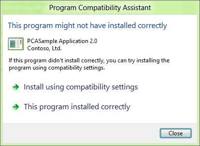

The user can then choose to:

-   Run the program using the compatibility settings (recommended option), after which PCA will apply the recommended setting (compatibility mode), restart the setup program, and track it till the setup completes successfully
-   Indicate that the program installed correctly, in which case PCA will not add any settings and will stop tracking the setup
-   Click Close, in which case PCA will not add any settings and will stop tracking this setup

The same mechanism is used to help the app’s uninstallation when a user tries to uninstall the app either from the ‘Add Remove Programs’ section in Windows, or from the app’s uninstaller shortcut.

**App fails to run with a Windows version check message**

One of the more common compatibility failures in app runtime is due to the Windows version check. Many apps, upon launch check the Windows version; if they do not recognize the version, they block themselves even if the app could have run without issues.

Generally, such checks are associated with two conditions that the PCA tracks:

The app displays a message box that warns the user. An example is below:

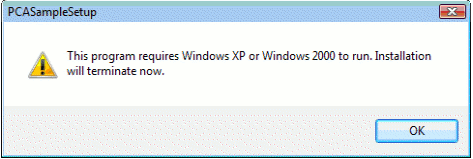

-   The app terminates immediately or crashes

If PCA identifies both of these conditions for an app, it will provide a recommendation to the user. PCA will allow the user to re-run the app with compatibility settings. PCA will apply the appropriate Windows XP, Windows Vista, or Windows 7 compatibility mode based on the app. As in any of the scenarios, the user can tell PCA that the app ran correctly, or opt out of the recommended settings by clicking the close button. An example dialog is provided as below:

**App fails to launch or run due to administrative privilege**

Some apps need administrative privilege to run and execute their functionality. However, in Windows 8, similar to Windows 7 and Windows Vista, apps run in lower privilege levels by default due to UAC. Newer apps designed for Windows Vista and above will generally declare the privilege level they need to run at using the EXE manifest’s TRUSTINFO section. However, older apps generally fail in two ways:

-   App displays a message to the user that it requires administrative privilege, as below example:

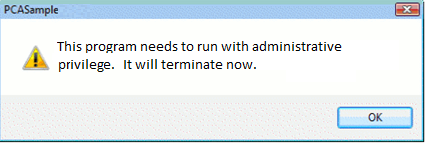

-   App either terminates immediately or crashes

If PCA identifies both of these conditions for an app, it will provide a recommendation to the user. PCA will allow the user to re-run the app with administrative privileges (PCA applies the RUNASHIGHEST compatibility mode). The user will get a UAC prompt when the app re-runs. As in any of the scenarios, the user can choose to re-run with the recommended setting, or opt out of the recommended settings by clicking Close. An example dialog is provided as below:

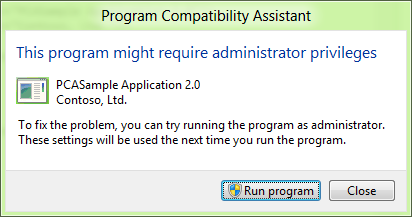

**App crashes due to specific memory problems**

Some apps crash due to a well-known memory problem. The app de-references a DLL from memory, and then calls a function to execute code in the same DLL. This causes an immediate crash of the app. While this problem is not due to Windows 8 compatibility changes, it is a relatively common problem seen in a wide variety of apps. PCA tracks this issue to give users a chance to run their app more reliably.

For these apps, PCA automatically applies the PINDLL compatibility mode silently. The compatibility mode invoked by PCA prevents the app from freeing the DLL from memory. So, the function call into the DLL by the app will work, preventing the app from crashing and allowing it to continue to function properly.

**App fails due to mismatched system files**

Some apps designed for Windows XP and prior include copies of Windows system DLLs along with their installers. When such apps are installed, the app has both an older copy of the DLL in its own folder as well as the latest version of the DLL that is in the Windows system folders.

On Windows Vista and later, this condition can cause the app to fail when it tries to load the local DLL, since this DLL will not work well with the rest of the current Windows system DLLs. Since the app is generally not aware of the newer versions of this DLL, it fails to work properly.

When PCA detects that the DLL failed to load properly, it will applies a compatibility setting that allows Windows to load the latest version of the DLL from the Windows system folder so the app can run properly.

At the end of the first failed run of the app, users will see the PCA dialog that notifies them of the applied setting as below:

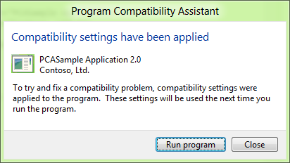

**App fails due to Unhandled Errors on 64-bit Windows**

On 64-bit version of Windows 8, a new exception was enabled to the message loop callback mechanism. While this exception was first introduced in Windows 7, it was not mandatory to handle this error. In Windows 8, apps that use message loops must handle this new exception. If they do not, they will crash. Apps designed for older Windows versions may not be aware of this exception, and hence may not handle this error (exception) properly.

PCA detects apps that fail due to this unhandled error, and automatically applies the DISABLEUSERCALLBACKEXCEPTION compatibility mode for the app. After the setting is applied at the end of the run, the user is notified as below. The app will get the mode on the next run, and will be able to avoid this error.

**App fails while attempting to delete protected non-Windows files**

Some apps designed for Windows XP and prior assume that they usually run with full administrative privileges. As a course of normal app behavior, they may try to delete protected non-Windows files (either in program files or Windows folders). When the delete operation fails many such apps can crash.

PCA detects these apps that fail to delete protected files and crash, and provides a recommendation to the user. PCA will allow the user to re-run the app with compatibility settings. As in any of the scenarios, the user can tell PCA that the app ran correctly, or opt out of the recommended settings by clicking the close button. In this case PCA applies the VIRTUALIZEDELETE compatibility mode. An example dialog is provided as below:

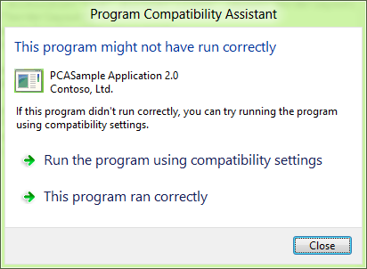

**App fails while attempting to modify Windows files or registry keys**

Some apps designed for Windows XP and prior assume that they usually run with full administrative privileges. As a course of normal app behavior, they may try to modify, delete or write Windows protected files (either in program files or Windows folders) or Registry keys owned by Windows. When any of the write, delete or modify operation for a file or a registry key fails many such apps can crash or fail badly.

PCA detects these apps that fail to write to protected Windows files or registry keys, and provides a recommendation to the user when the app quits. PCA will allow the user to re-run the app with compatibility settings. As in any of the scenarios, the user can tell PCA that the app ran correctly, or opt out of the recommended settings by clicking the Close button. In this case PCA applies the WRPMITIGATION compatibility mode. An example dialog is provided as below:

**App fails due to using 8- or 16-bit color modes**

As part of reimagining Windows 8 for Windows Store apps, one of the key changes is that the Desktop Window Manager (DWM) will now support only 32-bit colors in Windows 8. Lower color modes are now simulated.

Many older apps and games designed for Windows XP or before use 8-bit or 16-bit color modes. With no mitigation, these apps could fail to execute on Windows 8. However, when these apps enumerate or try to use any of the 8-bit or 16-bit color modes for display, PCA immediately identifies the issue and with the help of DWM, ensures that the app will work properly with the simulated color mode.

Note that this happens as soon as the app requests the low color modes and is transparent to the user. The user does not have to restart the app to get this mitigation because this fix is always needed to ensure that the app works properly.

**Application fails due to graphics and display issues**

Since Desktop Window Manager (DWM) is always on in Windows 8, some older Windows XP era apps can fail if the app uses mixed mode graphics APIs, as in using both GDI and DirectX APIs to draw to the screen (mostly older games), and tries to use full screen mode:

-   DWM will prevent painting directly to the desktop and the game or app will either fail, or draw a black screen on to the desktop and none of the graphics will be visible
-   In such cases, when the app quits, Windows detects that the app or game has a problem with full screen mode, and applies the DXMAXIMIZEDWINDOWEDMODE compatibility mode that allows the app or game to run in a maximized windowed mode instead of a full screen mode
-   After the setting is applied at the end of the run, the user is notified by PCA as shown below; the app will get the compatibility mode on the next run, and will be able run properly

**App fails to declare DPI awareness**

Another typical display problem with many older apps happens when Windows and the app run in high DPI mode, but the app does not declare its awareness of High DPI through its EXE manifest. Among the common problems that can occur due to this mismatch in settings are clipped UI elements or text and incorrect font size. For more details on the issues, see this link [here](/previous-versions//dd464660(v=vs.85)).

In such cases, Windows detects that the app is high DPI aware, and applies the HIGHDPIAWARE compatibility mode to the app at the end of the first run. PCA will then inform the user about this as shown below:

**Application fails due to missing Windows features**

Some apps depend on Windows features that have been removed since Windows Vista. When these apps try to load the missing DLLs or COM components, they fail to work.

PCA detects apps when they try to load the missing Windows features, and provides a recommendation to download these components and install them after the app terminates. The user can click on ‘get Help Online’ to find either an alternative or to download the feature and install it. If needed, the user can choose to do nothing by clicking Close.

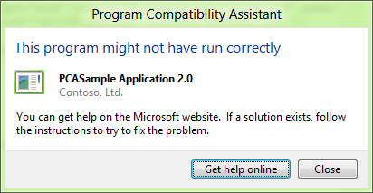

**App fails due to unsigned drivers on 64-bit Windows 8**

64-bit Windows has required digitally signed drivers (SYS files) since Windows Vista. However, older apps designed prior to the release of Windows Vista shipped drivers that were not digitally signed. If such an unsigned driver is installed, Windows will not load them. In rare cases, it is possible that Windows will not start if such drivers are marked as boot-time drivers.

Some older apps install drivers that are not signed on 64-bit Windows. Any device or app that tries to use this driver may fail or result in a system crash. To prevent such a scenario, PCA detects apps when they install unsigned drivers, and disables the driver it is marked as a boot-time driver.

It also instructs the user to acquire a digitally signed driver for the app to work properly. The message is shown as a result of the installation of the driver, and as a result of the installation of the app. If another app installs the same driver, that app will get the same message as well.

**Tracking apps installed through compatibility settings**

When an installer fails, PCA helps the installer with various compatibility modes depending on the type of failure. Once the installer succeeds with compatibility settings, PCA will track the shortcuts that the installer added. This is done to track if the apps that were installed may also need the compatibility settings applied to their installer.

When a user launches such an app, PCA prompts the user to ask if the app worked properly. If the user answers, ‘Yes,’ the PCA stops tracking the app. If the user answers ‘No,’ then it applies the same compatibility mode that was applied to the app’s installer, and re-runs the app with the compatibility mode applied.

**App fails to launch installers or updaters**

Apps sometimes launch child programs that need to run as administrators. This is typically the case when an app tries to launch its updater software to check and install new updates to the app. When apps directly run such child programs, the child program can fail to launch because the app itself did not have administrative privileges, or because the child program was not properly marked for elevation with the UAC manifest.

PCA tracks these errors and when the primary app closes, it automatically applies the ELEVATECREATEPROCESS compatibility mode that will help the child programs run correctly. When the app launches the child app on subsequent runs, the user will see a UAC dialog for the child program.

An Example of the PCA dialog is shown below:

**App installers that need to run with administrative privilege**

Installers of Windows desktop apps require administrative privileges since they write files, folders, and registry entries to protected system areas. Windows (UAC) has detection logic to identify when an installer is run, and immediately prompts the user to provide administrative privileges through the UAC dialog. However, in some cases, this logic will not be able to determine that an app was indeed an installer, and may not get administrative privileges. These are generally custom made installers that do not use well known install technologies such as Windows Installer or Install Shield.

In such cases, PCA detects that the installer failed to write its files. At the end if the failed install, PCA will provide a recommendation to apply compatibility settings. If the user chooses to click ‘Run Program,’ PCA will apply the RUNASADMIN compatibility mode, and re-run the installer. If the user chooses to close, then no setting will be applied. An example PCA dialog is shown below:

Legacy Control Panel applets that need to run with administrative privilege Control panel applets generally change system settings and need the ability to run ad administrator. However, those written before Windows Vista either do not have an EXE manifest or do not have the TRUSTINFO section that declares the privilege level they require. When such applets are run, PCA detects them, and at the end of the first run, provides a recommendation to run with administrative settings. If the user chooses to click ‘Run Program,’ PCA applies the RUNASADMIN compatibility mode, and re-runs the installer. If the user chooses to close, then no settings will be applied. An example PCA dialog is shown below:

**Verifying the recommended settings through user feedback**

At the end of each of the scenarios (after the app is run with recommended compatibility settings), PCA will ask the user a simple question:

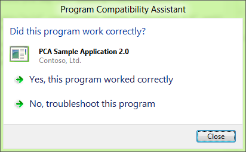

The user can provide feedback if the app worked or failed with the compatibility setting. This data will be sent anonymously to Microsoft. This helps to ensure that such fixes can be built into Windows 8 through Windows update process, so that future users of Windows 8 will no longer encounter the app failure, and PCA will no longer need to track the app for the failure.

**Tracking issues that have no recommendations**

Apps may fail in many different ways for compatibility reasons. PCA tracks many more compatibility issues than what is listed in the above scenarios. In these cases, many times, the issue manifestation depends on the app. This means that some apps handle such issues gracefully and recover from it, while others may not. So, for such issues, while PCA still tracks the app, it does not provide a direct recommendation for a fix.

The issues that PCA tracks that do not have a recommended setting or a dialog include apps that:

-   Have a very short runtime – Apps run for no more than three seconds
-   Create global memory objects without administrative privileges
-   Have an error (Win32 exception) on launch
-   Check for administrative privilege (but may not fail)
-   Use Indeo codecs (deprecated from Windows Vista)
-   Try to write or delete keys from protected registry locations such as HKLM
-   Crash on launch

**Applying fixes through the compatibility tab and compatibility troubleshooter**

As mentioned above, apps can fail for a variety of compatibility reasons. Not all of these have clear PCA recommendation since the settings are app dependent. However, users can go to the Compatibility Troubleshooter or the Compatibility Tab to apply certain common fixes to try to get their failing app to work properly on Windows 8. In such cases, PCA will still track the app for compatibility issues, before and after the fix is applied. After the app is run with the fix applied, PCA will ask the user if the fix worked. Once the user answers the question, the data is sent anonymously through telemetry to Microsoft. This data is collected from many users and analyzed, and the qualifying fixes are then broadly distributed to all Windows 8 users through Windows update.

**Using the Compatibility Troubleshooter**

The Compatibility Troubleshooter is a mechanism in Windows that allows you diagnose problems with apps and apply recommended fixes to get them working properly. This is needed only when PCA does not to provide any recommendation for the app.

The troubleshooter allows users to walk through and answer a set of questions, and based on the replies, it will apply a set of fixes and allow the users to test their apps and verify the fixes. Once verified, the fixes will be applied permanently to the apps to make them work better on Windows 8.

The Troubleshooter UI is shown below for reference:

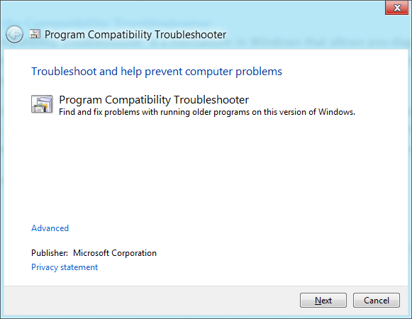

You can start the Compatibility Troubleshooter in two ways:

**From the start screen:**

1.  Type: compatibility troubleshooter
2.  Under the settings section, click the ‘Run programs made for previous version of Windows’ tile

  
**From the app tile:**

1.  From the Start screen, right click the app tile
2.  Click ‘Open File Location’ (Desktop apps only)
3.  From the Explorer ribbon, click the ‘App tab’
4.  Choose ‘Troubleshoot Compatibility’

  

**Using the Compatibility Tab**

Note that this is recommended only for users who are experts in trying different compatibility settings. This method does not provide any recommendation of the type of fix to apply to apps. Here the user is expected to know what fixes can be applied to make the app work. If you are unsure of the fixes, please use the Compatibility Troubleshooter to find a fix for the app.

To access the Compatibility Tab:

 **From the start screen:**

1.  Right click the app tile
2.  Open file location (desktop apps only)

  
**From the Explorer ribbon:**

1.  Click Properties
2.  Navigate to the Compatibility Tab
3.  Select the compatibility fixes
4.  Re-run the app
    > [!Note]  
    > You can come back to the same place again to change or remove the fixes as well. You can also apply the fixes to all users on the machine using the button provided in the tab.

     

  

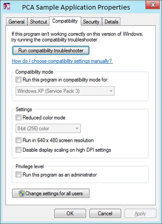

**Apps with known compatibility issues**

Apart from the runtime issues detection scenarios listed above, PCA also informs users at app startup if the app has known compatibility issues. The list is stored in the System app compatibility database. There are two types of these messages:

-   **Hard Block Messages**—if the app is known to be incompatible and if allowing the app to run will result in severe impact to the system (for example, a Windows crash or being unable to boot after the installation), a blocking message as shown below will be displayed

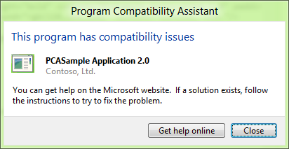

-   **Soft Block Messages**— If the app has a known compatibility issue and may not work properly, then this message is shown:

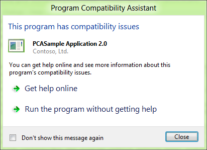

In both cases, the ‘Get help Online’ option sends a Windows Error Report to get an online response from Microsoft and display it to the user. Typically the responses will point the user to one of three types of resources:

-   An update from the app vendor
-   An app vendor’s website for more info
-   A Microsoft Knowledge base article for more info

**Telemetry for PCA**

After PCA addresses any app issues on a Windows 8 machine and gets all the user feedback, it collects anonymous data about the app, the installer, the issues detected, and the compatibility settings applied to the app, and send it back to Microsoft. This data is collected from any user who is willing to provide such anonymous data (through the Customer Experience Improvement Program - CEIP). Once this data is collected, the app failures and fixes are analyzed, and the fixes are then distributed to the entire Windows ecosystem through the Windows Update mechanism so that any user of the app in the future benefits from the fix automatically.

**Administrative controls and managing PCA settings**

IT administrators can control PCA behavior in two ways:

-   **Turn off PCA** – this setting allows IT administrators to turn off the dialogs that PCA shows to the users; PCA will still track and detect issues and send back telemetry
-   **Turn off App telemetry** – this setting will turn off any collection and sending of telemetry data by PCA
    > [!Note]  
    > If CEIP is turned off, this setting has no impact.

     

**Designing apps to work with PCA**

Developers need to ensure that their apps will work well across all of the compatibility scenarios described above. Developers must test and validate their apps for each of the above scenarios and ensure that there are no compatibility issues. If compatibility issues are identified, developers should make the fixes to their apps necessary to ensure that the compatibility issue is resolved. Some of the common fixes that developers should make include:

-   Eliminate Windows operating system version checks at install and runtime
-   Eliminate privilege check (checking for administrator access); use the EXE manifest to declare the right level of privilege needed
-   Ensure that Windows binaries are not shipped within the app installer
-   Eliminate writing to protected areas (registry, folders) or writing over protected files
-   Digitally sign all binaries (EXE, DLL, SYS files)
-   For installers, ensure that proper ‘Add/Remove programs’ entry is added; at a minimum, this app metadata entry should include the app name, publisher, Version string, and supported language. This will indicate to PCA that the installer completed successfully and will also provide a convenient way for users to uninstall the app

Ensuring that the TRUSTINFO and COMPATIBILITY section of the app (executable) manifest is updated as listed in the Windows 8 Compatibility Cookbook will let PCA know that the app was designed for Windows 8, and will also ensure that the app always runs natively without any compatibility modes applied to it.

To ensure that PCA considers the app to be designed for Windows 8:

-   The all EXEs (installer or runtime) must be manifested for TRUSTINFO and COMPATIBILITY sections for Windows 8
-   The installer should add an ‘Add/Remove programs’ entry

**Glossary**

The compatibility modes used by PCA are listed below with a brief description of what the mode enables.

| Mode                         | Description                                                                                                                                                      |
|------------------------------|------------------------------------------------------------------------------------------------------------------------------------------------------------------|
| Windows7RTM                  | This mode emulates common Windows 7 behavior including the operating system version number 6.1                                                                   |
| WindowsVistaSP2              | This mode emulates common Windows 7 behavior including the operating system version number 6.1                                                                   |
| WindowsXPSp3                 | This mode emulates common Windows XP SP3 behavior including the operating system version number 5.1. This also includes the RUNASHIGHEST mode                    |
| RUNASHIGHEST                 | This mode prompts the user to run the app with the highest available privilege. Users with administrative privileges will see a UAC elevation prompt for the app |
| RUNASADMIN                   | This mode always prompts the user to run the app with administrative privileges; apps with this mode will always get the UAC elevation prompt                    |
| ELEVATECREATEPROCESS         | This mode makes child processes of the main app run with administrative privileges; the child processes will get a UAC elevation dialog                          |
| PINDLL                       | This mode forces a DLL to be in memory for an app even if the app unloads the DLL                                                                                |
| DISABLEUSERCALLBACKEXCEPTION | This mode intercepts user call back exceptions and allows the app to continue on without having to handle the exception                                          |
| VIRTUALIZEDELETE             | This mode intercepts delete operations on protected files and prevents apps from failing due to unhandled exceptions from the delete operation                   |
| WRPMITIGATION                | This mode returns success when an app tries to write, modify, or delete Windows protected files or registry entries (without actually completing the operation)  |
| DXMAXIMIZEDWINDOWEDMODE      | This mode identifies apps that go into full screen mode and redirects them into a maximized Window mode                                                          |
| HIGHDPIAWARE                 | This mode lets the rest of Windows know that the app is High DPI aware, and helps proper rendering of UI elements, text, font, etc.                              |

 

 

 