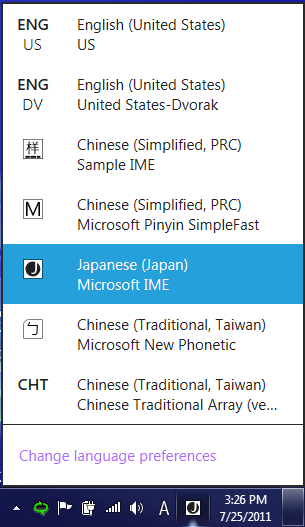
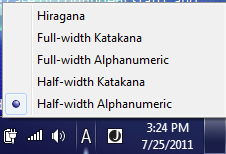
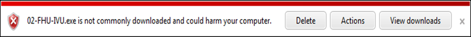
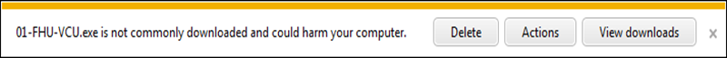

# Third-party input method editors

## Platforms

**Clients** - Windows 8  
**Servers** - Windows Server 2012  

## Description

Input method editors (IMEs) are software components that allow a user to type text in a language that has more characters than can be represented on a keyboard. (This is common, but not limited to, East Asian languages.) Instead of each single character appearing on a single key, users type combinations of keys that are then interpreted by the IME. The IME generates the character that matches the set of key strokes, sometimes presenting the user with a list of possible characters to pick from, and then inserts the character into the edit control window of the user’s app.

In the past, Windows has allowed third-party IMEs to run in the Windows system, and this capability continues for Windows 8. Users can install a third-party IME and use it. In addition, we are hardening the system and processes to prevent malicious IMEs, improve security, and enhance the user experience.

In Windows 8, you will find:

-   Third-party IME support for both hardware keyboards and touch keyboards
-   Third-party IME vendors must follow Microsoft guidelines to develop their IMEs for Windows 8
-   Third-party IMEs must be digitally signed
-   Third-party IMEs must be Text Services Framework (TSF) aware, and proper IME flags must be set to run correctly in Windows 8
-   Legacy third-party IMEs will be able to run in desktop apps, but will be blocked in Windows Store apps
-   Third-party IMEs can use the touch keyboard layout provided by Windows to link their IME, so that users can use their IME with touch keyboards. However, certain functions of in-box IMEs for touch keyboards will not be available to third-party IMEs
-   Windows Defender will remove malicious IMEs from the Windows system

## Manifestation

**Input language and input method switch changes**

Instead of showing all the IME mode icons along with the IME branding icon, only one IME mode icon along with the IME branding icon is shown. The two figures below show the Windows 8 input flyout and the IME flyout, with Japanese IME as the current input method. If you click the IME branding icon, you can switch input methods.

If you click the IME mode icon, you can switch to a different IME mode.

If an IME relies on the language bar to show its mode icons in Windows 7, the IME must be changed in order to show its branding icon and mode icon in the input indicator in Windows 8.

> [!Note]  
> Note: The details about how an IME can show its branding icon and mode icon in the SysTray on the desktop Taskbar will be documented and posted publicly in the Windows 8 IME Guidelines.

 

**New Windows environment**

The environment in Windows 8 changes the landscape for IMEs. The concepts of Windows Store apps, local context app containers, and API restrictions on IMEs were not present in Windows 7. Some existing Windows 7 IMEs stop responding when run inside a Windows Store app and therefore don’t allow legacy IMEs to run inside Windows Store apps. Additionally, make sure that new versions of IMEs are validated to ensure that they are compatible with the new UI environment before they are run inside Windows Store apps.

## Mitigation

You can use a desktop-compatible IME on the system. This might be your best option if you mainly use desktop apps, and you want to continue to use a preferred legacy IME for input. We recommend that you use a Windows 8 IME, and stop using legacy/non-certified IMEs. Notifications are provided by both the Language CPL and the Input Switch to warn you of the effects of using a desktop-compatible IME.

You will see either of the below behaviors if a desktop-compatible IME doesn’t work across your system:

-   The language CPL UI labels desktop-compatible IMEs, and displays a message that non-compatible IMEs work only in desktop apps.
-   The input flyout greys out desktop-compatible IMEs when the user is inside Windows Store apps. This indicates that the IME does not work in this app. (In the desktop, desktop-compatible IMEs are not greyed out). If you switch to Windows Store apps with a non-compatible IME and realize the IME is off, use the input indicator to change to an IME that is compatible with Windows Store apps.

Legacy or desktop-compatible IMEs are limited to these conditions:

-   Upgrading from Windows 7 to Windows 8, with third-party IMEs on the system
-   The vendor has not released a version compatible with Windows 8, and the user tries to use an existing Windows 7 version in the meantime

## Solution

**General**

Use the existing text services framework (TSF) infrastructure to implement your IME logic and the Windows Store app common controls for your UIs. Create owned windows to host your UI.

New search APIs are being added to improve search prediction and provide a cleaner search experience in the UI.

APIs are also being added to notify third-party IMEs when a touch keyboard is invoked to protect the UI from being covered by the touch keyboard. A default classic touch keyboard layout is automatically loaded for third-party IMEs. No additional work is needed to integrate with this classic touch keyboard layout. However, third-party IMEs will be able to request an alternate touch layout.

Become familiar with the Windows 8 IME guidelines so that you can promote key Windows Store app user experience principles in your IME. IMEs that adhere to the guidelines must set a flag to indicate that the IME is compatible with the Microsoft design. Windows 8 blocks all desktop-compatible IMEs from running in Windows Store apps.

Digital signing, in addition to revocation by Windows Defender, prevents malicious IMEs from being installed onto the Windows 8 system. Upon identity verification, a third-party IME’s .dll is digitally signed. Only IMEs that have this digital signature can be installed onto the system without having a critical warning message appear to the user. Users can report malicious IMEs. After an IME has been determined to be malicious, Windows Defender removes it from the Windows system.

**Text Services Framework**

The IME must be TSF-aware in order to be able to run in Windows 8. Windows 8 blocks non-TSF-aware IMEs from running in Windows Store apps. When an app is started, TSF loads the IME .dll for the IME that the user has selected into the app process.

> [!Note]  
> To provide separate functionality or UIs between Windows Store apps and desktop apps, the .dll loaded by TSF can check which type of app it is being loaded into. The IME calls the [ITfThreadMgrEx::GetActiveFlags](/windows/win32/api/msctf/nf-msctf-itfthreadmgrex-getactiveflags) method and checks the TF\_TMF\_IMMERSIVEMODE flag, and can trigger different app logic depending on the result.

 

When an IME is loaded into a Windows Store app, it is subject to the same app container restrictions as the app itself. This behavior ensures that IMEs are not able to violate Windows Store app security contracts, despite having access to the desktop SDK (because they are not distributed or certified by the Windows Store). Some functions that IMEs currently perform are affected inside an app container. Those functions include:

-   Dictionary files
-   Internet updating
-   On-the-fly learning
-   Sharing info between processes

See the Windows 8 IME Guidelines for more info.

Legacy IMEs do not work in Windows Store apps in order to avoid the potential for bad user experiences including system stoppages. IMEs that are compatible with the Windows Store apps must self-declare by setting a flag indicating this compatibility. This flag is provided by TSF in the TF\_INPUTPROCESSORPROFILE structure. Details regarding how to use this flag to declare a third-party IME as Windows Store app-compatible will be documented and posted publicly in the Windows 8 IME Guidelines.

IMEs that are compatible with Windows Store apps are allowed to run in either desktop apps or Windows Store apps. IMEs that are not compatible can only run in desktop processes.

**User interface**

Although third-party IMEs have access to desktop windowing APIs, they must follow the same window API restrictions as the app they are running in. For example, an IME cannot draw on top of a Windows Store app while active in a desktop app. API restrictions are targeted to prevent these scenarios:

-   Desktop apps taking focus from Windows Store apps
-   Desktop apps drawing in Windows Store app
-   Desktop apps interfering with Windows Store apps

**Touch keyboard support**

While touch keyboard (TKB) support is still available to third-party IME vendors, a fully customizable and integrated touch keyboard experience is not provided in Windows 8. However, third-party IMEs can map their IMEs with the keyboard layout optimized for touch. The Windows Soft Input Panel (SIP) provides a classic keyboard layout by default for third-party IMEs. Because the classic keyboard generates key events similar to how a hardware keyboard does, there is currently no special implementation requirement for third-party IMEs to work with a touch keyboard. The input handling for hardware key events will also handle key events from classic touch layouts.

> [!Note]  
> Note: IMEs might need to begin handling Unicode input events if TKB support is extended to include optimized keyboard layouts as well.

 

A third-party IME can choose to use the optimized keyboard layout for their IME. See the third-party IME Guideline for more info.

Make sure that your candidate pane’s UI (and other UI elements) are not drawn underneath the touch keyboard. In most cases, the app should resize its window to account for the touch keyboard. However, if an app doesn’t do this, IMEs can still use the InputPaneFramework API to learn the position of the touch keyboard. Third-party IMEs can use this API to get the screen space consumed by the touch keyboard prior to drawing candidate (or other) UIs, and reflow their UI to avoid drawing underneath the touch keyboard.

**Searching**

In Windows 8, Windows Store apps can easily provide their users with search features by implementing the [search contract](/previous-versions/windows/apps/hh464906(v=win.10)) and integrating with the Search pane. The Search pane is a central location for users to perform searches across all their apps. Windows helps apps that use the Search pane get their users where they want to go as fast as possible. In particular, for IME users, it provides a unique search experience that lets compatible IMEs integrate with the Windows 8 for greater efficiency and usability.

An IME is compatible with the integrated search experience if it meets these criteria:

-   Is compatible with the Windows Store app environment
-   Implements TFS UILess mode APIs
-   Implements TFS search integration APIs:
-   -   ItfSearchCandidateProvider
    -   ItfSearchHardwareKeyboardBehaviors

When activated in the Search pane, the compatible IME is placed in UILess mode and cannot show its UI. Instead, it sends conversion candidates to Windows, which will then display them in the inline candidate list control.

The IME also sends Windows candidates that should be used to run the current search – these candidates could be the same as the conversion candidates, or could be tailored for search. Good search candidates meet these criteria:

-   No prefix overlap
-   No prediction candidate (only completion)

IMEs that do not meet the criteria and are not compatible with search are shown in the same way as in other Windows Store app controls and are not able to take advantage of UI integration and search candidates. (Apps receive queries only after the user is done composing.)

When an app that supports the search contract receives a query, the query event will include a “queryTextAlternatives” array containing all known alternatives, ranked from the most relevant (likely) to least relevant (unlikely). Whenever alternatives are provided, the app should treat each alternative as a query, and return all results that match any of the alternatives (as if the user had issued multiple queries at the same time), essentially issuing an “or” query to the service providing the results. To enhance performance, apps will often limit matching to the 10 most relevant alternatives.

**IME digital signature**

All third-party IMEs must be digitally signed in order to be installed onto the Windows 8 system as an IME. Using SmartScreen, users can see a warning message when downloading an unsigned IME from the web. To obtain a certificate and sign your files:

-   **Use an Authenticode signature to digitally sign programs**
    -   Obtain a valid Authenticode code signing certificate from one of the many certificate authorities supported by Windows
    -   Use development tools (such as [signtool.exe](../seccrypto/signtool.md)) to sign the apps prior to distribution
    -   For more information and a step-by-step description of the code signing process, see the [Everything you need to know about Authenticode code signing](/archive/blogs/ieinternals/everything-you-need-to-know-about-authenticode-code-signing) blog entry
-   **Ensure downloads are not detected as malware**
    -   Downloaded programs that are detected and confirmed as malware affect both the download’s reputation and the reputation of the digital certificate used to sign that file
-   **Apply for Windows certification**
    -   Visit the Windows App Certification page on MSDN

For more info, see these articles about digital signatures and code signing:

-   [Authenticode Overview](/previous-versions/windows/internet-explorer/ie-developer/platform-apis/ms537359(v=vs.85))
-   [Ensuring Integrity and Authenticity](/previous-versions/windows/internet-explorer/ie-developer/platform-apis/ms537361(v=vs.85))
-   [Code Signing Best Practices](/previous-versions/windows/hardware/design/dn653556(v=vs.85))
-   [What are Digital Certificates?](/previous-versions/office/developer/office2000/aa190113(v=office.10))

If an IME **is not** signed, the user receives this warning message when they try to download the IME:

If an IME is signed, users see this message instead:

Based on these notifications, users can choose whether to delete the file or ignore the warning and run the downloaded program.

**IME revocation**

IMEs that are malicious or that do not follow the Windows 8 IME Guidelines can be removed from the system by using Windows Defender. For more info about malicious IMEs, see the article on [Third-party IMEs in Windows 8](/previous-versions/windows/apps/hh967426(v=win.10)).

## Resources

-   [ITfThreadMgrEx::Get Active Flags method](/windows/win32/api/msctf/nf-msctf-itfthreadmgrex-getactiveflags)
-   [SignTool](../seccrypto/signtool.md)
-   [Everything you need to know about Authenticode Code Signing](https://blogs.msdn.com/b/ieinternals/archive/2011/03/22/authenticode-code-signing-for-developers-for-file-downloads-building-smartscreen-application-reputation.aspx)
-   [Windows app contracts and extensions](/previous-versions/windows/apps/hh464906(v=win.10))
-   [Certification requirements for Windows 8 desktop apps](../win_cert/certification-requirements-for-windows-desktop-apps.md)
-   [Certification requirements for Windows apps](https://msdn.microsoft.com/library/windows/apps/51A7C609-94AB-49ab-B8E0-F26FF776DDB4.aspx)
-   [Using the Windows App Certification Kit](../win_cert/using-the-windows-app-certification-kit.md)
-   [Authenticode Overview](/previous-versions/windows/internet-explorer/ie-developer/platform-apis/ms537359(v=vs.85))
-   [Ensuring Integrity and Authenticity](/previous-versions/windows/internet-explorer/ie-developer/platform-apis/ms537361(v=vs.85)#Ensuring_Integrity_a)
-   [Code Signing Best Practices](/previous-versions/windows/hardware/design/dn653556(v=vs.85))
-   [What are Digital Certificates?](/previous-versions/office/developer/office2000/aa190113(v=office.10))

 

 