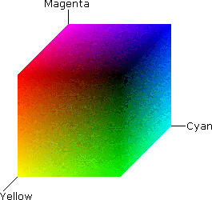
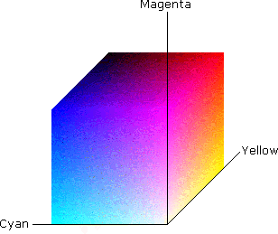

# CMY and CMYK Color Spaces

The CMY and CMYK [color spaces](c.md) are often used in color printing. A CMY color space uses cyan, magenta, and yellow (CMY) as its [primary colors](p.md). Red, green, and blue are the secondary colors.

The following figures are color representations of the CMY color space. The CMY color space is normalized.

The CMY color space is subtractive. Therefore, white is at (0.0, 0.0, 0.0) and black is at (1.0, 1.0, 1.0). If you start with white and subtract no colors, you get white. If you start with white and subtract all colors equally, you get black.

The CMYK color space is a variation on the CMY model. It adds black (Cyan, Magenta, Yellow, and blacK). The CMYK color space closes the gap between theory and practice. In theory, the extra black component is not needed. However, experience with various types of inks and papers has shown that when equal components of cyan, magenta, and yellow inks are mixed, the result is usually a dark brown, not black. Adding black ink to the mix solves this problem.

The CMY and CMYK colors spaces can be device independent, but most often they are used in reference to a specific device.

 

 

