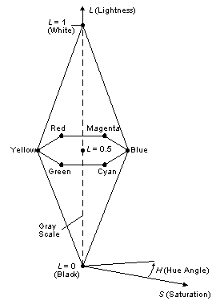

# HLS Color Spaces

HLS [color spaces](c.md) are also widely used by artists. Its color components are hue, lightness, and saturation (chroma).

Hue has the same meaning as the HSV model, except that a hue angle of 0 corresponds to blue in this model. Magenta is at 60, red is at 120. As with the HSV model, complementary colors are 180 apart.

Lightness is the amount of black or white in a color. Increasing lightness adds white to the hue. Decreasing lightness adds black to the hue.

[Saturation](s.md) in the HLS model is a measure of the "purity" of a hue. As saturation is decreased, the hue becomes more gray. A saturation value of zero results in a gray-scale value.

The following figure is a line drawing of HLS space, which is a double hexcone. Any horizontal cross section of the HLS color space is a hexagon. HLS is a normalized color space. That is, the lightness and saturation values range from 0.0 to 1.0 inclusive. Hue varies from 0 to 360 inclusive.

HLS color spaces can be device dependent or device independent.

 

 

