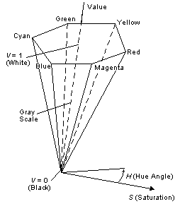

# HSV Color Spaces

Hue, saturation, and value (HSV) [color spaces](c.md) are often used by artists. "Hue" is what we normally think of as color. It is the attribute of a color by which we give it a name such as "red" or "blue". "Value" is another word for "lightness," the attribute of a color that makes it seem equivalent to some shade of gray between black and white. Saturation is a measure of how different a color appears from a gray of the same [lightness](b.md). Zero saturation indicates no hue, just gray scale. The HSV color space is normalized.

The preceding figure shows a line drawing of HSV space in the form of a hexcone. Each of its cross sections is a hexagon. At the vertices of each cross section are the colors red, yellow, green, cyan, blue, and magenta. A color in HSV space is specified by stating a hue angle, the chroma level, and the lightness level. A hue angle of zero is red. The hue angle increases in a counterclockwise direction. Complementary colors are 180 apart.

HSV color spaces can be device dependent or device independent.

 

 

