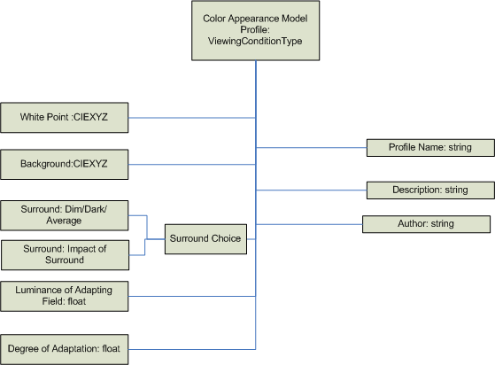

# WCS Color Appearance Model Profile Schema and Algorithm

[Overview](#overview)

[Color Appearance Model Profile (CAMP) Architecture](#color-appearance-model-profile-architecture)

[The CAMP Schema](#the-camp-schema)

[The CAMP Schema Elements](#the-camp-schema-elements)

[The CAMP Algorithm](#the-camp-algorithm)

### Overview

This schema is used to specify the content of a color appearance model profile (CAMP). The associated baseline algorithms are described in the following sections.

The CAMP is composed of XML tags that provide parametric values to the CIECAM02 baseline color appearance model variables. Details on the ranges for parameters are provided in the baseline color appearance model specification and CIECAM02 recommendation.

### Color Appearance Model Profile Architecture



### The CAMP Schema


```C++
<?xml version="1.0" encoding="UTF-8"?>
<xs:schema
  xmlns:cam="http://schemas.microsoft.com/windows/2005/02/color/ColorAppearanceModel"
  xmlns:wcs="http://schemas.microsoft.com/windows/2005/02/color/WcsCommonProfileTypes"
  targetNamespace="http://schemas.microsoft.com/windows/2005/02/color/ColorAppearanceModel"
  xmlns:xs="http://www.w3.org/2001/XMLSchema"
  elementFormDefault="qualified"
  attributeFormDefault="unqualified"
  blockDefault="#all"
  version="1.0">

  <xs:annotation>
    <xs:documentation>
      Color Appearance Model profile schema.
      Copyright (C) Microsoft. All rights reserved.
    </xs:documentation>
  </xs:annotation>

  <xs:import namespace="http://schemas.microsoft.com/windows/2005/02/color/WcsCommonProfileTypes" />

  <xs:annotation>
    <xs:documentation>
      ColorAppearanceModel element contains viewing conditions
      parameters based on CIECAM02.
    </xs:documentation>
  </xs:annotation>
  <xs:element name="ColorAppearanceModel">
    <xs:complexType>
      <xs:sequence>
        <xs:element name="ProfileName" type="wcs:MultiLocalizedTextType"/>
        <xs:element name="Description" type="wcs:MultiLocalizedTextType" minOccurs="0"/>
        <xs:element name="Author" type="wcs:MultiLocalizedTextType" minOccurs="0"/>
        <xs:element name="ViewingConditions">
          <xs:complexType>
            <xs:sequence>
              <xs:choice>
                <xs:element name="WhitePoint" type="wcs:NonNegativeCIEXYZType"/>
                <xs:element name="WhitePointName">
                  <xs:simpleType>
                    <xs:restriction base="xs:string">
                      <xs:enumeration value="D50"/>
                      <xs:enumeration value="D65"/>
                      <xs:enumeration value="A"/>
                      <xs:enumeration value="F2"/>
                    </xs:restriction>
                  </xs:simpleType>
                </xs:element>
              </xs:choice>
              <xs:element name="Background" type="wcs:NonNegativeCIEXYZType"/>
              <xs:choice>
                <xs:element name="ImpactOfSurround" type="xs:float"/>
                <xs:element name="Surround">
                  <xs:simpleType>
                    <xs:restriction base="xs:string">
                      <xs:enumeration value="Average"/>
                      <xs:enumeration value="Dim"/>
                      <xs:enumeration value="Dark"/>
                    </xs:restriction>
                  </xs:simpleType>
                </xs:element>
              </xs:choice>
              <xs:element name="LuminanceOfAdaptingField" type="xs:float"/>
              <xs:element name="DegreeOfAdaptation" type="xs:float"/>
            </xs:sequence>
          </xs:complexType>
        </xs:element>
        <xs:element name="NormalizeToMediaWhitePoint" minOccurs="0">
          <xs:simpleType>
            <xs:restriction base="xs:string">
              <xs:enumeration value="True"/>
              <xs:enumeration value="False"/>
            </xs:restriction>
          </xs:simpleType>
        </xs:element>
      </xs:sequence>
      <xs:attribute name="ID" type="xs:string" use="optional" />
    </xs:complexType>
  </xs:element>
</xs:schema>
```


## The CAMP Schema Elements

## ColorAppearanceModel

This element is a sequence of:

1.  ProfileName string,
2.  optional Description string,
3.  optional Author string,
4.  ViewingConditions element.

**Validation conditions:** Each sub-element is validated by its own type. String lengths are limited to 10,000 characters.

## Namespace

xmlns:cam="http://schemas.microsoft.com/windows/2005/02/color/ColorAppearanceModel"

targetNamespace="http://schemas.microsoft.com/windows/2005/02/color/ColorAppearanceModel"

## Version

Version &gt;0.1 or &lt;= "1.0" with the first release of Windows Vista.

**Validation conditions:** Any version value &lt;=2.0 is also valid to support non-breaking changes to the format.

## Documentation

Color Appearance Model Profile Schema.

Copyright (C) Microsoft. All rights reserved.

**Validation conditions:** Each sub-element is validated by its own type.

## SurroundType

This element is a either an enumeration of "Average," "Dim," or "Dark" CIECAM02 parameters or the actual quantitative parameters from the CIECAM02 recommendation c, impact of the surround.

**Validation conditions:** The c parameter can range from 0.525 to 0.69.

## ViewingConditions

This element consists of the following sub-elements:


| Element                    | Type           |
|----------------------------|----------------|
| WhitePoint                 | WhitePointType |
| Background                 | CIEXYZ         |
| Surround                   | SurroundType   |
| LuminanceOfAdaptingField   | float          |
| DegreeOfAdaptation         | float          |
| NormalizeToMediaWhitePoint | Boolean        |


 

**Validation conditions:** CIEXYZ sub-elements are validated by NonNegativeXYZType. The LuminanceOfAdaptingField is a maximum of 10,000cd/m^2. The DegreeOfAdaptation can range from 0.0 to 1.0. The NormalizeToMediaWhitePoint value can be either "true" or "false." If the NormalizeToMediaWhitePoint sub-element is absent, it effectively defaults to "true." See the following CAMP algorithm section.

## WhitePointType

This element is a either an enumeration of CIE light source value ("D50," "D65," "A," or "F2") or a CIEXYZ sub-element.

**Validation conditions:** Each sub-element is validated by its own type.

## CIEXYZType

The CIEXYZType element is composed of three NonNegativeFloatType single-precision IEEE floating-point elements, named "X," "Y," and "Z." These measurements can be either absolute (not relative) CIEXYZ 1931 reflective values or absolute (not relative) CIEXYZ 1931 direct (transmissive) values in candelas per meter squared units.

**Validation conditions:** This means that only real-world values are valid, and negative CIEXYZ measurement values are invalid. Since these are absolute values, values can range well beyond 1.0f. A reasonable limit for any X, Y, or Z value will be arbitrarily set to 10000.0f.

 

### The CAMP Algorithm

The color appearance model (CAM) is based on the CIE CIECAM02 color appearance model equations.

This class implements the color appearance modeling. Note that the WCS CAM is *not* replaceable, for example, using a plug-in. It is a design goal to have only one color appearance model. The CAM is based on CIECAM02 recommendations.

CIECAM02 can be used in two ways. In the colorimetric-to-appearance direction, it provides a mapping from CIE XYZ space to color appearance space. In the appearance-to-colorimetric direction, it maps from color appearance space back to XYZ space. The color appearance correlates lightness, J, chroma, C, and hue, h. These three values form a cylindrical coordinate system. Frequently, it turns out to be more convenient to work in a rectangular coordinate system, so compute a = C cos h and b = C sin h, to give CIECAM02 Jab.

You can use CAM lightness values greater than 100. The CIE committee that formulated CIECAM02 did not address the behavior of the lightness axis for input values with a luminance greater than the adopted white point; that is, for input Y values greater than the adopted white point Y value. Experimentation has shown that the luminance equations in CIECAM02 behave reasonably for such values. The lightness increases exponentially and follows the same exponent (roughly 1/3).

Users sometimes want to change the way that the degree of adaptation (D) is calculated. The WCS design enables users to control this calculation by changing the degreeOfadaptation value in the viewing conditions parameters.

To provide a more consistent match to users' ICC-influenced expectations, the degreeOfAdaptation in the default CAMPS is 1.0. This produces better results in all cases other than MinCD Absolute, where one might want to let WCS compute the degreeOfAdaptation (via degreeOfAdaptation = -1).

Instead of using a surround value of "Average," "Dim," and "Dark," a continuous surround value, computed from the value c, is provided. The value of c must be a float between 0.525 and 0.69.

From *c*, *Nc* and *F* can be computed, using piecewise linear interpolation between the values already provided for "Average," "Dim," and "Dark." This models what is shown in Figure 1 of CIE 159:2004, the CIECAM02 specification.


| degreeOfAdaption                     | Behavior                                                                       |
|--------------------------------------|--------------------------------------------------------------------------------|
| -1.0                                 | This is the default CIECAM02 behavior.<br/> |
| 0.0 &lt;= degreeOfAdaption &lt;= 1.0 | *D* = degreeOfAdaptation (the value supplied by the user)                      |


 

A certain amount of error checking has also been added to the implementation. The following equation numbers are those used in the CIE 159:2004 definition of CIECAM02.

**ColorimetricToAppearanceColors**

The input values are checked for reasonableness: If X or Z &lt; 0.0, or if Y &lt; -1.0, then the HRESULT is E\_INVALIDARG. If -1.0 &lt;= Y &lt; 0.0, then J, C, and h are all set to 0.0.

There are certain internal conditions that can produce error results. Instead of producing such results, the internal results are clipped to produce in-range values. This happens for specifications of colors that would be dark and impossibly chromatic: In equation 7.23, if A &lt; 0, A = 0. In equation 7.26, if t &lt; 0, t = 0.

**AppearanceToColorimetricColors**

The input values are checked for reasonableness. If C &lt; 0 , C &gt; 300, or J &gt; 500, then the HRESULT is E\_INVALIDARG.

*R'<sub>a;</sub>*, *G'<sub>a;</sub>*, and *B'<sub>a;</sub>*, (equations 8.19 - 8.21) are clipped to the range   399.9 .

For all Color Appearance Model Profiles (CAMPs), the WCS engine will examine the adopted white point. If Y is not 100.0, then the adopted white point will be scaled so that Y does equal 100.0. The same scaling will be applied to the background value. The scaling factor is 100.0/adoptedWhitePoint.Y. The same scaling factor is applied to each of X, Y, and Z. If the NormalizeToMediaWhitePoint field is set to "True," or if it is absent from the CAMP, the engine also scales all device colors input to DeviceToColorimetric so that the Y value of the device media white point equals 100.0. Device colors coming from ColorimetricToDevice will be scaled by the multiplicative inverse of that scaling factor. If the NormalizeToMediaWhitePoint flag is set to "False," then the colorimetric data is not scaled.

For some tasks, it makes sense to scale the colorimetric values coming from DeviceToColorimetric. The hyperbolic lightness equations in the CAM are really designed for a white point luminance of 100.0. The only place where a difference in the absolute luminance (or illuminance) comes into play is in the luminance of the adapting field. So the CAM must be initialized with a white point Y of 100.0. But if the device model's medium white point is being used as the adopted white point, then all colors coming from the device must be scaled accordingly, or device white will not come out with a J value of 100.0. So the Y values have to be scaled in the measurements. The measurement values could be scaled before initializing the device model. Then results would already be in the proper range. But that would make testing the device model more difficult, because the values coming out would require scaling. For tasks in which the device medium white point is perceived to be a true white, normalizing by the device media white point is desirable.

The CAM is initialized directly from the CAMP. This allows developers some flexibility in initializing the CAM, based upon the task they want to perform. In some tasks, observers will ignore any chroma in the media white points, because they cognitively "know" that the source and destination media are "white." In such cases, developers will want to initialize the forward and inverse CAMs with their respective media white points. In some cases, observers may be comparing the color of the media backgrounds. In these cases, it is advisable to use one CAM for both devices, and it may be desirable not to scale each device's colorimetric values by that device's medium white point. Then the different tristimulus values of the media will lead to different appearance values in CIECAM02.

## Related topics

<dl> <dt>

[Basic color management concepts](basic-color-management-concepts.md)
</dt> <dt>

[Windows Color System Schemas and Algorithms](windows-color-system-schemas-and-algorithms.md)
</dt> </dl>

 

 


