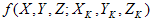
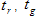
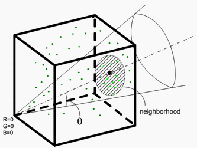
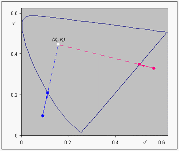
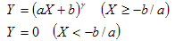
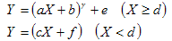
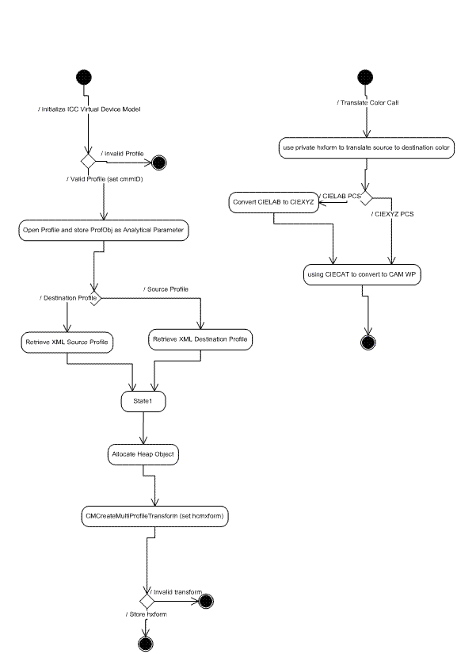

# WCS Color Device Model Profile Schema and Algorithms

This topic provides information about the WCS Color Device Model Profile Schema and its associated algorithms.

This topic contains the following sections:

-   [Overview](#overview)
-   [Color Device Model Profile Architecture](#color-device-model-profile-architecture)
-   [The CDMP Schema](#the-cdmp-schema)
-   [WCS CDMP v2.0 Calibration Addition](#wcs-cdmp-v20-calibration-addition)
-   [The CDMP Schema Elements](#the-cdmp-schema-elements)
    -   [ColorDeviceModelProfile](#colordevicemodelprofile)
    -   [ColorDeviceModel](#colordevicemodelprofile)
    -   [NamespaceVersion](#namespaceversion)
    -   [Version](#namespaceversion)
    -   [Documentation](#documentation)
    -   [CRTDevice element](#crtdevice-element)
    -   [LCDDevice element](#lcddevice-element)
    -   [ProjectorDevice element](#projectordevice-element)
    -   [ScannerDevice element](#scannerdevice-element)
    -   [CameraDevice element](#cameradevice-element)
    -   [RGBPrinterDevice element](#rgbprinterdevice-element)
    -   [CMYKPrinterDevice element](#cmykprinterdevice-element)
    -   [RGBVirtualDevice element](#rgbvirtualdevice-element)
    -   [PlugInDeviceType](#plugindevicetype)
    -   [RGBVirtualMeasurementType](#rgbvirtualmeasurementtype)
    -   [GammaType](#gammatype)
    -   [GammaOffsetGainType](#gammaoffsetgaintype)
    -   [GammaOffsetGainLinearGainType](#gammaoffsetgainlineargaintype)
    -   [ToneResponseCurvesType](#toneresponsecurvestype)
    -   [GamutBoundarySamplesType](#gamutboundarysamplestype)
    -   [FloatPairList](#floatpairlist)
    -   [CMYKPrinterMeasurementType](#cmykprintermeasurementtype)
    -   [RGBPrinterMeasurementType](#rgbprintermeasurementtype)
    -   [RGBCaptureMeasurementType](#rgbcapturemeasurementtype)
    -   [OneBasedIndex](#onebasedindex)
    -   [RGBProjectorMeasurementType](#rgbprojectormeasurementtype)
    -   [DisplayMeasurementType](#displaymeasurementtype)
    -   [MeasurementConditionsType](#measurementconditionstype)
    -   [GeometryType](#geometrytype)
    -   [RGBPrimariesGroup](#rgbprimariesgroup)
    -   [NonNegativeCMYKSampleType](#nonnegativecmyksampletype)
    -   [NonNegativeRGBSampleType](#nonnegativergbsampletype)
    -   [NonNegativeCMYKType](#nonnegativecmyktype)
    -   [NonNegativeRGBType](#nonnegativergbtype)
    -   [ExtensionType](#extensiontype)
    -   [NonNegativeXYZType](#nonnegativexyztype)
    -   [XYZType](#nonnegativexyztype)
-   [The CDMP Baseline Algorithms](#the-cdmp-baseline-algorithms)
    -   [CRT Device Model Baseline](#crt-device-model-baseline)
    -   [LCD Device Model Baseline](#lcd-device-model-baseline)
    -   [RGB Printer Device Model Baseline](#rgb-printer-device-model-baseline)
    -   [RGB Virtual Device Model Baseline](#rgb-virtual-device-model-baseline)
    -   [CMYK Printer Device Model Baseline](#cmyk-printer-device-model-baseline)
    -   [RGB Projector Device Model Baseline](#rgb-projector-device-model-baseline)
    -   [ICC Device Model Baseline](#icc-device-model-baseline)
-   [Related topics](#related-topics)

## Overview

This schema is used to specify the content of a color device model profile(CDMP). The associated baseline algorithms are described below.

The basic device model profile (DMP) schema consists of the sampling measurement data.

The sampling component of the DMP XML schema provides support for basic color measurement targets, focusing on common standard targets and targets optimized for the baseline device models.

In addition, the device profile provides specific information on the targeted device model and provides a policy that the baseline fallback device model can use if the targeted model is unavailable. The profile instances can include private extensions using standard XML extension mechanisms.

## Color Device Model Profile Architecture


## The CDMP Schema


```C++
<?xml version="1.0" encoding="UTF-8"?>
<xs:schema 
  xmlns:cdm="http://schemas.microsoft.com/windows/2005/02/color/ColorDeviceModel"
  xmlns:wcs="http://schemas.microsoft.com/windows/2005/02/color/WcsCommonProfileTypes"
  targetNamespace="http://schemas.microsoft.com/windows/2005/02/color/ColorDeviceModel"
  xmlns:xs="http://www.w3.org/2001/XMLSchema"
  elementFormDefault="qualified"
  attributeFormDefault="unqualified"
  blockDefault="#all"
  version="1.0">

  <xs:annotation>
    <xs:documentation>
      Color Device Model profile schema.
      Copyright (C) Microsoft. All rights reserved.
    </xs:documentation>
  </xs:annotation>

  <xs:import namespace="http://schemas.microsoft.com/windows/2005/02/color/WcsCommonProfileTypes" />

  <xs:complexType name="RGBType">
    <xs:attribute name="R" type="xs:float" use="required"/>
    <xs:attribute name="G" type="xs:float" use="required"/>
    <xs:attribute name="B" type="xs:float" use="required"/>
  </xs:complexType>

  <xs:complexType name="NonNegativeRGBType">
    <xs:attribute name="R" type="wcs:NonNegativeFloatType" use="required"/>
    <xs:attribute name="G" type="wcs:NonNegativeFloatType" use="required"/>
    <xs:attribute name="B" type="wcs:NonNegativeFloatType" use="required"/>
  </xs:complexType>

  <xs:complexType name="NonNegativeCMYKType">
    <xs:attribute name="C" type="wcs:NonNegativeFloatType" use="required"/>
    <xs:attribute name="M" type="wcs:NonNegativeFloatType" use="required"/>
    <xs:attribute name="Y" type="wcs:NonNegativeFloatType" use="required"/>
    <xs:attribute name="K" type="wcs:NonNegativeFloatType" use="required"/>
  </xs:complexType>
  
  <xs:complexType name="NonNegativeRGBSampleType">
    <xs:sequence>
      <xs:element name="RGB" type="cdm:NonNegativeRGBType"/>
      <xs:element name="CIEXYZ" type="wcs:NonNegativeCIEXYZType"/>
    </xs:sequence>
    <xs:attribute name="Tag" type="xs:string" use="optional"/>
  </xs:complexType>
  
  <xs:complexType name="NonNegativeCMYKSampleType">
    <xs:sequence>
      <xs:element name="CMYK" type="cdm:NonNegativeCMYKType"/>
      <xs:element name="CIEXYZ" type="wcs:NonNegativeCIEXYZType"/>
    </xs:sequence>
    <xs:attribute name="Tag" type="xs:string" use="optional"/>
  </xs:complexType>
  
  <xs:group name="RGBPrimariesGroup">
    <xs:sequence>
      <xs:element name="WhitePrimary" type="wcs:NonNegativeCIEXYZType"/>
      <xs:element name="RedPrimary" type="wcs:NonNegativeCIEXYZType"/>
      <xs:element name="GreenPrimary" type="wcs:NonNegativeCIEXYZType"/>
      <xs:element name="BluePrimary" type="wcs:NonNegativeCIEXYZType"/>
      <xs:element name="BlackPrimary" type="wcs:NonNegativeCIEXYZType"/>
    </xs:sequence>
  </xs:group> 
  
  <xs:complexType name="MeasurementConditionsType">
    <xs:annotation>
      <xs:documentation>
      Optional measurement conditions. 
       
      We only support CIEXYZ for measurement color space in this version. 
      If the white point value from the measurement conditions is not available, 
      the default processing will use
        - "D50" for printer and scanners
        - "D65" for camera and displays.          
      </xs:documentation>
    </xs:annotation>
    <xs:sequence>
      <xs:element name="ColorSpace" minOccurs="0">
        <xs:simpleType>
          <xs:restriction base="xs:string">
            <xs:enumeration value="CIEXYZ"/>
          </xs:restriction>
        </xs:simpleType>    
      </xs:element>
      <xs:choice minOccurs="0">
        <xs:element name="WhitePoint" type="wcs:NonNegativeCIEXYZType"/>
        <xs:element name="WhitePointName">
          <xs:simpleType>
            <xs:restriction base="xs:string">
              <xs:enumeration value="D50"/>
              <xs:enumeration value="D65"/>
              <xs:enumeration value="A"/>
              <xs:enumeration value="F2"/>
            </xs:restriction>
          </xs:simpleType>
        </xs:element>
      </xs:choice>
      <xs:element name="Geometry" minOccurs="0">
        <xs:simpleType>
          <xs:restriction base="xs:string">
            <xs:enumeration value="0/45"/>
            <xs:enumeration value="0/diffuse"/>
            <xs:enumeration value="diffuse/0"/>
            <xs:enumeration value="direct"/>
          </xs:restriction>
        </xs:simpleType>   
      </xs:element>
      <xs:element name="ApertureSize" type="xs:int" minOccurs="0"/>
    </xs:sequence>
  </xs:complexType>
  
  <xs:complexType name="DisplayMeasurementType">
    <xs:sequence>
      <xs:group ref="cdm:RGBPrimariesGroup"/>
      <xs:element name="GrayRamp">
        <xs:complexType>
          <xs:sequence>
            <xs:element name="Sample" type="cdm:NonNegativeRGBSampleType" maxOccurs="4096"/> 
          </xs:sequence>
        </xs:complexType>
      </xs:element>
      <xs:element name="RedRamp">
        <xs:complexType>
          <xs:sequence>
            <xs:element name="Sample" type="cdm:NonNegativeRGBSampleType" maxOccurs="4096"/> 
          </xs:sequence>
        </xs:complexType>
      </xs:element>
      <xs:element name="GreenRamp">
        <xs:complexType>
          <xs:sequence>
            <xs:element name="Sample" type="cdm:NonNegativeRGBSampleType" maxOccurs="4096"/> 
          </xs:sequence>
        </xs:complexType>
      </xs:element>
      <xs:element name="BlueRamp">
        <xs:complexType>
          <xs:sequence>
            <xs:element name="Sample" type="cdm:NonNegativeRGBSampleType" maxOccurs="4096"/> 
          </xs:sequence>
        </xs:complexType>
      </xs:element>
    </xs:sequence>
    <xs:attribute name="TimeStamp" type="xs:dateTime"/>
  </xs:complexType>

  <xs:complexType name="RGBProjectorMeasurementType">
    <xs:sequence>
      <xs:group ref="cdm:RGBPrimariesGroup"/>
      <xs:element name="ColorSamples">
        <xs:complexType>
          <xs:sequence>
            <xs:element name="Sample" type="cdm:NonNegativeRGBSampleType" maxOccurs="unbounded"/> 
          </xs:sequence>
        </xs:complexType>
      </xs:element>
    </xs:sequence>
    <xs:attribute name="TimeStamp" type="xs:dateTime"/>
  </xs:complexType>

  <xs:simpleType name="OneBasedIndex">
    <xs:restriction base="xs:int">
      <xs:minInclusive value="1"/>
    </xs:restriction>
  </xs:simpleType>
    
  <xs:complexType name="RGBCaptureMeasurementType">
    <xs:sequence>
      <xs:element name="PrimaryIndex">
        <xs:complexType>
          <xs:all>
            <xs:element name="White" type="cdm:OneBasedIndex"/>
            <xs:element name="Black" type="cdm:OneBasedIndex" minOccurs="0"/>
            <xs:element name="Red" type="cdm:OneBasedIndex" minOccurs="0"/>
            <xs:element name="Green" type="cdm:OneBasedIndex" minOccurs="0"/>
            <xs:element name="Blue" type="cdm:OneBasedIndex" minOccurs="0"/>
            <xs:element name="Cyan" type="cdm:OneBasedIndex" minOccurs="0"/>
            <xs:element name="Magenta" type="cdm:OneBasedIndex" minOccurs="0"/>
            <xs:element name="Yellow" type="cdm:OneBasedIndex" minOccurs="0"/>
          </xs:all>
        </xs:complexType>
      </xs:element>
      <xs:element name="NeutralIndices">
        <xs:simpleType>
          <xs:list itemType="cdm:OneBasedIndex"/>
        </xs:simpleType>
      </xs:element>
      <xs:element name="ColorSamples">
        <xs:complexType>
          <xs:sequence>
            <xs:element name="Sample" type="cdm:NonNegativeRGBSampleType" maxOccurs="unbounded"/> 
          </xs:sequence>
        </xs:complexType>
      </xs:element>
    </xs:sequence>
    <xs:attribute name="TimeStamp" type="xs:dateTime"/>
  </xs:complexType>

  <xs:complexType name="RGBPrinterMeasurementType">
    <xs:sequence>
      <xs:element name="ColorCube">
        <xs:complexType>
          <xs:sequence>
            <xs:element name="Sample" type="cdm:NonNegativeRGBSampleType" maxOccurs="unbounded"/> 
          </xs:sequence>
        </xs:complexType>
      </xs:element>       
    </xs:sequence>
    <xs:attribute name="TimeStamp" type="xs:dateTime"/>
  </xs:complexType>
  
  <xs:complexType name="CMYKPrinterMeasurementType">
    <xs:sequence>
      <xs:element name="ColorCube">
        <xs:complexType>
          <xs:sequence>
            <xs:element name="Sample" type="cdm:NonNegativeCMYKSampleType" maxOccurs="unbounded"/> 
          </xs:sequence>
        </xs:complexType>
      </xs:element>       
    </xs:sequence>
    <xs:attribute name="TimeStamp" type="xs:dateTime"/>
  </xs:complexType>

  <xs:complexType name="GammaType">
    <xs:attribute name="value" type="wcs:NonNegativeFloatType" use="required"/>
  </xs:complexType>
  
  <xs:complexType name="GammaOffsetGainType">
    <xs:attribute name="Gamma" type="wcs:NonNegativeFloatType" use="required"/>
    <xs:attribute name="Offset" type="wcs:NonNegativeFloatType" use="required"/>
    <xs:attribute name="Gain" type="wcs:NonNegativeFloatType" use="required"/>
  </xs:complexType>

  <xs:complexType name="GammaOffsetGainLinearGainType">
    <xs:attribute name="Gamma" type="wcs:NonNegativeFloatType" use="required"/>
    <xs:attribute name="Offset" type="wcs:NonNegativeFloatType" use="required"/>
    <xs:attribute name="Gain" type="wcs:NonNegativeFloatType" use="required"/>
    <xs:attribute name="LinearGain" type="wcs:NonNegativeFloatType" use="required"/>
    <xs:attribute name="TransitionPoint" type="wcs:NonNegativeFloatType" use="required"/>
  </xs:complexType>
  
  <xs:simpleType name="FloatList">
    <xs:list itemType="xs:float"/>
  </xs:simpleType>

  <xs:complexType name="OneDimensionLutType">
    <xs:sequence>
      <xs:element name="Input" type="cdm:FloatList"/>
      <xs:element name="Output" type="cdm:FloatList"/>
    </xs:sequence>
  </xs:complexType>

  <xs:complexType name="HDRToneResponseCurvesType">
    <xs:sequence>
      <xs:element name="RedTRC" type="cdm:OneDimensionLutType"/>
      <xs:element name="GreenTRC" type="cdm:OneDimensionLutType"/>
      <xs:element name="BlueTRC" type="cdm:OneDimensionLutType"/>
    </xs:sequence>
    <xs:attribute name="TRCLength" use="required">
      <xs:simpleType>
        <xs:restriction base="xs:int">
          <xs:minInclusive value="0" />
        </xs:restriction>
      </xs:simpleType>
    </xs:attribute>
  </xs:complexType>
  
  <xs:complexType name="GamutBoundarySamplesType">
    <xs:sequence>
      <xs:element name="RGB" type="cdm:RGBType" maxOccurs="unbounded"/>
    </xs:sequence>
  </xs:complexType>
  
  <xs:complexType name="RGBVirtualMeasurementType">
    <xs:sequence>
      <xs:element name="MaxColorantUsed" type="xs:float"/>
      <xs:element name="MinColorantUsed" type="xs:float"/>
      <xs:group ref="cdm:RGBPrimariesGroup"/>
      <xs:choice>
        <xs:element name="Gamma" type="cdm:GammaType"/>
        <xs:element name="GammaOffsetGain" type="cdm:GammaOffsetGainType"/>
        <xs:element name="GammaOffsetGainLinearGain" type="cdm:GammaOffsetGainLinearGainType"/>
        <xs:element name="HDRToneResponseCurves" type="cdm:HDRToneResponseCurvesType"/>
      </xs:choice>
      <xs:element name="GamutBoundarySamples" type="cdm:GamutBoundarySamplesType" minOccurs="0"/>
    </xs:sequence>
    <xs:attribute name="TimeStamp" type="xs:dateTime"/>
  </xs:complexType>
  
  <xs:element name="ColorDeviceModel">
    <xs:complexType>
      <xs:sequence>
        <xs:element name="ProfileName" type="wcs:MultiLocalizedTextType"/>
        <xs:element name="Description" type="wcs:MultiLocalizedTextType" minOccurs="0"/>
        <xs:element name="Author" type="wcs:MultiLocalizedTextType" minOccurs="0"/>
        <xs:element name="MeasurementConditions" type="cdm:MeasurementConditionsType" minOccurs="0"/>
        <xs:element name="SelfLuminous" type="xs:boolean" />
        <xs:element name="MaxColorant" type="xs:float"/>
        <xs:element name="MinColorant" type="xs:float"/>
        <xs:choice>
          <xs:element name="CRTDevice">
            <xs:complexType>
              <xs:sequence>
                <xs:element name="MeasurementData" type="cdm:DisplayMeasurementType"/>
              </xs:sequence>
            </xs:complexType>
          </xs:element>
          <xs:element name="LCDDevice">
            <xs:complexType>
              <xs:sequence>
                <xs:element name="MeasurementData" type="cdm:DisplayMeasurementType"/>
              </xs:sequence>
            </xs:complexType>
          </xs:element>
          <xs:element name="RGBProjectorDevice">
            <xs:complexType>
              <xs:sequence>
                <xs:element name="MeasurementData" type="cdm:RGBProjectorMeasurementType"/>
              </xs:sequence>
            </xs:complexType>
          </xs:element>
          <xs:element name="ScannerDevice">
            <xs:complexType>
              <xs:sequence>
                <xs:element name="MeasurementData" type="cdm:RGBCaptureMeasurementType"/>
              </xs:sequence>
            </xs:complexType>
          </xs:element>
          <xs:element name="CameraDevice">
            <xs:complexType>
              <xs:sequence>
                <xs:element name="MeasurementData" type="cdm:RGBCaptureMeasurementType"/>
              </xs:sequence>
            </xs:complexType>
          </xs:element>
          <xs:element name="RGBPrinterDevice">
            <xs:complexType>
              <xs:sequence>
                <xs:element name="MeasurementData" type="cdm:RGBPrinterMeasurementType"/>
              </xs:sequence>
            </xs:complexType>
          </xs:element>
          <xs:element name="CMYKPrinterDevice">
            <xs:complexType>
              <xs:sequence>
                <xs:element name="MeasurementData" type="cdm:CMYKPrinterMeasurementType"/>
              </xs:sequence>
            </xs:complexType>
          </xs:element>
          <xs:element name="RGBVirtualDevice">
            <xs:complexType>
              <xs:sequence>
                <xs:element name="MeasurementData" type="cdm:RGBVirtualMeasurementType"/>
              </xs:sequence>
            </xs:complexType>
          </xs:element>
        </xs:choice>
        <xs:element name="PlugInDevice" minOccurs="0">
          <xs:complexType>
            <xs:sequence>
              <xs:any namespace="##other" processContents="skip"
                minOccurs="0" maxOccurs="unbounded" />
            </xs:sequence>
            <xs:attribute name="GUID" type="wcs:GUIDType" use="required"/>
          </xs:complexType>
        </xs:element>
      </xs:sequence>
      <xs:attribute name="ID" type="xs:string" use="optional" />
    </xs:complexType>
  </xs:element>
</xs:schema>

```


## WCS CDMP v2.0 Calibration Addition

The **ColorDeviceModel** element of the CDMP schema has been updated in Windows 7 to include the new calibration element. The following shows the change to the CDMP schema.


```C++
  ...
  <xs:element name="ColorDeviceModel">
    <xs:complexType>
      <xs:sequence>
        ...
        <xs:element name="PlugInDevice" minOccurs="0">
             ...
        </xs:element>
        <xs:element name="Calibration" type="cal:Calibration" minOccurs="0"/>
        ...
      <xs:sequence>
    ...
    <xs:complexType>
  ...
```


## The CDMP Schema Elements

> [!Note]  
> Primaries are primary samples of red, green, blue, black, and white. A primary ramp is a tonal ramp from least luminance to full primary value. The maximum number of entries in a tone ramp is 4096.

 

> [!Note]  
> DMPs are required to have measurement data.

 

### ColorDeviceModelProfile

This element is of type ColorDeviceModel.

**Validation conditions:** Each sub-element is validated by its own type.

### ColorDeviceModel

This element is a sequence of the following sub-elements

1.  ProfileName string,
2.  optional Description string,
3.  optional Author string,
4.  optional MeasurementConditions MeasurementConditionsType,
5.  Self-Luminous Boolean,
6.  MaxColorant float,
7.  MinColorant float,
8.  Choice of elements
    1.  CRTDevice,
    2.  LCDDevice,
    3.  RGBProjectorDevice,
    4.  ScannerDevice,
    5.  CameraDevice,
    6.  RGBPrinterDevice,
    7.  CMYKPrinterDevice,
    8.  RGBVirtualDevice,
9.  PlugInDevice,
10. optional Extension ExtensionType

**Validation conditions:** Each sub-element is validated by its own type. String sub-elements have a maximum of 10,000 characters. The MaxColorant sub-element must be greater than or equal to zero (0) and greater than the MinColorant sub-element. The MinColorant can be negative.

### NamespaceVersion

xmlns:cdm="http://schemas.microsoft.com/windows/2005/02/color/ColorDeviceModel"

targetNamespace="http://schemas.microsoft.com/windows/2005/02/color/ColorDeviceModel"

### Version

Version = "1.0" with Windows Vista.

**Validation conditions:** Any version value &gt;0.1 or &lt;=2.0 is valid to support non-breaking changes to the format.

### Documentation

Device Model Profile schema.

Copyright (C) Microsoft. All rights reserved.

### CRTDevice element

This element is a sequence of sub-elements of a MeasurementData DisplayMeasurementType.

**Validation conditions:** Each sub-element is validated by its own type.

### LCDDevice element

This element is a sequence of sub-elements of a MeasurementData DisplayMeasurementType.

**Validation conditions:** Each sub-element is validated by its own type.

### ProjectorDevice element

This element is a sequence of sub-elements of a MeasurementData RGBProjectorMeasurementType.

**Validation conditions:** Each sub-element is validated by its own type.

### ScannerDevice element

This element is a sequence of sub-elements of a MeasurementData RGBCaptureMeasurementType

**Validation conditions:** Each sub-element is validated by its own type.

### CameraDevice element

This element is a sequence of sub-elements of a MeasurementData RGBCaptureMeasurementType

**Validation conditions:** Each sub-element is validated by its own type.

### RGBPrinterDevice element

This element is a sequence of sub-elements of a MeasurementData RGBPrinterMeasurementType.

**Validation conditions:** Each sub-element is validated by its own type.

### CMYKPrinterDevice element

This element is a sequence of sub-elements of a MeasurementData CMYKPrinterMeasurementType.

**Validation conditions:** Each sub-element is validated by its own type.

### RGBVirtualDevice element

This element is a sequence of sub-elements of a RGBVirtualMeasurementDataType.

**Validation conditions:** Each sub-element is validated by its own type.

### PlugInDeviceType

This element is a sequence of a GUID GUIDType and any sub-elements.

**Validation conditions:** The GUID is used to match the DM PlugIn Dll GUID. There are a maximum of 100,000 custom sub-elements.

### RGBVirtualMeasurementType

This element is a sequence consisting of

1.  RGBPrimariesGroup group
2.  A choice of
3.  -   Gamma
    -   GammaOffsetGain
    -   GammaOffsetGainLinearGam
    -   ToneResponseCurves elements

4.  optional GamutBoundarySamples GamutBoundarySamplesType
5.  TimeStamp dateTime

**Validation conditions:** Each sub-element of these types has its own validation conditions.

### GammaType

This element is a complex type consisting of the attribute

-   Gamma NonNegativeFloatType

**Validation conditions:** To be determined from industry feedback.

### GammaOffsetGainType

This element is a complex type consisting of the attributes

-   Gamma NonNegativeFloatType
-   Offset NonNegativeFloatType
-   Gain NonNegativeFloatType

**Validation conditions:** To be determined from industry feedback.

### GammaOffsetGainLinearGainType

This element is a complex type consisting of the attributes

-   Gamma NonNegativeFloatType
-   Offset NonNegativeFloatType
-   Gain NonNegativeFloatType
-   LinearGain NonNegativeFloatType
-   TransitionPoint NonNegativeFloatType.

**Validation conditions:** To be determined from industry feedback.

### ToneResponseCurvesType

This element is a sequence of

1.  RedTRC FloatPairList
2.  GreenTRC FloatPairList
3.  BlueTRC FloatPairList

The element also has an attribute TRCLength of unsignedint type.

**Validation conditions:** To be determined from industry feedback.

### GamutBoundarySamplesType

This element is a sequence of RGB RGBTypes.

**Validation conditions:** Currently unbounded maximum occurences, to be capped based on industry feedback.

### FloatPairList

This element is a simple type of list of pairs of floats.

**Validation conditions:** To be determined from industry feedback.

### CMYKPrinterMeasurementType

This element is a

1. sequence of ColorCube element consisting of a sequence of Sample NonNegativeCMYKSampleType

2. TimeStamp dateTime attribute.

**Validation conditions:** To be determined from industry feedback.

### RGBPrinterMeasurementType

This element is a

1. sequence of ColorCube element consisting of a sequence of Sample NonNegativeRGBSampleType

2. TimeStamp dateTime attribute.

**Validation conditions:** To be determined from industry feedback.

### RGBCaptureMeasurementType

This element is a sequence of

1.  PrimaryIndex complexType of
2.  1.  White OneBasedIndex
    2.  Optional Black OneBasedIndex
    3.  Optional Red OneBasedIndex
    4.  Optional Green OneBasedIndex
    5.  Optional Blue OneBasedIndex
    6.  Optional Cyan OneBasedIndex
    7.  Optional Magenta OneBasedIndex
    8.  Optional Yellow OneBasedIndex

3.  NeutralIndices of lines of OneBasedIndex
4.  ColorSamples sequence of Sample NonNegativeRGBSampleType

The element also has a TimeStamp dateTime attribute.

**Validation conditions:** To be determined from industry feedback.

### OneBasedIndex

This element is a simple type of restriction base unsigned int with minInclusive value = "1."

**Validation conditions:** To be determined from industry feedback.

### RGBProjectorMeasurementType

This element is a sequence of

1.  RGBPrimariesGroup group
2.  element ColorSamples consisting of sequence of Sample NonNegativeRGBSampleType

The element also has a TimeStamp dateTime attribute.

**Validation conditions:** To be determined from industry feedback.

### DisplayMeasurementType

This element is a sequence of

1.  group RGBPrimariesGroup
2.  GrayRamp of sequence of Sample NonNegativeRGBType
3.  RedRamp of sequence of Sample NonNegativeRGBType
4.  GreenRamp of sequence of Sample NonNegativeRGBType
5.  BlueRamp of sequence of Sample NonNegativeRGBType

The DisplayMeasurementType element also has a TimeStamp dateTime attribute.

**Validation conditions:** To be determined from industry feedback.

### MeasurementConditionsType

The MeasurementConditionsType is a sequence of sub-elements that contains:

1.  ColorSpace restricted string enumeration value of "CIEXYZ"
2.  optional choice of WhitePoint NonNegativeXYZType or WhitePointName string enumeration of values D50, D65, A, or F2
3.  Geometry GeometryType
4.  ApertureSize integer in millimeters

Defaults are:

1.  RGB and CMYK Printers:
    1.  CIEXYZ MeasurementSpaceType
    2.  D50 WhitePointValue
    3.  0/45 GeometryType
    4.  10mm ApertureSize
2.  Scanners:
    1.  CIEXYZ MeasurementSpaceType
    2.  D50 WhitePointValue
    3.  0/45 GeometryType
    4.  10mm ApertureSize
3.  Displays and RGB Virtual Device:
    1.  CIEXYZ MeasurementSpaceType
    2.  D65 WhitePointValue
    3.  0/45 GeometryType
    4.  10mm ApertureSize
4.  Cameras:
    1.  CIEXYZ MeasurementSpaceType
    2.  D65 WhitePointValue
    3.  Direct GeometryType
    4.  10mm ApertureSize

**Validation conditions:** Validation of each sub-element is determined by validation conditions for those sub-elements. If any sub-element is missing, the device model type specific default is used.

### GeometryType

String

Enumeration values:

-   "0/45"
-   "0/diffuse"
-   "diffuse/0"
-   "Direct"

**Validation conditions:** Any value except the enumberation values listed is invalid. This information will not change baseline processing behavior.

### RGBPrimariesGroup

This element is a sequence of

1.  WhitePrimary NonNegativeXYZType
2.  RedPrimary NonNegativeXYZType
3.  GreenPrimary NonNegativeXYZType
4.  BluePrimary NonNegativeXYZTYpe
5.  BlackPrimary NonNegativeXYZType

**Validation conditions:** To be determined from industry feedback.

### NonNegativeCMYKSampleType

This element is a sequence of

1.  CMYK NonNegativeCMYKType
2.  CIEXYZ NonNegativeXYZType

The element also has an optional attribute Tag string

**Validation conditions:** To be determined from industry feedback.

### NonNegativeRGBSampleType

This element is a sequence of

1.  RGB NonNegativeRGBType
2.  CIEXYZ NonNegativeXYZType

The element also has an optional attribute Tag string

**Validation conditions:** To be determined from industry feedback.

### NonNegativeCMYKType

This element consisting of attributes

1.  C float
2.  M float
3.  Y float
4.  K float

**Validation conditions:** To be determined from industry feedback.

### NonNegativeRGBType

This element consisting of attributes

1.  R float
2.  G float
3.  B float

**Validation conditions:** To be determined from industry feedback.

### ExtensionType

The ExtensionType element is a sequence of any sub-element type and is used for proprietary information from non-Microsoft applications.

**Validation conditions:** This element is optional. There can be a maximum of 1000 extension sub-elements.

### NonNegativeXYZType

The NonNegativeXYZType element is composed of NonNegativeFloatType three single-precision IEEE floating-point elements named "X," "Y," and "Z." These values are limited to the DMP profiles measurement values. These measurements can be either absolute (not relative) CIEXYZ 1931 reflective values or absolute (not relative) CIEXYZ 1931 direct (transmissive) values in candelas per meter squared units.

**Validation conditions:** Only real-world values are valid, and negative CIEXYZ measurement values are invalid. Because these are absolute values, values can be greater than 1.0f. A reasonable limit for any "X," "Y," or "Z." value is arbitrarily set to 10000.0f.

### XYZType

The XYZType element is composed of three single-precision IEEE floating-point values: "X," "Y," and "Z."

## The CDMP Baseline Algorithms

### CRT Device Model Baseline

To understand this model, you must consider both the characterization process and the device modeling. In the characterization process, XYZ measurements are first performed on the colors obtained by filling the display buffer of a CRT display device. The following example values will generate good data for the baseline CRT device model:

Red: R = 15, 30, 45, 60, 75, 90, 105, 120, 135, 150, 165, 180, 195, 210, 225, 240, 255, G = B = 0

Green: G = 15, 30, 45, 60, 75, 90, 105, 120, 135, 150, 165, 180, 195, 210, 225, 240, 255, R = B = 0

Blue: B = 15, 30, 45, 60, 75, 90, 105, 120, 135, 150, 165, 180, 195, 210, 225, 240, 255, R = G = 0

Neutrals: R = G= B = 0, 8, 16, 32, 64, 128, 192, 255

Increments other than 15 and nonlinear increments can also be used. Each red, green, blue, and neutral ramp must contain at least three samples, but providing more samples is recommended. You must provide samples for pure red, green, blue, black, and white. The samples do not have to be uniformly spaced.

The process of building the tristimulus matrix consists of two steps. First, estimate the black point XYZ value, or the flare. This step is based largely on work of Berns\[3\] with a slightly modified objective function for the nonlinear optimization. Second, calculate tristimulus matrix based on the result from step one and also from an averaging calculation on all of the per-channel measurements, not just the one for maximum digital count.

Each of these steps contains detailed procedures. The starting point is the ramps (17 steps in our example) for each of R, G, and B channels. When the XYZ measurements are plotted on the chromaticity *xy* -plane, a typical situation is shown in Figure 1. Step one consists of solving a nonlinear optimization problem to find the "best fit" black point that will minimize the drift in chromaticity as one traverses along the R, G, and B channels. Based on Berns\[3\], we seek ( *X<sub>K</sub>*,*Y<sub>K</sub>*,*Z<sub>K</sub>* ) that minimizes the following objective function:


where *S<sub>R</sub>*,*S<sub>G</sub>*, and *S<sub>B</sub>* are the set of data points corresponding to the points on the R, G, and B channels. For any set *S*, define:


In the preceding, \| *S* \| is the cardinality of *S*, i.e., the number of points in the set *S*.  is the chromaticity coordinates of the point  , so , is the average, or center of mass, of all the points in the set *S* in the chromaticity plane. Thus,  is the sum of second moments of the points about the center of mass and is a measure of how spread out the points are about it. Finally,  is a total measure of how spread out the three clusters of points are about their respective centers of mass.

In the calculation of  , if  , then the calculation is skipped, and the cardinality of *S* is adjusted accordingly.

Despite the apparent complexity of the objective function, it is a sum of the squares of many differentiable functions in *X<sub>K</sub>*,*Y<sub>K</sub>Z<sub>K</sub>* (17 points   2*xy* -components   3 channels = 102, in the example), and, therefore, is amenable to standard nonlinear least squares techniques, such as the Levenberg-Marquardt algorithm, which is the algorithm used in WCS. Note that the preceding objective function is different from the one suggested in Berns\[3\] in that the latter function measures the variance of the distances from the center of mass, so that the variance is zero when the points are equidistant from the center of mass, even though they may spread out quite a bit about it. In the example, the dispersion of points is contolled directly using the second moments.

As with any iterative algorithm for the nonlinear least squares problem, Levenberg-Marquardt requires an initial guess. There are two obvious candidates. One is (0, 0, 0); the other is the measured black point. For the CTE, the measured black point is first used as the initial guess. If a maximum of 100 iterations is exceeded without achieving a threshold of an average distance of 0.001 of each point from its center of mass (which corresponds to a threshold value of (0.001)    17   3 = 0.000051 for the objective function), then another round of iterations with the initial guess of (0, 0, 0) is performed. The resulting estimate of the black point is XYZ compared with the best estimate from the previous round of iterations (with the measured black point as the initial guess). Use the estimate that gives the smallest value for the objective function. The choice of 100 iterations and the error distance of 0.001 were each selected empirically. In future versions, it might be reasonable to parameterize the error distance.

The result of step one is the estimated black point ( *X<sub>K</sub>*,*Y<sub>K</sub>*,*Z<sub>K</sub>* ). Step two consists of determining the tristimulus matrix by averaging the chromaticity of the points in the three clusters obtained in step one. For CRTs, this is done primarily to minimize the effects of measurement errors. The points used in averaging the chromaticity must be the same points used in the optimization in step one. In other words, if the first point (digital count 15, in the example) in each ramp is discarded in the optimization step, then the same must be done in the averaging. If  , and  are the averaged chromaticity coordinates of the red, green, and blue channels, then the following procedure determines the tristimulus matrix. First, solve the 3?3 linear system:




*X<sub>W</sub>*,*Y<sub>W</sub>*,*Z<sub>W</sub>*


After the tristimulus matrix is determined, the determination of tone curves follows the standard approach. For CRT displays, the individual channels are assumed to follow the "GOG" model:


where *k<sub>g</sub>* is the "gain",1 -*k<sub>g</sub>* is the "offset", and ? is the "gamma." The inverse matrix of the tristimulus matrix is applied to the XYZ data of the neutrals to obtain the linear RGB data, which is then correlated with the digital RGB values using nonlinear regression on the GOG model. These characteristics do not have to be the same for the R, G, and B channels, and generally are not the same.

Berns\[1\]: Berns, *Billmeyer and Saltzman's Principles of Color Technology*, 3 <sub>rd</sub> Ed. John Wiley & Sons (2000).

Berns\[2\]: Berns and Katoh, The digital to radiometric transfer function for computer controlled CRT displays, *CIE Expert Symposium '97 Colour Standards for Imaging Technology*, Nov. 1997.

Berns\[3\]: Berns, Fernandez and Taplin, Estimating Black-Level Emissions of Computer-Controlled Displays, *Color Research and Application*, 28: 379-383 Wiley Periodicals, Inc. (2003)

Kang\[1\]: Kang, *Color Technology for Electronic Imaging Devices*, SPIE (1997)

Katoh\[1\]: Katoh, Deguchi and Berns, An accurate characterization of CRT monitor (II) proposal for an extension to CIE method and its verification, *Opt. Rev.* 8: 397-408 (2001)

### LCD Device Model Baseline

The LCD Device Model Baseline is similar to the CRT Device Model Baseline. This section will explain the ways in which LCD modeling differs from CRT modeling.

One difference is that you cannot assume that LCD displays follow the GOG model used for CRTs, and the tone curves are obtained by interpolation of measured data. Because of that, the device neutral axis should be sampled more frequently.

Here are some typical example values that can generate good data for the LCD device model baseline:

Red: R = 15, 30, 45, 60, 75, 90, 105, 120, 135, 150, 165, 180, 195, 210, 225, 240, 255, G = B = 0

Green: G = 15, 30, 45, 60, 75, 90, 105, 120, 135, 150, 165, 180, 195, 210, 225, 240, 255, R = B = 0

Blue: B = 15, 30, 45, 60, 75, 90, 105, 120, 135, 150, 165, 180, 195, 210, 225, 240, 255, R = G = 0

Neutrals: R = G = B = 0, 15, 30, 45, 60, 75, 90, 105, 120, 135, 150, 165, 180, 195, 210, 225, 240, 255.

The process of averaging measured color chromaticies to obtain the chromaticities for the device primaries is more critical for LCDs than it is for CRTs. When XYZ measurements are plotted on the chromaticity *xy* -plane, a typical situation is shown in Figure 1. Notice how the chromaticity drifts toward the black point. This is because all LCDs have a certain amount of light leakage.


**Figure 1** : The chromaticity diagram using raw data with no correction

When this is subtracted from the raw XYZ measurements, a typical situation is depicted in Figure 2. Tthe points are now clustered about three centers, although they don't fall identically on them. The averaging process described for CRTs greatly improves the results for LCDs.


**Figure 2** : The chromaticity diagram using data with adjusted black point

### RGB Capture Device Model Baseline

The baseline RGB capture device model is a subclass of the IDeviceModel class. In the colorimetric characterization of color capture devices, such as scanners and digital cameras, the following approach is used. A target consisting of color patches with known CIEXYZ values is captured using the capture device. The result of the capture is an RGB bitmap image in which the color of each patch is encoded in an RGB value. These device RGB values are specific to a particular capture device. The goal of colorimetric characterization is to establish an empirical relationship between the device RGB values and CIEXYZ values, or a mathematical transformation from RGB to XYZ that models as accurately as possible the behavior of the capture device.

Such a mathematical transformation can be modeled reasonably by polynomials of low degrees. This procedure is detailed in the literature, for example Kang\[92\], Kang\[97\]. In Kang\[97\], an approach is reported that uses a set of three polynomials with 3, 6, 8, 9, 11, 14 or 20 terms in the R, G, and B variables, while the three polynomials regress respectively into the X, Y, Z components of the CIEXYZ space. For the 20-term polynomial, the form is:


There are similar expressions for Y and Z. The mathematical technique for fitting the polynomials falls within "Multivariate Linear Regression" and is described in any elementary text in Statistics.

This method of linear regression suffers from not minimizing the "right" objective function. By design, linear regression finds the least squares solution, which implies that the coefficients obtained will minimize the total sum of squares of errors in the underlying space, or equivalently, the sum of squares of the Euclidean distances. In practice, you want to minimize the sum of squares of ?Es, where ?E is one of the accepted standards such as CIE94. Minimizing this objective function is a nonlinear regression problem.

In the new engine, Lab to XYZ is the CIE color space that is regressed into, and the 20-term cubic polynomial is used as the model for the capture device, or coefficients ls,as,bs such that the following polynomials minimize the sum of squares of ?E <sub>CIE94</sub> s.


The solution ( *l<sub>i</sub>*, *a<sub>i</sub>*, *b<sub>i</sub>* ) in the 60-dimensional real numeric space **R**203 must be such that the following total error is minimized:


where the summation is through all the data point pairs (*R<sub>i</sub>*,*G<sub>i</sub>*,*B<sub>i</sub>*;*L<sub>i</sub>*,*u<sub>i</sub>*,*v<sub>i</sub>* ) in the sampled data set plus additional control points to be detailed in the following. This is a nonlinear regression problem because the parameters *?<sub>i</sub>*, *a<sub>i</sub>*, * <sub>i</sub>* enter into the objective function in a nonlinear way (not quadratically).

Because the objective function ? is a nonlinear (and nonquadratic) function of the parameters *?<sub>i</sub>*, *a<sub>i</sub>* and * <sub>i</sub>*, you must resort to iterative techniques to solve the optimization problem. Because the form of the objective function is a sum of squares, a standard optimization technique called the Levenberg-Marquardt algorithm is used. It is considered the method of choice for nonlinear least squares problems. For iterative algorithms such as Levenberg-Marquardt, you must supply an initial guess. A good initial guess is usually critical in finding the correct minimum value. In this case, one good candidate for the initial guess is the solution of the linear regression problem. First, minimize the sum of the square of Euclidean distances in Lab space, by defining a quadratic objective function:


The mathematical solution to such "linear least squares" problem is well known. Because *?<sub>i</sub>* only appears in the *L* modeling, *a<sub>i</sub>* only appears in the *u* modeling, and * <sub>i</sub>* only appears in the *v* modeling; the optimization problem can be decomposed into three subproblems: one for *L*, one for *u* and one for *v*. Consider the *L* equations. (The *u* equations and the *v* equations follow exactly the same argument.) The problem of minimizing the sum of squares of errors in *L* can be stated as solving the following matrix equation in the least squares sense:


where *N* is the total number of data points (original sampled points plus control points created in a manner described below). Typically, *N* is much larger than 20, so the preceding equation is over-determined, requiring a least squares solution. A closed form solution for **?** is available:


In practice, direct evaluation using the closed form solution is not used because it has poor numerical properties. Instead, some kind of matrix factorization algorithm is applied to the coefficient matrix which reduces the system of equations to a canonical form. In the current implementation, Singular Value Decomposition (SVD) is applied to the matrix **R** and then the resulting decomposed system is solved.

The solution to the linear regression problem, denoted by  , is used as the starting point of the Levenberg-Marquardt algorithm. In this algorithm, a trial step is computed that should move the point closer to the optimal solution. The trial step satisfies a set of linear equations dependent on the functional value and values of the derivatives at the current point. For this reason, the derivatives of the objective function ? with respect to the parameters *?<sub>i</sub>*, *a<sub>i</sub> <sub>i</sub>* are required inputs to the Levenberg-Marquardt algorithm. Although there are 60 parameters, there is a shortcut that allows you to compute a lot less. By the Chain Rule of Calculus,


where *j* = 1, 2,  , 20, *L<sub>i</sub>*,*u<sub>i</sub>*,*v<sub>i</sub>* are the CIELAB value of the *i* th sample point, and *R<sub>ij</sub>* is the (*i*,*j* )th entry of the matrix **R** defined above. So instead of computing derivatives for 60 parameters, you can compute derivatives for *L*,*a*, and *b* using numerical forward differencing.

It is also necessary to set up a stopping criterion for iterative algorithms. In the current implementation, the iterations are terminated if the mean square DECIE94 is less than 1, or the number of iterations performed has exceeded 10. The number 10 comes from the practical experience that if the first few iterations do not reduce the error significantly, further iterations would not help much other than moving the point in an oscillatory manner, i.e., the algorithm may not converge. Even in the case that the algorithm diverges, we can be sure that the DECIE94 is no worse than what we started, i.e. with the parameters obtained from linear regression.

Even with the preceding method of nonlinear regression, there are several problems with the fitting. One problem is that the polynomials tend to overshoot or undershoot beyond the data points. Artificial local maxima and minima may be introduced in the fitting process. This can be counteracted by using polynomials of low degree, which is the reason you should not use higher than three degrees. A more serious aspect of overshooting or undershooting is that, while a polynomial can take any real value theoretically, the space it tries to model typically has physical constraints and practical constraints. CIEXYZ must have all of X, Y, Z non-negative, which is a physical constraint. In practice, they only take values in the magnitude of hundreds, not thousands or higher. Similarly, CIELAB or CIELUV has its own physical and practical constraints. When the RGB space is filled sufficiently with sample points, the problem of overshooting or undershooting is not serious. However, the captured RGB points from the capture device do not usually fill up the RGB space uniformly. The points may fill up only inner the 80% of the RGB cube, or worse, they may reside in a lower dimensional manifold. When this happens, the regressed polynomials may do a poor job at extrapolating the values beyond the data points, sometimes returning unrealistic predictions. You want a model that always returns reasonably realistic values. This requires a method that can effectively control the boundary behavior of regression polynomials by imposing additional cost to those polynomials that behave erratically near the boundary of the RGB cube. A further measure to ensure that the polynomials always return realistic values is applied by clipping the output to within the CIE spectral locus.

It is at this point that the scanner modeling and camera modeling diverge from each other. The camera model is expected to extrapolate to regions beyond the sampled points including the "specular highlights," the same extrapolation is not required for the scanner model. The scanner target is expected to cover a characterization that is similar to the printed materials to be scanned. The scanner model is still required to be robust in the sense that it should not return unrealistic values, but extrapolation far beyond the characterization target is not required. To ensure robustness, the L-polynomial above is clipped at 100, that is, the polynomial model is forced not to extrapolate beyond "Dmin" of the scanner target.

The camera model is expected to extrapolate to specular highlights, so clipping at 100 is undesirable. Instead, the following algorithm is used.

Artificial control points are introduced to control the behavior of the polynomials in regions with insufficient sampling. By strategically placing these control points with appropriate values, they serve to "pull" the polynomials in the required direction. In the current implementation, eight control points corresponding to the corners of the RGB cube are used. If the device values are normalized to unity, then these points are:

*R* = 0, *G* = 0, *B* = 0

*R* = 0, *G* = 0, *B* = 1

*R* = 0, *G* = 1, *B* = 0

*R* = 0. *G* = 1, *B* = 1

*R* = 1, *G* = 0, *B* = 0

*R* = 1, *G* = 0, *B* = 1

*R* = 1, *G* = 1, *B* = 0

*R* = 1, *G* = 1, *B* = 1

Except for the white *R* =*G* =*B* = 1, which is associated with a CIELAB value of *L* = 100, *u* =*v* = 0, the following extrapolation algorithm is used to determine the appropriate CIELAB value to be associated with. Generally, for a given (*R*,*G*,*B* ), a weight is associated with each of the (*R<sub>i</sub>*,*G<sub>i</sub>*,*B<sub>i</sub>* ) in the sampled data set. There are two goals to assigning the weight. First, the weight is inversely proportional to the distance between (*R*,*G*,*B* ) and (*R<sub>i</sub>*,*G<sub>i</sub>*,*B<sub>i</sub>* ). Second, you want to discard, or assign weight 0 to, points that have a different hue than the given point (*R*,*G*,*B* ). To take the hue into account, consider points that lie within a cone whose vertex is at (0, 0, 0), whose axis coincides with the line joining (0, 0, 0) to (*R*,*G*,*B* ), and whose semi-vertical angle ? satisfies cos ? = 0.9. See Figure 3 for an illustration of this cone.



**Figure 3** : Filtering the sample points by angle and distance. The shape of the neighborhood depicted is for illustration purpose only. The actual shape depends on the distance used; it is a diamond-shaped neighborhood if the 1-norm is used.

Within this cone, a second filtering is performed that is based on the RGB distance, which uses the 1-norm, defined by


With the current cone, the initial search is for points that are within a distance of 0.1 from (*R*,*G*,*B* ). If no point is found within this radius, the radius is increased by 0.1, and the search is restarted. If the next round nets no point either, the radius is increased by 0.1. This process continues until the radius exceeds MaxDist/5, where MaxDist = 3, in the case of 1-norm. If no point is found, the cone is enlarged by decreasing the cos ? by 0.05, that is, increasing the angle ? and restarting the whole process with an increasing radius. This process continues until a non-empty set of points is found, or cos ? reaches 0, that is, the cone has opened up to become a plane. At this point, the search is restarted by increasing the radius, except that the search continues until the radius reaches MaxDist. This guarantees that in the worst-case scenario, a non-empty set of points will be found. The algorithm is summarized in the flow diagram in Figure 4.


**Figure 4** : Flow diagram for determining the set S of sample points used in the extrapolation for an input RGB value

Assuming that the preceding process yields a non-empty set *S* of points (*R<sub>i</sub>*,*G<sub>i</sub>*,*B<sub>i</sub>* ) and corresponding (*L<sub>i</sub>*,*a<sub>i</sub>*,*b<sub>i</sub>* ), then for each such point, a weight *w<sub>i</sub>* is assigned, given by


Finally, the extrapolant is defined by


The preceding equations constitute an instance of the "inverse-distance weighted methods," commonly called the Shepard methods. By running each of the eight points from eq (6) through the algorithm, eight control points are obtained, each with *R*,*G*,*B* and *L*,*a*,*b* values, which are put into the pool with the original sample data.

To ensure that the model always produces valid color values and for system integrity and stability down the whole color processing pipeline, you must perform a final clipping to the output of the polynomial model. The CIE visual gamut is described by the achromatic component (*Y* or *L* ) and the chromatic component (*xy* or *a'b'*, which are related to the XYZ space by a projective transformation). In the current implementation, the *a'b'* chromaticity is used because it is directly related to the CIELUV space. For any *CIELAB* value, first clip *L* to a non-negative value:


To allow extrapolation for specular highlights, *L* is not clipped at 100, the "conventional" upper bound for *L* in Lab space.

Next, if *L* = 0, then *a* and *b* are clipped such that a*= b =* 0. If *L* ? 0, calculate


These are the components of a vector in the *a'b'* diagram from the white point (*u?'*,*v?'* ) to the color in question. Define the CIE spectral locus as the convex hull of all the points (*a'*,*b'* ), parameterized by the wavelength ?:


where  are the CIE color-matching functions for the 2-degree observer. If the vector lies outside the CIE locus, the color is clipped to the point on the CIE locus that is the intersection of the locus and the line defined by the vector. See Figure 5. If clipping has occurred, the *a* and *b* value is reconstructed by first subtracting *a?'* and *b?'* from the clipped *a'* and *b'*, and then multiplying by 13 *L*.



**Figure 5** : Clipping algorithm for Lab values that are outside the CIE visual gamut

In the current implementation, the CIE spectral locus in the *a'b'* plane is represented by a piecewise linear curve with 35 segments (corresponding to a wavelength from 360 nm to 700 nm inclusive). By ordering the line segments so that their subtended angles at the white point are ascending, which is equivalent to descending wavelengths, the line segment that intersects with the ray formed by the above vector can be found by a simple binary search.

### RGB Printer Device Model Baseline

A device characterization of a RGB printer consists of constructing an empirical model of the device that predicts the device-independent CIELUV color for any given RGB value

There are two ways to construct the empirical model. One way is to use the device data for a RGB printer, and the other is to use analytical parameter data. In the first one, measurement data provided by a user for a RGB printer device is used to construct 3-D lookup table (LUT). The measurement data consists of XYZ values for uniformly sampled RGB patches. Typical sampling sizes are 9 or 17 for each component. Each patch is measured with a colorimeter or spectrophotometer in CIEXYZ space. The XYZ value for a patch is then converted into CIELUV value, forming a 3-D LUT. In the device model, the Sakamoto's tetrahedral interpolation method is applied to the 3-D LUT in order to predict the CIELUV data for a given RGB data. (Confer US Patent 4275413 (Sakamoto et al.), US Patent 4511989 (Sakamoto), Kang \[1\]. The two patents mentioned have expired.). The analytical parameter data passed in the second method is simply a LUT that was built previously. Typically, that LUT was built using the first method, although it could be hand-built.

In the current color management, the source map is defined as the map that goes from RGB space to a device-independent CIEXYZ color space. The destination map is defined as the map that goes from the device-independent CIEXYZ color space to RGB space. It is the inverse of the source map.

The empirical model is directly used in the source map. It first maps a given RGB data into a CIELUV data, which is converted into XYZ data. In the destination map, device-independent CIEXYZ data is first converted into CIELUV data. Then, the empirical model and the classical Newton-Raphson method are used to predict the best RGB data for the CIELUV data. The details about conversion from CieLUV to RGB data are as follows:

After generating a 3-D LUT from RGB to CieLUV, the map from RGB to LUV is built using tetrahedral interpolation on RGB. This map is denoted by the following equations:


Inversion of the map consists of solving, for any color  , the following system of nonlinear equations:


A nonlinear equation that is based on the classical Newton-Raphson method is used in the new CTE. An initial guess, or *a priori* see, s <sub>prior</sub> -(R 0, G 0, B 0 ) is obtained by searching through a "seed matrix" consisting of a uniform 8x8x8 grid of pre-computed (RGB,Luv) pairs. The RGB corresponding Luv that is closest to the L\*u\*v\* is chosen. Each point in the seed matrix corresponds to the center of a cell so that the iterations don't start with a point on the boundary face of the RGB cube. In other words, the RGB of the seeds is defined by: STEP = 1/8 s <sub>ijk</sub> = (STEP/2 + (i-1) STEP, STEP/2+(j-1)STEP, STEP/2+(k-1)STEP) with i,j,k = 1...8 At the *i* th step of Newton-Raphson, the next estimate  is obtained by the formula:


Iteration stops when the error (distance in the CIELUV space) is less than a pre-set tolerance level (0.1 in the CTE), or when the number of iterations has exceeded the maximum allowed number of iterations (10 in the CTE). The values for the tolerance and the number of iterations were empirically determined to be effective. In future versions, the tolerance value may be changed.

The Jacobian matrix is calculated using forward difference, except at a boundary point (one or more of the R, G, B is 1) where backward difference is used instead. Instead of calculating the inverse of the Jacobian matrix, the linear system is solved directly using Gauss-Jordan elimination with full pivoting.

At the end of the iterations, convergence still might not be achieved because Newton-Raphson is a "local" algorithm, that is, it only works well if you start with an initial guess that is close to the true solution. If, at the end of the Newton-Raphson iterations, convergence within the pre-defined error tolerance has not been achieved, the iterations are restarted with a new set of seeds, defined as follows.

For example, the best solution obtained so far is (r, g, b). From this solution, N a posteriori seeds are derived, where N = 4. Intuitively, the solution is moved "toward the center" in a step size that depends on N. See Figure 6.


**Figure 6** : Perturbation direction of the solution depends on which octant it is in.

In other words, if r &gt; 0.5, the value on the R channel is decreased, otherwise the value is increased. There is similar logic for the G and B channels. The precise definitions are:

PERTURBATION = 0.5/(N+1)

Dir(r) = -1 if r &gt; 0.5; +1 otherwise. Similarly for Dir(g) and Dir(b)

The jth a posteriori seed, s ????, is (r + Dir(r) \*j \* PERTURBATION, g + Dir(g) \* j \* PERTURBATION, b + Dir(b) \* j \* PERTURBATION)

Try the first s ???? and if it gives a new solution within error tolerance, you can stop. Otherwise, try the second s ???? and so on until the Nth s ????.

The schematics of the whole algorithm is shown in Figure 7.


**Figure 7** : Schematics of inverting the device model

### RGB Virtual Device Model Baseline

This device model(DM) is a simple matrix/tone reproduction algorithm. The matrix is derived from the white point and primaries using standard color science algorithms. The tone reproduction curve is derived from the measurement parameters according to the ICC descriptions of CurveType and ParametricType (or inverted as required). Details of the internal algorithms will be provided after additional validation of high dynamic range issues.

The RGB virtual device model is an idealized matrix/tone reproduction curve RGB similar to the ICC three-component matrix-based profile design. The "virtual measurement" parameters of the DM include a white point value (absolute CIEXYZ), RGB primary values (absolute CIEXYZ), and a tone reproduction curve that is based on the ICC ParametricCurveType and CurveType in XML formatting consistent with the DMP schemas.

ICC parametricCurveType function type encoding and corresponding support in IRGBVirtualDeviceModelBase are shown in the following table.


| Function type                                         | Parameters                          | Type                                     | Note                                           |
|------------------------------------------|---------------------------|--------------------------------------|--------------------------------------------|
| <br/> | g<br/>              | GammaType<br/>                 | Common implementation<br/>           |
| <br/> | ga b<br/>           | GammaOffsetGainType<br/>       | CIE 122-1966<br/>                    |
| <br/> | ga b c<br/>         | GammaOffsetGainOffsetType<br/> | IEC 61966-3<br/>                     |
| <br/> | ga b c d<br/>       | GammaOffsetGainGainType<br/>   | IEC 61966-2.1<br/> (sRGB)<br/> |
| <br/> | ga b c d e f<br/>   | N/A<br/>                       | Not supported in WCS<br/>            |


 

The tone curve for RGB virtual devices is applied in DeviceToColorimetric between the input data, pDeviceColors, and the matrix multiply. For ColorimetricToDevice, a method must be used to invert the tone curve. In the baseline implementation, this is done by direct interpolation in the same tone curve used for DeviceToColorimetric.

The curves should be specified in the profiles as pairs of numbers in float space. The first number represents values in pDeviceColors. The second number represents the output of the tone curve. All values in the tone curve must be between minColorantUsed and maxColorantUsed. Tone curves must contain at least two entries: one for minColorantUsed and one for maxColorantUsed. The maximum number of entries in the ToneCurve is 2048. In general, the more entries in the table, the more accurately you can model curvature. A piecewise linear interpolation is performed between the entries.

You might consider alternative interpolation methods. If you know something about the underlying behavior of the device, you can use fewer samples and model more accurately with a higher order curve. But if you use the wrong curve type, you will be very inaccurate. Without more information, you cannot guess the curve type. So, use linear interpolation and provide many data points.

### CMYK Printer Device Model Baseline

A device characterization of a CMYK printer consists of constructing an empirical model of the device that predicts the printed color for any given CMYK value. The characterization also includes the inversion of this model so that a prescription of the CMYK value to us for a given color to be printed can be given. This is typically defined in terms of CIEXYZ or CIELAB value.

Typically, an IT8.7/3 target containing CMYK patches is used. The patches consist of sampling of the CMYK space in a well-defined manner so that a rectangular grid (with non-uniform spacing in C, M, Y and K) is formed. Each patch is then measured with a colorimeter or spectrophotometer. The measurements in CIEXYZ values then form a lookup table (LUT), from which an empirical model of the printer is built using Sakamoto's interpolation method. US Patent 4275413 (Sakamoto et al.), US Patent 4511989 (Sakamoto), Kang \[1\]. The two patents mentioned have expired.

Specific requirements for the CMYK measurement samples necessary for a device model profile to be accepted as valid by the CMYK printer baseline device model are as follows. (The sample set is most clearly described as a set of CMY sample cubes, each associated with a specific K level.)

-   At minimum, valid CMY cubes must be provided for the K = 0 and K = 100 levels.
-   Intermediate K levels may be non-uniformly spaced.
-   Any intermediate K level without a valid CMY cube will be ignored.
-   The CMY cubes may use non-uniform sample intervals (grid spacing), but the same set of sample intervals must be used in all of the C,M, and Y dimensions in the CMY cube for a given K level.
-   Each K level CMY cube can use a different number and spacing of sample intervals.
-   All CMY cubes must contain the "corners" of the CMY cube, that is, CMY samples at \[0,0,0\], \[0,0,100\], \[0,100,0\], \[100,0,0\], \[0,100,100\], \[100,0,100\], \[100,100, 0\], \[100,100,100\].
-   Any intermediate CMY grid levels must be fully sampled in each channel. In other words, a sample must exist at each 3-D grid intersection within the CMY cube.
-   For the K = 0 and K = 100 CMY cubes, 2x2x2 "corners-only" cubes are the minimum accepted as valid.

    \[NOTE: for K=0 and K=100 levels, a 3x3x3 CMY cube will be processed as a 2x2x2 "corners-only" cube; the intermediate sample level is ignored. 4x4x4 and larger cubes will have all on-grid samples used.\]

-   For intermediate K levels, 4x4x4 CMY cubes are the minimum accepted as valid.

A high-quality profile will use finer sampling grids than the minimum required for validity, usually 9x9x9x9 or higher. The samples from the IT8.7/3, IT8.7/4, and ECI targets produce valid device model profiles (DMPs)for the CMYK printer baseline device model. While this device model is able to ignore the extraneous (off-grid) samples in these targets, it is not guaranteed to be able to do so for other targets, and so, it is recommended that extraneous samples be removed from measurement sets going into profiles for this device model.

The inversion of the printer model presents more difficulties. Given an input color in CIECAM, there is a question of whether this color is within the printer gamut. There is also the issue regarding the arrangement of points in the color appearance space. While we can arrange the CMYK values to fall on a rectangular grid, as is done in the IT8.7/3 target, the same cannot be said of the resulting printed colors as they are situated in the color appearance space. In general, they are scattered in the color appearance space with no particular pattern.

There are generally two approaches to the inversion problem of scattered points. One approach is to use a geometric subdivision of the printer gamut using elementary 3-dimensional solids, such as tetrahedra. A subdivision of the printer gamut in the color appearance space can be induced from the corresponding subdivision of the CMY(K) space, see Hung\[93\], Kang\[97\].This approach has the advantage of computational simplicity. In the case of a tetrahedron, only four points are used in an interpolation. On the other hand, the result depends heavily on a few points, which means that a measurement error will have a significant effect on the result. The interpolant also tends to be not as smooth. The second approach does not assume any subdivision, and is based on the technique of scattered data interpolation. A classical example is the technique of Shepard interpolation, or inverse weighted method (See Shepard \[68\]). Here, several points surrounding the input point are chosen in some manner, each assigned a weight, usually inversely proportional to the distance, and the interpolant is taken as the weighted average of the neighboring points. In this approach, the choice of neighboring points is paramount to performance. While too few points can render the interpolant inaccurate and non-smooth, too many points impose a high computational cost, as the weights are typically non-linear functions and costly to compute.

The two approaches described above both have problems. The subdivision approach depends critically on the data being reasonably void of noise, and generally the interpolant is not very smooth. The scattered data interpolation is more tolerant to data noise, and generally gives a smoother interpolant, but it is computationally more expensive.

The new CTE takes an alternative approach. The CMYK device is treated as a collection of several CMY devices, each of which has a specific value of black (K). Using a selection algorithm that takes as parameters lightness and chroma, a level of black is chosen. The CMY values are obtained by inversion of the corresponding CMY to Luv table using the Newton methods employed elsewhere by the RGB printer algorithm.

Use the following steps.

1.  Print the characterization target, which is either the IT8.7/3 target, or a target containing sampling of the CMYK space at regularly or irregularly spaced intervals.
2.  Measure the target using a spectrophotometer, and convert the measurements to CIELUV space.
3.  Construct the forward map from CMYK to Luv.
4.  Use the forward map to construct a set of CMY to Luv maps for a range of K values.
5.  For any input Luv value, the corresponding CMYK value is obtained by selecting one of the maps constructed in step 4 above and inverting using Newton's method to obtain a CMY colorant set to accompany the K value selected.

Steps 1 and 2, which are standard procedures, are performed by a profiling program that is not part of the new CTE. The IT8.7/3 target contains a reasonably detailed sampling of all the CMYK values at various levels of C, M, Y, and K. Alternatively, a custom target with uniform sampling of the C, M, Y, and K channels can be used. After the target is printed, a spectrophotometer or colorimeter can be used to measure the XYZ value of each patch, and the XYZ value can be converted to the Luv value using the CIELUV model.

Step 3, construction of the forward map from CMYK to Luv, can be achieved by applying any known interpolation technique, such as tetrahedral or multilinear method, on the rectangular grid in CMYK space. In the new CTE, a 4-dimensional tetrahedral interpolation is used. Because the CMY sampling grids are generally different on each level of K, however, we use a technique of super-sampling, as detailed below. For a given CMYK point, the sandwiching K levels are first determined based on the K value. Then introduce a "super-grid" on each K level that is a union of the CMY grids on each of the two K levels. On each K level, the Luv value of any newly introduced grid point is obtained by a 3-dimensional tetrahedral interpolation within that K level. Finally, a 4-dimensional tetrahedral interpolation for the specific CMYK point is performed on this new grid.


**Figure 8** : Supersampling

Step 4 constructs a set of CMY-to-Luv lookup tables (LUTs). The forward map constructed in Step 3 is called repeatedly to resample the CMYK space. The CMYK color space is sampled using an even spacing of K and a different, but still evenly spaced, sampling of CMY.

Step 5 is a procedure to obtain the CMYK value using the LUTs constructed in Step 4 for any input Luv point. The appropriate value of K is chosen by analyzing the lightness as well as the degree of color in the Luv requested. After the table is selected, the CMY values are obtained from the table by using Newton's method (as documented under the RGB printer device model earlier).

CIELUV space is used in the printer model instead of CIEJab because the device model should be based solely on colorimetric data available in the DMP. The DMP contains colorimetric data for each measured patch, including the media white point, so it is possible to convert CIEXYZ data into CIELUV data. However, it is not possible to convert to CIECAM02 JCh or Jab, because there is no access to the viewing condition information in the DMP.

### RGB Projector Device Model Baseline

Note: Many RGB projectors have more than one operating mode. In one mode, which is often the default and might be called something like "presentation," the color response of the projector is optimized for maximum brightness. However, in this mode, the projector loses the ability to reproduce light, slightly chromatic colors such as pale yellows and some flesh tones. In another mode, often called "film," "video," or "sRGB," the projector is optimized for reproduction of realistic images and natural scenes. In this mode, maximum brightness is traded off to improve the overall quality of the color reproduction. To obtain satisfactory color reproduction with RGB projectors, it is necessary to place the projector in a mode where a smooth gamut of colors can be reproduced.


**Figure 9** : DLP device model

An incoming RGB value passes through two computational pathways. The first is the matrix model, which results in an XYZ value. This is immediately followed by the conversion from XYZ to Luv. The second is the non-uniform LUT interpolation using tetrahedral interpolation. The output of the interpolation is already in Luv space by construction. The two outputs are added to obtain the predicted Luv value. This is finally converted to XYZ, which is the expected output of the colorimetric model for the DLP device.

Since projectors are display devices, they also support the inversion of the model, that is, the transform from XYZ to RGB. Because the device model transforms RGB space to XYZ space, which are both three dimensional, inversion is equivalent to solving three nonlinear equations in three unknowns. This can done by standard equation solving techniques, such as Newton-Raphson. It is preferable, however, to first convert XYZ to Luv, and then invert the Luv To RGB transform, because Luv space is more perceptually linear than XYZ space.

### ICC Device Model Baseline

The CITE ICC workflow interoperability is enabled by creating a special ICC device baseline device model profile that stores the profile object and creates a ICC transform using a no-op XYZ profile. This transform is then used to translate between device and CIEXYZ colors.



**Figure 10** : CITE ICC Workflow Interoperability

## Related topics

<dl> <dt>

[Basic color management concepts](basic-color-management-concepts.md)
</dt> <dt>

[Windows Color System Schemas and Algorithms](windows-color-system-schemas-and-algorithms.md)
</dt> </dl>

 

 


