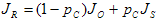
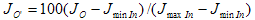
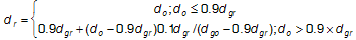
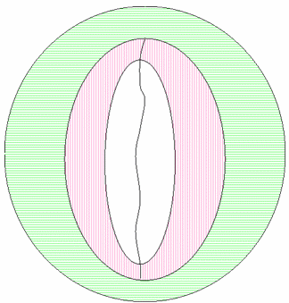
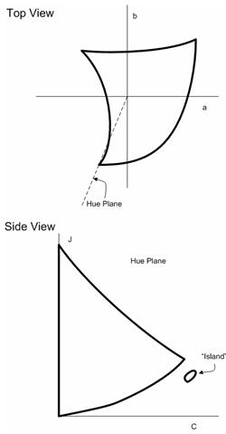

# WCS Gamut Map Model Profile Schema and Algorithms

-   [Overview](#overview)
-   [Gamut Map Model Profile Architecture](#gamut-map-model-profile-architecture)
-   [Generation of the Gamut Boundary](#generation-of-the-gamut-boundary)
-   [The GMMP Schema](#the-gmmp-schema)
-   [The GMMP Schema Elements](#the-gmmp-schema-elements)
-   [GamutMapModel](#defaultbaselinegamutmapmodel-type)
    -   [Namespace](#namespace)
    -   [Version](#version)
    -   [Documentation](#documentation)
    -   [DefaultBaselineGamutMapModel type](#defaultbaselinegamutmapmodel-type)
    -   [PlugInGamutMapType](#plugingamutmaptype)
    -   [ExtensionType](#extensiontype)
-   [The GMMP Baseline Algorithms](#the-gmmp-baseline-algorithms)
-   [Aligning the Neutral Axes](#aligning-the-neutral-axes)
    -   [Minimum Color Difference (MinCD)](#minimum-color-difference-mincd)
    -   [BasicPhoto](#basicphoto)
    -   [Overview](#overview)
    -   [The case of single gamut shell](#the-case-of-single-gamut-shell)
    -   [Black enhancement](#black-enhancement)
    -   [The case of dual gamut shells](#the-case-of-dual-gamut-shells)
    -   [Reasons for changes from the CIE TC8-03 recommendations](#reasons-for-changes-from-the-cie-tc8-03-recommendations)
    -   [Hue mapping](#hue-mapping)
-   [Gamut Boundary Description and Gamut Shell Algorithms](#gamut-boundary-description-and-gamut-shell-algorithms)
    -   [Triangulation of the Gamut Boundary](#triangulation-of-the-gamut-boundary)
    -   [Boundary Line Elements](#boundary-line-elements)
    -   [Gamut Operation: CheckGamut](#gamut-operation-checkgamut)
    -   [Full Hue Plane: Intersect](#full-hue-plane-intersect)
    -   [Gamut Operation: CheckGamut (continued)](#gamut-operation-checkgamut-continued)
    -   [Minimum Color Difference Gamut Mapping](#minimum-color-difference-gamut-mapping)
    -   [Hue Smoothing](#hue-smoothing)
    -   [Setting Primaries and Secondaries in the Gamut Boundary Description](#setting-primaries-and-secondaries-in-the-gamut-boundary-description)
    -   [Setting the Neutral Axis in the Gamut Boundary Description](#setting-the-neutral-axis-in-the-gamut-boundary-description)
-   [Related topics](#related-topics)

## Overview

This schema is used to specify the content of a gamut map model profile (GMMP). The associated baseline algorithms are described in the following topic.

The basic GMMP schema consists of common header information, an optional reference to a preferred Gamut Map Model plug-in, and extension tags.

In addition, the GMMP provides explicit information on the targeted Gamut Map Model, and provides a policy on the baseline fallback Gamut Map Model to use if the targeted model is unavailable. The schema can include private extensional information, but will include no other extraneous information.

## Gamut Map Model Profile Architecture


The sampling of the output device colorant space is done by iterating through the colorants from 0.0 to 1.0 with a fractional step, accumulating all combinations of each colorant at each step, and then converting them from device colorant space to color appearance space using the DM::DeviceToColorimetricColors method followed by the CAM::ColorimetricToAppearanceColors method. The following is an example of how this is done for RGB.


```C++
For (red= 0.0; red <= 1.0; red += redStep) {

     For (green = 0.0; green <= 1.0; green += greenStep) {

          For (blue = 0.0; blue <= 1.0; blue += blueStep) {

               Colorants[0] = red; colorants[1] = green; colorants[2] = blue;

               pRGBDM->DeviceToColorimetricColors(1, colorants, &amp;XYZ);

               pCAM->ColorimetricToAppearanceColors(1, &amp;XYZ, &amp;JCh);

          }

     }

}

```


## Generation of the Gamut Boundary

There are three components to the gamut boundary: the primaries, the neutral samples, and the shells. The primaries are generated by taking the device primaries and applying the DeviceToColorimetric/ColorimetricToAppearance transformation. The neutral samples are generated by sampling the device colorant space in the neutral area and applying the same transformation. For three colorant devices (RGB or CMY), the neutral samples are defined as having all of the colorants equal, for example, R == G == B. For CMYK, the neutral samples are defined as having C == M == Y == 0.

The factors that influence the data used to create the gamut boundary are the data samples (baseline devices only) and the viewing conditions. The step size used to do the full sampling of the colorant space (for monitors and for plausible shell) is an internal constant and isn't available for outside manipulation. Changing the viewing conditions changes the behavior of the color appearance model (CAM) and alters the shape of the gamut boundary, so you must generate a gamut boundary tied to the viewing conditions profile. If sample data is used, as in the case of baseline printers and capture devices, then the samples will have a lot of impact on the shape of the reference gamut and affect the behavior of the model itself.

For input devices, such as cameras and scanners, different samplings are used to generate the reference shell and the plausible shell. The reference shell is generated from the measurements used to initialize the device model. The plausible shell is generated similar to the prior illustration for output devices. The difference it that when you input a typical target, you don't get fully saturated values (where R, G, or B = 255). You must extrapolate using the device model to estimate those values.

## The GMMP Schema


```C++
<?xml version="1.0" encoding="UTF-8"?>
<xs:schema 
  xmlns:gmm="http://schemas.microsoft.com/windows/2005/02/color/GamutMapModel"
  xmlns:wcs="http://schemas.microsoft.com/windows/2005/02/color/WcsCommonProfileTypes"
  targetNamespace="http://schemas.microsoft.com/windows/2005/02/color/GamutMapModel"
  xmlns:xs="http://www.w3.org/2001/XMLSchema"
  elementFormDefault="qualified"
  attributeFormDefault="unqualified"
  blockDefault="#all"
  version="1.0">

  <xs:annotation>
    <xs:documentation>
      Gamut Map Model profile schema.
      Copyright (C) Microsoft. All rights reserved.
    </xs:documentation>
  </xs:annotation>

  <xs:import namespace="http://schemas.microsoft.com/windows/2005/02/color/WcsCommonProfileTypes" />

  <xs:element name="GamutMapModel">
    <xs:complexType>
      <xs:sequence>
        <xs:element name="ProfileName" type="wcs:MultiLocalizedTextType"/>
        <xs:element name="Description" type="wcs:MultiLocalizedTextType" minOccurs="0"/>
        <xs:element name="Author" type="wcs:MultiLocalizedTextType" minOccurs="0"/>
        <xs:element name="DefaultBaselineGamutMapModel">
          <xs:simpleType>
            <xs:restriction base="xs:string">
              <xs:enumeration value="HPMinCD_Absolute"/>
              <xs:enumeration value="HPMinCD_Relative"/>
              <xs:enumeration value="SGCK"/>
              <xs:enumeration value="HueMap"/>
            </xs:restriction>
          </xs:simpleType>
        </xs:element>
        <xs:element name="PlugInGamutMapModel" minOccurs="0">
          <xs:complexType>
            <xs:sequence>
              <xs:any namespace="##other" processContents="skip"
                minOccurs="0" maxOccurs="unbounded" />
            </xs:sequence>
            <xs:attribute name="GUID" type="wcs:GUIDType" use="required"/>
          </xs:complexType>
        </xs:element>
      </xs:sequence>
      <xs:attribute name="ID" type="xs:string" use="optional" />
    </xs:complexType>
  </xs:element>
</xs:schema>
```


## The GMMP Schema Elements

## GamutMapModel

This element is a sequence of the following sub-elements:

1.  ProfileName string,
2.  DefaultBaselineGamutMapModel,
3.  Optional Description string,
4.  Optional Author string,
5.  Optional PlugInGamutMap, and
6.  Optional ExtensionType.

**Validation conditions** : Each sub-element is validated by its own type.

### Namespace

xmlns:gmm="http://schemas.microsoft.com/windows/2005/02/color/GamutMapModel"

targetNamespace="http://schemas.microsoft.com/windows/2005/02/color/GamutMapModel"

### Version

Version "1.0" with the first release of Windows Vista.

**Validation conditions** : 1.0 in Windows Vista. Versions &lt;2.0 are also valid in order to support non-breaking changes to the format.

### Documentation

Gamut Map Model Profile schema.

Copyright (C) Microsoft. All rights reserved.

**Validation conditions** : Each sub-element is validated by its own type.

### DefaultBaselineGamutMapModel type

UINT type

Enumeration values:

<dl> "MinCD\_Absolute"  
"MinCD\_Relative"  
"SIG\_KNEE"  
"HueMap"  
</dl>

**Validation conditions** : The values must match one of the enumerations above.

### PlugInGamutMapType

This element is a sequence of a GUID GUIDType and any sub-elements.

**Validation conditions** : The GUID is used to match the GMM PlugIn DLL GUID. There are a maximum of 100,000 custom sub-elements.

### ExtensionType

This element is a optional sequence of any sub-elements.

**Validation conditions** : There can be a maximum of 100,000 sub-elements.

## The GMMP Baseline Algorithms

## Aligning the Neutral Axes

Most gamut mapping algorithms have a goal of mapping the neutral axis of the source device to the neutral axis of the destination device: that is, white goes to white, black to black, and gray to gray. This is addressed in part by scaling the lightness of source colors to match the lightness range of the destination device. But that does not completely address the problem.

It is a physical property of most imaging devices that the chromaticity of the device white does not exactly match the chromaticity of the device black. For example, monitor white depends on the sum of the chromaticities and relative luminances of the three primaries, while monitor black depends on the reflectance of the display surface. Printer white depends on the chromaticity of the paper, while printer black depends on the ink or toner used. An appearance model that maps device white exactly to the neutral axis of the appearance space (chroma exactly equal to zero) will not map device black to the neutral axis. Because the eye is more sensitive to chroma differences as lightness increases, mid-grays will be represented as even more chromatic than device black. (Figure 1 illustrates the curvature of the neutral axes in two dimensions. In fact, the neutral axes form a more complex curve in three dimensions.)

While the CAM predicts that these device neutral colors will appear chromatic, actual observers seem to compensate for this. Most people do not consider these device neutral values to be chromatic. For most gamut mapping models, therefore, you should continue to map source neutrals to device neutrals.

To map source neutrals to device neutrals, adjust the source and destination gamut boundaries and each pixel when you apply the gamut mapping algorithm. First adjust each value in the source color so that the source device's neutral axis at the source color's lightness falls directly on the neutral axis of the appearance space. (See the left side of Figure 1.) Then adjust the destination device's gamut boundary description so that each color on the destination device's neutral axis at the destination device gamut boundary color's lightness falls directly on the neutral axis of the appearance space. (See the right side of Figure 1.)


**Figure 1** : Alignment of the neutral axes illustrated. Left: Adjusting source points relative to the source device neutral axis. Right: Adjusting the destination gamut boundary description relative to the destination gamut boundary description.

Note that you adjust each source pixel value relative to the neutral axis at that lightness value. This assures that source device neutrals will fall on the neutral axis of the appearance model. You also shift all other colors at that lightness by the same amount, so that there are no discontinuities in the representation of the source gamut. You have to shift by different amounts at different lightness levels, because the source device neutrals are not represented as equally chromatic at the different lightness levels. Clearly, this is not a trivial transformation.

Handling the destination device values is a little more tricky. Initially, you adjust the entire destination gamut boundary in a similar manner, but relative to the destination device neutral axis. This is illustrated in Figure 1 on the right side. That adjustment assures that source gray values will map to destination gray values. This is the space in which the gamut mapping algorithms operate.

However, this space does not accurately describe the true behavior of the destination device. You must invert the mapping before gamut mapped colors are handed to the appearance model and destination device model. You offset all the mapped values by the opposite of the offset applied earlier to the destination device neutral axis. This maps the destination neutral axis back to the value represented originally by the CAM. It does the same for the gamut boundary and all intermediate values.


**Figure 2** : Undoing the alignment of the destination device neutral axis

### Minimum Color Difference (MinCD)

Minimum Color Difference(MinCD) Relative and Absolute versions - equivalent to the ICC colorimetric intent.

> [!Note]  
> The MinCD GMM is suitable for mapping graphics and line art containing "logo" colors (spot colors), logo color gradients with some out-of-gamut colors, and for the final stage of proofing transforms. While the MinCD GMM could be used for photographic images that are entirely within the destination gamut, it is not recommended for general rendering of photographic images. The mapping of out-of-gamut colors to colors on the destination gamut surface can result in unwanted artifacts, such as tone or chroma irregularities in smooth gradients that cross the gamut boundary. BasicPhoto is recommended for photographic images. If a photographic or contone image requires a gamut mapping other than BasicPhoto, then the alternative should be to create a plug-in GMM implementing that mapping, instead of using MinCD.

 

In-gamut colors are left unchanged. For out-of-gamut colors, lightness and chroma are adjusted by finding the point in the destination gamut that has the minimum color distance from out-of-gamut input points. The color distance is computed in JCh space. However, you weight the distance in lightness (J) and the distance in chroma (C) or hue (h) differently. A chroma-dependent weight function is used for the distance in lightness so that the weight is smaller for small chroma and larger for large chroma until a threshold chroma is reached, after which the weight stays at 1, that is, the same weight as distance in chroma or hue. This follows recommended usage for CMC and CIEDE2000. There are two variants: Relative colorimetric and absolute colorimetric.

**Relative colorimetric:** First, align the source and destination neutral axes as described previously. Then clip the adjusted source color to the adjusted destination gamut boundary. (See Figure 4. Chroma mapping along constant lightness.) Readjust the destination device values as described previously. In the case of a monochrome destination gamut boundary, the chroma clipping means that the chroma value (C) is set to zero (0.0).

**Absolute colorimetric:** This is similar to relative colorimetric, but without the alignment of the source and destination neutral axis. The source value is clipped directly to the destination neutral axis. Note that if both the source and destination gamut boundaries are monochrome, the behavior is identical to the relative colorimetric variant; that is, the neutral axes alignment is performed, and then the chroma is clipped to zero. This ensures that a reasonable output is attained even if the media and colorants are significantly different.


**Figure 3** : MinCD clipping to the adjusted gamut

### BasicPhoto

### Overview

BasicPhoto - equivalent to the ICC preferred, pictorial, or perceptual intent.

This algorithm is a variant of the chroma-dependent sigmoidal lightness mapping and cusp knee scaling (SGCK) described by CIE TC8-03 in CIE156:2004. This variant algorithm supports gamut boundary descriptors (GBDs) with dual gamut shells; that is, GBDs with a reference shell and a plausible shell. The SGCK algorithm, which originally assumes only one gamut shell in the GBD, is based on the SIG\_KNEE algorithm (Braun 1999), that incorporates the sigmoidal lightness mapping and knee function scaling proposed by Braun and Fairchild (1999), combined with the chroma dependence from GCUSP (Morovic, 1998). It keeps perceived hue constant, for example, hue angle in hue-corrected Jab, and uses a generic (image-independent) sigmoidal lightness scaling which is applied in a chroma-dependent way and a 90 percent knee function chroma. The variant scales along lines of constant lightness.

### The case of single gamut shell

It is helpful to review the algorithm in the case where both source and destination GBDs have only one gamut shell. In this case, the algorithm consists of the following calculations.

First, perform initial lightness mapping using the following formula:

 (1)

where *Jₒ* is the original lightness and *J<sub>R</sub>* is the reproduction lightness.

 (2)

When the source gamut boundary is monochrome, the chroma value will be zero for the monochrome boundary due to neutral axis alignment. This will result in the degenerate case where C is equal to zero. In this case, *p<sub>C</sub>* is set to 1.

*p<sub>C</sub>* is a chroma-dependent weighting factor (Morovic, 1998) that depends on the chroma of the original color, C and *J<sub>S</sub>* are the result of the original lightness being mapped using a sigmoidal function.

 

To calculate *J<sub>S</sub>* (Braun and Fairchild, 1999), a one-dimensional lookup table (LUT) between original and reproduction lightness values is first set up on the basis of a discrete cumulative normal function (S).

 (3)

where x ₀ and S are the mean and standard deviation of the normal distribution respectively and *i* = 0,1,2... *m*,*m* is the number of points used in the LUT. *S<sub>i</sub>* is the value of the cumulative normal function for *i* /*m* percent. The parameters depend on the lightness of the black point of the reproduction gamut and can be interpolated from Table 1. For details of calculating these parameters see Braun and Fairchild (1999, p. 391).

:::row:::
    :::column:::
        J <sub>minOut</sub>
    :::column-end:::
    :::column:::
       5.0
    :::column-end:::
    :::column:::
        10.0
    :::column-end:::
    :::column:::
        15.0
    :::column-end:::
    :::column:::
        20.0
    :::column-end:::
:::row-end:::
:::row:::
    :::column:::
        x ₀
    :::column-end:::
    :::column:::
       53.7
    :::column-end:::
    :::column:::
        56.8
    :::column-end:::
    :::column:::
        58.2
    :::column-end:::
    :::column:::
        60.6
    :::column-end:::
:::row-end:::
:::row:::
    :::column:::
        S
    :::column-end:::
    :::column:::
       43.0
    :::column-end:::
    :::column:::
        40.0
    :::column-end:::
    :::column:::
        35.0
    :::column-end:::
    :::column:::
        34.5
    :::column-end:::
:::row-end:::


**Table 1** : BasicPhoto lightness compression parameter calculation

To use S as a lightness mapping LUT (S <sub>LUT</sub> ) it must first be normalized into the lightness range of \[0,100\]. The normalized data is then scaled into the dynamic range of the destination device, as shown in Equation 4, where *J*<sub>min\ *Out*</sub> and *J*<sub>max\ *Out*</sub> are the values of lightness of the black point and the white point of the reproduction medium, respectively.

 (4)

At this point, the *J S* values can be obtained from the S <sub>LUT</sub> by interpolating between the *m* points of corresponding *J O'* and *J S* values it contains, and using the following equation as the input.

 (5)

J <sub>minIn</sub> is the lightness value of the black point of the original medium, J <sub>maxIn</sub> is the lightness value of the white point of the original medium, and J <sub>O</sub> is the original lightness. For later reference, you can denote by *S* the sigmoidal function defined in the manner just outlined, as illustrated in the following Figure 4.


**Figure 4** : Chroma mapping along constant lightness

Second, if the destination gamut boundary is chromatic, compress chroma along lines of constant lightness (l) and perform the compression as follows.

 (6)

where *d* represents distance from *E* on *l*;*g* represents the medium gamut boundary; *r* represents the reproduction; and *o* the original Figure 5.


**Figure 5** : Chroma and lightness compression in BasicPhoto

If the destination gamut boundary is monochrome, then the chroma value is clipped to zero.

Third, use a MinCD clip (described earlier) to eliminate any residual error.

### Black enhancement

The preceding algorithm can be modified to improve the black when the destination is a printer device. The issue has to do with the choice of *J<sub>minOut</sub>*, which usually does not correspond to the darkest color a printer can produce.

More specifically, the color with highest density, obtained by putting 100 percent inks (or maximum possible coverage, if GCR/ink limiting is in effect), is usually not "neutral" in the color appearance space. See Figure 6. In other words, if neutral minimum lightness is used for the destination device, the lightness scaler constructed will map to a minimum lightness that is not the highest density that can be achieved by the printer. Consider the further use case of monitor to printer. The monitor black, R=G=B=0, will then be printed as not the highest density. The impact on the image quality is that there is a lack of depth and contrast.


**Figure 6** : The device black point may be darker than the neutral minimum lightness.

Suppose the destination "device black point" is Jₖaₖbₖ/JₖCₖh ₖ. If C ₖ is not zero, then the device black point is not neutral relative to CAM02. If you use J ₖ for the destination "neutral minimum lightness" in the construction of the lightness scaler; that is, setting

*J<sub>minOut</sub> = Jₖ*

and apply it to the source gamut shell, you obtain the configuration depicted in Figure 7. In the figure, the hue plane corresponds to h ₖ.


**Figure 7** : Geometry using the modified lightness scaler with destination device black point

To allow the subsequent chroma compression algorithm to proceed, you want to align the maximum and minimum lightnesses on the source and destination shells. This can be achieved by adjusting the destination shell between J <sub>neutralMin</sub> and J ₖ by shifting points to the left. Furthermore, this transformation must be applied on the whole Jab space, not just the hue plane corresponding to h ₖ.

The transformation is


Figure 8 shows the effect of the transformation.


**Figure 8** : Geometry using the modified lightness scaler with destination device black point

After applying the usual chroma compression algorithm, the point must then be "shifted back;" that is, the inverse transformation must be applied to obtain the final mapped color.


### The case of dual gamut shells

The goal is to generalize SIG\_KNEE for single gamut shell to the case where either the source device GBD or the destination device GBD has a two-shell structure. The inner shell will be called the Reference Shell, while the outer shell will be called the Plausible Shell. You want to consider the following cases.

(a) Both the source GBD and destination GBD have a two-shell structure.

(b) The source GBD has a two-shell structure; the destination GBD has only one shell.

(c) The source GBD has only one shell; the destination GBD has a two-shell structure.

(d) Both the source GBD and destination GBD have only one shell.

Case (d) is the case of single gamut shell that was discussed previously. For cases (a), (b), and (c), you can generalize the lightness rescaling to use the extra information from the dual shell structure. In cases (b) and (c) where either the source or the destination has only one shell, you introduce an "induced reference shell" which will be discussed in a subsequent section, "Induced Reference Shell." The general algorithm for two shells will be described for case (a). After the Induced Reference Shell construction is explained, the algorithm can be applied to case (b) and (c), as well. As for chroma compression, the compression ratio will be determined by the largest shells available. In other words, if both the Plausible Shell and Reference Shell are available, the Plausible Shell will be used; otherwise, the Reference Shell will be used.

*Generalized Lightness Rescaling*

The existence of two shells for both source and destination GBD means that you must map a set of four points from the source GBD to a corresponding set in the destination GBD.


The subscripts have the following meanings.

o or r: "original" (source) or "reproduction" (destination)

min or max: minimum neutral lightness or maximum neutral lightness

pla or ref: Plausible Shell or Reference Shell

The ordering in each quadruple is also the expected relative magnitude of these points.

The Lightness Rescaling map uses the same first two equations as the single shell, but *J S* is defined in a piecewise manner as follows.

 (7)

In other words, it is sigmoidal within the reference shell, and linear outside. See Figure 9.


**Figure 9** : Lightness Rescaling function for two-shell GBDs

**INDUCED REFERENCE SHELL**

Where one GBD has one shell and the other GBD has two shells, you must create a "Reference Shell" for the GBD with only one shell. The existing shell, which would be called the Reference Shell, will be changed to the "Plausible Shell."In fact, you don't actually have to create a shell in the full Jab space. Because the lightness rescaling only uses *J max* and *J min*, you only have to make up these values for the induced Reference Shell. There are two cases, depending on which GBD has two shells.

Case 1: Source GBD has two shells; destination GBD has one shell.

Determine the destination induced Reference Shell on the neutral axis; that is, the J <sub>r,\ min,\ ref</sub> and J <sub>r,\ max,\ ref</sub> of the shell. This is done using the following algorithm.


The factors ? <sub>low</sub> and ? <sub>high</sub> control the separation between the Plausible Shell and the Reference Shell. A value of 1 means that the J <sub>min</sub> values or J ₘₐₓ values coincide. Their values are "induced" from the source Reference Shell and source Plausible Shell.


The "fudge factors" F <sub>low</sub> and F <sub>high</sub> are *tunable parameters* that must lie between 0 and 1. If the value is 0, then the J <sub>min</sub> or J ₘₐₓ are directly induced from the source shells. For this case, choose F <sub>low</sub> = 0.95, and F <sub>high</sub> = 0.1.

Case 2: Source GBD has one shell; destination GBD has two shells.

Determine the source induced Reference Shell on the neutral axis; that is, the J <sub>o,\ min,\ ref</sub> and J <sub>o,\ max,\ ref</sub> of the shell. This is done using the following algorithm.


Again, the factors ? <sub>low</sub> and ? <sub>high</sub> control the separation between the Plausible Shell and Reference Shell. A value of 1 means the J <sub>min</sub> values or J ₘₐₓ values coincide. Their values are "induced" from the source Reference Shell and source Plausible Shell:


### Reasons for changes from the CIE TC8-03 recommendations

BasicPhoto differs from the CIE TC8-03 recommendations in the following ways.

1.  Chroma is not compressed toward the cusp but along lines of constant lightness.
2.  The lightness range uses the lightness of the darkest color in the gamut rather than the point at which the gamut boundary crosses the neutral axis.
3.  BasicPhoto supports both a reference gamut shell and a plausible gamut shell, if either gamut boundary in the transform has two shells.
4.  BasicPhoto uses CIECAM02; instead of using CIECAM97s to convert to D65 at 400 cd/m2, and then using RIT IPT color space.

The first change was made to prevent tone inversion problems that can occur when using compression toward a cusp. As shown in Figure 10, cusp compression can cause tone inversions. This can happen when colors of high chroma are lighter than colors of lower chroma. Because SGCK compresses each pixel independently in both lightness and chroma, it is not guaranteed to preserve the lightness relationship between the pixel values after the compression. The well-known downside to this decision to compress on lines of constant lightness is that you can suffer losses of chroma, particular in areas where the destination gamut boundary is very flat, as happens with bright yellows.


**Figure 10** : Tone inversion caused by SGCK


**Figure 11** : Original image, SGCK result, and BasicPhoto result

Figure 11 illustrates this tone inversion. On the left is an original image captured by a digital camera; in the center, the image as reproduced by SGCK; and on the right, the image as reproduced by BasicPhoto. The image on the left is in the digital camera's color space, the center and right images are in the color space of an LCD video display. In the original image, the top part of the teapot is darker than the bottom, because the bottom is reflecting the tablecloth that it is sitting upon. In the SGCK image, the top part is actually lighter than the bottom, because of the tone inversion. Also, it is difficult to see the items reflected in the lower part of the teapot. On the right, BasicPhoto has fixed the tone inversion and the reflected articles are more clearly distinguishable.

The second change was made to improve the reproduction of nearly black colors on printers where the blackest black does not fall directly on the CIECAM02 neutral axis. The following Figure 12 shows an image converted to sRGB; reproduced for an RGB inkjet printer using SGCK; and reproduced for the same printer using BasicPhoto. The image in the center is not using the full device black, and so it lacks the contrast seen in the original. The contrast is restored with BasicPhoto.


**Figure 12** : Enhanced black

The third change was made to improve the color reproduction for digital cameras. Particularly in cases where the digital camera has been profiled using a reference target, a gamut boundary description built from measured colors might not include all the colors that might be captured in a real world scene. Rather than clipping all colors to the gamut of the measured color target, you allow for extrapolation to produce a plausible gamut boundary. The BasicPhoto algorithm is designed to support such an extrapolated gamut boundary.

The fourth change was made because CIECAM02 works well for gamut mapping. The process recommended by TC8-03 of converting device colors to D65 at 400 cd/m2, and then using the RIT IPT color space is both computation-intensive and time-consuming.

### Hue mapping

HueMap is the equivalent of the ICC Saturation intent.

If either the source gamut boundary or the destination gamut boundary does not contain primaries, this model reverts to the MinCD (relative) model described in a preceding section; for example, devices for which the primaries cannot be determined (ICC profiles with more than four channels) or monochrome ICC profiles.

This algorithm first adjusts the hue of the input color value. Then it simultaneously adjusts the lightness and chroma, using a shearing mapping. Finally, it clips color value to make sure it is within gamut.

The first step is to determine the "Hue Wheels." Find the JCh values for primary and secondary colors for both source and destination device. You are only considering the hue components. This results in a primary or secondary hue wheel with six color points for each device. (See Figure 13.)


**Figure 13** : Hue wheels

Better results can be obtained if the source blue primary is not rotated to the destination blue primary. Instead, the source blue primary hue angle is used as the destination blue primary hue angle.

Next, perform the hue rotations for each input color from the source image,

a)Using the hue angle of the input color, determine the location of the color on the source hue wheel relative to the two adjacent primary or secondary color. The location can be thought of as a percentage of the distance between the primaries. For example, the input color hue is 40 percent of the way from the hue value of Magenta to the hue value of Red.

b)On the destination hue wheel, find the associated hue angle, for example, 40 percent from Magenta to Red. This value will be the destination hue angle.

In general, the source primaries and secondaries will not be at the same hue angles as the destination primaries and secondaries; that is, the destination hue angle usually will be different from the source hue angle.

For example, suppose the hue wheels produce the following values:

Source M = 295 degrees, Source R = 355 degrees.

Destination M = 290 degrees, Destination R = 346 degrees.

If the hue angle of the input color is 319 degrees, it is 40 percent of the angle (24 degrees) from source M to source R. The angle from M to R is 60 degrees, and the angle from M to input hue is 24 degrees. Calculate the angle on the destination that is 40 percent from destination M to destination R (22 degrees), so the hue angle of the destination color is 312 degrees.

Next, calculate the hue reference points for the source hue and the destination hue. To calculate the hue reference point for a particular h (hue) value, you want to find the J (lightness) value and C (chroma) value.

-   Find the J value of the hue reference point by interpolating between the J values for the adjacent primary or secondary points, using the relative position of the hue; for example, 40 percent in this example.
-   Find the maximum C value at this J value and h value. You now have the JCh of the hue reference point for that hue.


**Figure 14** : A hue leaf (visualization of a gamut boundary slice at a specific hue)

The next step is to compute the shear mapping for each pixel. First, visualize a hue leaf from the source gamut for the source color hue angle, and a hue leaf from the destination gamut for the destination hue angle computed during hue rotation. The hue leaves are created by taking a "slice" from the JCh gamut boundary surface at a specific hue angle (see Figure 14).

NOTE: For performance optimization reasons, hue leaves are not actually created; they are described and shown here for visualization purposes only. The operations are performed directly on the gamut boundary surface at the specified hue. You then compute the hue reference points to determine the shear mapping.

-   Perform a lightness rescaling to map the black and white points of the source leaf to the destination leaf (see Figure 15). The black and white points of the source hue leaf are mapped linearly to the black and white points of the destination hue leaf, by scaling all the J coordinates of the source boundary. The hue-mapped input color value is scaled in the same manner.


**Figure 15** : Lightness mapping

-   Determine the hue reference points for each hue leaf. Apply a shear mapping to the source leaf so that the source and destination reference points coincide (see Figure 16). The reference point for a gamut at a specific hue is the interpolated hue reference point between the adjacent primaries. The reference point of the source hue leaf is mapped linearly to the reference point of the destination hue leaf, using a "shear" operation that locks the J axis, keeping the black points and the white points stationary. The black points, white points, and reference points of the source and destination hue leaves should coincide.
-   Apply the shear mapping to the lightness-adjusted input color value. The J and C coordinates of the source color value are proportionally scaled, relative to its distance from the J axis.
-   Next, a subtle chroma-dependent lightness compression toward the J-value of the hue reference point is performed on the shear-mapped color point. The compression toward hue reference J is done in a gamma-like fashion, where white, black, grays, and points on the hue reference J are not affected. All other points tend toward the hue reference J in a smooth fashion, slightly bunching up near the hue reference J, with chroma remaining constant. The chroma dependency assures that neutral colors are not affected, and the effect is increased on colors with higher chroma.

The following is a mathematical description of the lightness compression toward the hue reference J, or adjusting the J-value of the destination point. It is called the destination point because it has been shear mapped into the destination gamut.

First, compute "factorC" (chroma dependency factor) for the destination point, which determines how much effect the lightness compression will have. Points near or on the J-axis will have little or no compression; points farther away from the J-axis (high-chroma) will have more compression applied. Multiply by 0.5 to ensure that factorC is less than 1, because it is possible that sourceC could be slightly greater than referenceC, but not twice as great.

factorC = (destinationC / referenceC) ? 0.5

where:

destinationC is the C-value of the destination point.

referenceC is the C-value of the Hue Reference point.

Next, determine whether the destination point J is above or below the hue reference J. If it is above, do the following:

1.  Compute "factorJ" for the destination point relative to the referenceJ. This factorJ value will be between 0 and 1 (0 if on the referenceJ; 1 if at maxJ).
2.  factorJ = (destinationJ - referenceJ) / (maxJ - referenceJ)

    where:

    destinationJ is the J-value of the destination point.

    referenceJ is the J-value of the hue reference point.

    maxJ is the maximum J-value of the gamut.

3.  Apply a gamma-like power function to factorJ, which will reduce factorJ by a certain amount. This example uses the power of 2 (the square). Subtract the reduced factorJ from the original factorJ and multiply the result by the total J-range above the primary referenceJ to find the "deltaJ," which represents the change in J after the lightness compression, but not including the chroma dependency.
4.  deltaJ = (factorJ - (factorJ ? factorJ)) ? (maxJ - referenceJ)

5.  Apply factorC to the deltaJ (the higher the chroma, the greater the effect), and compute the new J-value for the destination point.
6.  destinationJ = destinationJ - (deltaJ ? factorC)

If J-value for the destination point is below referenceJ, then a similar computation to the preceding steps A-C is performed, using minJ instead of maxJ to find the range in J to compute the factorJ, and taking into account the polarity of the operations "underneath" the referenceJ.

factorJ = (referenceJ - destinationJ) / (referenceJ - minJ)

deltaJ = (factorJ - (factorJ ? factorJ)) ? (referenceJ - minJ)

destinationJ = destinationJ + (deltaJ ? factorC)

where:

minJ is the minimum J-value of the gamut.

The chroma for input color points is expanded linearly (when possible) along constant lightness proportional to the maximum chroma value of the source and destination gamuts at that hue and lightness. Combined with the preceding chroma-dependent lightness compression, this helps preserve the saturation because shear mapping using the reference points sometimes causes the source point to over-compress in chroma (see Figure 16).


**Figure 16** : Shear mapping, lightness compression toward hue reference J, and chroma expansion

The following is a mathematical description of the chroma expansion process, or adjusting the C-value of the destination point. It is called the destination point because it has been shear mapped and lightness compressed into the destination gamut.

1.  Before the shear mapping, determine sourceExtentC (the chroma extent at the lightness and hue of the source point).
2.  After the shear mapping and lightness compression which transforms the source point into the destination point, determine the destExtentC (the chroma extent at the lightness and hue of the destination point).
3.  If the sourceExtentC is greater than the destExtentC, no chroma adjustment to the destination point is necessary, and you can skip the next step.
4.  Adjust destinationC (the chroma of the destination point) to fit within the destination chroma extent at this lightness and hue.
5.  destinationC = destinationC ? (destExtentC / sourceExtentC)

    where:

    destinationC is the destination point C-value.

    sourceExtentC is the maximum C-value of the source gamut at the lightness and hue of the source point.

    destExtentC is the maximum C-value of the destination gamut at the lightness and hue of the destination point.

Finally, perform the mimimum distance clipping. If the hue-rotated, lightness-adjusted, and shear-mapped input color is still slightly outside the destination gamut, clip it (move it) to the closest point on the destination gamut boundary (see Figure 17).


**Figure 17** : Minimum distance clipping

## Gamut Boundary Description and Gamut Shell Algorithms

The device gamut boundary function uses the device model engine and analytical parameters to derive a color device gamut boundary, described as an indexed vertex list of the hull of the device gamut. The hull is computed differently depending on whether you are working with additive devices, such as monitors and projectors, or subtractive devices. The indexed vertex list is stored in CIEJab. The structure of the indexed vertex list is optimized for hardware acceleration by DirectX.

This approach has many well-known solutions. If you search for "convex hull DirectX" on the Web, you get more than 100 hits. For example, there is a reference from 1983 on this specific topic (Computer Graphics Theory and Application, "Shiphulls, b-spline surfaces, and cadcam," pp. 34-49) with references dating from 1970 to 1982 on the topic.

The collection of points can be determined from externally available information, as follows:

-   Points for the reference shell for monitors are generated using a sampling of the color cube in device colorant space.
-   Points for the reference shell for printers and capture devices are obtained from the sample data used to initialize the model.
-   Points for the reference shell for scRGB and sRGB are generated using a sampling of the color cube for sRGB.
-   Points for the plausible shell for capture devices are generated using a sampling of the color cube in device colorant space.
-   Points for the reference shell for projectors are generated using a sampling of a polyhedron in the color cube in device colorant space.
-   Points for the possible shell for wide dynamic range color spaces are generated using a sampling of the color cube in the space itself.

You can create a vertex list that efficiently describes the color device gamut, given a device profile and system support services.

For output devices, the gamut boundary describes the range of colors that can be displayed by the device. A gamut boundary is generated from the same data used to model the behavior of the device. Conceptually, you output a sampling of the range of colors the device can produce, measure the colors, convert the measurements into appearance space, and then use the results to create the gamut boundary.

Input devices are trickier. Each pixel in an input image must have some value. Each pixel must be able to represent any color found in the real world in some way. In this sense, no colors are "out of gamut" for an input device, because they can always be represented.

All digital image formats have some fixed dynamic range. Because of this limitation, there is always some distinct stimuli that map to the same digital value. So, you cannot establish a one-to-one mapping between real-world colors and digital camera values. Instead, the gamut boundary is formed by estimating a range of real-world colors that can produce the digital responses of the camera. You use that estimated range as the gamut for the input device.

Primaries are included to provide for business graphics intent-type gamut mapping.

In true object-oriented style, you abstract the underlying representation of the gamut boundary. This allows you the flexibility to change the representation in the future. To understand the gamut boundary descriptor (GBD) used in the new CTE, you must first understand how gamut mapping algorithms (GMAs) work. Traditionally, GMAs have been designed to meet the needs of the graphic art community; that is, to reproduce images that have already been properly rendered for the device on which the input image was created. The goal of graphic arts GMAs is to make the best possible reproduction of the input image on the output device. The new CTE GBD is designed to solve four key problems.

Because the input image is rendered for the input device, all colors fit within the range between the medium's white point and black point. Suppose that the image is a photograph of a scene in which there is a diffuse white, such as a person in a white tee shirt, and a specular highlight, such as light reflecting off a window or chrome bumper. The scene will be rendered to the input medium so that the specular highlight is mapped to the medium's white point, and the diffuse white is mapped to some neutral color darker than the medium's white point. The choice of how to map colors from the scene to the input medium is both a scene-dependent decision and an aesthetic decision. If the specular highlight was missing from the original scene, then the diffuse white would probably be mapped to the medium's white point. In a scene with a lot of highlight detail, more range would be left between the specular white and the diffuse white. In a scene where the highlight is not significant, very little range might be left.

For pre-rendered images, gamut mapping is relatively straightforward. Basically, the original medium's white point is mapped to the reproduction medium's white point, the source black point is mapped to the destination black point, and most of the mapping is complete. The different GMAs in existence provide variations for mapping other points on the source medium's tone scale and different ways to handle out-of-gamut chroma values. But the mapping of white to white and black to black is consistent throughout these variations. This implementation requires that white be above a J\* of 50 and black below a J\* of 50.

Not all color encodings limit color ranges for input images. The IEC standard color encoding scRGB (IEC 61966-2-2) provides 16 bits for each of the three color channels red, green, and blue (RGB). In that encoding, reference black is not encoded as the RGB triple (0, 0, 0), but as (4096, 4096, 4096). Reference white is encoded as (12288, 12288, 12288). The scRGB encoding can be used to represent specular highlights and shadow detail. It includes RGB triples that are not physically possible because they require negative amounts of light, and encodings that are outside the CIE spectral locus. Clearly, no device can possibly produce all the colors in the scRGB gamut. In fact, no device can produce all the colors that a human being can see. So, devices cannot fill the scRGB gamut, and it would be useful to be able to represent the part of the gamut that they do fill. Each device has a range of values in scRGB space that it can produce. These are the "expected" colors for the device; it would be surprising for the device to produce colors outside this gamut. There is a defined transformation from scRGB space to appearance space, so each device also has a range of appearance values that it is expected to reproduce.

In both scRGB and input from capture devices characterized with a fixed target, it is possible to get a value outside the range of expected values. If someone calibrates a camera to a test target; and then captures a scene with specular highlights, there might be pixels that are brighter than the target's white point. The same thing can happen if a naturally occurring red is more chromatic than the target red. If someone takes an scRGB image from a device, and then manually edits the colors in the image, it is possible to create pixels that fall outside the expected range of the device gamut, even though they are within the full scRGB gamut.

A second problem may not, at first, seem to be related to this. It arises when you use a color target to characterize an input device, such as a camera or scanner. Reflective targets are typically produced on paper and contain a number of colored patches. Manufaturers provide data files with color measurements taken under a fixed viewing condition for each color patch. Color profiling tools create a mapping between these measured values and the values returned by the color sensors in the devices. The problem is that often these color targets do not cover the full range of device values. For example, the scanner or camera might return a value of (253, 253, 253) for the reference white point, and a reference red patch might have an RGB value of (254, 12, 4). These represent the range of expected values for the input device, based on the target values. If you characterize the input device based on the responses to the target, then you only expect colors within this narrow range. This range is not only smaller than the range of colors humans can see, it is smaller than the range of colors the device can produce.

In both cases, it is difficult to estimate the gamut of the input device or image, despite the existence of a reference gamut or measurements. In the first problem, the plausible gamut of the input device is less than the full gamut of scRGB. In the second problem, the reference gamut of the target is less than the full possible gamut of the input device.

The third problem involves tone mapping. Many models of gamut boundaries that can adequately represent pre-rendered images used in the graphic arts have been proposed, for example, the Braun and Fairchild Mountain range GBD (Braun\[97\]), and Morovic's Segment Maxima boundary descriptor (Morovic\[98\]). But these models only provide information about the extremes of the device's gamut; they are missing information about other points in the tonal mapping. Without such information, GMAs can only make rough estimates of optimal tone mapping. Worse, these models provide no help for the extended dynamic range in scRGB and in digital camera images.

How is this problem resolved in the photographic and videographic industries? The camera captures an image. Experts might debate how much rendering occurs in the capture device; but they agree that it is not a significant amount. Both technologies do not map a diffuse white in a captured scene to the medium's white point. Similarly, they do not map the black point from the scene to the medium's black point. The behavior of photographic film is described in density space using a characteristic curve, often called a Hurter and Driffield, or H&D curve. The curve shows the density of the original scene and the resulting density on the film. Figure 18 shows a typical H&D curve. The x-axis represents increasing log exposure. The y-axis represents the density on the slide. Five reference points are marked on the curve: black without detail, which represents the minimum density on the negative; black with detail; reference mid-gray card; white with detail; and white without detail. Note that there is space between black without detail (which represents device black) and black with detail (shadow black). Similarly, there is space between white with detail (diffuse white) and white without detail (which represents device white).


**Figure 18** : H&D curve for slide film

The video industry provides "headroom" and "footroom" in images. In the ITU 709 specification, luminance (called Y) is encoded in 8 bits, with a range of 0 to 255. However, reference black is encoded at 15 and reference white is encoded as 235. This leaves the encoding range between 236 and 255 to represent specular highlights.

The video industry presents an essentially closed loop system. While there are many different equipment vendors, video systems are based upon reference devices. There is a standard encoding for video images. There is no need to communicate a gamut boundary with video images, because all images are encoded for reproduction on the same reference device. Film is also closed loop because there is no need to convey intermediate data between different components. You want a solution that enables images from devices with varying gamuts and representing both pre-rendered and unrendered scenes to be reproduced on output with varying gamuts.

A fourth problem that the new CTE must resolve is that the visually gray colors produced by a device, for example, when red=green=blue on a monitor, frequently do not fall upon the neutral axis of the CAM (when the chroma = 0.0). This causes great difficulties for GMAs. To make GMAs work well, you have to adjust the description of the device's gamut and of the input points so that the device's neutral axis falls on the appearance space's neutral axis. You have to adjust points off the neutral axis by a similar amount. Otherwise, you cannot make smooth gradations through the image. On the way out of the GMA, you undo this mapping, relative to the output device's neutral axis. This is referred to as a "chiropractic" straightening of the axis. Like a chiropractor, you not only straighten the skeleton (neutral axis), but you adjust the rest of the body to move along with the skeleton. Like a chiropractor, you do not adjust the skeleton by the same amount through the entire space. Instead, you adjust different sections differently.


**Figure 19:** Curvature of the device neutral axis relative to the CIECAM neutral axis

What the new CTE requires is a model of a gamut boundary that can be used to represent both rendered and unrendered source images, provide information about the appearance of device neutrals, and provide information for tone mapping images with a wide luminance range.


**Figure 20** : Three gamut shells

The gamut boundary is composed of three shells that define three regions.

In the new CTE, the outer shell of the gamut is formed with a convex hull made from sample points in the device gamut. A hull is formed by taking a set of sample points and surrounding them by a surface. A convex hull has the additional property of being convex everywhere. Therefore, this is not the smallest possible hull that can be fit to the data. But experimentation has shown that fitting the sample points too tightly causes unappealing artifacts in images, such as a lack of smooth shading. The convex hull seems to solve these problems.

In the algorithm, color appearance values are obtained for a set of points sampled from the device. For monitors and printers, the color appearance values are obtained by outputting samples, and then measuring them. You can also create a device model, and then run synthetic data through the device model to predict measured values. The measured values are then converted from colorimetric space (XYZ) to appearance space (Jab), and the hull is wrapped around the points.

The key point to this algorithm is that the adopted white point used in the conversion from colorimetric to appearance space does not have to be the medium's white point. Instead, you can select a point farther inside the gamut and on (or near) the neutral axis. That point will then have a J-value of 100. Samples with a measured Y-value higher than the adopted white point will end up with a J-value greater than 100.

If you place the scene's diffuse white point as the adopted white point for the color space conversion, then specular highlights in the scene will be easily detected as having a J-value greater than 100.

Because the CIECAM02 color model is based on the human visual system, after an adopted white is selected, the luminance level of the black point (J = 0) is automatically determined by the model. If the input image has a wide dynamic range, it is possible that there might be values that map to J-values less than zero.

The following Figure 21 shows the device neutrals running through the center of the plausible and reference gamuts.



**Figure 21** : Device neutral axis added to gamut boundary

All gamut mappings involve either clipping an input range to an output gamut, or compressing the input gamut to fit within the output gamut. More complex algorithms are formed by compressing and clipping in different directions, or by dividing the gamut into different regions, and then performing clipping or compression in the different regions.

The new CTE extends this concept to support the regions of a possible gamut, a plausible gamut, and a reference gamut, and enables GMAs to map them in different ways. In addition, the GMAs have information about the device neutral axis. The following discussion addresses how to handle situations where the plausible gamuts and reference gamuts have collapsed on each other.


**Figure 22** : GMA with two un-collapsed gamut descriptors

You might see this example if you map from an input device, such as a camera or scanner that is characterized with a reflective target, to scRGB space. Here the plausible colors that are lighter than reference white are specular highlights. In practice, characterizing a camera with a target might not generate the full range of values possible in the camera; however, specular highlights and very chromatic colors found in nature would. (Transmissive targets usually have a patch that is the minimum density possible on the medium. With such a target, specular highlights would fall within the target's range.) The reference black for a reflective target would be the beginning of the shadow black region. That is, there are likely to be colors in the shadows that are darker than the black on the target. If the image contains a lot of interesting content in that region, it may be worthwhile preserving that tonal variation.


**Figure 23** : GMA with collapsed destination gamut

Figure 23 shows one possible gamut mapping algorithm when the destination gamut only provides the range from device white to black, and there are no possible colors outside this gamut. This is likely to happen for typical output devices, such as printers. The possible colors are mapped to the edge of the destination gamut. But it lacks a tone curve for the output device. The GMA must select some neutral point of lower luminance to use as a mapping destination for the reference white. A sophisticated algorithm can do this by histogramming the lightnesses in the source image and seeing how many fall in the range of expected but lighter than the reference white. The more lightnesses, the more space is required in the destination device between the mapped points for the specular highlights and reference white. A simpler algorithm might pick an arbitrary distance down the lightness scale from device white, such as 5 percent. A similar approach applies for the mapping of the maximum black and shadow black.

After you generate the destination tone curve, you can map in a method similar to that used in the preceding Figure 23. All points in the destination tone curve will fall within the device gamut, and all points in the mapping must fall within the device gamut.

If you reverse the left figures and right figures, and the directions of the arrows in Figure 23, you can describe the case where the source image has only a reference gamut, and the three gamuts of the output device have not collapsed onto each other. An example of this might be mapping from a monitor to scRGB. Again, the GMA must synthesize the control points for the five points on the tone curve for the source image. Some mappings might put all points of the tone curve within the scRGB device gamut, while other mappings might use more of the scRGB gamut by mapping diffuse white to the reference white and allowing specular white to map to a lighter value.

Finally, you have the case where both devices have only the reference gamut, which is how most gamut mapping algorithms work. So you can resolve this by just falling back to current algorithms. Alternatively, if you have a reasonable way to determine the five reference points for the source and destination devices, then you can arrange to map the reference points.

Device gamuts contain more than the five reference points on the neutral axis. These just represent the boundaries between potential regions in the image. Between each of the reference points, you can use any of the existing gamut mapping techniques. So you might clip the range of unexpected colors, and compress all colors between the expected white and black, or you might clip all colors outside the reference range and compress within that range. There are many possibilities, which can be implemented in different GMAs. Further, the GMAs can compress and clip in different ways. All of those combinations are covered within this invention.

So far in this discussion, the gamut has been treated as if it were solely a function of the device on which the image was created, captured, or displayed. However, there is no reason why all images for a device must have the same gamut. The GMAs depend on the data in the GBD. If the descriptor is changed between images, there is no way for the GMAs to know. In particular, if images have no specular highlights, GMAs perform better if the gamut descriptor does not show that there are colors lighter than diffuse white.

In the new CTE architecture, it is possible to use more than one GMA. Using multiple GMAs is inherently ill-defined. For example, if a capture device associates a GMA with its "look and feel," it tends to do so with a "targeted" destination gamut. The same is true for output devices and "targeted" source gamuts. The sRGB gamut is one commonly targeted implied gamut. Therefore, it is strongly recommended that you use a single GMA, if predictability is a priority. A single GMA workflow should be the default for all workflows, especially consumer and prosumer workflows. While gamut mapping for preferred reproduction should be done one time, there are instances where multiple mapping processes are included. First, for proofing, you do a preferred mapping to the gamut of the final target device, and then a colorimetric rendering to the gamut of the proofing device. Second, some types of mapping are used to alter the characteristics of the image, but aren't included to map to a device gamut, for example, adjusting the tone curve or the chromaticity. If multiple GMAs are used, the transform interface takes an array of bound gamut maps, that is, gamut maps that have been initialized with a pair of gamut boundary descriptions. When there is more than one gamut map, the input gamut boundary for a succeeding gamut map must be the same as the output gamut boundary of its predecessor.

The device gamut boundary function takes the device model engine and analytical parameters and derives a color device gamut boundary described as an ordered vertex list of the convex hull of the device gamut. The ordered vertex list is stored in CIEJab. The structure of the ordered vertex list is optimized for hardware acceleration by DirectX. This approach has many well known solutions (search for "convex hull DirectX" on the web and you get well over 100 hits). There is also a reference from 1983 on this topic (Computer Graphics Theory and Application, "Shiphulls, b-spline surfaces and cadcam" pp. 34-49), with references dating from 1970 to 1982 on the topic.

Two different techniques can be used to compute the triangles in the gamut shell. For other devices other than additive RGB devices, you compute a convex hull. You can consider investigating non-convex hull support for other devices if you have direct access to such devices to validate the robustness, performance, and fidelity of the algorithms. This is a well-known process that does not require further description. The technique used for additive RGB devices is described as follows.

Different GBDs have advantages and drawbacks. The convex hull representation guarantees nice geometric properties, such as convex hue slices that provide a unique intersection point with a ray emanating from a point on the neutral axis. The downside of the convex hull representation is also convexity. It is known that many devices, specifically display devices, have gamuts that are far from being convex. If the actual gamut deviates significantly from the convexity assumption, the convex hull representation would be inaccurate, possibly to the extent that it doesn't represent reality.

After you adopt a GBD that gives a reasonably accurate representation of the actual gamut, other problems arise, some due to the very concept of hue slice. There are at least two pathological situations. In the following Figure 24, a CRT gamut gives rise to hue slices with "islands." In Figure 25, a printer gamut gives rise to a hue slice with part of the neutral axis missing. The pathological hue slices are not caused by particularly pathological gamut boundaries in these cases. They are caused by the very concept of hue slice, because (a) it is taken along constant hue, and (b) it only takes one-half of the plane that corresponds to the hue angle.



**Figure 24** : A typical CRT monitor has a gamut that shows peculiar "curving in" in the blue hues. If hue slices are taken within this hue range, isolated islands may appear in the hue slices.


**Figure 25** : A printer may have a gamut that has "gap" in its neutral axis. When a hue slice is taken (which is only one-half the plane), there is a "dent" on the part of the boundary that is the neutral axis. This can be hard to resolve algorithmically.

To resolve these pathologies, a new framework is proposed that abandons the concept of hue slice that used as the starting point. Instead, the framework uses the set of "boundary line elements," or lines that lie on the gamut boundary. They do not necessarily provide a coherent geometric visualization like hue slices, but they support all the common gamut operations. Besides solving the problems mentioned previously, this approach also suggests that the construction of hue slices, even when it is possible, is computationally wasteful.

### Triangulation of the Gamut Boundary

The starting point is a GBD consisting of a triangulation of the gamut boundary. Known methods of constructing GBDs usually provide that triangulation. For concreteness, one method of constructing GBDs for additive devices its device space is described here. These devices include monitors (both CRT-based and LCD-based) and projectors. The simple geometry of the cube enables you to introduce a regular lattice on the cube. The boundary faces of the cube can be triangulated in a number of fashions, such as the one shown in Figure 26. The architecture provides either a device model for the device so that colorimetric values of the lattice points can be obtained algorithmically, or measurements have been made directly for those points. The architecture also provides CIECAM02, so that you can assume the starting data has already been mapped into CIECAM02 Jab space. Then each lattice point on the boundary faces of the RGB cube has a corresponding point in Jab space. The connections of points that form the set of triangles in RGB space also induces a set of triangles in Jab space. This set of triangles forms a reasonable triangulation of the gamut boundary if (a) the lattice on the RGB cube is fine enough, and (b) the transformation from device space to the uniform color space is topologically well-behaved; that is, it maps boundary to boundary, and it doesn't turn the gamut inside out so that interior points become boundary points.


**Figure 26** : A simple method to triangulate the gamut boundary of a device with RGB as its device space

### Boundary Line Elements

Central to this framework is the concept of boundary line elements; a set of line segments that (a) lie on the gamut boundary, and (b) lie on a plane. In this case, the plane is a hue plane. Each line segment is the result of intersecting the plane with a gamut boundary triangle. Although many researchers have used the construction of intersecting a plane with boundary triangles, they generally analyze the relationship among these line segments, and attempt to construct a coherent geometric object out of the line segments. Different algorithms have been devised to follow these line segments one after the other until a whole hue slice is obtained, and many attempts have been made to speed up the process of searching.

This approach is different. You intersect the plane with the triangles to obtain the line segments. You then consider these line segments as the *basic* conceptual objects. It is necessary to analyze the relationship among the line segments; you don't have to know how they are interconnected with each other. This point of view solves the problem of hue slice with islands. The known approaches that attempt to construct hue slice assume that, if one starts with one line segment and follows it to the next line segment, and so on; it eventually leads back to the starting point, at which point a whole hue slice would be constructed. Unfortunately, this approach would miss the island (and in the worst scenario, the continent). By not insisting on obtaining a coherent geometric picture; that is, hue slice, you can handle the island problem effortlessly. Another important difference in this approach is that, to speed up the construction of line segments, it uses a "triangle filter." The triangle filter throws out certain triangles that will definitely not produce line segments that would be useful in the current gamut operation. Because intersecting a triangle with the plane is expensive computationally, this improves speed. A side effect is that, you cannot construct hue slice because some line segments would be missing due to the triangle filtering.

### Gamut Operation: CheckGamut

The following example will explain how the framework works, and how CheckGamut is carried out, that is, the operation of checking if a color is in-gamut.

The general framework is illustrated in the following Figure 27. There are various components. The components labeled in italics are components that may be different in implementation depending on the gamut operation in question. The other components are invariant across all gamut operations. To begin, the ***Input*** is a set of color attributes. In the case of CheckGamut, it is the query color. In Figure 27 and the following discussion, it is assumed that the hue angle is either among the input color attributes, or can be obtained from them. This is clearly the case if the input is the whole color point, either in Jab or JCh, from which you can then compute the hue angle. Note that the hue angle is only needed because hue planes are being used. Depending on the gamut operation in question, it might not be necessary to use the hue plane. For example, in the construction of the routine CheckGamut, you might want to use planes of constant J. This is a generality that will not be used or discussed further; but it might be helpful to remember this flexibility of the methodology to support other gamut operations when hue plane might not be the best choice.


**Figure 27** : The framework to support gamut operations

The hue angle, which is obtained directly from the inputs or computed from the inputs, is used to initialize the hue plane labeled **Full Hue Plane** in the figure. "Full" is emphasized because this is the full plane, not just the half-plane containing the hue. The full plane contains both the input hue angle and the angle 180 degrees opposite to it. The key functionality of the hue plane is the Intersect function, which is explained in the following subsection, Full Hue Plane: Intersect. Assume that the GBD has already been constructed, and the set of **Gamut Boundary Triangles** is available. Intersect the triangles that have survived the ***Triangle Filter*** with the hue plane using Intersect. The *Triangle Filter* component is labeled in italics, which means that the component varies in implementation for different gamut operations. The *Triangle Filter* for CheckGamut is explained in the section, Gamut Operation: CheckGamut (continued). The result of intersecting a triangle with the hue plane is either empty or a **Boundary Line Element** , that is, a pair of distinct points. If the result is non-empty, it is passed into the ***Line Element Processor*** , which again does different things depending on the gamut operation. The *Line Element Processor* updates the internal data structure, ***Internal Processed Data*** , whose content or layout also depends on the gamut operation. Generally, the *Internal Processed Data* contains the "answer" to the problem, which is continually updated with each new Boundary Line Element found. When all the Boundary Line Elements have been processed, the answer has been found. It remains to access it through the ***Output Adaptor***. Because the *Internal Processed Data* is gamut operation specific, the *Output Adaptor* is also gamut operation specific.

### Full Hue Plane: Intersect

The Intersect function calculates the intersection of the hue plane and a triangle. As simple as it sounds, this function is important for two reasons.

First, intersecting each edge of the triangle with the plane might yield three intersection points, a geometrically impossible situation. The reason why this might happen in the computation is that, when calculations are done in floating point, for example, IEEE format, there are uncertainties, or "numeric noise," in each step that affects the conclusion of whether an edge intersects the plane. When the plane intersects the edges in a near-miss situation, the intersection points are close to each other, and the determination whether an intersection point lies within the edge is random. Although noise in the numeric values of the points is small, the qualitative conclusion that there are more than two intersection points is geometrically impossible and difficult to handle correctly in the algorithm.

Second, this function is in the critical loop for each edge of each filtered triangle, so it is important that you optimize its efficiency as much as possible.

To address the first issue Of numeric noise, perform the calculations in integers. To address the second issue of optimizing its efficiency, cache the most used attribute of each vertex, or the "dot product" associated with each vertex. Passing into integers is a typical way to guarantee geometric consistency. The basic idea is that if you have to quantize, do it at the beginning. Then subsequent calculations can be performed in integers, and if the integers are wide enough so that there is no danger of overflow, the calculations can be done with infinite precision. The following quantization function useful for this purpose.

ScaleAndTruncate(x) = Integer part of x\*10000

The scaling factor 10000 means that the input floating-point number has four decimal places, which is precise enough for this application. Depending on the range of values of the color appearance space, you want to choose an integer type with bits wide enough to hold the intermediate calculations. In most color appearance spaces, the range of each coordinate is within the range -1,000 to 1,000. The quantized coordinate has a maximum possible absolute value of 1,000\*10,000 = 10,000,000. As you will see, the intermediate quantity is a dot product, which is a sum of two products of coordinates, so it has a maximum possible absolute value of 2\*(10,000,000) ₂ = 2?10 ₁₄. The number of bits required is log ₂ (2?10 ₁₄ ) = 47.51. A convenient choice for the integer type is, therefore, 64-bit integers.

To guarantee that intersecting a plane with a triangle always gives either empty set or a set of two points, you must consider the triangle as a whole, not as individual edges of the triangle separately. To understand the geometric situation, consider the "signed distances" of the vertices of the triangle from the hue plane. Do not calculate these signed distances directly; instead calculate the dot products of the position vectors of the vertices with the quantized normal vector to the plane. More specifically, during the initialization of the hue plane, the quantized normal vector is calculated as follows.

NormalVector = (ScaleAndTruncate(-sin(hue)), ScaleAndTruncate(cos(hue)))

Note that this vector is a two-dimensional vector. You can use a two-dimensional vector because the hue plane is vertical, so the third component of the normal vector is always zero. Moreover, a lookup table of dot products is initialized to have an entry for each vertex from the Gamut Boundary Triangles and the corresponding dot product set to an invalid value.

During one operation of intersecting the hue plane with a triangle, the dot product of each vertex of the triangle is looked up. If the value in the lookup table is the invalid value, then the dot product is computed using the following expression.

NormalVector.a\*ScaleAndTruncate(vertex.a) + NormalVector.b\*ScaleAndTruncate(vertex.b)

Again, the J-component of the vertex is never used, because the normal vector is horizontal. This dot product is then saved in the lookup table so that it doesn't have to be computed again if the dot product of the vertex is queried later.

Caching allows for a quick determination of whether an edge intersects the plane, after the dot products are tabulated in the lookup table, which is built progressively as the vertices are processed.


**Figure 28** : Intersecting the hue plane with a triangle

For the triangle in Figure 28 to intersect the hue plane in a non-degenerate line segment, the dot products of the vertices must be in one of the following patterns, when sorted in ascending order.

0,0,+; -,0,0; -,0,+; -,-,+; -,+,+

An end point of the line segment arises when the plane is intersected by an edge with vertices that have different signs in the dot product. If the sign is zero, then the vertex lies right on the plane, and the intersection of the edge with the plane is the vertex itself. Note also that the cases 0,0,0; -,-,0; 0,+,+ are not reported. The first case (0,0,0) means the whole triangle lies on the plane. This is not reported because each edge of the triangle should belong to a neighboring triangle that does not also lie entirely on the plane. The edge will be reported when that triangle is considered. The other two cases (-,-,0 and 0,+,+) correspond to the geometric configuration that the triangle touches the plane in one vertex. These cases are not reported because they don't give rise to a non-degenerate line segment.

The preceding algorithm determines when to calculate an intersection between an edge of the triangle and the hue plane. After an edge is determined, the intersection is calculated using parametric equations. If one of the dot products is zero, the intersection is the vertex itself, so no calculation is necessary. Assuming that both dot products of the vertices of the edge are non-zero , vertex1 is the vertex with *negative* dot product dotProduct1; and vertex2 is the vertex with *positive* dot product dotProduct2. This order is important to ensure that the calculated intersection point does not depend on how the ordering of the vertices appears in the representation of the edge. The geometric concept of the edge is symmetrical with respect to its vertices. The computational aspect of using parametric equations of the edge introduces asymmetry (choice of starting vertex), which may give a slightly different intersection point due to numeric noise and conditioning of the linear equations to be solved. With this said, the intersection point, intersection,is given by the following.

t = dotProduct1/(dotProduct1 - dotProduct2)

intersection.J = vertex1.J + t \* (vertex2.J - vertex1.J)

intersection.a = vertex1.a + t \* (vertex2.a - vertex1.a)

intersection.b = vertex1.b + t \* (vertex2.b - vertex1.b)

### Gamut Operation: CheckGamut (continued)

The basic geometric algorithm used for gamut checking is to count the number of ray crossings. For a given query point, consider a ray starting with the query point and pointing upwards (J-direction). Count the number of times this ray crosses the gamut boundary. If this number is even, then the query point is out-of-gamut. If this number is odd, the point is inside. In principle, this algorithm can be implemented in 3-D, it is generally plagued by difficulties caused by degenerate situations, such as the ray lying (partly) on a boundary triangle, or lower dimensional degeneracy, such as the ray lying (partly) on an edge of a boundary triangle. Even in 2-D, you have to deal with these degenerate situations; but the problem is simpler and has been addressed in a satisfactory manner. See \[O'Rourke\].

For a given input point Jab, determine its hue angle h as follows.

h = atan(b/a),

Initialize the hue plane, and then determine the Boundary Line Elements corresponding to this hue plane. Because the Boundary Line Elements are only relevant if they intersect the upward ray, set up a Triangle Filter to remove triangles that give line elements that definitely will not intersect the upward ray. In this case, consider the bounding box of the triangle. The upward ray will not intersect the triangle if the query point is outside the "shadow" cast by the bounding box if a light source was directly above. Inflate this slightly with a pre-fixed tolerance to allow for numeric noise so that you don't inadvertently throw away triangles that might give useful line elements. The result is the semi-infinite rectangular cylinder shown in Figure 29. Checking whether the query point is inside or outside this cylinder can be efficiently implemented using simple inequalities.


**Figure 29** : Triangle Filter for CheckGamut

CheckGamut has three gamut operation specific components: *Internal Processed Data*,*Line Element Processor*, and *Output Adaptor*. The *Internal Processed Data* is a list of line elements that have been processed by *Line Element Processor*. In this case, the *Line Element Processor* simply adds a line element to the list. The internal data structure for *Internal Processed Data* can be either a linked list or an array that can grow in size.

The *Output Adaptor* is a module that accesses the list of line elements, determines if a line element crosses the upward ray (count 1) or not (count 0). Summing all these counts gives a total count. The *Output Adaptor* ultimately outputs an answer of "yes" (in-gamut) or "no" (out-of-gamut), depending on whether the total count is odd or even. The step where you determine if a line element crosses the upward ray deserves some attention because this is where the problem of degeneracy arises and also the problem of over-counting arises. Following \[O'Rourke\], for a line element to cross the ray, the right end point (the end point with larger chroma) must be strictly on the right side of the ray. This guarantees that, if an end point ever lies exactly on the ray, it is only counted one time. The same rule also solves the degenerate situation where the line element lies exactly on the ray. You do not increment the count for this line element.

Figure 30 shows the resulting line elements of a sample gamut with the query point in various positions.


**Figure 30** : How CheckGamut works

### Minimum Color Difference Gamut Mapping

The Minimum Color Difference Gamut Mapping, MinDEMap, has a simple specification: If a color is in-gamut, do nothing. If a color is out-of-gamut, project it to the "nearest" point on the gamut boundary. The keyword "nearest" is not well-defined until you specify which color difference equation to use. In practice, to make computation easier and faster, the Euclidean distance of the chosen color appearance space, or a variant of it, is used as the color difference metric. The advantage of the Euclidean metric is that it is compatible with the dot product of the space, which makes it possible to use linear algebra. In detail, if a "dot product" is defined in the space, then a distance can be defined as the square root of the dot product of the difference vector with itself. A dot product can generally be defined by a positive definite 3x3 matrix A.

u?v = u <sub>T</sub> Av

where the right hand side is the usual matrix multiplication. If A is the identity matrix, the standard dot product is recovered. In practice, if Jab is the color space, you do not want to mix up the components, so a diagonal matrix other than the identity matrix can be used. In addition, you might want to keep the scale on a and b unchanged so that the measure of hue is preserved. So a useful variation of the standard Euclidean dot product is the following.

w <sub>J</sub> (J component of u)(J component of v) + (a component of u)(a component of v) + (b component of u)(b component of v)

where w <sub>J</sub> is a positive number. One further variation is to let w <sub>J</sub> vary with the input query point:

w <sub>J\ =</sub> w <sub>J</sub> (queryPoint)

The end result is a measure of distance that is asymmetric with respect to the two points, and with different relative weights on lightness and chroma or hue as the input query point varies. This is in accordance with some observations about human color perception that color differences are not weighted equally in all dimensions. It has been found that people are less sensitive to differences in lightness than they are to differences in hue and chroma.

The following weight function is useful.

w <sub>J</sub> = k ₂ - k ₁ (C - C ₘₐₓ ) ₙ

where k ₂ = 1, k ₁ = 0.75/(C ₘₐₓ ) ₙ, C ₘₐₓ = 100, n = 2 and C is the smaller of chroma of the query point and C ₘₐₓ.

so that a weight of 0.25 is put on the J term when chroma is zero, and a weight of 1 when chroma is 100. The trend of putting less weight on J when chroma is small, and more weight on J when chroma is large follows the recommended usage for CMC and CIEDE2000.


**Figure 31** : The weight function on the J component of the metric

Use Jab space for the following example. It is computationally demanding to search through all the boundary triangles to determine the closest point in the Euclidean metric. The following is a simple approach to make this process as efficient as possible, without introducing additional assumptions that may speed up the process but also end up in only an approximate answer. First, it is necessary to understand the geometric procedure of projecting a point onto the given triangle. A description is given here.

An orthogonal projection onto the infinite plane containing the triangle is first performed. The shortest distance of the query point from the plane can be determined in two steps.

**(a)** Calculate the unit normal vector to the triangle.

**(b)** Calculate the dot product of the unit normal vector and a vector formed from the query point and a point on the triangle; that is, one of its vertices. Because the normal vector has unit length, the absolute value of this dot product is the distance of the query point from the plane.

The projected point might not be the answer, because it might lie outside the triangle. So, you must perform a check first. The calculation is equivalent to calculating the barycentric coordinates of the projected point relative to the triangle. If the projected point is determined to be inside the triangle, it is the answer. If not, the closest point is acquired on one of the edges of the triangle. Perform a search on each of the three edges. Determining the projection of the query point onto an edge is a process similar to projection onto the triangle, but one dimension less. An orthogonal projection is first calculated. If the projected point lies on the edge, it is the answer. If not, the closest point is acquired on one of the two end points. Perform a search on the two end points; that is, calculate the distance of query point from each one, and compare which one is smaller.

Careful examination reveals that there is a lot of repeated searching when you go through all the triangles because an edge is always shared by two triangles, and a vertex shared by at least three edges. In addition, you are not much interested in finding the closest point to one particular triangle; instead you are interested in finding the closest point to the whole gamut boundary. However,one particular triangle would be the one in which this is achieved. There are two strategies that you can use to speed up the search.

**Strategy I**. Each vertex will be processed, at most, once. Each edge will be processed, at most, once.

**Strategy II**. At any point in the search, you have a best candidate with the corresponding best distance. If you can determine, by a quick check, that a triangle is not capable of giving a better distance, there is no need to continue the calculation further. You do not need the closest point and distance for this triangle.


**Figure 32** : Minimum DE Mapping schematics

Figure 32 shows the general flow of logic for the gamut map MinDEMap. For a query point, the CheckGamut function is first invoked. If the point is in-gamut, the map is a no-op. If the point is out-of-gamut, call ProjectPointToBoundary. Now move on to Figure 33. At this point, it is assumed that the following values have been computed.

**(a)** Unit normal vector to each Gamut Boundary Triangle with respect to the standard dot product.

**(b)** Vertex list and edge list, in addition to the triangle list.


**Figure 33** : The ProjectPointToBoundary routine

All these are constant overhead, and would have diminishing cost if sufficient queries to this gamut boundary are made. Usually, this is the case when you build a transform LUT from one device to another, where there are only two fixed gamuts, and the transform LUT runs through points on the uniformly sampled grid. You pre-compute the normal vectors with respect to the standard dot product, even though the notion of perpendicularity will be based on the weighted dot product, which depends on the query point as explained previously. The reason is because a normal vector with respect to the weighted dot product can be obtained easily from the normal vector with respect to the standard dot product. If n ₀ is a normal vector with respect to the standard dot product, then

n = (J-component of n ₀ /w <sub>J</sub>, a-component of n ₀, b-component of n ₀ )

is normal to the triangle with respect to the weighted dot product. Because of this relationship, it is still beneficial to pre-compute n ₀ even though it must be adjusted based on the query point.

The ProjectPointToBoundary routine starts by resetting the "processed history" of the vertices and edges. These are tables of BOOLEAN flags that track whether a vertex or edge has been visited before. It also resets the variable ShortestDistance to "INFINITY," which is the maximum encoded value in the floating-point number system used. Then it runs through a loop, searching for the closest point from each triangle using the ProcessTriangle call. ProcessTriangle is the routine to update the ShortestDistance variable and is clearly in the critical loop. One optimization is to stop when the result is good enough. After each call to ProcessTriangle, the variable ShortestDistance is examined. If it satisfies a predefined threshold, you can stop. The predefined threshold is dependent on the color space used and on the required accuracy of the color imaging system. For a typical application, you do not want to do unnecessary work if the color difference is less than what can be discerned by human vision. For CIECAM02, this color difference is 1. Use a threshold value of 0.005 in the implementation, however, to preserve the precision of computations, because this might be only an intermediate step in a chain of transforms.

ProcessTriangle implements the preceding Strategy II. Obtaining a normal vector from the pre-computed unit normal vector to the triangle with respect to the standard dot product, it computes the distance of the query point to the infinite plane containing the triangle by forming the dot product of the unit normal vector and the queryVector, the vector from one of the vertices of the triangle, vertex1, to the query point, queryPoint.

queryVector = queryPoint - vertex1

distance = \| normalVector \* queryVector \|/\|\|normalVector\|\|

This is a relatively inexpensive calculation, and the distance is required to carry out further calculations. If this distance is not less than the current best distance, ShortestDistance, this triangle will not produce a better distance, because it will not give a better distance than the plane containing it. In this case, you return control to the triangle loop. If the distance is smaller than ShortestDistance, potentially, you have a closer point, if this point lies inside the triangle. You must perform some "hard" calculations (though nothing beyond linear algebra) to determine that. If the other two vertices of the triangle are vertex2 and vertex3, then form the basis vectors firstBasisVector and secondBasisVector.

firstBasisVector = vertex2 - vertex1

secondBasisVector = vertex3 - vertex1

Use the following linear system of equations to solve for unknowns u and v.

firstBasisVector \* queryVector = (firstBasisVector \* firstBasisVector)u + (firstBasisVector \* secondBasisVector)v

secondBasisVector \* queryVector = (secondBasisVector \* firstBasisVector)u + (secondBasisVector \* secondBasisVector)v

and the conditions for the projected point to lie inside the triangle are:

0 ≤ u ≤ 1, 0 ≤ v ≤ 1 and u + v ≤ 1

After this calculation, if it is determined that the projected point lies within the triangle, then you have found a new closest point; the distance that you calculated at the beginning is the new shortest distance. In this case, update the variables ShortestDistance and ClosestPoint. If the projected point lies outside the triangle, you might find a closer point on one of its edges. So, you can call the ProcessEdge routine on each of the three edges.


**Figure 34** : ProcessEdge and ProcessVertex routines

The ProcessEdge routine implements Strategy I, which is illustrated in Figure 34. ProcessEdge starts by checking whether the edge has been processed before. If so, no further action is taken. If not, it proceeds to calculate the orthogonal projection of the query point onto the infinite line containing the edge. The linear algebra involved in the calculation is similar to the previous triangle equations. However, the calculation is simpler, it is not described here. If the projected point lies within the edge, you find the distance of the projected point from the query point. If this distance is smaller than ShortestDistance, you have found a new closest point. Update both ShortestDistance and ClosestPoint. If the projected point lies outside the edge, call ProcessVertex on the two end points. Before returning control, update the edge history so that this edge is marked as "PROCESSED."

Finally, you give a description of ProcessVertex. The ProjectVertex routine also implements Strategy I and maintains a vertex history table. As illustrated in Figure 34, it first checks whether the vertex has been processed before. If so, no further action is taken. If not, it proceeds to calculate the distance of the vertex from the query point. If the distance is smaller than ShortestDistance, update both ShortestDistance and ClosestPoint. At the end, it updates the vertex history so that this vertex is marked as "PROCESSED."

When the outer control loop has either exhausted all the triangles or exited before color difference threshold has been met, the variable ClosestPoint is accessed. This is the result of MinDEMap. The caller can also retrieve ShortestDistance if interested in how far the mapped color is from the query color.

### Hue Smoothing


**Figure 35** : Hue Smoothing

An issue arises with operations that are hue constrained; that is, the operation only considers variables within a hue plane. Figure 35 shows an example of a gamut exhibiting "discontinuous" hue slices in the blue hues. Within this hue range, for certain hue angles, the gamut boundary is tangential to the hue plane. In effect, this causes a change in the topological structure of the hue slices. In the example shown, as the hue plane sweeps across this hue range, an "island" emerges and submerges. This change in topology will cause hue specific operations to be discontinuous. For example, the cusp at fixed hue will change abruptly as the hue angle changes across this range.

There is a color science reason why it is desirable to preserve hue in certain operations. To resolve the preceding issue, the original Gamut Boundary Triangles must be "hue smoothed." Generally speaking, a hue smoothing of a set of Gamut Boundary Triangles is a set of triangles such that (a) it forms the boundary of a new "gamut," which might not correspond to the actual device gamut, and that contains the gamut defined by the original set of triangles; and (b) the triangles in the new set are bounded away from being parallel to the hue planes.

One practical way to obtain a hue smoothed set of triangles is to take the convex hull of the original vertices. As illustrated in Figure 35, the hue slices of the convex hull vary smoothly in the problematic hue range without a sudden change in topology.

### Setting Primaries and Secondaries in the Gamut Boundary Description

Certain gamut mapping methods, such as HueMap, depend on the location of the device primaries and secondaries. For additive devices, the primaries are red, green, and blue (R, G, and B); and the secondaries are cyan, magenta, and yellow (C, M, and Y). For subtractive devices, the primaries are C, M, and Y; and the secondaries are R, G, and B. The GBD keeps track of all six of those values, plus white and black (W and K), in a array of Jab color values. These values are set into the gamut boundary description when it is created. For output devices, the primaries can be determined by running combinations of device control values through the device model. For capture devices, this approach is not well-suited for creating the reference GBD, because it is almost impossible to capture an image that yields a fully saturated pure device value, such as (0.0, 0.0, 1.0). WCS device profiles contain the indices of the primaries in the capture target. Because these values are not contained in an ICC profile, use values measured from a typical scanner target after converting to Jab, relative to the ICC viewing conditions.

### Setting the Neutral Axis in the Gamut Boundary Description

The HueMap and the Relative MinCD gamut mapping methods use the device neutral axis for straightening. For the baseline output devices, the neutral axis can be determined by running device neutral values (R=G=B or C=M=Y) through the DeviceToColorimetric method, and then through the ColorimetricToAppearance method of the CIECAM02 object. However, capture devices do not always return a device neutral value when presented with a neutral sample. This is particularly true when the ambient lighting is not perfectly neutral. WCS device profiles contain the indices of the neutral samples in the target. Use those samples to set the neutral axis. Because this information is not available for ICC profiles, you must use the same method that is used for output devices; run device neutral samples through the DeviceToColorimetric method, and then couple the input values and the colorimetric results.

## Related topics

<dl> <dt>

[Basic color management concepts](basic-color-management-concepts.md)
</dt> <dt>

[Windows Color System Schemas and Algorithms](windows-color-system-schemas-and-algorithms.md)
</dt> </dl>

 

 


