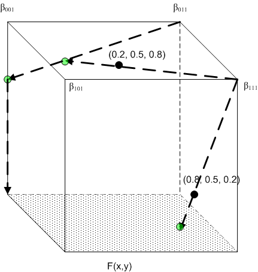

# WCS Transform Creation Algorithms

[Creation of Transforms](#creation-of-transforms)

 

[Sequential Transform Execution](#sequential-transform-execution)

 

[Creation of Optimized Transforms](#creation-of-optimized-transforms)

 

[ICCProfileFromWCSProfile](#iccprofilefromwcsprofile)

 

[Black Preservation and Black Generation](#black-preservation-and-black-generation)

 

[Check Gamut](#checkgamut)

## Creation of Transforms

To properly explain how color transforms work, it is helpful to explain the complete processing path through both ICM 2.0 and the internals of the CTE. The ICM 2.0 [**CreateColorTransformW**](/windows/win32/api/icm/nf-icm-createcolortransformw) function creates a color transform that applications can use to perform color management. This function creates a color context from the [**LOGCOLORSPACE**](/windows/desktop/api/Wingdi/ns-wingdi-taglogcolorspacea) and intent inputs. The intents are mapped to baseline ICC gamut mapping algorithm correlates. The function then calls ICM 2.0 function [**CreateMultiProfileTransform**](/windows/desktop/api/Wingdi/) for consistent color processing. The **CreateColorTransform** function generally copies data into the internal optimized transform structure.

The ICM 2.0 CreateMultiProfileTransform function accepts an array of profiles and an array of intents or a single device link profile and creates a color transform that applications can use to perform color mapping. It processes those input profiles and intents to create device models, color appearance models, gamut boundary descriptions, and gamut mapping models. Here's how this is done:

-   Device models are initialized directly from DM profiles. There is one device model created for each profile in the call to [**CreateMultiProfileTransform**](/windows/desktop/api/Wingdi/).
-   Color appearance models are initialized directly from CAM profiles. There is one CAM profile for each profile in the call to [**CreateMultiProfileTransform**](/windows/desktop/api/Wingdi/). The same CAM profile can be specified for more than one profile, however.
-   Gamut boundary descriptions are initialized from a device model object and a CAM object. There is one gamut boundary description for each profile in the call to [**CreateMultiProfileTransform**](/windows/desktop/api/Wingdi/).
-   Gamut mapping models are initialized from two gamut boundaries and an intent. You must create a gamut mapping model between each pair of device models created from the call to [**CreateMultiProfileTransform**](/windows/desktop/api/Wingdi/). Note that this means that you use one fewer gamut map model than device model. Because the number of intents matches the number of device models, there is also one more intent than required. The first intent in the list is skipped. You walk through the list of device models and intents, creating gamut mapping models. Pick up the first and second device models and the second intent, and then initialize the first gamut mapping model. Pick up the second and third device models and the third intent, and then initialize the second gamut mapping model. Continue in this manner until you have created all the gamut mapping models.

When the profiles have been properly processed and all intermediate objects have been created and initialized, then you can create the CITE transform with the following call. The *pDestCAM* and *pDestDM* are those associated with the last profile in the call to [**CreateMultiProfileTransform**](/windows/desktop/api/Wingdi/).


```C++
HRESULT CreateCITEColorTransform(
 __inout     IDeviceModel          *pSourceDM,
 __inout     IColorAppearanceModel *pSourceCAM,
 __in        GamutMapArray         *pGamutMapArray,
 __inout     IColorAppearanceModel *pDestCAM,
 __inout     IDeviceModel          *pDestDM,
             EColorTransformMode    eTransformMode,
 __deref_out IColorTransform      **ppCTS
 );
```


## Support for plug-ins

One issue involved in setting up the transform list is to validate whether a required plug-in is available. The following model switch provides this policy to control this behavior. The management of this transform list is a method in the internal optimized transform structure, but each model method provides the pointer to itself and its own set of parameter values.

The mode must be one of the following.

-   TfmRobust: If a measurement profile specifies a preferred plug-in and the plug-in is not available, the new CTE system will use the baseline plug-in. If neither plug-in is available, the transform will report an error.
-   TfmStrict: If the ColorContext specifies a preferred plug-in, the plug-in must be available. If no preferred plug-in is found, the baseline plug-in will be used. If neither plug-in is available, the transform will report an error.
-   TfmBaseline: Only baseline plug-ins can be used in AddMeasurementStep. If the ColorContext specifies a preferred plug-in, the plug-in will be ignored. If the baseline plug-in is not available, the transform will report an error.

## Transform execution

The ICM 2.0 API [**TranslateColors**](/windows/win32/api/icm/nf-icm-translatecolors) function translates an array of colors from the source [color space](c.md) to the destination color space as defined by a color transform. This function internally checks against an array of cached colors to enable immediate matching of commonly transformed colors. This transform supports 8-bit per channel byte arrays and 32-bit per channel float arrays. All other formats will be converted prior to passing off to the new CTE.

The ICM 2.0 API [**TranslateBitmapBits**](/windows/win32/api/icm/nf-icm-translatebitmapbits) function translates the colors of a bitmap having a defined format to produce another bitmap in a requested format. This function internally checks against an array of cached colors to enable immediate matching of commonly transformed colors. To avoid too many code paths, support, and testing complexity, only a limited number of bitmap formats are actually supported in the transform and interpolation engine. This function must translate the non-native incoming and outgoing bitmap formats into natively supported formats for processing. This transform only supports 8-bit per channel byte bitmaps and 32-bit per channel float bitmaps. All other formats will be converted prior to passing off to the new CTE.

 

### Sequential Transform Execution

If the *dwFlags* parameter has the SEQUENTIAL\_TRANSFORM bit set when the ICM functions [**CreateColorTransformW**](/windows/win32/api/icm/nf-icm-createcolortransformw) or **CreateMultiProfileTransform** are called, then the transform steps are executed sequentially. This means that the code steps through each device model, color appearance model, and gamut mapping model separately, as specified by the **CreateColorTransform** or **CreateMultiProfileTransform** call. This may be helpful for debugging plug-in modules, but it is much slower than executing through an optimized transform. Running in sequential mode is therefore not recommended for production software. Also, there may be slight differences in the results obtained in sequential mode and in optimized mode. This is due to variations introduced when the functions are concatenated together.

### Creation of Optimized Transforms

An optimized transform is a multi-dimensional lookup table. The table can be processed by a multi-dimensional interpolation engine, such as tetrahedral interpolation, that applies the input colors to the transform. The following section describes how the optimized lookup tables are created. The section after that describes how to interpolate within the optimized lookup tables.

## Sparse lookup tables

Conventional printers have CMYK inks. To extend the gamut, one approach is to add new inks to the system. The inks typically added are colors that CMYK inks have difficulty reproducing. Common choices are orange, green, red, blue, etc. To increase the "apparent resolution," inks with different tints can be used, for example, light cyan, light magenta, and so on. In effect, the printer device has more than four channels.

Although printers are output devices, they also perform the color conversion from the device space to another color space. In the case of a CMYK printer, this would be a transformation from CMYK to XYZ, or the "forward model" of the printer. By combining the forward model with other transformations, it is possible to emulate a CMYK print on another device. For example, a printer CMYK to a monitor RGB would make possible a proofing mechanism that emulates a print of that CMYK printer on a monitor. Similarly, the same also applies for hi-fi printers. A CMYKOG to RGB conversion allows proofing of the CMYKOG printer on a monitor.

The conventional approach to implementing such color conversion is by using a uniform LUT. For example, in an ICC profile for a CMYKOG printer, the ICC specification mandates an A2B1 tag that stores a uniform LUT representing a uniform sampling in the CMYKOG device space of the forward model, which goes from CMYKOG to the ICC profile connection space (either CIELAB or CIEXYZ). The ICC device link profile enables a direct transformation from CMYKOG device space to any color space including a device space, also in the form of a LUT sampled uniformly in CMYKOG space. Sampling is never done with 256 levels (bit depth 8) because of the huge LUT resulting, except in the case of monochrome devices (1 channel). Instead, sampling with lower bit depth is used; some typical choices are 9 (bit depth 3), 17 (bit depth 4), 33 (bit depth 5). With the number of levels less than 256 in each channel, the LUT is used in conjunction with an interpolation algorithm to produce the result if a level is between two sampled levels.

While a uniform LUT is conceptually simple to implement, and interpolation on a uniform LUT is generally efficient, the LUT size increases exponentially with the input dimension. In fact, if *d* is the number of steps used in the uniform LUT, and *n* is the number of channels in the source color space, then the number of nodes in the LUT is . Clearly, the number of nodes quickly demands so much storage in memory that even top-of-the-line computing systems have difficulty handling the demand. For devices with six or eight channels, an ICC implementation of the device profile requires using few steps in the LUT, sometimes even down to five steps in the A2B1 table to keep the profile within megabytes instead of gigabytes. Clearly, using a smaller number of steps increases interpolation error, because there are now fewer samples. Because the LUT must be uniform, accuracy over the whole color space is degraded even in those regions of the space where a significant color difference can be caused by small change in the device value.

In devices with more than four colorants, certain subspaces of the whole device space are more important than others. For example, in CMYKOG space, cyan and green inks are seldom used together because their hues largely overlap each other. Similarly, yellow and orange inks largely overlap each other. A uniform reduction in the number of steps can be viewed as an overall degradation in quality across the whole color space, which is something you can afford for the improbable ink combinations, but not for the likely or important combinations.

While a uniformly sampled LUT is simple and efficient for interpolation, it imposes huge memory requirements as dimension increases. In reality, while a device might have six or eight channels, they are rarely used simultaneously. In most cases, the input color to color transformation has only a few "active" colorants and so resides in a lower dimensional color space. This also means that interpolation can be done more efficiently in that lower dimensional space because interpolation is faster when the dimension is lower.

Therefore, the approach is to stratify the whole device space into subspaces of various dimensions. And because lower dimensions (those combining three or four colorants) are more important, by stratifying the space, you can also apply different sampling rates; that is, a different number of steps, to the pieces; increasing sampling rates for lower dimensions, reducing them for higher dimensions.

To fix notations, *n* is the number of channels in the source color space of the color transformation that you want to sample. You can also refer to *n* as the input dimension, and  , unless otherwise specified.

The basic building blocks are LUTs of various input *dimensions* and sizes, instead of one uniform LUT with input dimension *n*. To be more precise, a*LUT* is a rectangular lattice imposed on a unit cube; that is, all the device coordinates are normalized to the range \[0, 1\]). if   is the input dimension of the lut (note that   does not have to be equal to *n*, although  is required), then it consists of ν one-dimensional sampling grids:

Samp *i*: 

where all the *x<sub>j</sub>s* must lie in the range \[0, 1\],  is the number of steps for the *i* th channel sampling which must be at least 1, and  must be 1. On the other hand,  is not required to be 0.

Only the following two special cases of LUT will be defined.

*Closed LUT*: This is a LUT with the additional requirement that for each Samp*<sub>i</sub>*,  , and  . A uniform closed LUT is a closed LUT that has the same  for each channel, and the nodes are uniformly spaced between 0 and 1.

*Open LUT*: This is a LUT with the additional requirement that for each Samp *i*,  . It is OK to have  .

The goal is to stratify the unit cube \[0, 1\] *n* into a collection of closed LUTs and open LUTs, such that the whole collection will cover the unit cube. It is conceptually simpler to organize these "LUT strata" by their dimensions, so that on the top level:


where  is the "*k* -dimensional strata collection." Note that the strata dimension starts from 3 instead of 0; that is, points, because interpolation of three-colorant combinations can be handled without too much memory requirement.

## Description of the LUT strata

In this implementation:

1.  consists of closed LUTs with three inputs, one from every possible combination of three colorants chosen out of the *n* colorants.

2.  consists of one closed LUT for the combination CMYK (or the first four colorants), together with  open LUTs for all other four-colorant combinations. By singling out the CMYK combination, you acknowledge that it is an important combination.

3. For  ,  consists of  open LUTs, one for each possible combination of choosing *k* colorants from the total of *n* colorants.

It remains to specify the sizes of the LUTs. The key difference between open and closed LUTs is that open LUTs don't overlap, and closed LUTs might overlap at the boundary faces. The fact that the one-dimensional sampling in an open LUT does not contain 0, essentially means that an open LUT is missing half of the boundary faces, hence the name "open." If two LUTs don't overlap, you can use a different number of steps or node locations in each channel. The same is not true if two LUTs overlap. In that case, if the number of steps or the node locations are different, a point lying in the intersection of the two LUTs will receive a different interpolation value depending on which LUT is used in the interpolation. A simple solution to this problem is to use uniform sampling with the same number of steps whenever two LUTs overlap. In other words:

All closed LUTs (all three-colorant LUTs and the CMYK LUT in this implementation) must be uniform and have the same number of steps, which are denoted *d*.

The following two algorithms can be used to determine the number of steps *d* for closed LUTs and the number of steps for open LUTs.

## Algorithm \#1

This algorithm does not require external input.

All the closed LUTs will be uniform with *d* number of steps.

All the open LUTs of dimension *k* will have same number of steps  in each input channel, and the nodes are equally spaced; that is, for each  .

Samp *i*: 

Finally, specify *d* and *d* (*k* ) in the following Table 1. The three modes, "proof," "normal," and "best" are the ICM 2.0 quality settings. In this implementation, the proof mode has the smallest memory footprint, and best mode has the largest memory footprint.

To implement this algorithm, you must call the following Algorithm \#2. Users can specify their own sampling locations, using the tables as a guide.

## Algorithm \#2

This algorithm requires external input in the form of a list of "important" sampling locations, but it is more adaptive and can save memory space potentially.

The required input is an array of device values supplied by the user. These device values indicate which region of the device color space is important; that is, which region should be sampled more.

All the closed LUTs will be uniform with *d* number of steps as described in Algorithm \#1. Values for *d* are provided in Table 1.

*(a) Uniform Closed LUT*


|         | Proof mode | Normal mode | Best mode |
|---------|------------|-------------|-----------|
| ***d*** | 9          | 17          | 33        |


 

*(b) Open LUT*


| Input dimension | Proof mode | Normal mode | Best mode |
|-----------------|------------|-------------|-----------|
| 4               | 5          | 7           | 9         |
| 5               | 2          | 3           | 3         |
| 6               | 2          | 3           | 3         |
| 7               | 2          | 2           | 2         |
| 8 or more       | 2          | 2           | 2         |


 

**Table 1:** LUT sizes used in the algorithm

Each open LUT can have a different number of steps in each input channel, and the sampling locations do not have to be equally spaced. For a given open LUT stratum, there is an associated colorant combination, for example,  , where the  s are distinct integers between 1 and *n*. They are the channel indices corresponding to the "active" colorants in this strata.

STEP 1: Filter out the inputted array of device values that are not contained in this strata. A device value  is contained in the strata, if and only if  and all other channels are 0. If the filtered set has *N* entries, let


For each  , iterate the following steps 2-5:

STEP 2: If  , Samp *i* has only 1 point, which must be 1.0. Move on to the next *i*. Otherwise, continue to STEP 3.

STEP 3: Sort the filtered samples in ascending order in the  channel.

STEP 4: Define the "tentative" sampling grid using the nodes


where  .

STEP 5: Regularize the tentative grid to ensure that it conforms with strict monotonicity and also that it ends with 1.0. Because the array is already sorted, the nodes in the tentative grid are already monotonic nondecreasing. However, adjacent nodes might be identical. You can fix this by removing identical nodes, if necessary. Finally, after this procedure, if the end point is less than 1.0, replace it with 1.0.

Note that STEP 5 is the reason that the LUT strata may have a different number of steps in each channel. After the regularization, the number of steps in a channel may be less than  .

## Interpolation

You can construct the stratification of the unit cube by open LUT strata and closed LUT strata. To perform interpolation using this "sparse LUT structure," follow these steps. Assume a given input device value  .

STEP 1: Determine the number of "active" channels. This is the number of non-zero channels. This determines the strata dimension *k* to search for the containing stratum. More precisely, the strata dimension is 3 if the number of active channels is  , otherwise, the strata dimension is the same as the number of active channels.

STEP 2: Within  , search for the containing stratum. A device value is contained in an open stratum if all the channels corresponding to the stratum have non-zero value, and all other channels are zero. A device value is contained in a closed stratum if every channel not represented by the stratum is zero. If no containing stratum is found, there is an error condition. Cancel and report failure. If a containing stratum is found, proceed to the next step.

STEP 3: If the containing stratum is closed, then interpolation within the stratum can be done by any known interpolation algorithm. In this implementation, the choice of algorithm is tetrahedral interpolation. If the containing stratum is open, and the device value lies strictly within the stratum, that is,

 first node in *i* th channel

where *i* is a channel index for the stratum, then standard interpolation algorithm, such as tetrahedral interpolation, works.

If  first node in *i* th channel for some *i*, then the device value falls into the "gap" between the stratum and the lower dimensional subspaces. This MOI is not concerned with an interpolation algorithm per se, so any interpolation algorithm can be used to interpolate within this "gap," although the preferred algorithm is the following transfinite interpolation.

The architecture of the interpolation module is illustrated in the two parts of Figure 1.


**Figure 1:** Intepolation module architecture

As explained earlier, this algorithm is able to achieve reasonably dense sampling in regions of the device space that contain important combination of colorants, while minimizing the total size of LUTs needed. The following table shows a comparison of the number of nodes needed for the sparse LUT implementation (using Algorithm \#1 and normal mode) and the corresponding uniform LUT implementation.


| **Number of input channels** | **Sparse LUT** | **Uniform LUT** |
|------------------------------|----------------|-----------------|
| 5                            | 142498         | 1419857         |
| 6                            | 217582         | 24137567        |
| 7                            | 347444         | 410338673       |
| 8                            | 559618         | 6975757441      |


 

## Interpolation within a unit cube

A basic step in the case of rectangular grid is interpolation within an enclosing cell. For an input point, you can determine the enclosing cell easily. In a rectangular grid, the output value at each of the vertices (corner points) of the enclosing cell is specified. They are also the only boundary conditions (BCs) that an interpolant must satisfy: The interpolant must pass through all these points. Note that these boundary conditions are on "discrete" points, in this case the 2n corner points of the cell, where n is the dimension of the color space.

It is useful to formalize the concept of boundary conditions before moving on. For any subset S of the boundary of the enclosing cell (the unit cube in n dimensions), a boundary condition on S is a specification of a function BC: S → Rm, where m is the output dimension. In other words, an interpolant, which may be denoted Interp: \[0,1\]n→ Rm, is required to satisfy: Interp(x) = BC(x) for all x in S.

In the standard scenario of interpolation on the unit cube, S is the set of discrete points that are the 2n vertices of the cube.

You can now generalize the boundary conditions to solve the issues described earlier and provide a new interpolation algorithm within the unit cube. Instead of allowing only discrete boundary points, boundary conditions can be imposed on a whole boundary face of the cube. The precise assumptions are as follows:

(a) The point vn =(1,1,…,1) is special and only a discrete boundary condition is allowed. In other words, no continuous boundary conditions can be imposed on the n boundary faces xi=1 (i=1,…,n).

(b) For each of the remaining n boundary faces xi=0 (i=1,…,n), boundary condition can be imposed on the whole face, with the compatibility condition that if two faces intersect, the boundary conditions on the faces should agree on the intersection.

(c) Any vertices not contained in the faces with boundary condition will have an individual (discrete) boundary condition.

You can refer to a discrete boundary condition as finite data, and a continuous boundary condition as transfinite data in discussing interpolation on finite and transfinite data.

First, review the standard tetrahedral interpolation (such as that used in Sakamoto's patent) which helps set the notations for this particular formulation of the problem. It is known that the unit cube \[0,1\]n can be subdivided into n! tetrahedra, parameterized by the set of permutations on n symbols. More specifically, each such tetrahedron is defined by inequalities


where σ:{1,2,..,n}→{1,2,…,n} is a permutation of "symbols" 1, 2, …, n, that is, it is a bijective mapping of the set of n symbols. For example, if n = 3 and σ = (3, 2, 1), meaning σ(1)=3, σ(2)=2, σ(3)=1, then the corresponding tetrahedron is defined by z≥y≥x, where the common notation x, y, z is used for x1, x2, x3. Note that these tetrahedrons are not disjoint from each other. For the purpose of interpolation, points lying on a common face of two distinct tetrahedrons will have the same interpolation value regardless of which tetrahedron is used in the interpolation. Still, in the standard scenario of interpolating on finite points, for a given input point (x1, …, xn), first determine which tetrahedron it lies in, or equivalently, the corresponding permutation σ, then the tetrahedral interpolant is defined as


where  for i=1, …, n, and e1, …, en are the standard basis vectors. Before moving on to the generalization, note that v0, v1, …, vn are the vertices of the tetrahedron, and  are the "barycentric coordinates."

For the general case of BCs on boundary faces, you can use the concept of barycentric projection. As before, for a given input point (x1, …, xn), first determine in which tetrahedron it lies, or equivalently, the corresponding permutation σ. Then perform a series of barycentric projections, as follows. The first projection  sends the point to the plane  unless  in which case it is not changed. The precise definition of the map BProj is defined as follows:


with  and k = 1, 2, …, n.

In the case  , you can stop, because BC is defined at vn by Assumption (a). In the case  , it is clear that  has the σ(1)th component annihilated. In other words, it is on one of boundary faces. Either it is on a face on which BC is defined, in which case you can stop, or you perform another barycentric projection  where  . And if  is on a face on which BC is defined, you can stop; otherwise, perform yet another projection  . Because every projection annihilates one component, the effective dimension decreases, so you know the process must eventually stop. In the worst case scenario, you perform n projections down to dimension 0, that is, vertices on the cube, which according to Assumption (c), you know BC will be defined on.

Assuming that K projections have been performed, with


x(0)= x, the input point, and BC is defined at x(k). Then unwind the projections by defining a series of output vectors:


where  , and you finally obtain the answer


## Worked example



**Figure 2:** Worked example

Consider the situation depicted in Figure 2, where n = 3, m = 1, and you have the following BCs:

(a) Four discrete BCs on the vertices

(0, 0, 1): β001

(0, 1, 1): β011

(1, 0, 1): β101

(1, 1, 1): β111

(b) A continuous BC on the face x3=0: F(x1, x2)

Computation \#1: Input point x = (0.8, 0.5, 0.2). The enclosing tetrahedron is associated with the permutation &lt;1, 2, 3&gt;.

1st projection: 

This is already on the face x3=0, so you can stop. Backward substitution then gives

 which is the answer.

Computation \#2 : Input point x = (0.2, 0.5, 0.8). The enclosing tetrahedron is associated with the permutation &lt;3, 2, 1&gt;.

1st projection: 

2nd projection: 

3rd projection:  , which is on the face x3=0. Backward substitution then gives


, which is the final answer.

## Applications

*(a) Sequential Tetrahedral Interpolation*


**Figure 3:** Sequential tetrahedral interpolation

Refer to Figure 3. To interpolate between two planes on which incompatible grids have been imposed, consider a cell enclosing a given point P shown in the figure. The "top" vertices of the cell come directly from the grid in the top plane. The vertices in the bottom face are not compatible with the grid in the bottom plane, so the whole face is treated as having a BC with values obtained by interpolation on the grid in the bottom plane. It is then clear that this setup satisfies Assumptions (a), (b), and (c) above, and you can apply the interpolation algorithm.

It is also clear that the algorithm has reduced the dimension of the interpolation problem by 1, because the result is a linear combination of values at the vertices in the upper grid, and interpolation in the lower plane, which has dimension less 1. If a similar sandwiching plane configuration exists in the lower plane, you can apply the procedure in that plane, further reducing the dimension by 1. This procedure can continue until you reach dimension 0. This cascade of projections and interpolations can be called "Sequential Tetrahedral Interpolation."

*(b) Gap Interpolation*


**Figure 4:** Gap interpolation

This is a grid imposed on a cube sitting strictly inside the positive quadrant. The cube itself has a grid on it, and each coordinate plane has grids that are not necessarily compatible. The "gap" between the cube and the coordinate planes has a cross-section that is "L-shaped" and is not amenable to standard techniques. However, with the technique introduced here, you can easily introduce cells that cover this gap. Figure 4 depicts one of these. The grids on the coordinate planes support interpolation that provides the necessary BCs for all the bottom faces of the cell, with one remaining vertex whose BC is provided by the lower corner of the cube.

## Final note on implementation

In actual application, the "unit cube" that is the basic setting of the algorithm is extracted from larger lattices, and the values at the vertices may require expensive calculation. On the other hand, it is also clear that tetrahedral interpolation requires only the values at the vertices of the tetrahedron, which is a subset of all the vertices of the unit cube. Therefore, it is more efficient to implement what can be called "deferred evaluation." In a software implementation of the preceding algorithm, it is typical to have a subroutine that takes the unit cube and values at its vertices as input. Deferred evaluation means that instead of passing the values at the vertices, the necessary information to evaluate the values of the vertices is passed, without actually carrying out the evaluation. Inside the subroutine, actual evaluation of these values will be carried out only for those vertices that belong to the enclosing tetrahedron, after the enclosing tetrahedron is determined.

## Lookup table for use with high dynamic range virtual RGB source devices

In the case where a transform is constructed with a source device that is modeled as a virtual RGB device, it is possible that source colorant values may be negative or greater than unity (1.0). When this occurs, the source device is referred to as having a high dynamic range(HDR). Special consideration is made for this case.

In the case of HDR transforms, the minimum and maximum values for each colorant channel can be determined from the gamut boundary of the device. By using these values, a simple scaling for each colorant channel is applied so that colorant values equal to the minimum colorant would be converted to 0.0, and colorant values equal to the maximum colorant would be converted to 1.0, with a linear scaling of values between to map linearly between 0.0 and 1.0.

### ICCProfileFromWCSProfile

Because the main purpose of this feature is to support pre-Vista versions of Windows, you must generate Version 2.2 ICC profiles as defined in ICC Specification ICC.1:1998-09. In certain cases (see the following table "Baseline Device To ICC Profile Class Mapping"), you can create a matrix or TRC-based ICC profile from a WCS profile. In other cases, the ICC profile consists of LUTs. The following process describes how to create the AToB and BToA LUTs. Of course, ICC profiles have other fields as well. Some of the data can be derived from the WCS profile. For other data, you'll have to develop intelligent defaults. The copyright will be assigned to Microsoft; since it is Microsoft technology that is being used to create the LUTs.

This design should work for all types of device models, including plug-ins. As long as the plug-in has an associated baseline device model, the underlying device type can be determined.

The hard part of creating an ICC profile is creating the AToB and BToA lookup tables. These tables map between the device space, for example, RGB or CMYK, and the Profile Connection Space (PCS), which is a variant of CIELAB. This is fundamentally the same as the color management process used in the CITE transform to map from device space to device space. However, you must have the following information to make the transformation.

1) Reference viewing conditions for the PCS.

2) Reference PCS gamut.

3) Device model that converts between PCS values and colorimetry.

The WCS profile and its associated CAM are provided as parameters. There are two baseline device models that convert between colorimetry and the PCS encoding. The reason you need two is explained below.

1) You can obtain the reference viewing conditions for the PCS from the ICC profile format specification. The information provided in the ICC profile format specification is sufficient to compute all the data required to initialize the CAM used by the CMS. For consistency and flexibility, this information is stored in a WCS color profile.

2) You can also use a WCS profile to store samples that define the reference gamut of the PCS. The CITE color management system (CMS) has two ways to create gamut boundaries. One is to sample the complete device space and use the device model to create measurement values. The second method is to use measured samples from the profile to create a reference gamut boundary. Because the gamut of the ICC PCS is too large to make a useful reference gamut, the first method is inappropriate. But the second method is a flexible, profile-based approach. To redefine the reference PCS gamut, you can change the measurement data in the PCS device profile.

3) The ICC PCS is a modeling of an ideal device. By creating a model of the PCS as a real device, you can take advantage of the color management process used in the Smart CMM. Creating a device model from colorimetry to the PCS encoding is straightforward. You simply map between the true colorimetric values and the PCS encoded values. Since the CMS interface for device models only supports XYZ values, you might also have to map between XYZ and LAB. This is a well-known transformation. This model is described in the document 2.2.02 "Baseline Device Models" in sections 7.9 and 7.10.

You might have to perform some gamut mapping, if the gamut of the device is larger than the gamut of the PCS. The baseline GMMs can be used for this purpose. Note that a properly created ICC profile has lookup tables for the Relative Colorimetric, Perceptual, and Saturation intents, although these may all point to the same LUT internally.


**Figure 5:** Creation of an AToB LUT

This process is illustrated in Figure 5. First, the device model is initialized from the data in the DM profile. Then, construct a device gamut boundary as follows. A sampling of data from the device model is run through the device model to obtain colorimetric data. The colorimetric data is run through the CAM to create appearance data. The appearance data is used to create the device gamut boundary.

Next, use data from the reference PCS measurement profile to create a gamut boundary for the PCS.

Use the two gamut boundaries just created to initialize a GMM. Then, use the device model, the GMM, and the PCS device model to create a transform. Run a sampling of device space through the transform to create an AToB LUT.


**Figure 6:** Creation of a BToA LUT

Figure 6 illustrates the creation of the BToA LUT. This is almost identical to creating an AToB LUT, with the roles of source and destination exchanged. Also, you must sample the full PCS gamut to create the LUT.

Note that because the CAM (CIECAM02 in WCS) is involved in the process, chromatic adaptation between the media white point and the PCS white point (mandated by ICC to be that of D50) is effected transparently by the CAM.

## HDR virtual RGB devices

Special consideration must be given when generating profiles for HDR virtual RGB devices; that is, devices for which the colorant values may be less than 0.0 or greater than 1.0. In the generation of the ATOB LUT, a larger set of 1D input LUTs is built. Colorant values are scaled and offset to the range 0 .. 1 using the minimum and maximum colorant values in the WCS profile.

Because the colorant space for HDR devices is not likely to be completely populated, special support is provided in the 3-D LUT for the tag as well. In order to handle colors in the sparsely populated region, the colorants are recoded so that extrapolation beyond 0.0 and 1.0 can be achieved. The range used is -1 .. +4.

Because of the rescaling applied for the 3-D LUT, a set of 1D output LUTs is built to map the result back to the range 0 .. 1.

## More than one PCS

The ICC found that one PCS was not sufficiently flexible to meet all the intended uses of a CMS. In version 4 of the Profile Specification, the ICC clarified that there are actually two PCS encodings. One is used for the colorimetric intents; another is used for the perceptual intent. (No PCS is specified for the Saturation intent. The ICC has left this part ambiguous.) The colorimetric PCS has a minimum and maximum lightness specified, but the chroma and hue values range to roughly ± 127. This PCS looks like a rectangular prism. As mentioned previously, the perceptual PCS volume resembles the gamut of an inkjet printer.

The two ICC PCSs also have two different digital encodings. In the perceptual PCS, a value of zero represents a lightness of zero. In the colorimetric PCS, a value of zero represents the minimum lightness of the PCS, which is greater than zero. You can solve this problem by having a different device model for each of the PCS encodings.

## Gamut mapping

To create the AToB LUTs in an ICC profile, you map from the device gamut to the appropriate PCS space. To create the BToA LUTs, you map from the PCS space to the device gamut. The mapping for the AToB LUTs is quite similar to that used in a measurement-based CMS. For the perceptual PCS, map the device plausible gamut to the perceptual PCS gamut boundary, using either clipping or compression for any out-of-gamut colors. For the colorimetric intents, you might have to clip lightness, but the chroma and hue values are all going to fit in the colorimetric PCS gamut.

The mapping for the BToA LUTs is a little different. The colorimetric intents are still easy; you just clip PCS values to the device gamut. But the ICC requires that all possible PCS values map to some device value, not merely those within the reference gamut of the perceptual PCS. So, you must make sure that the GMMs can handle source colors that are outside the reference gamut. This can be handled by clipping those colors to the device gamut boundary.

## Baseline device to ICC profile class mapping


| Baseline Device Type              | ICC Profile Class       | Remark                                                                      |
|-----------------------------------|-------------------------|-----------------------------------------------------------------------------|
| RGB Capture Device                | Input Device ("scnr")   | PCS is CIELAB. AToB0Tag is Device to PCS with relative colorimetric intent. |
| CRT, LCD monitor                  | Display Device ("mntr") | PCS is CIEXYZ. See the following for model conversion.                      |
| RGB Projector                     | Color Space ("spac")    | PCS is CIELAB.                                                              |
| RGB and CMYK printer              | Output Device ("prtr")  | PCS is CIELAB.                                                              |
| RGB Virtual Device (non-HDR case) | Display Device ("mntr") | PCS is CIEXYZ.                                                              |
| RGB Virtual Device (HDR case)     | Color Space ("spac")    | PCS is CIELAB.                                                              |


 

The conversion of monitor profiles does not involving building LUTs, but instead consists of building a matrix or TRC model. The model used in ICC is slightly different from the one used in the WCS CRT or LCD modeling in that the "black correction" term is missing. Specifically,

WCS model: 

ICC model: 

The conversion from WCS model to ICC model is done as follows.

Define new curves:


These are not tone reproduction curves because they do not map 1 to 1. A normalization will achieve that. The final definitions of the ICC model are:


For non-HDR RGB virtual devices, you are also generating a display ICC profile for space efficiency. In that case, the tristimulus matrix *M ICC* can be obtained directly from the primaries of the WCS profile without the above model conversion. One final, but important, note is that this tristimulus matrix must be chromatically adapted to D50 to conform with the ICC specification of the PCS. In other words, the entries on each row of the matrix to be encoded in the ICC profile must sum respectively to 96.42, 100, and 82.49. In the current implementation, the chromatic adaptation is done by CAT02, which is also the chromatic adaptation transform used in CAM02.

## Black Preservation and Black Generation

Implementation of black preservation is tied together with the generation of the black channel in devices that support a black channel. To accomplish this, information about each source color is collected to allow device models that support a black channel to determine how best to set the black channel on output. While black preservation is pertinent for color transforms that convert between one black-channel device to another, black generation is implemented for all transform involving a black-channel destination device.

Black channel information is recorded in a data structure called [**BlackInformation**](/previous-versions/windows/desktop/api/WcsPlugIn/ns-wcsplugin-_blackinformation). The **BlackInformation** structure contains a boolean indicating whether the color contains only black colorant and a numeric value indicating the degree of "blackness" called black weight. For source devices that support a black channel, the black weight is the percentage of black colorant in the source color. For source devices that do not contain a black channel, the black weight is computed using the other colorants and the appearance value. A value called "color purity" is computed by taking the difference between the maximum colorant value and the minimum colorant value divided by the maximum colorant value. A value called "relative lightness" is computed by taking the difference between the lightness of the color and the minimum lightness for the destination device divided by the difference between the minimum and maximum lightness for the destination device. If the source device is an additive device (monitor or projector), the black weight is determined to be the 1.0 minus the color purity multiplied by the relative lightness. For example, if the source device is an RGB monitor, the maximum value and minimum value of R, G, and B for each color is computed and the black weight is determined by the formula:

BW = (1.0 – (max(R,G,B) – min(R,G,B)) / max(R, G, B)) \* relative lightness

If the source device supports subtractive coloration, for example, a CMY printer, then the individual colorants must be "ones complemented" (subtracted from 1.0) before use in the preceding formula. Therefore, for a CMY printer, R = 1.0 – C, G = 1.0 – M, and B = 1.0 – Y.

The black information for each color processed by the color transform is determined during the color translation process. The black-only information is only determined if black preservation is specified. Black weight is always determined if the destination device model support a black colorant. The black information is passed to the destination device model via the [**ColorimetricToDeviceColorsWithBlack**](/previous-versions/windows/desktop/api/WcsPlugIn/nf-wcsplugin-idevicemodelplugin-colorimetrictodevicecolorswithblack) method, which uses the resulting LUT.

Note that, because of color transform optimization, the above process occurs only during the creation of the optimized transform LUT, not during the execution of the TranslateColors method.

## Optimization for transforms with more than three source channels

The size of the optimized transform is determined by several factors: the number of color channels in the source device, the number of steps in the table for each source color channel, and the number of color channels in the output device. The formula for determining the transform table size is:

Size = Number of steps per channel <sub>source\ device(Number\ of\ channels\ in\ source\ device)</sub> x number of channels in output device

As you can see, the size of the table grows exponentially depending on the number of channels in the source device. Many source devices support three color channels, for example,Red, Green, and Blue. However, if a source device supports four channels, such as CMYK, the size of the table and the time required to construct the table grow by a factor of the number of steps. In a measurement-based CMS where transforms are constructed "on the fly," this time may well be unacceptable.

To reduce the time required to construct the color conversion table, it is possible to take advantage of two facts. First, while the source device may support more than three color channels, the intermediate device-independent color space (CIECAM02 Ja <sub>C</sub> b <sub>C</sub> ) has only three color channels. Second, the most time-consuming part of the processing is not the device modeling (converting from device color coordinates to tristimulus values), but the gamut mapping. Using these facts, you can construct a preliminary color conversion table that converts colors in the device-independent color space through the gamut mapping steps, and finally, through the output device color model. Construction of this table is of dimension three. Then we construct the dimension four final color-conversion table by converting the source color combinations to intermediate device-independent space, and then, using the preliminary color-conversion table, finish the conversion to the output device color space. So you reduce from computing (number of steps in the lookup table) <sub>number\ of\ channels</sub> gamut mapping computations to the number of steps in the intermediate table ₃ gamut mapping computations. Even though you have to perform number of steps in the (lookup table) <sub>number\ of\ channels</sub> computations of device modeling and three-dimensional table lookups, this is still much faster than the original calculation.

The preceding process will work well provided that there is no need for information to pass between the source device model and any other component in the color transform. However, if the output device and the source device both support a black colorant, and the source black colorant is used in determining the output black colorant, the process will fail to properly communicate the source black information. An alternative process is to construct a preliminary color conversion table that converts colors in the device-independent color space through the gamut mapping steps only. Then construct the dimension four final color-conversion table using the following steps: a) convert the source color combinations to intermediate device-independent space, b) perform the gamut mapping steps by interpolating in the preliminary color table instead of applying the actual gamut mapping processes, and c) use the resulting values from the gamut mapping steps and any source black channel information to compute the output device colorants using the output device model. This process also can be used when there is information transferred between the source and output device models even if there is no black channel; for example, if the two modules are implemented with a plug-in architecture that allows for data interchange between modules.

The preceding two processes can be used to effectively improve the time required to construct the four-dimensional color transform table.

### CheckGamut

The ICM calls CreateTransform and **CreateMultiProfileTransform** take a word of flag values, one of which is ENABLE\_GAMUT\_CHECKING. When this flag is set, CITE must create the transform differently. The initial steps are the same: the source and destination CAMs must be initialized, then the source and destination gamut boundary descriptors must be initialized. Regardless of the specified intent, the CheckGamut GMM must be used. The CheckGamut GMM should be initialized using the source and destination device models and gamut boundary descriptors. However, the transform should then create a truncated transform comprising the source device model, the source CAM, any intervening GMMs, and the CheckGamut GMM. This assures that the delta J, delta C, and delta h values output by the CheckGamut CMM become the final resulting values.

The meaning of CheckGamut is clear when there are only two device profiles in the transform. When there are more than two device profiles and more than two GMMs, then CheckGamut reports whether the colors which have been transformed through the first device model and all but the last GMM fall within the gamut of the destination device.

## Related topics

<dl> <dt>

[Basic color management concepts](basic-color-management-concepts.md)
</dt> <dt>

[Windows Color System Schemas and Algorithms](windows-color-system-schemas-and-algorithms.md)
</dt> </dl>

 

 


