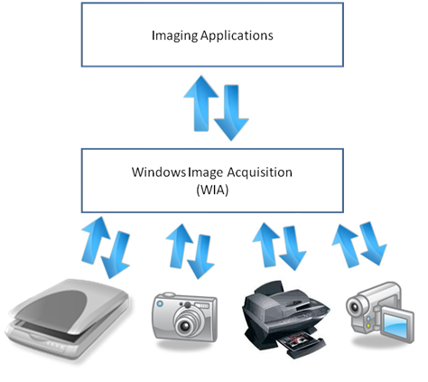
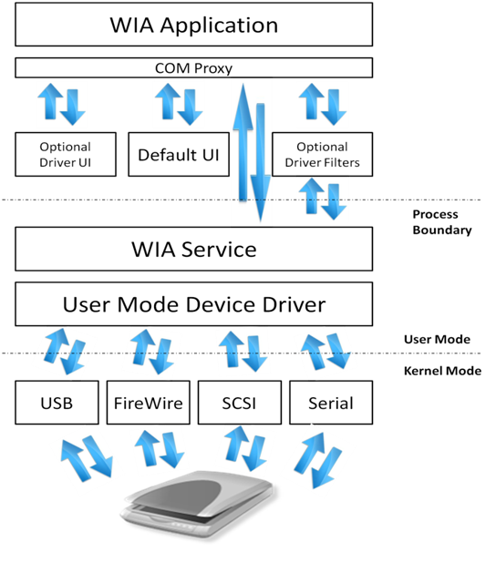

# Windows Image Acquisition (WIA)

Windows Image Acquisition (WIA) is the still image acquisition platform in the Windows family of operating systems starting with Windows Millennium Edition (Windows Me) and Windows XP.

-   [Introduction](#introduction)
-   [Benefits of Windows Image Acquisition 2.0](#benefits-of-windows-image-acquisition-20)
    -   [For Application Writers](#for-application-writers)
    -   [For Device Manufactures](#for-device-manufactures)
    -   [For Scanner Users](#for-scanner-users)
-   [Development of Windows Image Acquisition](#development-of-windows-image-acquisition)
-   [Overview of Windows Image Acquisition](#overview-of-windows-image-acquisition)
-   [Facts about Windows Image Acquisition 2.0](#facts-about-windows-image-acquisition-20)
-   [Developer Audience](#developer-audience)
-   [Run-Time Requirements](#run-time-requirements)
-   [WIA Topics](#wia-topics)

## Introduction

The WIA platform enables imaging/graphics applications to interact with imaging hardware and standardizes the interaction between different applications and scanners. This allows those different applications to talk to and interact with those different scanners without requiring the application writers and scanner manufactures to customize their application or drivers for each application-device combination.

## Benefits of Windows Image Acquisition 2.0

WIA provides benefits to application developers, device manufacturers, and scanner users who need to interact with imaging hardware.

### For Application Writers

-   Windows runs a certification process for WIA drivers so WIA applications are guaranteed to be base-level compatible with all WIA-based scanners.
-   WIA drivers are loaded in the WIA service process, thus providing a more stable driver environment.
-   Applications can be initiated from the scanner scan button via push events supported by the WIA subsystem.
-   The WIA includes a default segmentation filter that all drivers can take advantage of; this way, applications do not have to write code for multi-region scanning for purposes such as separating out a large number of photos spread over a flatbed scanner.

### For Device Manufactures

-   WIA driver certification process helps driver developers in establishing that their driver is WIA-compliant.
-   WIA drivers can take advantage of a built-in segmentation filter, image processing filter and error handler, if they choose to do so.
-   WIA-based scanners work right out of the box on Windows with Windows scanning applications such as Windows Fax and Scan and Paint.
-   WIA drivers offer better integration with Windows such as the full device experience.
-   Windows Vista release includes a WSD-WIA class driver that enables all devices compliant with Web Services for Scanner (WS-Scan) protocol to work with WIA applications without any additional driver or software.

### For Scanner Users

-   WIA-based scanners can be used from Windows applications such Windows Fax and Scan and Paint without the need for any additional software.
-   WIA-based applications and scanners can also take advantage of WIA add-ons such as the segmentation filter which enables such features as processing a number of pictures on the scanner and scanning them all to individual files without user intervention.
-   WIA-based devices offers a much better integration with other Windows features such as the Device Stage feature for Windows 7.
-   WIA provides a more robust, stable and reliable scanning experience by isolating the driver and the application.

## Development of Windows Image Acquisition

The imaging architecture in Windows 2000 and Windows 95 or later consisted of a low-level hardware abstraction, Still Image Architecture (STI), and a high-level set of APIs known as TWAIN. In Windows XP and Windows Me WIA was introduced. WIA is an imaging architecture that builds on STI and does not require TWAIN, although TWAIN is still supported alongside WIA.

WIA 1.0 was introduced in Windows Me and Windows XP and supports scanners, digital cameras and digital video equipment. WIA 2.0 was released with Windows Vista. WIA 2.0 is targeted towards scanners but continues to offer support for legacy WIA 1.0 applications and devices through a WIA 1.0 to WIA 2.0 compatibility layer provided by the WIA service. However, video content support was removed from WIA for Windows Vista. We recommend Windows Portable Devices (WPD) API for digital cameras and digital video equipment in the future. WIA 1.0 as well as STI TWAIN drivers are still supported directly on Windows Vista and Windows 7 alongside native WIA 2.0 device drivers and imaging applications.

## Overview of Windows Image Acquisition

WIA provides a framework that allows a device to present its unique capabilities to the operating system and allows imaging applications to invoke those unique capabilities.

The WIA platform includes a data acquisition protocol, a Device Driver Model and Interface (DDI), an API and a dedicated WIA service. The platform also includes a set of built-in kernel mode drivers that support communication with imaging devices locally connected through USB, serial/parallel, SCSI and FireWire interfaces. The WIA subsystem also includes a transparent compatibility layer which allows TWAIN compatible applications to employ and use WIA-driver-based devices.

Network connected imaging devices that support Web Services for Devices (WSD) protocol can also be used from WIA-compliant imaging applications on Windows Vista and Windows 7 out of the box via a WSD-WIA class driver that shipped as part of Windows Vista. The class driver converts WIA calls to WSD calls and vice versa and makes already existing WIA applications work with WSD based scanners without any additional driver.

WIA drivers are made up of a user interface (UI) component and a core driver component, loaded into two different process spaces: UI in the application space and the driver core in the WIA service space. The service runs in Local System context in Windows XP and runs in Local Service context starting with Windows Server 2003 and Windows Vista for enhanced security against buggy or malicious drivers.

The WIA API set exposes imaging applications to still image acquisition hardware functionality by providing support for:

-   Enumeration of available image acquisition devices.
-   Creating connections to multiple devices simultaneously.
-   Querying properties of devices in a standard and expandable manner.
-   Acquiring device data by using standard and high performance transfer mechanisms.
-   Maintaining image properties across data transfers.
-   Notification of device status and scan event handling.

Windows added scripting support to WIA by releasing the WIA Automation Library in 2002 that was incorporated in Windows Vista as Windows Image Acquisition (WIA) Automation Layer and continues to be a part of Windows 7. The WIA Automation Library provides end-to-end image acquisition capabilities to automation-enabled application development environments and programming languages such as Microsoft Visual Basic 6.0, Active Server Pages (ASP), VBScript and C\#.

For Windows 7, WIA APIs have additional support to complement the already existing push-scanning support.

-   Auto-configured device initiated scanning with scan parameters configured at the scanner on the device front panel.
-   Automatic source selection for device-initiated scan.

## Facts about Windows Image Acquisition 2.0

-   The data transfer mechanism in WIA 2.0 is stream based. The stream abstraction removes the distinction between different transfer types and also allows exchange of mutually agreed-upon metadata between device and application.
-   WIA 2.0 subsystem also includes a basic image processing filter driver add-on that is optionally replaceable by the scanner driver, if the driver chooses to provide a customized image processing filter. The built-in filter enables post processing of images acquired through the scanner. Image processing filter also enables live software previews when small settings such as brightness and contrast are adjusted.
-   The segmentation filter is another handy WIA component that can be replaced by a more customized filter by the scanner driver. The segmentation filter can be used for multi-region scanning. Multi-region scanning, as an example, allows an application to automatically detect different scan regions without any user intervention, such as identifying a bunch of photos lying randomly on the scanner flatbed.
-   WIA 2.0 provides a replaceable/extensible error handler to gracefully handle, and possibly recover from, software, hardware and configuration errors and delays. The error handler is another WIA component that can be replaced with a more customized version by the scanner driver. This extension provides status and error messages during data acquisitions such as "Lamp warming up," "Cover open," "Paper jam," and so on. This extension also allows cleaner support for "Cancel operations."

## Developer Audience

The WIA API is designed for use by C/C++ programmers. Familiarity with the Windows  GUI and Component Object Model (COM) interfaces is required.

For developers familiar with Microsoft Visual Basic 6.0, Active Server Pages (ASP), or scripting, WIA provides an automation layer for Windows XP Service Pack 1 (SP1) or later that builds upon and simplifies access to the foundation provided by C/C++. For information about the automation layer, see [Windows Image Acquisition Automation Layer](/previous-versions/windows/desktop/wiaaut/-wiaaut-startpage).

> [!Note]  
> The WIA Automation Layer supersedes Windows Image Acquisition (WIA) 1.0 scripting.

 

## Run-Time Requirements

Applications that use the WIA API require Windows XP or later.

## WIA Topics

The WIA topics are organized as shown in the following table.

|                                                                                                                              |                                                                                                   |
|------------------------------------------------------------------------------------------------------------------------------|---------------------------------------------------------------------------------------------------|
| [About Windows Image Acquisition](-wia-about-windows-image-acquisition.md)                                                  | General information about WIA                                                                     |
| [Windows Image Acquisition Drivers](/windows-hardware/drivers/image/windows-image-acquisition-drivers)                  | WIA driver development                                                                            |
| [Windows Image Acquisition Automation Layer](/previous-versions/windows/desktop/wiaaut/-wiaaut-startpage) | WIA Automation Layer                                                                              |
| [WIA Tutorial](-wia-wia-tutorial.md)                                                                                        | Walkthrough of code included in the software development kit (SDK) that focuses on specific tasks |
| [Reference](-wia-reference.md)                                                                                              | Information on WIA interfaces, methods, objects, and data types used in C/C++ and scripting.      |

 

 

 
