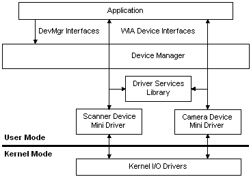

# WIA Architecture

WIA is implemented as a Component Object Model (COM) out-of-process server to ensure the robust operation of client applications. Unlike most out of process server applications, Windows Image Acquisition (WIA) avoids performance penalties during image data transfer by providing its own data transfer mechanism, [**IWiaDataTransfer**](/windows/desktop/api/wia_xp/nn-wia_xp-iwiadatatransfer). This high performance interface uses a shared memory window to transfer data to the client.

WIA has three main components: a Device Manager, a Minidriver Service Library, and a Device Minidriver.

-   The Device Manager enumerates imaging devices, retrieves device properties, sets up events for devices, and creates device objects.
-   The Minidriver Service Library implements all services that are device independent.
-   The Device Minidriver maps WIA properties and commands to the specific device.

The following diagram illustrates the WIA architecture:

 

 

