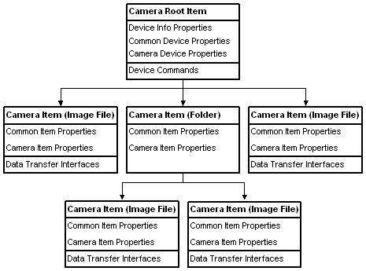

# WIA Camera Devices

WIA represents a camera device as a hierarchical tree of [**IWiaItem**](/windows/desktop/api/wia_xp/nn-wia_xp-iwiaitem) objects. The root item, returned from a call to the Windows Image Acquisition (WIA) device manager [**IWiaDevMgr::CreateDevice**](/windows/desktop/api/wia_xp/nf-wia_xp-iwiadevmgr-createdevice) method, is used to get and set device information, to control the device, and to begin device item enumeration.

> [!Note]  
> WIA does not support cameras in Windows Vista or later. For those versions of the Windows, use the Windows Portable Device (WPD) API described in the Windows Driver Development Kit (DDK) to acquire images from cameras.

 

The following diagram illustrates a sample camera implementation. The camera root item has three child items, two pictures and one folder. The folder has two child items, both pictures.

 

 

