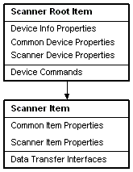
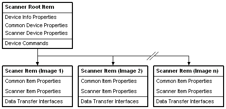

# WIA Scanner Devices in WIA 1.0

> [!Note]  
> This topic discusses the scanner device tree for applications that use the Windows Image Acquisition (WIA) 1.0 service (which is supported on Windows XP or earlier). For information on the device tree of Windows Image Acquisition (WIA) 2.0 items (which are supported on Windows Vista or later), see [About the IWiaItem2 Item Tree](-wia-about-item-tree.md).

 

The Windows Image Acquisition (WIA) scanner device is implemented as a hierarchical tree of [**IWiaItem**](/windows/desktop/api/wia_xp/nn-wia_xp-iwiaitem) objects. From the root item an application may:

-   Query scanner capabilities
-   Set scanner device properties
-   Control the document feeder

A WIA scanner device is different from a WIA camera device because, in general, it does not store multiple images in memory.

Underneath the root item, a typical scanner object has a single [**IWiaItem**](/windows/desktop/api/wia_xp/nn-wia_xp-iwiaitem) object that represents the data collecting functionality of the device, the Scan Item. This item has the [**WiaItemTypeFile**](-wia-wia-item-type-flags.md) flag set to indicate that data transfers on this item are possible. An application sets up a scan by setting the properties of the scan item, then performs the scan and transfers the data using a data transfer interface.

The following diagram illustrates the WIA implementation for a typical scanner:

A typical duplex scanner is represented in WIA by having one [**IWiaItem**](/windows/desktop/api/wia_xp/nn-wia_xp-iwiaitem) object. Front- and back-page data is accessed sequentially one data transfer per page. Therefore, the representation of a duplex scanner is identical to the representation of a typical scanner.

A slide scanner capable of scanning multiple slides in a single scan operation represents each separate image as a separate [**IWiaItem**](/windows/desktop/api/wia_xp/nn-wia_xp-iwiaitem) object.

The following diagram illustrates the WIA representation of a slide scanner:

 

 

