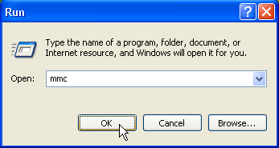
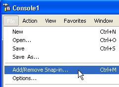
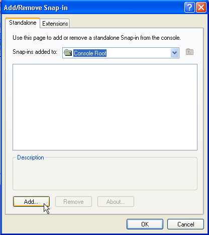
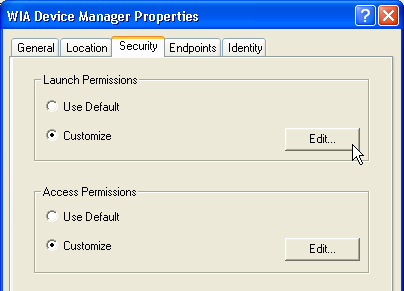
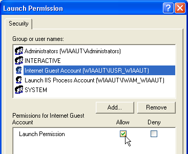
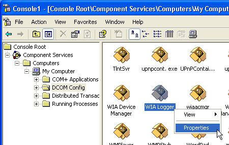

# How to Configure Security Settings

You will need to configure the security settings for Windows Image Acquisition (WIA) before you can successfully create a [**DeviceManager**](-wiaaut-devicemanager.md) object on an Active Server Pages (ASP) page. This configuration is necessary because the script in an ASP page runs in the context of the IUSR\_MACHINENAME or IWAM\_MACHINENAME account (where MACHINENAME is the uppercase computer name).

This topic outlines the necessary steps to configure WIA security settings.

-   [Run the Microsoft Management Console](#run-the-microsoft-management-console)
-   [Add the Component Services Snap-in](#add-the-component-services-snap-in)
-   [Adjust Security Settings for WIA Device Manager](#adjust-security-settings-for-wia-device-manager)
-   [Adjust Security Settings for WIA Logger](#adjust-security-settings-for-wia-logger)
-   [Reboot](#reboot)

## Run the Microsoft Management Console

Click **Run** on the **Start menu**, type `mmc` and click **OK**.

## Add the Component Services Snap-in

Perform the following steps to add the **Component Services Snap-in**.

1.  From the **File** menu, select **Add/Remove Snap-in**.

    

2.  On the **Standalone** tab, click **Add**.

    

3.  Select **Component Services**, click **Add**, click **Close**, and then click **OK**.

    

## Adjust Security Settings for WIA Device Manager

1.  In the tree-view control, select **Console Root**, click **Component Services**, click **Computers**, click **My Computer**, and then click **DCOM Config**. Right-click on the **WIA Device Manager** icon and select **Properties**.

    

2.  Add Launch Permissions for the IUSR\_WIAAUT and IWAM\_WIAAUT accounts as follows: On the **Security** tab in the **Launch Permissions** section, click **Customize** and click **Edit**.

    

    1.  Add the IUSR\_WIAAUT account (if it is not already present) and select **Allow** next to **Launch Permission**.

        

    2.  Add the IWAM\_WIAAUT account (if it is not already present) and select **Allow** next to **Launch Permission**.

        

3.  Add Access Permissions for the previous two accounts as follows: On the **Security** tab, in the **Access Permissions** section, click **Customize** and click **Edit**.

    

    1.  Add the IUSR\_WIAAUT account (if it is not already present) and select **Allow** next to **Access Permission**.

        

    2.  Add the IWAM\_WIAAUT account (if it is not already present) and select **Allow** next to **Access Permission**.

        

## Adjust Security Settings for WIA Logger

Repeat the previous steps for the WIA Logger component and add the IUSR\_WIAAUT and IWAM\_WIAAUT accounts for both launch and access permissions.

## Reboot

Restart your computer. If you know how to restart the WIA Device Manager service, you could do that instead.

 

 

