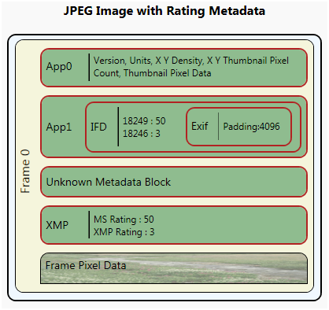

# WIC Metadata Overview

This topic introduces the imaging metadata support provided by the Windows Imaging Component (WIC). It provides an introduction to reading and writing image metadata, the metadata query language, and metadata handler extensibility.

Image metadata is data embedded inside an image file that provides additional information about the image, such as the device used to capture the image or the dimensions of the image. Although it is contained within the image file itself, this metadata is not part of the rendering data. WIC provides interfaces that enable you to read and write this metadata for several common metadata formats including Extensible Metadata Platform (XMP), Exchangeable Image File (EXIF), and Png Textual Data (tEXt).

This topic contains the following sections.

-   [Prerequisites](#prerequisites)
-   [Introduction](#introduction)
-   [Reading Image Metadata](#reading-image-metadata)
-   [Writing Image Metadata](#writing-image-metadata)
-   [Metadata Extensibility](#metadata-extensibility)
-   [Supported Metadata Formats](#supported-metadata-formats)
-   [Metadata Component Summary](#metadata-component-summary)
-   [Related topics](#related-topics)

## Prerequisites

To understand this topic, you should be familiar with the WIC encoder and decoder interfaces and their related Component Object Model (COM) components, as described in the [Windows Imaging Component Overview](-wic-about-windows-imaging-codec.md). It also helps to have a general familiarity with some of the imaging metadata formats in use today.

## Introduction

Metadata provides extended information about an image. This information can be used in several ways. An image might contain metadata such as a description, rating, category tags, and copyright information. Accessing the metadata makes it easier to perform tasks such as asset management, file location, or determining copyright information. For example, the Windows Photo Gallery in Windows Vista enables you to add descriptions and category tags to images. This allows for better discoverability of images and a convenient way to categorize images. Using the WIC APIs and common metadata formats, applications can easily write or read this type of metadata to or from images.

The following diagram illustrates the contents of a JPEG file that includes embedded metadata blocks and metadata items.



In this example image, the metadata is embedded in the image file within an image frame. The JPEG format does not support multiple image frames, so the metadata is conceptually attached to this single frame. Formats that support multiple frames, such as TIFF, may have metadata attached to each image frame as this diagram shows. Though not common today and not supported by the native image codecs, some image formats may also support metadata outside of an image frame. WIC is flexible enough to handle both frame-level metadata and metadata outside of an image's individual frame.

## Reading Image Metadata

The WIC APIs provide COM components that make it easy for applications to read and write image metadata.

The primary way to read metadata is to use a metadata query reader ([**IWICMetadataQueryReader**](/windows/desktop/api/Wincodec/nn-wincodec-iwicmetadataqueryreader)) to access specific metadata items. The metadata query reader component is implemented by the codec and can be accessed at the decoder level or through individual image frames, which is the more common method. The following code demonstrates how to access a query reader for an individual frame by using the query reader's **GetMetadataQueryReader** method.


```
// Get the query reader
if (SUCCEEDED(hr))
{
    hr = pFrameDecode->GetMetadataQueryReader(&pQueryReader);
}
```


A query reader provides methods to obtain information about specific metadata, and a means to specify a metadata item to retrieve. The following code uses a query expression to request a specific metadata item within the App1 nested image file directory (IFD) block. This is done by using the query reader's **GetMetadataByName** method. The following code demonstrates using the query reader to obtain the MicrosoftPhoto rating value.


```
PROPVARIANT value;
PropVariantInit(&value);

LPCWSTR pwzRatingQuery = L"/app1/ifd/{ushort=18249}";

if (SUCCEEDED(hr))
{
    hr = pQueryReader->GetMetadataByName(pwzRatingQuery, &value);
}
```


The pwzRatingQuery variable in the preceding example is the query string to access the metadata item MicrosoftPhoto rating. This string is created by using the metadata query language. To create this string, knowledge of the metadata format and the metadata query language is needed to retrieve individual metadata items. For more information about the metadata query language, see the [Metadata Query Language Overview](-wic-codec-metadataquerylanguage.md).

Behind the scenes, a query reader uses a metadata reader ([**IWICMetadataReader**](/windows/desktop/api/Wincodecsdk/nn-wincodecsdk-iwicmetadatareader)) to access the metadata described by the query expression. In addition to using a query reader, you can also access a metadata reader directly to read metadata. You can obtain a metadata reader from the decoder or individual frames by querying for a block reader ([**IWICMetadataBlockReader**](/windows/desktop/api/Wincodecsdk/nn-wincodecsdk-iwicmetadatablockreader)) interface.

## Writing Image Metadata

The process of writing metadata is similar to the way it is read except that a metadata query writer ([**IWICMetadataQueryWriter**](/windows/desktop/api/Wincodec/nn-wincodec-iwicmetadataquerywriter)) is used. The query writer interface is implemented by the image encoder and, as in the query reader, metadata is accessed both on the encoder and on individual frames (depending on image format support).

The following code demonstrates how to obtain a query writer from an encoder frame and remove the rating value that was previously read.


```
// Get the frame's query writer
if (SUCCEEDED(hr))
{
    hr = pFrameEncode->GetMetadataQueryWriter(&pFrameQWriter);
}

if (SUCCEEDED(hr))
{
    hr = pFrameQWriter->RemoveMetadataByName(L"/app1/ifd/{ushort=18249}");
}
```


Another way to write metadata is through fast metadata updates. Fast metadata encoding is a way to write image metadata without having to re-encode an image file. This is done by writing new metadata information to a padded region of the metadata format. The fast metadata encoder ([**IWICFastMetadataEncoder**](/windows/desktop/api/Wincodec/nn-wincodec-iwicfastmetadataencoder)) is obtained from the component factory, based on the image decoder. The fast metadata encoder then obtains a query writer that is used to write the metadata. Finally, the fast encoder commits the change.

The following code demonstrates how to obtain a fast metadata encoder and use it to write the MicrosoftRating value.


```
if (SUCCEEDED(hr))
{
    IWICFastMetadataEncoder *pFME = NULL;
    IWICMetadataQueryWriter *pFMEQW = NULL;

    hr = pFactory->CreateFastMetadataEncoderFromFrameDecode(
        pFrameDecode,
        &pFME);

    if (SUCCEEDED(hr))
    {
        hr = pFME->GetMetadataQueryWriter(&pFMEQW);
    }

    if (SUCCEEDED(hr))
    {
        // Add additional metadata
        PROPVARIANT value;

        PropVariantInit(&value);

        value.vt = VT_UI4;
        value.uiVal = 99;
        hr = pFMEQW->SetMetadataByName(L"/app1/ifd/{ushort=18249}", &value);

        PropVariantClear(&value);
    }

    if (SUCCEEDED(hr))
    {
        hr = pFME->Commit();
    }
}
```


Not all metadata formats support fast metadata. To see which natively supported formats support fast metadata encoding, see the table in the [Supported Metadata Formats](#supported-metadata-formats) section later in this document.

Behind the scenes, a query writer uses a metadata writer ([**IWICMetadataWriter**](/windows/desktop/api/Wincodecsdk/nn-wincodecsdk-iwicmetadatawriter)) to write the metadata described by the query expression. In addition to using a query reader, you can also access a metadata writer directly to write metadata. You can obtain a metadata writer from the decoder or individual frames using querying for a block writer ([**IWICMetadataBlockWriter**](/windows/desktop/api/Wincodecsdk/nn-wincodecsdk-iwicmetadatablockwriter)) interface.

## Metadata Extensibility

As mentioned previously, WIC provides several metadata handlers to read and write metadata for common metadata formats. However, there are some metadata formats that are not natively supported. Therefore, WIC provides APIs for creating additional metadata handlers that can extend metadata support to other formats.

To fully support other metadata formats, two types of handlers must be developed — a metadata reader to read metadata and a metadata writer to write metadata. Although these two handlers are usually implemented in pairs for a specific format, that is not a requirement. There might be some cases in which only the read ability or only the write ability is needed.

For more information on metadata extensibility using the WIC APIs, see the [Metadata Extensibility Overview](-wic-codec-metadatahandlers.md).

## Supported Metadata Formats

WIC provides support for several common metadata formats. The following table lists the supported metadata formats, their versions, the image formats that support the metadata format, and whether the metadata format supports fast metadata encoding. For more information about fast metadata encoding, see the [Writing Image Metadata](#writing-image-metadata) section earlier in this document.


| Supported metadata formats | Metadata specification version | Image format support | Supports fast metadata encoding |
|----------------------------|--------------------------------|----------------------|---------------------------------|
| App0                       | JFIF 1.02                      | JPEG                 | No                              |
| App1                       | JFIF 1.02                      | JPEG, TIFF           | No                              |
| App13                      | Unknown                        | JPEG, TIFF           | No                              |
| IFD                        | TIFF 6.0                       | JPEG, TIFF           | Yes                             |
| IRB                        | Unknown                        | JPEG, TIFF           | No                              |
| Exif                       | Exif 2.2                       | JPEG, TIFF           | Yes                             |
| XMP                        | XMP 1.0 (Sept 2005)            | JPEG, TIFF           | Yes                             |
| GPS                        | Exif 2.2                       | JPEG, TIFF           | Yes                             |
| IPTC                       | IPTC 4.0                       | JPEG, TIFF           | Yes                             |
| tEXt                       | PNG 1.2                        | PNG                  | No                              |


 

> [!Note]  
> IPTC only supports FME if the blocks grow in size, as IPTC does not support padding.

 

## Metadata Component Summary

The following table describes the WIC interfaces that support metadata, and their corresponding components. These components provide the access to an image's metadata. For more information about these components, see the [Windows Imaging Component Overview](-wic-about-windows-imaging-codec.md). 

<table>
<colgroup>
<col style="width: 50%" />
<col style="width: 50%" />
</colgroup>
<thead>
<tr class="header">
<th>Component</th>
<th>Description</th>
</tr>
</thead>
<tbody>
<tr class="odd">
<td>Bitmap Decoder (<a href="/windows/desktop/api/Wincodec/nn-wincodec-iwicbitmapdecoder"><strong>IWICBitmapDecoder</strong></a>)</td>
<td><ul>
<li>Reads an image stream and produces a usable bitmap source. Associated with a container format such as Tagged Image File Format (TIFF) or Joint Photographic Experts Group (JPEG).</li>
<li>Implements an <a href="/windows/desktop/api/Wincodecsdk/nn-wincodecsdk-iwicmetadatablockreader"><strong>IWICMetadataBlockReader</strong></a> interface to enumerate all of the metadata blocks in the decoder's data stream that are not inside a frame.</li>
<li>Exposes a query reader to read the metadata associated with the image that is not inside a frame.</li>
</ul></td>
</tr>
<tr class="even">
<td>Bitmap Frame Decode (<a href="/windows/desktop/api/Wincodec/nn-wincodec-iwicbitmapframedecode"><strong>IWICBitmapFrameDecode</strong></a>)</td>
<td><ul>
<li>Accesses individual frames from the image stream held by the decoder.</li>
<li>Implements an <a href="/windows/desktop/api/Wincodecsdk/nn-wincodecsdk-iwicmetadatablockreader"><strong>IWICMetadataBlockReader</strong></a> interface to enumerate all of the metadata blocks in the frame's data stream.</li>
<li>Exposes a query reader to read the metadata associated with the frame, using query expressions.</li>
</ul></td>
</tr>
<tr class="odd">
<td>Bitmap Encoder (<a href="/windows/desktop/api/wincodec/nn-wincodec-iwicbitmapencoder"><strong>IWICBitmapEncoder</strong></a>)</td>
<td><ul>
<li>Writes a bitmap source to an image stream. Associated with a container format such as TIFF or JPEG.</li>
<li>Implements an <a href="/windows/desktop/api/Wincodecsdk/nn-wincodecsdk-iwicmetadatablockwriter"><strong>IWICMetadataBlockWriter</strong></a> interface to build up a list of metadata blocks to write into the data stream of the encoder.</li>
<li>Exposes a query writer to write the metadata associated with the image, using query expressions.</li>
</ul></td>
</tr>
<tr class="even">
<td>Bitma Frame Encode (<a href="/windows/desktop/api/Wincodec/nn-wincodec-iwicbitmapframeencode"><strong>IWICBitmapFrameEncode</strong></a>)</td>
<td><ul>
<li>Creates a frame that will be encoded into the stream held by the encoder.</li>
<li>Implements an <a href="/windows/desktop/api/Wincodecsdk/nn-wincodecsdk-iwicmetadatablockwriter"><strong>IWICMetadataBlockWriter</strong></a> interface to build up a list of metadata blocks to write into the frame's data stream.</li>
<li>Exposes a query writer to write the metadata associated with the frame, using query expressions.</li>
</ul></td>
</tr>
</tbody>
</table>


 

The following table describes the WIC metadata components. These components enable you to read and write the metadata in an image exposed by the components listed in the previous table. 

<table>
<colgroup>
<col style="width: 50%" />
<col style="width: 50%" />
</colgroup>
<thead>
<tr class="header">
<th>Component</th>
<th>Description</th>
</tr>
</thead>
<tbody>
<tr class="odd">
<td>Metadata Query Reader (<a href="/windows/desktop/api/Wincodec/nn-wincodec-iwicmetadataqueryreader"><strong>IWICMetadataQueryReader</strong></a>)</td>
<td><ul>
<li>Takes a query string and navigates the underlying metadata hierarchy to get metadata.</li>
</ul></td>
</tr>
<tr class="even">
<td>Metadata Query Writer (<a href="/windows/desktop/api/Wincodec/nn-wincodec-iwicmetadataquerywriter"><strong>IWICMetadataQueryWriter</strong></a>)</td>
<td><ul>
<li>Takes a query string and navigates the underlying metadata hierarchy to get, set, and remove metadata.</li>
</ul></td>
</tr>
<tr class="odd">
<td>Metadata Block Reader (<a href="/windows/desktop/api/Wincodecsdk/nn-wincodecsdk-iwicmetadatablockreader"><strong>IWICMetadataBlockReader</strong></a>)</td>
<td><ul>
<li>Manages a read-only collection of <a href="/windows/desktop/api/Wincodecsdk/nn-wincodecsdk-iwicmetadatareader"><strong>IWICMetadataReader</strong></a> objects at the top of the metadata hierarchy and enables enumeration of all metadata blocks.</li>
<li>Implemented by a bitmap decoder and a decoded bitmap frame.</li>
<li>Implemented by third-party component developers for custom codecs.</li>
</ul></td>
</tr>
<tr class="even">
<td>Metadata Block Writer (<a href="/windows/desktop/api/Wincodecsdk/nn-wincodecsdk-iwicmetadatablockwriter"><strong>IWICMetadataBlockWriter</strong></a>)</td>
<td><ul>
<li>Manages a read and write collection of <a href="/windows/desktop/api/Wincodecsdk/nn-wincodecsdk-iwicmetadatawriter"><strong>IWICMetadataWriter</strong></a> objects at the top of the metadata hierarchy.</li>
<li>Implemented by a bitmap encoder and a bitmap frame encode.</li>
<li>Implemented by third-party component developers for custom codecs.</li>
</ul></td>
</tr>
<tr class="odd">
<td>Metadata Reader (<a href="/windows/desktop/api/Wincodecsdk/nn-wincodecsdk-iwicmetadatareader"><strong>IWICMetadataReader</strong></a>)</td>
<td><ul>
<li>Parses a stream of metadata and manages a read-only collection of the metadata items. Associated with a metadata format such as EXIF, IFD, and XMP.</li>
<li>Acts as a dictionary, returning a value when given a format and ID pair.</li>
<li>Implemented by third-party component developers for custom metadata types.</li>
</ul></td>
</tr>
<tr class="even">
<td>Metadata Writer (<a href="/windows/desktop/api/Wincodecsdk/nn-wincodecsdk-iwicmetadatawriter"><strong>IWICMetadataWriter</strong></a>)</td>
<td><ul>
<li>Parses and serializes a stream of metadata and manages a read/write collection of metadata items.</li>
<li>Implemented by third-party component developers for custom metadata types.</li>
</ul></td>
</tr>
<tr class="odd">
<td>Fast Metadata Encoder<a href="/windows/desktop/api/Wincodec/nn-wincodec-iwicfastmetadataencoder"><strong>IWICFastMetadataEncoder</strong></a></td>
<td><ul>
<li>Exposes semantics for writing on a metadata hierarchy that will update metadata in place without re-encoding the image.</li>
</ul></td>
</tr>
</tbody>
</table>


 

## Related topics

<dl> <dt>

**Conceptual**
</dt> <dt>

[Windows Imaging Component Overview](-wic-about-windows-imaging-codec.md)
</dt> <dt>

[Metadata Query Language Overview](-wic-codec-metadataquerylanguage.md)
</dt> <dt>

[Overview of Reading and Writing Image Metadata](-wic-codec-readingwritingmetadata.md)
</dt> <dt>

[Metadata Extensibility Overview](-wic-codec-metadatahandlers.md)
</dt> <dt>

[How-to: Re-encode a JPEG Image with Metadata](-wic-codec-jpegmetadataencoding.md)
</dt> </dl>

 

 


