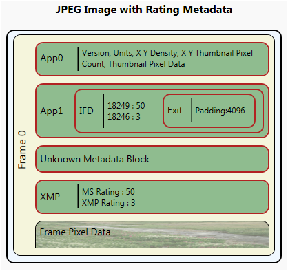

# Overview of Reading and Writing Image Metadata

This topic provides an overview of how you can use the Windows Imaging Component (WIC) APIs to read and write metadata that is embedded in image files.

This topic contains the following sections.

-   [Prerequisites](#prerequisites)
-   [Introduction](#introduction)
-   [Reading Metadadata Using a Query Reader](#reading-metadadata-using-a-query-reader)
    -   [Obtaining a Query Reader](#obtaining-a-query-reader)
    -   [Reading Metadata](#reading-metadata)
    -   [Additional Query Reader Methods](#additional-query-reader-methods)
-   [Writing Metadata Using a Query Writer](#writing-metadata-using-a-query-writer)
    -   [Obtaining a Query Writer](#obtaining-a-query-writer)
    -   [Adding Metadata](#adding-metadata)
    -   [Removing Metadata](#removing-metadata)
    -   [Copying Metadata for Re-encoding](#copying-metadata-for-re-encoding)
-   [Fast Metadata Encoding](#fast-metadata-encoding)
    -   [Adding Padding to Metadata Blocks](#adding-padding-to-metadata-blocks)
    -   [Obtaining a Fast Metadata Encoder](#obtaining-a-fast-metadata-encoder)
    -   [Using the Fast Metadata Encoder](#using-the-fast-metadata-encoder)
-   [Related topics](#related-topics)

## Prerequisites

To understand this topic, you should be familiar with the WIC metadata system as described in the [WIC Metadata Overview](-wic-about-metadata.md). You should also be familiar with the query language used to read and write metadata, as described in [Metadata Query Language Overview](-wic-codec-metadataquerylanguage.md).

## Introduction

WIC provides application developers with Component Object Model (COM) components to read and write metadata embedded in image files. There are two ways to read and write metadata:

-   Using a query reader/writer and a query expression to query metadata blocks for nested blocks or specific metadata within a block.
-   Using a metadata handler (a metadata reader or a metadata writer) to access the nested metadata blocks or specific metadata within the metadata blocks.

The easiest of these is to use a query reader/writer and a query expression to access the metadata. A query reader ([**IWICMetadataQueryReader**](/windows/desktop/api/Wincodec/nn-wincodec-iwicmetadataqueryreader)) is used to read metadata while a query writer ([**IWICMetadataQueryWriter**](/windows/desktop/api/Wincodec/nn-wincodec-iwicmetadataquerywriter)) is used to write metadata. Both of these use a query expression to read or write the desired metadata. Behind the scenes, a query reader (and writer) uses a metadata handler to access the metadata described by the query expression.

The more advanced method is to directly access the metadata handlers. A metadata handler is obtained from the individual frames using a block reader ([**IWICMetadataBlockReader**](/windows/desktop/api/Wincodecsdk/nn-wincodecsdk-iwicmetadatablockreader)) or a block writer ([**IWICMetadataBlockWriter**](/windows/desktop/api/Wincodecsdk/nn-wincodecsdk-iwicmetadatablockwriter)). The two types of metadata handlers available are the metadata reader ([**IWICMetadataReader**](/windows/desktop/api/Wincodecsdk/nn-wincodecsdk-iwicmetadatareader)) and the metadata writer ([**IWICMetadataWriter**](/windows/desktop/api/Wincodecsdk/nn-wincodecsdk-iwicmetadatawriter)).

The following diagram of the contents of a JPEG image file is used throughout the examples in this topic. The image represented by this diagram was created by using Microsoft Paint; the rating metadata was added by using the Photo Gallery feature of Windows Vista.



## Reading Metadadata Using a Query Reader

The easiest way to read metadata is to use the query reader interface, [**IWICMetadataQueryReader**](/windows/desktop/api/Wincodec/nn-wincodec-iwicmetadataqueryreader). The query reader enables you to read metadata blocks and items within metadata blocks using a query expression.

There are three ways to obtain a query reader: through a bitmap decoder ([**IWICBitmapDecoder**](/windows/desktop/api/Wincodec/nn-wincodec-iwicbitmapdecoder)), through its individual frames ([**IWICBitmapFrameDecode**](/windows/desktop/api/Wincodec/nn-wincodec-iwicbitmapframedecode)), or through a query writer ([**IWICMetadataQueryWriter**](/windows/desktop/api/Wincodec/nn-wincodec-iwicmetadataquerywriter)).

### Obtaining a Query Reader

The following example code shows how to obtain a bitmap decoder from the imaging factory and retrieve an individual bitmap frame. This code also performs setup work needed to obtain a query reader from a decoded frame.


```
IWICImagingFactory *pFactory = NULL;
IWICBitmapDecoder *pDecoder = NULL;
IWICBitmapFrameDecode *pFrameDecode = NULL;
IWICMetadataQueryReader *pQueryReader = NULL;
IWICMetadataQueryReader *pEmbedReader = NULL;
PROPVARIANT value;

// Initialize COM
CoInitialize(NULL);

// Initialize PROPVARIANT
PropVariantInit(&value);

//Create the COM imaging factory
HRESULT hr = CoCreateInstance(
    CLSID_WICImagingFactory,
    NULL,
    CLSCTX_INPROC_SERVER,
    IID_IWICImagingFactory,
    (LPVOID*)&pFactory);

// Create the decoder
if (SUCCEEDED(hr))
{
    hr = pFactory->CreateDecoderFromFilename(
        L"test.jpg",
        NULL,
        GENERIC_READ,
        WICDecodeMetadataCacheOnDemand,
        &pDecoder);
}

// Get a single frame from the image
if (SUCCEEDED(hr))
{
    hr = pDecoder->GetFrame(
         0,  //JPEG has only one frame.
         &pFrameDecode); 
}
```


The bitmap decoder for the test.jpg file is obtained by using the **CreateDecoderFromFilename** method of the imaging factory. In this method, the fourth parameter is set to the value WICDecodeMetadataCacheOnDemand from the [**WICDecodeOptions**](/windows/desktop/api/Wincodec/ne-wincodec-wicdecodeoptions) enumeration. This tells the decoder to cache the metadata when the metadata is needed; either by obtaining a query reader or the underlying metadata reader. Using this option enables you to retain the stream to the metadata required for fast metadata encoding and enables lossless decoding of the JPEG image. Alternatively, you could use the other **WICDecodeOptions** value, WICDecodeMetadataCacheOnLoad, which caches the embedded image metadata as soon as the image is loaded.

To obtain the frame's query reader, make a simple call to the frame's **GetMetadataQueryReader** method. The following code demonstrates this call.


```
// Get the query reader
if (SUCCEEDED(hr))
{
    hr = pFrameDecode->GetMetadataQueryReader(&pQueryReader);
}
```


Similarly, a query reader can also be obtained at the decoder level. A simple call to the decoder's **GetMetadataQueryReader** method gets the decoder's query reader. An decoder's query reader, unlike a frame's query reader, reads metadata for an image that is outside of the individual frames. However, this scenario is not common, and the native image formats do not support this capability. The native image CODECS provided by WIC read and write metadata at the frame level even for single-frame formats such as JPEG.

### Reading Metadata

Before you move on to actually reading metadata, look at the following diagram of a JPEG file that includes embedded metadata blocks and actual data to retrieve. This diagram provides callouts to specific metadata blocks and items within the image providing the metadata query expression to each block or item.


To query for embedded metadata blocks or specific items by name, call the **GetMetadataByName** method. This method takes a query expression and a [PROPVARIANT](/windows/win32/api/propidlbase/ns-propidlbase-propvariant) in which the metadata item is returned. The following code queries for a nested metadata block and converts the [IUnknown](/windows/win32/api/unknwn/nn-unknwn-iunknown) component provided by the PROPVARIANT value to a query reader if found.


```
if (SUCCEEDED(hr))
{
    // Get the nested IFD reader
    hr = pQueryReader->GetMetadataByName(L"/app1/ifd", &value);
    if (value.vt == VT_UNKNOWN)
    {
        hr = value.punkVal->QueryInterface(IID_IWICMetadataQueryReader, (void **)&pEmbedReader);
    }
    PropVariantClear(&value); // Clear value for new query
}
```


The query expression "/app1/ifd" is querying for the IFD block nested in the App1 block. The JPEG image file contains the IFD nested metadata block, so the [PROPVARIANT](/windows/win32/api/propidlbase/ns-propidlbase-propvariant) is returned with a variable type (vt) of `VT_UNKNOWN` and a pointer to an [IUnknown](/windows/win32/api/unknwn/nn-unknwn-iunknown) interface (punkVal). You then query the IUnknown interface for a query reader.

The following code demonstrates a new query based on the new query reader relative to the nested IFD block.


```
if (SUCCEEDED(hr))
{
    hr = pEmbedReader->GetMetadataByName(L"/{ushort=18249}", &value);
    PropVariantClear(&value); // Clear value for new query
}
```


The query expression "/{ushort=18249}" queries the IFD block for the MicrosoftPhoto rating embedded under tag 18249. The [PROPVARIANT](/windows/win32/api/propidlbase/ns-propidlbase-propvariant) value will now contain a value type of `VT_UI2` and a data value of 50.

However, it is not necessary to obtain a nested block before querying for specific data values. For instance, instead of querying for the nested IFD and then for the MicrosoftPhoto rating, you can instead use the root metadata block and the query shown in the following code to obtain the same information.


```
if (SUCCEEDED(hr))
{
    hr = pQueryReader->GetMetadataByName(L"/app1/ifd/{ushort=18249}", &value);
    PropVariantClear(&value);
}
```


In addition to querying for specific metadata items in a metadata block, you can also enumerate all the metadata items in a metadata block (not including metadata items in nested metadata blocks). To enumerate the metadata items in the current block, the query reader's **GetEnumeration** method is used. This method obtains an **IEnumString** interface populated with the metadata items in the current block. For example, the following code enumerates the XMP rating and MicrosoftPhoto rating for the nested IFD block that was obtained earlier.


```
IEnumString *metadataItems = NULL;

if (SUCCEEDED(hr))
{
    hr = pEmbedReader->GetEnumerator(&metadataItems);
}
```


For more information on identifying appropriate tags for various image formats and metadata formats, see [Native Image Format Metadata Queries](-wic-native-image-format-metadata-queries.md).

### Additional Query Reader Methods

In addition to reading metadata, you can also obtain additional information about the query reader and obtain metadata through other means. The query reader provides two methods that provide information about the query reader, **GetContainerFormat** and **GetLocation**.

With the embedded query reader, you can use **GetContainerFormat** to determine the type of metadata block, and you can call **GetLocation** to obtain the path relative to the root metadata block. The following code queries the embedded query reader for its location.


```
// Determine the metadata block format

if (SUCCEEDED(hr))
{
    hr = pEmbedReader->GetContainerFormat(&containerGUID);
}

// Determine the query reader's location
if (SUCCEEDED(hr))
{
    UINT length;
    WCHAR readerNamespace[100];
    hr = pEmbedReader->GetLocation(100, readerNamespace, &length);
}
```


The call to **GetContainerFormat** for the embedded query reader returns the IFD metadata format GUID. The call to **GetLocation** returns a namespace of "/app1/ifd"; providing you with the relative path from which subsequent queries to the new query reader will be executed. Of course, the preceding code isn't very useful, but it does demonstrate how to use the **GetLocation** method for finding nested metadata blocks.

## Writing Metadata Using a Query Writer

> [!Note]  
> Some of the code examples provided in this section are not shown in the context of the actual steps required to write metadata. To view the code examples in the context of a working sample, see the How-to: Re-encode an Image with Metadata tutorial.

 

The main component for writing metadata is the query writer ([**IWICMetadataQueryWriter**](/windows/desktop/api/Wincodec/nn-wincodec-iwicmetadataquerywriter)). The query writer enables you to set and remove metadata blocks and items within a metadata block.

Like the query reader, there are three ways to obtain a query writer: through a bitmap encoder ([**IWICBitmapEncoder**](/windows/desktop/api/wincodec/nn-wincodec-iwicbitmapencoder)), through its individual frames ([**IWICBitmapFrameEncode**](/windows/desktop/api/Wincodec/nn-wincodec-iwicbitmapframeencode)), or through a fast metadata encoder ([**IWICFastMetadataEncoder**](/windows/desktop/api/Wincodec/nn-wincodec-iwicfastmetadataencoder)).

### Obtaining a Query Writer

The most common query writer is for an individual frame of a bitmap. This query writer sets and removes an image frame's metadata blocks and items. To obtain an image frame's query writer, call the frame's **GetMetadataQueryWriter** method. The following code demonstrates the simple method call to obtain a frame's query writer.


```
IWICMetadataQueryWriter &pFrameQWriter = NULL;

//Obtain a query writer from the frame.
hr = pFrameEncode->GetMetadataQueryWriter(&pFrameQWriter);
```


Similarly, a query writer can also be obtained for the encoder level. A simple call to the encoder's **GetMetadataQueryWriter** method gets the encoder's query writer. An encoder's query writer, unlike a frame's query writer, writes metadata for an image outside of the individual frame. However, this scenario is not common, and the native image formats do not support this capability. The native image codecs provided by WIC read and write metadata at the frame level even for single-frame formats such as JPEG.

You can also obtain a query writer directly from the imaging factory ([**IWICImagingFactory**](/windows/desktop/api/Wincodec/nn-wincodec-iwicimagingfactory)). There are two imaging factory methods that return a query writer: **CreateQueryWriter** and **CreateQueryWriterFromReader**.

**CreateQueryWriter** creates a query writer for the specified metadata format and vendor. This query writer enables you to write metadata for a specific metadata format and add it to the image. The following code demonstrates a **CreateQueryWriter** call to create an XMP query writer.


```
IWICMetadataQueryWriter *pXMPWriter = NULL;

// Create XMP block
GUID vendor = GUID_VendorMicrosoft;
hr = pFactory->CreateQueryWriter(
        GUID_MetadataFormatXMP,
        &vendor,
        &pXMPWriter);
```


In this example, the friendly name `GUID_MetadataFormatXMP` is used as the *guidMetadataFormat* parameter. It represents the XMP metadata format GUID, and vendor represents the Microsoft created handler. Alternatively, **NULL** can be passed as the *pguidVendor* parameter with the same results if no other XMP handler exists. If a custom XMP handler is installed alongside the native XMP handler, passing **NULL** for the vendor will result in the query writer with the lowest GUID being returned.

**CreateQueryWriterFromReader** is similar to the **CreateQueryWriter** method except that it prepopulates the new query writer with the data provided by the query reader. This is useful for re-encoding an image while maintaining the existing metadata, or for removing unwanted metadata. The following code demonstrates a **CreateQueryWriterFromReader** call.


```
hr = pFrameDecode->GetMetadataQueryReader(&pFrameQReader);

// Copy metadata using query readers
if(SUCCEEDED(hr) && pFrameQReader)
{
    IWICMetadataQueryWriter *pNewWriter = NULL;

    GUID vendor = GUID_VendorMicrosoft;
    hr = pFactory->CreateQueryWriterFromReader(
        pFrameQReader,
        &vendor,
        &pNewWriter);
```


### Adding Metadata

After you obtain a query writer, you can use it to add metadata blocks and items. To write metadata, you use the query writer's **SetMetadataByName** method. **SetMetadataByName** takes two parameters: a query expression (*wzName*) and a pointer to a [PROPVARIANT](/windows/win32/api/propidlbase/ns-propidlbase-propvariant) (*pvarValue*). The query expression defines the block or item to set while the PROPVARIANT provides the actual data value to set.

The following example demonstrates how to add a title by using the XMP query writer previously obtained by using the **CreateQueryWriter** method.


```
// Write metadata to the XMP writer
if (SUCCEEDED(hr))
{
    PROPVARIANT value;
    PropVariantInit(&value);

    value.vt = VT_LPWSTR;
    value.pwszVal = L"Metadata Test Image.";
   
    hr = pXMPWriter->SetMetadataByName(L"/dc:title", &value);

    PropVariantClear(&value);
}
```


In this example, value's type (vt) is set to `VT_LPWSTR`, indicating that a string will be used as the data value. Because *value*'s type is a string, *pwszVal* is used to set the title to use. **SetMetadataByName** is then called using the query expression "/dc:title" and the newly set [PROPVARIANT](/windows/win32/api/propidlbase/ns-propidlbase-propvariant). The query expression used indicates that the title property in the digital camera (dc) schema should be set. Note that the expression is not "/xmp/dc:title"; this is because the query writer is already specific to XMP and does not contain an embedded XMP block, which "/xmp/dc:title" would suggest.

Up to this point you haven't actually added any metadata to an image frame. You've simply populated a query writer with data. To add to a frame a metadata block represented by the query writer, you again call **SetMetadataByName** using the query writer as the value of the [PROPVARIANT](/windows/win32/api/propidlbase/ns-propidlbase-propvariant). This effectively copies the metadata in the query writer to the image frame. The following code demonstrates how to add the metadata in the XMP query writer previously obtained to a frame's root metadata block.


```
// Get the frame's query writer and write the XMP query writer to it
if (SUCCEEDED(hr))
{
    hr = pFrameEncode->GetMetadataQueryWriter(&pFrameQWriter);

    // Copy the metadata in the XMP query writer to the frame
    if (SUCCEEDED(hr))
    {
        PROPVARIANT value;

        PropVariantInit(&value);
        value.vt = VT_UNKNOWN;
        value.punkVal = pXMPWriter;
        value.punkVal->AddRef();

        hr = pFrameQWriter->SetMetadataByName(L"/", &value);

        PropVariantClear(&value);
    }
}
```


In this example, a value type (vt) of `VT_UNKOWN` is used; indicating a COM interface value type. The XMP query writer (piXMPWriter) is then used as the value of the [PROPVARIANT](/windows/win32/api/propidlbase/ns-propidlbase-propvariant), adding a reference to it by using the AddRef method. Finally, the XMP query writer is set by calling the frame's **SetMetadataByName** method and passing the query expression "/", indicating the root block, and the newly set PROPVARIANT.

> [!Note]  
> If the frame already contains the metadata block you are trying to add, the metadata you are adding will be added and existing metadata overwritten.

 

### Removing Metadata

A query writer also enables you to remove metadata by calling the **RemoveMetadataByName** method. **RemoveMetadataByName** takes a query expression and removes the metadata block or item if it exists. The following code demonstrates how to remove the title that was previously added.


```
if (SUCCEEDED(hr))
{
    hr = pFrameQWriter->RemoveMetadataByName(L"/xmp/dc:title");
}
```


The following code demonstrates how to remove the entire XMP metadata block.


```
if (SUCCEEDED(hr))
{
    hr = pFrameQWriter->RemoveMetadataByName(L"/xmp");
}
```


### Copying Metadata for Re-encoding

> [!Note]  
> The code in this section is valid only when the source and destination image formats are the same. You cannot copy all of an image's metadata in a single operation when encoding to a different image format.

 

To preserve metadata while re-encoding an image to the same image format, there are methods available for copying all the metadata in a single operation. Each of these operations follows a similar pattern; each sets the decoded frame's metadata directly into the new frame being encoded.

The preferred method to copy metadata is to initialize the new frame's block writer with the decoded frame's block reader. The following code demonstrates this method.


```
if (SUCCEEDED(hr) && formatsEqual)
{
    // Copy metadata using metadata block reader/writer
    if (SUCCEEDED(hr))
    {
        pFrameDecode->QueryInterface(
            IID_IWICMetadataBlockReader,
            (void**)&pBlockReader);
    }
    if (SUCCEEDED(hr))
    {
        pFrameEncode->QueryInterface(
            IID_IWICMetadataBlockWriter,
            (void**)&pBlockWriter);
    }
    if (SUCCEEDED(hr))
    {
        pBlockWriter->InitializeFromBlockReader(pBlockReader);
    }
}
```


In this example, the block reader and the block writer are obtained from the source frame and destination frame, respectively. The block writer is then initialized from the block reader. This initializes the block reader with the pre-populated metadata of the block reader.

Another method to copy metadata is to write the metadata block referenced by the query reader using the encoder's query writer. The following code demonstrates this method.


```
if (SUCCEEDED(hr) && formatsEqual)
{
    hr = pFrameDecode->GetMetadataQueryReader(&pFrameQReader);

    // Copy metadata using query readers
    if(SUCCEEDED(hr))
    {
        hr = pFrameEncode->GetMetadataQueryWriter(&pFrameQWriter);
        if (SUCCEEDED(hr))
        {
            PropVariantClear(&value);
            value.vt=VT_UNKNOWN;
            value.punkVal=pFrameQReader;
            value.punkVal->AddRef();
            hr = pFrameQWriter->SetMetadataByName(L"/", &value);
            PropVariantClear(&value);
        }
    }
}
```


Here, a query reader is obtained from the decoded frame and then used as the property value of the [PROPVARIANT](/windows/win32/api/propidlbase/ns-propidlbase-propvariant) with a value type set to VT\_UNKNOWN. The query writer for the encoder is obtained and the query expression "/" is used to set the metadata at the root navigation path. You can also use this method when setting nested metadata blocks, by adjusting the query expression to the desired location.

Similarly, you can create a query writer based on the decoded frame's query reader by using the imaging factory's **CreateQueryWriterFromReader** method. The query writer created in this operation will be prepopulated with the metadata from the query reader and can then be set in the frame. The following code demonstrates the **CreateQueryWriterFromReader** copy operation.


```
IWICMetadataQueryWriter *pNewWriter = NULL;

GUID vendor = GUID_VendorMicrosoft;
hr = pFactory->CreateQueryWriterFromReader(
    pFrameQReader,
    &vendor,
    &pNewWriter);

if (SUCCEEDED(hr))
{
    // Get the frame's query writer
    hr = pFrameEncode->GetMetadataQueryWriter(&pFrameQWriter);
}

// Set the query writer to the frame.
if (SUCCEEDED(hr))
{
    PROPVARIANT value;

    PropVariantInit(&value);
    value.vt = VT_UNKNOWN;
    value.punkVal = pNewWriter;
    value.punkVal->AddRef();
    hr = pFrameQWriter->SetMetadataByName(L"/",&value);
}
```


This method uses a separate query writer is created that is based on the data of the query reader. This new query writer then set in the frame.

Again, these operations to copy metadata only work when the source and destination images have the same format. This is because different image formats store the metadata blocks in different locations. For instance, both JPEG and TIFF support XMP metadata blocks. In JPEG images, the XMP block is at the root metadata block as illustrated in the [WIC Metadata Overview](-wic-about-metadata.md). However, in a TIFF image, the XMP block is nested in a root IFD block. The following diagram illustrates the differences between a JPEG image and a TIFF image with the same rating metadata.


## Fast Metadata Encoding

It is not always necessary to re-encode an image to write new metadata to it. Metadata can also be written by using a fast metadata encoder. A fast metadata encoder can write a limited amount of metadata to an image without re-encoding the image. This is accomplished by writing the new metadata within the empty padding provided by some metadata formats. The native metadata formats that support metadata padding are Exif, IFD, GPS and XMP.

### Adding Padding to Metadata Blocks

Before you can perform fast metadata encoding, there must be room within the metadata block to write more metadata. If there is not enough room within the existing padding to write the new metadata, the fast metadata encoding will fail. To add metadata padding to an image, the image must be re-encoded. You can add padding the same way you would add any other metadata item, by using a query expression, if the metadata block you are padding supports it. The following example demonstrates how to add padding to an IFD block embedded in an App1 block.


```
if (SUCCEEDED(hr))
{
    // Add metadata padding
    PROPVARIANT padding;

    PropVariantInit(&padding);
    padding.vt = VT_UI4;
    padding.uiVal = 4096; // 4KB

    hr = pFrameQWriter->SetMetadataByName(L"/app1/ifd/PaddingSchema:padding", &padding);

    PropVariantClear(&padding);
}
```


To add padding, create a PROPVARIANT of type VT\_UI4 and a value corresponding to the number of bytes of padding to add. A typical value is 4096 bytes. The metadata queries for JPEG, TIFF, and JPEG-XR are in this table.


| Metadata format | JPEG metadata query                  | TIFF, JPEG-XR metadata query    |
|-----------------|--------------------------------------|---------------------------------|
| IFD             | /app1/ifd/PaddingSchema:Padding      | /ifd/PaddingSchema:Padding      |
| EXIF            | /app1/ifd/exif/PaddingSchema:Padding | /ifd/exif/PaddingSchema:Padding |
| XMP             | /xmp/PaddingSchema:Padding           | /ifd/xmp/PaddingSchema:Padding  |
| GPS             | /app1/ifd/gps/PaddingSchema:Padding  | /ifd/gps/PaddingSchema:Padding  |


 

### Obtaining a Fast Metadata Encoder

When you have an image with metadata padding, a fast metadata encoder can be obtained by using the imaging factory methods **CreateFastMetadataEncoderFromDecoder** and **CreateFastMetadataEncoderFromFrameDecode**.

As the name implies, **CreateFastMetadataEncoderFromDecoder** creates a fast metadata encoder for decoder-level metadata. The native image formats provided by WIC do not support decoder-level metadata but this method is provided in case such an image format is developed in the future.

The more common scenario is to obtain a fast metadata encoder from an image frame by using **CreateFastMetadataEncoderFromFrameDecode**. The following code obtains a decoded frame's fast metadata encoder and changes the rating value in the App1 block.


```
if (SUCCEEDED(hr))
{
    IWICFastMetadataEncoder *pFME = NULL;
    IWICMetadataQueryWriter *pFMEQW = NULL;

    hr = pFactory->CreateFastMetadataEncoderFromFrameDecode(
        pFrameDecode, 
        &pFME);
}
```


### Using the Fast Metadata Encoder

From the fast metadata encoder, you can obtain a query writer. This enables you to write metadata by using a query expression as previously demonstrated. After metadata has been set in the query writer, commit the fast metadata encoder to finalize the metadata update. The following code demonstrates setting and committing the metadata changes


```
    if (SUCCEEDED(hr))
    {
        hr = pFME->GetMetadataQueryWriter(&pFMEQW);
    }

    if (SUCCEEDED(hr))
    {
        // Add additional metadata
        PROPVARIANT value;

        PropVariantInit(&value);

        value.vt = VT_UI4;
        value.uiVal = 99;
        hr = pFMEQW->SetMetadataByName(L"/app1/ifd/{ushort=18249}", &value);

        PropVariantClear(&value);
    }

    if (SUCCEEDED(hr))
    {
        hr = pFME->Commit();
    }
}
```


If **Commit** fails for any reason, you will need to re-encode the image to ensure the new metadata is added to the image.

## Related topics

<dl> <dt>

**Conceptual**
</dt> <dt>

[Windows Imaging Component Overview](-wic-about-windows-imaging-codec.md)
</dt> <dt>

[WIC Metadata Overview](-wic-about-metadata.md)
</dt> <dt>

[Metadata Query Language Overview](-wic-codec-metadataquerylanguage.md)
</dt> <dt>

[Metadata Extensibility Overview](-wic-codec-metadatahandlers.md)
</dt> <dt>

[How-to: Re-encode a JPEG Image with Metadata](-wic-codec-jpegmetadataencoding.md)
</dt> </dl>

 

 
