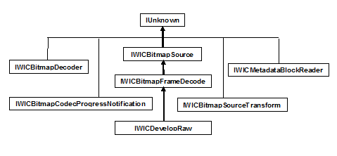

# Decoder Interfaces

The following tables show the interfaces implemented by Windows Imaging Component (WIC) decoders, and the class diagram shows the inheritance hierarchy.

Container-Level Decoder Interfaces

| Interface                                                                                       | Responsibilities                             | Implementation                                                             |
|-------------------------------------------------------------------------------------------------|----------------------------------------------|----------------------------------------------------------------------------|
| [IWICBitmapDecoder](-wic-imp-iwicbitmapdecoder.md)                                             | Container-level services                     | Required                                                                   |
| [IWICBitmapCodecProgressNotification](-wic-imp-iwicbitmapcodecprogressnotification-decoder.md) | Progress notification & cancellation support | Recommended                                                                |
| [IWICMetadataBlockReader](-wic-imp-iwicmetadatablockreader.md)                                 | Metadata enumeration                         | Optional (Required only for formats that support container-level metadata) |

 

Frame-Level Decoder Interfaces

| Interface                                                           | Responsibilities          | Implementation                |
|---------------------------------------------------------------------|---------------------------|-------------------------------|
| [IWICBitmapFrameDecode](-wic-imp-iwicbitmapframedecode.md)         | Frame-level services      | Required                      |
| [IWICMetadataBlockReader](-wic-imp-iwicmetadatablockreader.md)     | Metadata enumeration      | Required                      |
| [IWICBitmapSourceTransform](-wic-imp-iwicbitmapsourcetransform.md) | Native decoder transforms | Recommended                   |
| [IWICDevelopRaw](-wic-imp-iwicdevelopraw.md)                       | Raw processing services   | Required for Raw formats only |

 

## Related topics

<dl> <dt>

**Conceptual**
</dt> <dt>

[Implementing a WIC-Enabled Decoder](-wic-implementingwicdecoder.md)
</dt> <dt>

[Implementing IWICBitmapDecoder](-wic-imp-iwicbitmapdecoder.md)
</dt> <dt>

[How to Write a WIC-Enabled CODEC](-wic-howtowriteacodec.md)
</dt> <dt>

[Windows Imaging Component Overview](-wic-about-windows-imaging-codec.md)
</dt> </dl>

 

 

