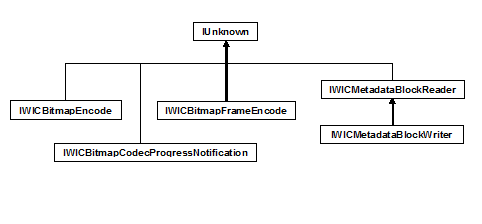

# Encoder Interfaces

The following tables show the interfaces implemented by Windows Imaging Component (WIC) encoders, and the class diagram shows the inheritance hierarchy.

Container-Level Encoder Interfaces

| Interface                                                                                       | Responsibilities                             | Implementation                                                             |
|-------------------------------------------------------------------------------------------------|----------------------------------------------|----------------------------------------------------------------------------|
| [IWICBitmapEncoder](-wic-imp-iwicbitmapencoder.md)                                             | Container-level services                     | Required                                                                   |
| [IWICBitmapCodecProgressNotification](-wic-imp-iwicbitmapcodecprogressnotification-encoder.md) | Progress notification & cancellation support | Recommended                                                                |
| [IWICMetadataBlockWriter](-wic-imp-iwicmetadatablockwriter.md)                                 | Metadata serialization services              | Optional (Required only for formats that support container-level metadata) |

 

Frame-Level Encoder Interfaces

| Interface                                                       | Responsibilities                | Implementation |
|-----------------------------------------------------------------|---------------------------------|----------------|
| [IWICBitmapFrameEncode](-wic-imp-iwicbitmapframeencode.md)     | Frame-level services            | Required       |
| [IWICMetadataBlockWriter](-wic-imp-iwicmetadatablockwriter.md) | Metadata serialization services | Required       |

 

You'll notice that the encoder interfaces are almost mirror images of the decoder interfaces, and that most of the methods on these interfaces correspond to methods on the related decoder interfaces. Now that you're familiar with the implementation of a WIC-enabled decoder, the implementation of a WIC-enabled encoder will seem familiar as well.

## Related topics

<dl> <dt>

**Conceptual**
</dt> <dt>

[Implementing a WIC-Enabled Encoder](-wic-implementingwicencoder.md)
</dt> <dt>

[Implementing IWICBitmapEncoder](-wic-imp-iwicbitmapencoder.md)
</dt> <dt>

[How to Write a WIC-Enabled CODEC](-wic-howtowriteacodec.md)
</dt> <dt>

[Windows Imaging Component Overview](-wic-about-windows-imaging-codec.md)
</dt> </dl>

 

 

