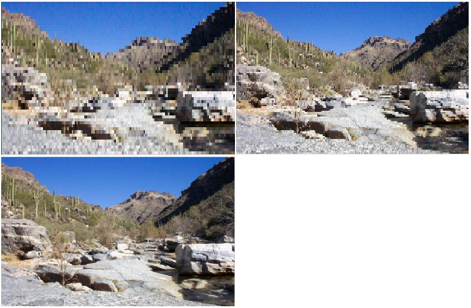

# Progressive Decoding Overview

This topic introduces progressive decoding and how to use progressive decoding in applications. It also provides guidelines for creating codecs that support progressive decoding.

This topic contains the following sections.

-   [Introduction](#introduction)
-   [What is Progressive Decoding?](#what-is-progressive-decoding)
-   [Progressive Decoding Support in Windows 7](#progressive-decoding-support-in-windows-7)
-   [JPEG Progressive Decoding](#jpeg-progressive-decoding)
-   [PNG/GIF Progressive Decoding](#pnggif-progressive-decoding)
    -   [PNG Progressive Decoding](#png-progressive-decoding)
    -   [GIF Progressive Decoding](#gif-progressive-decoding)
-   [Progressive Decoding in Applications](#progressive-decoding-in-applications)
-   [Custom Codec Support for Progressive Decoding](#custom-codec-support-for-progressive-decoding)
-   [Related topics](#related-topics)

## Introduction

Progressive decoding provides the ability to incrementally decode and render portions of an image before the entire image has finished downloading. This feature greatly improves the user's experience when viewing images from the Internet, because the user does not have to wait for the entire image to download before decoding can begin. Users are able to see an image preview with available data long before the entire image is downloaded. This feature is essential for any application used to view images from the Internet or from data sources with limited bandwidth.

The Windows Imaging Component (WIC) in Windows 7 supports progressive decoding of popular image formats such as JPEG, PNG, and GIF. WIC also supports any WIC-enabled non-Microsoft codecs that implement progressive decoding. Progressive encoding is not supported in the current release of WIC. This topic outlines progressive decoding in Windows 7 and the procedure for enabling progressive decoding in your applications.

## What is Progressive Decoding?

Progressive decoding is the ability to incrementally decode portions of an image from an incomplete image file. Traditional decoding requires a complete image file before decoding can begin. Progressive decoding starts after a progressive level of an image has finished downloading. The decoder performs a decoding pass on the image's current progressive level. It then performs multiple decoding passes on the image as each progressive level is downloaded. Each decoding pass reveals more of the image until the image is fully downloaded and decoded. The number of passes required to decode a full image depends on the image file format and the encoding process used to create the image.

Images must be specifically encoded to implement progressive decoding, but not all image formats support it. The following list summarizes the requirements for using progressive decoding.

-   The image file must support progressive decoding. Most image formats do not support progressive decoding, although the popular image formats JPEG, PNG, and GIF do.
-   The image file must be encoded as a progressive image. Image files that were not created with the progressive image encoding cannot implement progressive decoding, even where the file format would otherwise support it.
-   A codec that supports progressive decoding must be available. If a codec does not support progressive decoding, an image encoded as a progressive image will be decoded as a traditional image.

## Progressive Decoding Support in Windows 7

Windows 7 provides built-in codecs that support progressive decoding for JPEG, PNG, and GIF image formats. Each of these Windows 7 codecs perform multiple decoding passes on an image. Each pass corresponds to a particular level and portion of the image that is decoded, eventually leading to a fully decoded image.

Each image format handles progressive decoding in a different manner. The following table provides information about the number of progressive levels and the decoding method supported by the Windows 7 progressive decoding formats. 

| Image Format | Number of progressive levels supported | Progressive decoding method |
|--------------|----------------------------------------|-----------------------------|
| JPEG         | Defined by Image                       | Increasing resolution       |
| PNG          | 7                                      | Interlacing                 |
| GIF          | 4                                      | Interlacing                 |


 

In addition, progressive decoding can be implemented in codecs by providing support for progressive interfaces and methods. If progressive decoding is not supported in a codec, then appropriate error messages should be returned if these methods are called.

## JPEG Progressive Decoding

JPEG progressive decoding presents image data at increasingly higher resolutions for each level, until the full-resolution image is available. Each level of the image is set to provide a different resolution level. As more progressive levels become available, the image is displayed at higher resolutions, until the full resolution image is resolved.

The number of available levels and the resolution set at each level depends entirely on the encoded JPEG. The following two images show an example of JPEG progressive decoding at two progressive levels.


The image on the left is decoded at progressive level 0. The image on right is fully decoded after five progressive levels.

## PNG/GIF Progressive Decoding

Both PNG and GIF progressive decoding use an interlaced progressive decoding method. The decoding process for both formats is very similar.

### PNG Progressive Decoding

PNG image files provide seven progressive levels for decoding, as described in the PNG specification. PNG progressive decoding is implemented by decoding a specified pattern of pixels on each pass of the decoder. The pattern in the following table from the PNG specification is replicated over the entire image. Each number represents the progressive level in which the corresponding pixel will be decoded.


|     |     |     |     |     |     |     |     |
|-----|-----|-----|-----|-----|-----|-----|-----|
| 1   | 6   | 4   | 6   | 2   | 6   | 4   | 6   |
| 7   | 7   | 7   | 7   | 7   | 7   | 7   | 7   |
| 5   | 6   | 5   | 6   | 5   | 6   | 5   | 6   |
| 7   | 7   | 7   | 7   | 7   | 7   | 7   | 7   |
| 3   | 6   | 4   | 6   | 3   | 6   | 4   | 6   |
| 7   | 7   | 7   | 7   | 7   | 7   | 7   | 7   |
| 5   | 6   | 5   | 6   | 5   | 6   | 5   | 6   |
| 7   | 7   | 7   | 7   | 7   | 7   | 7   | 7   |


 

From the table above, you can determine the pixels that will be decoded with each pass of the decoder. Unlike the Windows 7 GIF codec, the Windows 7 PNG codec replicates the left-most available pixel on a scan line to populate empty pixels.

The following images show an example of the Windows 7 PNG progressive decoding codec at three progressive levels.



The image at the top left shows a PNG image decoded at progressive level 0. The top-right image shows the same PNG image decoded at progressive level 3. The bottom image shows the same image fully decoded after 7 progressive levels.

### GIF Progressive Decoding

GIF image files provide four progressive levels for decoding, as described in the GIF specification. Each pass populates certain rows within an image, producing a full image after the fourth pass. The following table from the GIF specification shows which scan lines are decoded by each pass of the decoder. 

| Level number/ pass number | Scan lines populated   | Starting scan line |
|---------------------------|------------------------|--------------------|
| 1                         | Every eighth scan line | 0                  |
| 2                         | Every eighth scan line | 4                  |
| 3                         | Every fourth scan line | 2                  |
| 4                         | Every second scan line | 1                  |


 

Although codecs can specify the content of empty pixels at any particular level, the Windows GIF codec populates empty scan lines by replicating populated scan lines above the empty scan line.

## Progressive Decoding in Applications

The main progressive decoding interface is the [**IWICProgressiveLevelControl**](/windows/desktop/api/Wincodec/nn-wincodec-iwicprogressivelevelcontrol) interface. To obtain a reference to the interface, query an image frame ([**IWICBitmapFrameDecode**](/windows/desktop/api/Wincodec/nn-wincodec-iwicbitmapframedecode)) for **IWICProgressiveLevelControl**. Progressive methods can then be accessed from the interface.

The code below provides an example for using progressive decoding in applications.


```
IWICProgressiveLevelControl *pProgressive = NULL;

HRESULT hr = (pBitmapFrame->QueryInterface(
   IID_IWICProgressiveLevelControl, 
   (void**) &pProgressive));
                
if (SUCCEEDED(hr))
{
   for (UINT uCurrentLevel = 0; SUCCEEDED(hr); uCurrentLevel++)
   {
      hr = pProgressive->SetCurrentLevel(uCurrentLevel);
               if (WINCODEC_ERR_INVALIDPROGRESSIVELEVEL == hr)
      {
         // No more levels
         break;
      }

      if (SUCCEEDED(hr))
      {
         // Output the current level
         hr = pBitmapFrame->CopyPixels(...);
      }                      
   }
}

if (pProgressive)
{
   pProgressive->Release();
}
```


The preceding code provides the basic functionality necessary for implementing progressive decoding in most applications. Using the code, progressive levels can be accessed as image pixel data becomes available. The [**SetCurrentLevel**](/windows/desktop/api/Wincodec/nf-wincodec-iwicprogressivelevelcontrol-setcurrentlevel) function blocks execution until the level being requested is available.

## Custom Codec Support for Progressive Decoding

Codec developers may choose to implement the [**IWICProgressiveLevelControl**](/windows/desktop/api/Wincodec/nn-wincodec-iwicprogressivelevelcontrol) if their image formats support progressive decoding. Support for progressive decoding is not a requirement for discovery and arbitration by WIC. However, progressive decoding greatly enhances the user experience, and implementation should be considered if possible.

## Related topics

<dl> <dt>

**Conceptual**
</dt> <dt>

[Windows Imaging Component Overview](-wic-about-windows-imaging-codec.md)
</dt> <dt>

**Other Resources**
</dt> <dt>

[Digital Compression and Coding of Continuous-Tone Still Images - Requirements and Guidelines](https://www.w3.org/Graphics/JPEG/itu-t81.pdf)
</dt> <dt>

[JPEG File Interchange Format](https://www.w3.org/Graphics/JPEG/jfif3.pdf)
</dt> <dt>

[GIF89a Specification](https://www.w3.org/Graphics/GIF/spec-gif89a.txt)
</dt> <dt>

[Portable Network Graphics (PNG) Specification and Extensions](http://www.libpng.org/pub/png/spec/)
</dt> </dl>

 

 


