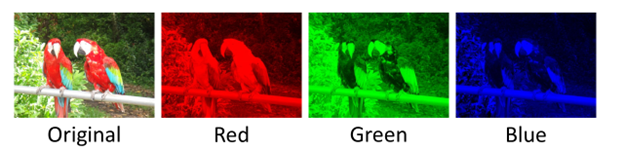
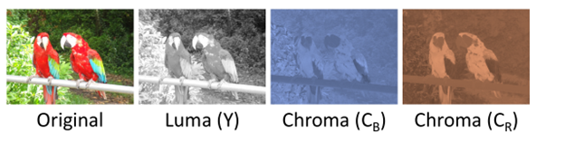
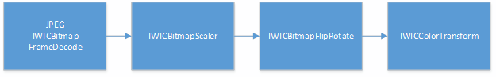

# JPEG YCbCr Support

Starting with Windows 8.1, the [Windows Imaging Component (WIC)](-wic-about-windows-imaging-codec.md) JPEG codec supports reading and writing image data in its native YC<sub>b</sub>C<sub>r</sub> form. WIC YC<sub>b</sub>C<sub>r</sub> support can be used in conjunction with [Direct2D](../direct2d/direct2d-portal.md) to render YC<sub>b</sub>C<sub>r</sub> pixel data with an image effect. In addition, the WIC JPEG codec can consume YC<sub>b</sub>C<sub>r</sub> pixel data produced by certain camera drivers via Media Foundation.

YC<sub>b</sub>C<sub>r</sub> pixel data consumes significantly less memory than standard BGRA pixel formats. In addition, accessing YC<sub>b</sub>C<sub>r</sub> data allows you to offload some stages of the JPEG decode/encode pipeline to Direct2D which is GPU accelerated. By using YC<sub>b</sub>C<sub>r</sub>, your app can reduce JPEG memory consumption and load times for the same size and quality images. Or, your app can use more, higher resolution JPEG images without suffering from performance penalties.

This topic describes how YC<sub>b</sub>C<sub>r</sub> data works and how to use it in WIC and Direct2D.

-   [About JPEG YC<sub>b</sub>C<sub>r</sub> Data](#about-jpeg-ycbcr-data)
    -   [YC<sub>b</sub>C<sub>r</sub> Color Model](#ycbcr-color-model)
    -   [Planar Versus Interleaved Memory Layouts](#planar-versus-interleaved-memory-layouts)
    -   [Chroma Subsampling](#chroma-subsampling)
    -   [JPEG Usage of YC<sub>b</sub>C<sub>r</sub>](#jpeg-usage-of-ycbcr)
-   [Using JPEG YC<sub>b</sub>C<sub>r</sub> Data](#using-jpeg-ycbcr-data)
    -   [Using YC<sub>b</sub>C<sub>r</sub> JPEG images](#using-ycbcr-jpeg-images)
    -   [Windows Imaging Component APIs](#windows-imaging-component-apis)
    -   [Direct2D APIs](#direct2d-apis)
    -   [Determining if the YC<sub>b</sub>C<sub>r</sub> Configuration is Supported](#determining-if-the-ycbcr-configuration-is-supported)
    -   [Decoding YC<sub>b</sub>C<sub>r</sub> Pixel Data](#decoding-ycbcr-pixel-data)
    -   [Transforming YC<sub>b</sub>C<sub>r</sub> Pixel Data](#transforming-ycbcr-pixel-data)
    -   [Encoding YC<sub>b</sub>C<sub>r</sub> Pixel Data](#encoding-ycbcr-pixel-data)
    -   [Decoding YC<sub>b</sub>C<sub>r</sub> pixel data in Windows 10](#decoding-ycbcr-pixel-data-in-windows-10)
-   [Related topics](#related-topics)

## About JPEG YC<sub>b</sub>C<sub>r</sub> Data

This section explains some key concepts necessary to understand how YC<sub>b</sub>C<sub>r</sub> support in WIC works and its key benefits.

### YC<sub>b</sub>C<sub>r</sub> Color Model

WIC in Windows 8 and earlier supports four different [color models](-wic-codec-native-pixel-formats.md), the most common of which is RGB/BGR. This color model defines color data using red, green and blue components; a fourth alpha component may also be used.

Here is an image decomposed into its red, green and blue components.



YC<sub>b</sub>C<sub>r</sub> is an alternate color model that defines color data using a luminance component (Y) and two chrominance components (C<sub>b</sub> and C<sub>r</sub>). It is commonly used in digital imaging and video scenarios. The term YC<sub>b</sub>C<sub>r</sub> is often used interchangeably with YUV, although the two are technically distinct.

There are several variations of YC<sub>b</sub>C<sub>r</sub> which differ in color space and dynamic range definitions – WIC specifically supports JPEG JFIF YC<sub>b</sub>C<sub>r</sub> data. For more information, refer to the [JPEG ITU-T81 specification](https://www.w3.org/Graphics/JPEG/itu-t81.pdf).

Here is an image decomposed into its Y, C<sub>b</sub>, and C<sub>r</sub> components.



### Planar Versus Interleaved Memory Layouts

This section describes some differences between accessing and storing RGB pixel data in memory versus YC<sub>b</sub>C<sub>r</sub> data.

RGB pixel data is typically stored using an interleaved memory layout. This means that data for a single color component is interleaved between pixels, and each pixel is stored contiguously in memory.

Here is a figure showing RGBA pixel data stored in an interleaved memory layout.


YC<sub>b</sub>C<sub>r</sub> data is typically stored using a planar memory layout. This means that each color component is stored separately in its own contiguous plane, for a total of three planes. In another common configuration, the C<sub>b</sub> and C<sub>r</sub> components are interleaved and stored together, while the Y component remains in its own plane, for a total of two planes.

Here is a figure showing planar Y and interleaved C<sub>b</sub>C<sub>r</sub> pixel data, a common YC<sub>b</sub>C<sub>r</sub> memory layout.


In both WIC and Direct2D, each color plane is treated as its own distinct object (either an [IWICBitmapSource](-wic-imp-iwicbitmapsource.md) or [**ID2D1Bitmap**](/windows/win32/api/d2d1/nn-d2d1-id2d1bitmap)), and collectively these planes form the backing data for a YC<sub>b</sub>C<sub>r</sub> image.

While WIC supports accessing YC<sub>b</sub>C<sub>r</sub> data in both the 2 and 3 plane configurations, Direct2D only supports the former (Y and C<sub>b</sub>C<sub>r</sub>). Therefore, when using WIC and Direct2D together you should always use the 2 plane YC<sub>b</sub>C<sub>r</sub> configuration.

### Chroma Subsampling

The YC<sub>b</sub>C<sub>r</sub> color model is well suited for digital imaging scenarios because it can take advantage of certain aspects of the human visual system. In particular, humans are more sensitive to changes in the luminance (brightness) of an image and less sensitive to chrominance (color). By splitting the color data into separate luminance and chrominance components, we can selectively compress just the chrominance components to achieve space savings with a minimal loss in quality.

One technique for doing this is called chroma subsampling. The C<sub>b</sub> and C<sub>r</sub> planes are subsampled (downscaled) in one or both of the horizontal and vertical dimensions. For historical reasons, each chroma subsampling mode is commonly referred to using a three part J:a:b ratio.


| Subsampling mode | Horizontal downscale | Vertical downscale | Bits per pixel\* |
|------------------|----------------------|--------------------|------------------|
| 4:4:4            | 1x                   | 1x                 | 24               |
| 4:2:2            | 2x                   | 1x                 | 16               |
| 4:4:0            | 1x                   | 2x                 | 16               |
| 4:2:0            | 2x                   | 2x                 | 12               |


 

\* Includes Y data.

From the above table, if you use YC<sub>b</sub>C<sub>r</sub> to store uncompressed image data you can achieve a memory savings of 25% to 62.5% versus 32 bit per pixel RGBA data, depending on which chroma subsampling mode is used.

### JPEG Usage of YC<sub>b</sub>C<sub>r</sub>

At a high level, the JPEG decompression pipeline consists of the following stages:

1.  Perform entropy (e.g. Huffman) decompression
2.  Perform dequantization
3.  Perform inverse discrete cosine transform
4.  Perform chroma upsampling on C<sub>b</sub>C<sub>r</sub> data
5.  Convert YC<sub>b</sub>C<sub>r</sub> data to RGBA (if needed)

By having the JPEG codec produce YC<sub>b</sub>C<sub>r</sub> data, we can avoid the final two steps of the decode process, or defer them to the GPU. In addition to the memory savings listed in the previous section, this significantly reduces overall time needed to decode the image. The same savings apply when encoding YC<sub>b</sub>C<sub>r</sub> data.

## Using JPEG YC<sub>b</sub>C<sub>r</sub> Data

This section explains how to use WIC and Direct2D to operate on YC<sub>b</sub>C<sub>r</sub> data.

To see the guidance from this document used in practice, see the [JPEG YCbCr optimizations in Direct2D and WIC sample](https://github.com/microsoftarchive/msdn-code-gallery-microsoft/tree/master/Official%20Windows%20Platform%20Sample/JPEG%20YCbCr%20optimizations%20in%20Direct2D%20and%20WIC%20sample) which demonstrates all of the steps needed to decode and render YC<sub>b</sub>C<sub>r</sub> content in a Direct2D app.

### Using YC<sub>b</sub>C<sub>r</sub> JPEG images

The vast majority of JPEG images are stored as YC<sub>b</sub>C<sub>r</sub>. Some JPEGs contain CMYK or grayscale data and do not use YC<sub>b</sub>C<sub>r</sub>. This means that you typically, but not always, can directly use pre-existing JPEG content without any modifications.

WIC and Direct2D do not support every possible YC<sub>b</sub>C<sub>r</sub> configuration, and YC<sub>b</sub>C<sub>r</sub> support in Direct2D is dependent upon the underlying graphics hardware and driver. Because of this, a general purpose imaging pipeline needs to be robust to images that do not use YC<sub>b</sub>C<sub>r</sub> (including other common image formats such as PNG or BMP) or to cases where YC<sub>b</sub>C<sub>r</sub> support is not available. We recommend that you keep your existing BGRA based imaging pipeline and enable YC<sub>b</sub>C<sub>r</sub> as a performance optimization when available.

### Windows Imaging Component APIs

WIC in Windows 8.1 adds three new interfaces to provide access to JPEG YC<sub>b</sub>C<sub>r</sub> data.

### IWICPlanarBitmapSourceTransform

[**IWICPlanarBitmapSourceTransform**](/windows/desktop/api/Wincodec/nn-wincodec-iwicplanarbitmapsourcetransform) is analogous to [**IWICBitmapSourceTransform**](/windows/desktop/api/Wincodec/nn-wincodec-iwicbitmapsourcetransform), except that it produces pixels in a planar configuration, including YC<sub>b</sub>C<sub>r</sub> data. You can obtain this interface by calling QueryInterface on an implementation of [**IWICBitmapSource**](/windows/desktop/api/Wincodec/nn-wincodec-iwicbitmapsource) that supports planar access. This includes the JPEG codec’s implementation of [**IWICBitmapFrameDecode**](/windows/desktop/api/Wincodec/nn-wincodec-iwicbitmapframedecode) as well as [**IWICBitmapScaler**](/windows/desktop/api/Wincodec/nn-wincodec-iwicbitmapscaler), [**IWICBitmapFlipRotator**](/windows/desktop/api/Wincodec/nn-wincodec-iwicbitmapfliprotator), and [**IWICColorTransform**](/windows/desktop/api/Wincodec/nn-wincodec-iwiccolortransform).

### IWICPlanarBitmapFrameEncode

[**IWICPlanarBitmapFrameEncode**](/windows/desktop/api/Wincodec/nn-wincodec-iwicplanarbitmapframeencode) provides the ability to encode planar pixel data, including YC<sub>b</sub>C<sub>r</sub> data. You can obtain this interface by calling QueryInterface on the JPEG codec’s implementation of [**IWICBitmapFrameEncode**](/windows/desktop/api/Wincodec/nn-wincodec-iwicbitmapframeencode).

### IWICPlanarFormatConverter

[**IWICPlanarFormatConverter**](/windows/desktop/api/Wincodec/nn-wincodec-iwicplanarformatconverter) allows [**IWICFormatConverter**](/windows/desktop/api/Wincodec/nn-wincodec-iwicformatconverter) to consume planar pixel data, including YC<sub>b</sub>C<sub>r</sub>, and convert it to an interleaved pixel format. It does not expose the ability to convert interleaved pixel data to a planar format. You can obtain this interface by calling QueryInterface on the Windows provided implementation of **IWICFormatConverter**.

### Direct2D APIs

Direct2D in Windows 8.1 supports YC<sub>b</sub>C<sub>r</sub> planar pixel data with the new YC<sub>b</sub>C<sub>r</sub> image effect . This effect provides the ability to render YC<sub>b</sub>C<sub>r</sub> data. The effect takes as input two [**ID2D1Bitmap**](/windows/win32/api/d2d1/nn-d2d1-id2d1bitmap) interfaces: one containing planar Y data in the DXGI\_FORMAT\_R8\_UNORM format, and one containing interleaved CbCr data in the DXGI\_FORMAT\_R8G8\_UNORM format. You typically use this effect in place of the **ID2D1Bitmap** that would have contained BGRA pixel data.

The YC<sub>b</sub>C<sub>r</sub> image effect is intended to be used in conjunction with the WIC YC<sub>b</sub>C<sub>r</sub> APIs which provide the YC<sub>b</sub>C<sub>r</sub> data. This effectively acts to offload some of the decode work from the CPU to the GPU, where it can be processed much quicker and in parallel.

### Determining if the YC<sub>b</sub>C<sub>r</sub> Configuration is Supported

As noted before, your app should be robust to cases where YC<sub>b</sub>C<sub>r</sub> support is not available. This section discusses the conditions that your app should check for. If any of the following checks fail, your app should fall back to a standard BGRA-based pipeline.

### Does the WIC component support YC<sub>b</sub>C<sub>r</sub> data access?

Only the Windows provided JPEG codec and certain WIC transforms support YC<sub>b</sub>C<sub>r</sub> data access. For a complete list, refer to the [Windows Imaging Component APIs](#windows-imaging-component-apis) section.

To obtain one of the planar YC<sub>b</sub>C<sub>r</sub> interfaces, call QueryInterface on the original interface. This will fail if the component does not support YC<sub>b</sub>C<sub>r</sub> data access.

### Is the requested WIC transform supported for YC<sub>b</sub>C<sub>r</sub>?

After obtaining an [**IWICPlanarBitmapSourceTransform**](/windows/desktop/api/Wincodec/nn-wincodec-iwicplanarbitmapsourcetransform), you should first call [**DoesSupportTransform**](/windows/desktop/api/Wincodec/nf-wincodec-iwicplanarbitmapsourcetransform-doessupporttransform). This method takes as input parameters the complete set of transforms that you want to be applied to the planar YC<sub>b</sub>C<sub>r</sub> data, and returns a Boolean indicating support, as well as the closest dimensions to the requested size that can be returned. You should check all three values before accessing the pixel data with [**IWICPlanarBitmapSourceTransform::CopyPixels**](/windows/desktop/api/Wincodec/nf-wincodec-iwicplanarbitmapsourcetransform-copypixels).

This pattern is similar to how [**IWICBitmapSourceTransform**](/windows/desktop/api/Wincodec/nn-wincodec-iwicbitmapsourcetransform) is used.

### Does the graphics driver support the features necessary to use YC<sub>b</sub>C<sub>r</sub> with Direct2D?

This check is only necessary if you are using the Direct2D YC<sub>b</sub>C<sub>r</sub> effect to render YC<sub>b</sub>C<sub>r</sub> content. Direct2D stores YC<sub>b</sub>C<sub>r</sub> data using the DXGI\_FORMAT\_R8\_UNORM and DXGI\_FORMAT\_R8G8\_UNORM pixel formats, which are not available from all graphics drivers.

Before using the YC<sub>b</sub>C<sub>r</sub> image effect, you should call [**ID2D1DeviceContext::IsDxgiFormatSupported**](/windows/win32/api/d2d1_1/nf-d2d1_1-id2d1devicecontext-isdxgiformatsupported) to ensure that both formats are supported by the driver.

### Sample code

Below is a code example demonstrating the recommended checks. This example was taken from the [JPEG YCbCr optimizations in Direct2D and WIC sample](https://github.com/microsoftarchive/msdn-code-gallery-microsoft/tree/master/Official%20Windows%20Platform%20Sample/JPEG%20YCbCr%20optimizations%20in%20Direct2D%20and%20WIC%20sample).


```C++
bool DirectXSampleRenderer::DoesWicSupportRequestedYCbCr()
{
    ComPtr<IWICPlanarBitmapSourceTransform> wicPlanarSource;
    HRESULT hr = m_wicScaler.As(&wicPlanarSource);
    if (SUCCEEDED(hr))
    {
        BOOL isTransformSupported;
        uint32 supportedWidth = m_cachedBitmapPixelWidth;
        uint32 supportedHeight = m_cachedBitmapPixelHeight;
        DX::ThrowIfFailed(
            wicPlanarSource->DoesSupportTransform(
                &supportedWidth,
                &supportedHeight,
                WICBitmapTransformRotate0,
                WICPlanarOptionsDefault,
                SampleConstants::WicYCbCrFormats,
                m_planeDescriptions,
                SampleConstants::NumPlanes,
                &isTransformSupported
                )
            );

        // The returned width and height may be larger if IWICPlanarBitmapSourceTransform does not
        // exactly support what is requested.
        if ((isTransformSupported == TRUE) &&
            (supportedWidth == m_cachedBitmapPixelWidth) &&
            (supportedHeight == m_cachedBitmapPixelHeight))
        {
            return true;
        }
    }

    return false;
}

bool DirectXSampleRenderer::DoesDriverSupportYCbCr()
{
    auto d2dContext = m_deviceResources->GetD2DDeviceContext();

    return (d2dContext->IsDxgiFormatSupported(DXGI_FORMAT_R8_UNORM)) &&
        (d2dContext->IsDxgiFormatSupported(DXGI_FORMAT_R8G8_UNORM));
}
```


### Decoding YC<sub>b</sub>C<sub>r</sub> Pixel Data

If you want to obtain YC<sub>b</sub>C<sub>r</sub> pixel data you should call [**IWICPlanarBitmapSourceTransform::CopyPixels**](/windows/desktop/api/Wincodec/nf-wincodec-iwicplanarbitmapsourcetransform-copypixels). This method copies pixel data into an array of filled-out [**WICBitmapPlane**](/windows/desktop/api/Wincodec/ns-wincodec-wicbitmapplane) structures, one for each plane of data you want (for example, Y and C<sub>b</sub>C<sub>r</sub>). A **WICBitmapPlane** contains info about the pixel data and points to the memory buffer that will receive the data.

If you want to use the YC<sub>b</sub>C<sub>r</sub> pixel data with other WIC APIs you should create an appropriately configured [**IWICBitmap**](/windows/desktop/api/Wincodec/nn-wincodec-iwicbitmap), call [**Lock**](/windows/desktop/api/Wincodec/nf-wincodec-iwicbitmap-lock) to obtain the underlying memory buffer, and associate the buffer with the [**WICBitmapPlane**](/windows/desktop/api/Wincodec/ns-wincodec-wicbitmapplane) used to receive the YC<sub>b</sub>C<sub>r</sub> pixel data. You can then use the [IWICBitmap](-wic-imp-iwicbitmapdecoder.md) normally.

Finally, if you want to render the YC<sub>b</sub>C<sub>r</sub> data in Direct2D, you should create an [**ID2D1Bitmap**](/windows/win32/api/d2d1/nn-d2d1-id2d1bitmap) from each [**IWICBitmap**](/windows/desktop/api/Wincodec/nn-wincodec-iwicbitmap) and use them as source for the YC<sub>b</sub>C<sub>r</sub> image effect. WIC allows you to request multiple planar configurations. When interoperating with Direct2D you should request two planes, one using GUID\_WICPixelFormat8bppY and the other using GUID\_WICPixelFormat16bppCbCr, as this is the configuration expected by Direct2D.

### Code Sample

Below is a code example demonstrating the steps to decode and render YC<sub>b</sub>C<sub>r</sub> data in Direct2D. This example was taken from the [JPEG YCbCr optimizations in Direct2D and WIC sample](https://github.com/microsoftarchive/msdn-code-gallery-microsoft/tree/master/Official%20Windows%20Platform%20Sample/JPEG%20YCbCr%20optimizations%20in%20Direct2D%20and%20WIC%20sample).


```C++
void DirectXSampleRenderer::CreateYCbCrDeviceResources()
{
    auto wicFactory = m_deviceResources->GetWicImagingFactory();
    auto d2dContext = m_deviceResources->GetD2DDeviceContext();

    ComPtr<IWICPlanarBitmapSourceTransform> wicPlanarSource;
    DX::ThrowIfFailed(
        m_wicScaler.As(&wicPlanarSource)
        );

    ComPtr<IWICBitmap> bitmaps[SampleConstants::NumPlanes];
    ComPtr<IWICBitmapLock> locks[SampleConstants::NumPlanes];
    WICBitmapPlane planes[SampleConstants::NumPlanes];

    for (uint32 i = 0; i < SampleConstants::NumPlanes; i++)
    {
        DX::ThrowIfFailed(
            wicFactory->CreateBitmap(
                m_planeDescriptions[i].Width,
                m_planeDescriptions[i].Height,
                m_planeDescriptions[i].Format,
                WICBitmapCacheOnLoad,
                &bitmaps[i]
                )
            );

        LockBitmap(bitmaps[i].Get(), WICBitmapLockWrite, nullptr, &locks[i], &planes[i]);
    }

    DX::ThrowIfFailed(
        wicPlanarSource->CopyPixels(
            nullptr, // Copy the entire source region.
            m_cachedBitmapPixelWidth,
            m_cachedBitmapPixelHeight,
            WICBitmapTransformRotate0,
            WICPlanarOptionsDefault,
            planes,
            SampleConstants::NumPlanes
            )
        );

    DX::ThrowIfFailed(d2dContext->CreateEffect(CLSID_D2D1YCbCr, &m_d2dYCbCrEffect));

    ComPtr<ID2D1Bitmap1> d2dBitmaps[SampleConstants::NumPlanes];
    for (uint32 i = 0; i < SampleConstants::NumPlanes; i++)
    {
        // IWICBitmapLock must be released before using the IWICBitmap.
        locks[i] = nullptr;

        // First ID2D1Bitmap1 is DXGI_FORMAT_R8 (Y), second is DXGI_FORMAT_R8G8 (CbCr).
        DX::ThrowIfFailed(d2dContext->CreateBitmapFromWicBitmap(bitmaps[i].Get(), &d2dBitmaps[i]));
        m_d2dYCbCrEffect->SetInput(i, d2dBitmaps[i].Get());
    }
}

void DirectXSampleRenderer::LockBitmap(
    _In_ IWICBitmap *pBitmap,
    DWORD bitmapLockFlags,
    _In_opt_ const WICRect *prcSource,
    _Outptr_ IWICBitmapLock **ppBitmapLock,
    _Out_ WICBitmapPlane *pPlane
    )
{
    // ComPtr guarantees the IWICBitmapLock is released if an exception is thrown.
    ComPtr<IWICBitmapLock> lock;
    DX::ThrowIfFailed(pBitmap->Lock(prcSource, bitmapLockFlags, &lock));
    DX::ThrowIfFailed(lock->GetStride(&pPlane->cbStride));
    DX::ThrowIfFailed(lock->GetDataPointer(&pPlane->cbBufferSize, &pPlane->pbBuffer));
    DX::ThrowIfFailed(lock->GetPixelFormat(&pPlane->Format));
    *ppBitmapLock = lock.Detach();
}
```


### Transforming YC<sub>b</sub>C<sub>r</sub> Pixel Data

Transforming YC<sub>b</sub>C<sub>r</sub> data is nearly identical to decoding, as both involve [**IWICPlanarBitmapSourceTransform**](/windows/desktop/api/Wincodec/nn-wincodec-iwicplanarbitmapsourcetransform). The only difference is which WIC object you obtained the interface from. The Windows provided scaler, flip rotator and color transform all support YC<sub>b</sub>C<sub>r</sub> access.

### Chaining Transforms Together

WIC supports the notion of chaining together multiple transforms. For example, you can create the following WIC pipeline:



You can then call QueryInterface on the [**IWICColorTransform**](/windows/desktop/api/Wincodec/nn-wincodec-iwiccolortransform) to obtain [**IWICPlanarBitmapSourceTransform**](/windows/desktop/api/Wincodec/nn-wincodec-iwicplanarbitmapsourcetransform). The color transform can communicate with the preceding transforms and can expose the aggregate capabilities of every stage in the pipeline. WIC ensures that the YC<sub>b</sub>C<sub>r</sub> data is preserved through the entire process. This chaining only works when using components that support YC<sub>b</sub>C<sub>r</sub> access.

### JPEG Codec Optimizations

Similar to the JPEG frame decode implementation of [**IWICBitmapSourceTransform**](/windows/desktop/api/Wincodec/nn-wincodec-iwicbitmapsourcetransform), the JPEG frame decode implementation of [**IWICPlanarBitmapSourceTransform**](/windows/desktop/api/Wincodec/nn-wincodec-iwicplanarbitmapsourcetransform) supports native JPEG DCT domain scaling and rotation. You can request a power of two downscale or a rotation directly from the JPEG decoder. This typically results in higher quality and performance than using the discrete transforms.

In addition, when you chain one or more WIC transforms after the JPEG decoder, it can leverage native JPEG scaling and rotation to satisfy the aggregate requested operation.

### Format Conversions

Use [**IWICPlanarFormatConverter**](/windows/desktop/api/Wincodec/nn-wincodec-iwicplanarformatconverter) to convert planar YC<sub>b</sub>C<sub>r</sub> pixel data to an interleaved pixel format such as GUID\_WICPixelFormat32bppPBGRA. WIC in Windows 8.1 does not provide the ability to convert to a planar YC<sub>b</sub>C<sub>r</sub> pixel format.

### Encoding YC<sub>b</sub>C<sub>r</sub> Pixel Data

Use [**IWICPlanarBitmapFrameEncode**](/windows/desktop/api/Wincodec/nn-wincodec-iwicplanarbitmapframeencode) to encode YC<sub>b</sub>C<sub>r</sub> pixel data to the JPEG encoder. Encoding YC<sub>b</sub>C<sub>r</sub> data **IWICPlanarBitmapFrameEncode** is similar but not identical to encoding interleaved data using [**IWICBitmapFrameEncode**](/windows/desktop/api/Wincodec/nn-wincodec-iwicbitmapframeencode). The planar interface only exposes the ability to write planar frame image data, and you should continue to use the frame encode interface to set metadata or a thumbnail and to commit at the end of the operation.

For the typical case, you should follow these steps:

1.  Obtain the [**IWICBitmapFrameEncode**](/windows/desktop/api/Wincodec/nn-wincodec-iwicbitmapframeencode) as normal. If you want to configure chroma subsampling, set the [**JpegYCrCbSubsampling**](/windows/desktop/api/Wincodec/ne-wincodec-wicjpegycrcbsubsamplingoption) encoder option when creating the frame.
2.  If you need to set metadata or a thumbnail, do this using [**IWICBitmapFrameEncode**](/windows/desktop/api/Wincodec/nn-wincodec-iwicbitmapframeencode) as normal.
3.  QueryInterface for the [**IWICPlanarBitmapFrameEncode**](/windows/desktop/api/Wincodec/nn-wincodec-iwicplanarbitmapframeencode).
4.  Set the YC<sub>b</sub>C<sub>r</sub> pixel data using [**IWICPlanarBitmapFrameEncode::WriteSource**](/windows/desktop/api/Wincodec/nf-wincodec-iwicplanarbitmapframeencode-writesource) or [**IWICPlanarBitmapFrameEncode::WritePixels**](/windows/desktop/api/Wincodec/nf-wincodec-iwicplanarbitmapframeencode-writepixels). Unlike with their [**IWICBitmapFrameEncode**](/windows/desktop/api/Wincodec/nn-wincodec-iwicbitmapframeencode) counterparts, you provide these methods with an array of [**IWICBitmapSource**](/windows/desktop/api/Wincodec/nn-wincodec-iwicbitmapsource) or [**WICBitmapPlane**](/windows/desktop/api/Wincodec/ns-wincodec-wicbitmapplane) which contain the YC<sub>b</sub>C<sub>r</sub> pixel planes.
5.  When you are finished, call [**IWICBitmapFrameEncode::Commit**](/windows/desktop/api/Wincodec/nf-wincodec-iwicbitmapframeencode-commit).

### Decoding YC<sub>b</sub>C<sub>r</sub> pixel data in Windows 10

Starting in Windows 10 build 1507, Direct2D provides [**ID2D1ImageSourceFromWic**](/windows/win32/api/d2d1_3/nn-d2d1_3-id2d1imagesourcefromwic), a simpler way to decode JPEGs into Direct2D while leveraging YC<sub>b</sub>C<sub>r</sub> optimizations. **ID2D1ImageSourceFromWic** automatically performs all of the necessary YC<sub>b</sub>C<sub>r</sub> capability checks for you; it uses the optimized codepath when possible, and uses a fallback otherwise. It also enables new optimizations such as only caching subregions of the image that are needed at a time.

For more information about using [**ID2D1ImageSourceFromWic**](/windows/win32/api/d2d1_3/nn-d2d1_3-id2d1imagesourcefromwic), refer to the Direct2D Photo Adjustment SDK [sample](https://github.com/Microsoft/Windows-universal-samples/tree/master/Samples/D2DPhotoAdjustment).

## Related topics

* [JPEG YCbCr optimizations in Direct2D and WIC sample](https://github.com/microsoftarchive/msdn-code-gallery-microsoft/tree/master/Official%20Windows%20Platform%20Sample/JPEG%20YCbCr%20optimizations%20in%20Direct2D%20and%20WIC%20sample)
