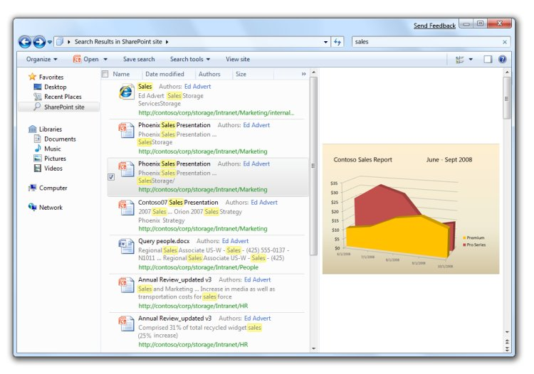

# Federated Search

Windows 7 supports searching for documents beyond the user's own PC. Developers and IT professionals can enable their search engines, document repositories, web applications, and proprietary data stores to be searched from Windows 7 without needing to write and deploy client code. This enables end users to search their corporate intranet or the web as easily as they can search for their local files, all from within the same familiar Windows interface.

Windows 7 compatible *OpenSearch* support can be added by developers and IT professionals to any existing searchable web application by adding *RSS* or *ATOM* output as defined in the public [OpenSearch](http://www.opensearch.org/) standard. *OpenSearch* description files can then be authored by developers and advanced users to define the connection parameters that enable the desktop client to create a Search Connector for the service.

SharePoint Search Server can also query these compatible *OpenSearch* services. This enables access to your search service from the *SharePoint* search center web interface as well.

Windows 7 supports searching for documents beyond the user's own PC, as well as a preview of search results

## Related topics

<dl> <dt>

[Federated Search in Windows]()
</dt> </dl>

 

 