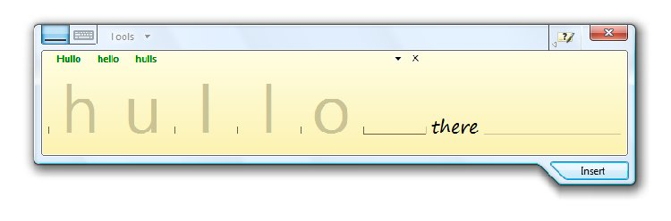
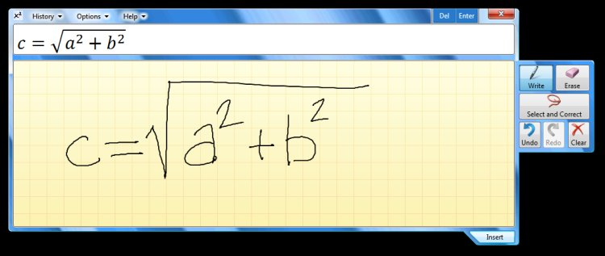

# Handwriting and Ink

With the proliferation of *Tablet PCs* in the market, *Tablet* features are becoming part of mainstream computing. In Windows 7, touch and writing are first-class user experiences. Windows 7 improves the pen experience by providing greater accuracy and speed. Handwriting input is improved and more languages are supported. The Text Input Panel offers predictive text for greater speed of input and correction. Handwriting accuracy is improved through personalization in all languages, custom dictionaries, and breakthroughs in East Asian language recognition. The improved interaction model delivers a better reading experience on the small, high-resolution screens common in portable computers. (See [Programming the Text Input Panel](../tablet/programming-the-text-input-panel.md).)

The Text Input Panel features easy text correction

## Math Recognition

The new Math Recognition feature enables users to enter math into applications by means of handwriting—the most natural and efficient way of entering mathematical expressions. The functionality is provided by two UI components. Math Input Panel is a stand-alone Windows accessory that works with any math-aware application. Math Input Control is integrated into applications through its API.

Underlying the UI components is the Math Recognizer. This engine recognizes handwritten mathematical expression and translates the result into *MathML* format for applications to use. The correction experience has been improved to help users make corrections faster. (See [Programming the Math Input Control](../tablet/programming-the-math-input-control.md).)

Math Recognition enables users to enter math into applications by means of handwriting

## Handwriting with Personalized Custom Dictionary

For many scenarios, good handwriting accuracy requires a dictionary tailored to the domain of use. Windows 7 introduces custom dictionaries, which enable better handwriting recognition for specialized vocabularies. Developers who are writing vertical applications--for example, a medical prescription notepad--can now add specific terms to their application, such as drug names. (See [Developer Enhancements to Windows Touch and Tablet PC](https://www.microsoft.com/whdc/device/input/Touch_tab_enhance.mspx).)

 

 