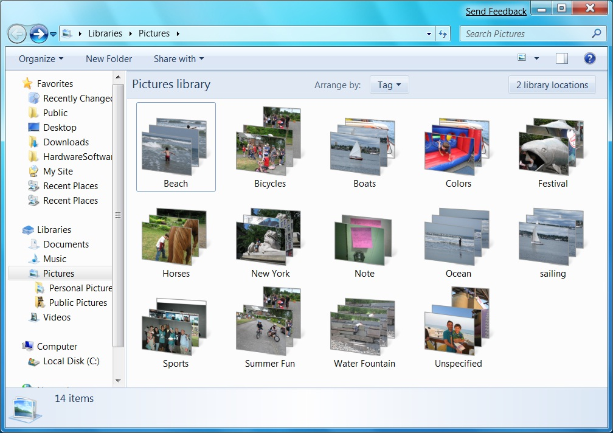

# Managing Files and Data

Users have easier access to files and data in Windows 7. New APIs make files and views more informative, enabling applications to deliver relevant and distinctive information to Windows Explorer. In addition, applications benefit from the new *Libraries* model, a useful, more abstract notion of user storage space than folders, and can also participate in common libraries of similar file types that are shared by different applications.

## Libraries

Windows 7 introduces the concept of *Libraries* as destinations where developers and end-users can find and organize their data as collections of items that can span multiple locations on the local computer as well as on remote computers.

The *Library*APIs provide a straightforward way for developers to create applications that create, interact with, and support *Libraries* as first-class items within applications. *Libraries* can also be selected by using the folder picker dialog box. Applications can enumerate relevant library scopes, or they can use the library directly as a folder. (See [Windows Libraries](/previous-versions/windows/desktop/legacy/dd758096(v=vs.85)) and [Windows 7 Libraries: Developer Resources](https://github.com/microsoft/Windows-classic-samples/tree/master/Samples/Win7Samples/dataaccess)).

*Pictures Library* shows your pictures no matter where they are stored

## File Formats and Data Stores

In Windows 7, Windows Explorer makes file management and manipulation easier for the user in several ways:

-   The preview for your application's file type is more accessible with a new button that lets users show and hide the preview pane.
-   Immersive visual stacks aggregate thumbnail images for file types in a view.
-   Windows Explorer views show useful information based on properties written with your property handler.
-   Document snippets and hit highlighting use your **IFilter** interface implementation to make searching and finding files easier.
-   Context-menu verbs and commands are easier than ever to implement.

By implementing all of the appropriate format handlers for the items returned from your protocol handler, search results from your custom data store can be as rich as search results from files. *Libraries* are automatically created for your protocol handlers so users can scope their searches easily. And the logic for creating *Libraries* can be easily customized through the registry. (See [Developing Filters for Windows Search](../search/-search-3x-wds-extidx-filters.md).)

In Windows 7, Windows Explorer makes file management and manipulation easier

 

 