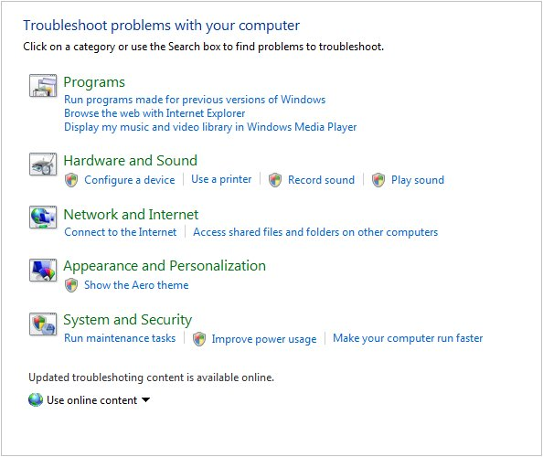

# Performance (Windows 7 Developer Guide)

Windows 7 maximizes hardware energy efficiency and scalability while maintaining high performance. Energy efficiency is improved through reduced background activity and new support for the trigger starting of system services. Windows 7 also offers improvements in the Windows kernel that enable applications and services to scale efficiently between platforms. Performance of many features and APIs is improved in Windows 7 versus Windows Vista. For example, driver performance on servers is optimized by new user-mode and kernel-mode topology APIs. Graphics rendering is considerably smoother and faster. Accessibility performance is also significantly faster than before.

## Building Power-Efficient Applications

Building energy efficient applications that take advantage of the latest power management technologies is a significant challenge developers are facing today. Typically, processor and device manufacturers get all of the attention as their latest offerings are measured and benchmarked. However, a single application can easily prevent the latest generation of hardware from realizing its energy-efficiency potential. For example, a single application that increases the platform timer resolution can decrease battery life by 10 percent.

Extended operation on battery power and the use of energy efficient technologies are key requirements for today's developers. Windows 7 greatly reduces the number of activities that the operating system performs that prevent use of power-saving modes. It also supports the trigger-starting of system services to enable processors to become idle more often and stay idle longer, which decreases power consumption. In addition, Windows 7 takes advantage of the latest energy-efficient hardware, including network adapters, storage devices, and graphics cards.

Windows 7 provides the infrastructure and tools that make it easy for developers to determine the energy impact of their applications. A set of event callbacks enable applications to reduce their activity when the system is on battery power and automatically scale up when the system is on *AC* power. For applications that involve a background process or service, Windows 7 features new infrastructure to automatically enable background tasks when most appropriate in order to maximize energy efficiency. (See [WHDC Performance Central](https://www.microsoft.com/whdc/system/sysperf/default.mspx) and [Power Management in Windows 7 Overview](https://www.climatesaverscomputing.org/wordpress/wp-content/uploads/2011/06/Power_Management_in_Windows_7_Overview.pdf).)

## Service Control Manager

The Windows 7Service Control Manager (SCM) has been extended so that a service can be automatically started and stopped when a specific system event, or trigger, occurs on the system. Trigger-start capabilities remove the need for services to start up automatically at computer startup and then poll or wait for an event to occur, such as device arrival. Common trigger events for services include:

-   Device-class interface arrival: Start a service only when a certain type of device is present or attached on the system.
-   Domain join: Start a service only if the system is joined to a Windows domain.
-   Group policy change: Start a service automatically when group policies are refreshed on the system.
-   IP address arrival: Start a service only when the system is connected to the network.

Software developers can use the predefined trigger types for Windows 7 and the configuration options to enable trigger-start capability. The Windows 7SCM exposes a new set of APIs that enable a service to register for specific custom trigger events. (See [Service Control Manager](../services/service-control-manager.md).)

## Windows Troubleshooting Platform

Windows 7 delivers a comprehensive and extensible Troubleshooting Platform that uses a PowerShell-based mechanism to troubleshoot and resolve problems. The key components of the Troubleshooting Platform include a troubleshooting package, troubleshooting engine, and troubleshooting wizard. The troubleshooting pack is a collection of PowerShell scripts and relevant metadata. The troubleshooting engine launches a PowerShell runtime to execute a troubleshooting pack, and exposes a set of interfaces to control troubleshooting pack execution.

The troubleshooting wizard provides a consistent experience across troubleshooting packs, communicating with the troubleshooting engine to troubleshoot and resolve problems that are specified in a troubleshooting pack. Execution of a troubleshooting pack can also be controlled through a set of PowerShell*commandlets*.

The Troubleshooting Platform seamlessly integrates with the Windows 7PC Solution Center, enabling other applications to execute diagnostics in a similar manner as part of their PC management regimen. The Troubleshooting Platform is configurable by IT professionals through *Group Policy* for use within the enterprise, and a Windows Troubleshooting Toolkit that allows developers to author troubleshooting packs is also available. (See [Windows Troubleshooting Platform](/previous-versions/windows/desktop/wintt/windows-troubleshooting-toolkit-portal).)

The Troubleshooting Platform seamlessly integrates with the Windows 7PC Solution Center

 

 
