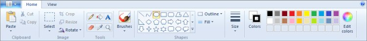

# The Desktop Experience

The new Windows 7 desktop brings your applications to life. Applications are now more discoverable, informative, and interactive. Modern and intuitive user interfaces are easier to develop with Windows 7. New desktop and application experiences include the following:

-   The enhanced taskbar introduces interactive thumbnails, and enables animation and interaction for minimized applications.
-   The Destinations concept lets users jump with one click to the files, locations, or tasks that they use most frequently.
-   New controls and APIs for the *Ribbon*, based on the Office Fluent UI, are available for easily adding *Ribbon*-style controls, menus, and galleries to your applications.
-   An animation framework helps you enhance custom animations.

Enhancements to the gadgets platform enable applications to install companion gadgets during the setup or first-run experience.

The new Windows 7 desktop brings your applications to life

## Jump Lists—Getting Users into Your Application Quickly

Jump Lists help users get to where they want to go faster. Jump Lists are files, URLs, tasks, or custom items that open within the application. The new Jump Lists menu in the *Start* menu and taskbar makes common destinations and key tasks available with a single click. The Jump Lists menu is automatically populated based on how frequently and how recently items have been used. Developers can provide custom Jump Lists based on their own semantics. Applications can also define *Tasks* to appear in their menus—these are actions of the application that users want to access directly, such as composing an email. (See [Taskbar Extensions](../shell/taskbar-extensions.md) and [ICustomDestinationList Interface](/windows/win32/api/shobjidl_core/nn-shobjidl_core-icustomdestinationlist).)

Jump Lists help users get to where they want to go faster

## Enhanced Taskbar

With the new taskbar in Windows 7, applications can provide more information to the user in more intuitive ways. For example, applications can show progress bars in their taskbar buttons so that users can stay aware of progress without having to keep the window visible. This is useful for tracking time-consuming operations such as file copying, downloads, installations, or media burning. Icon overlays can be displayed on the lower-right area of the application's taskbar button, and are used to communicate status or notifications (such as new mail). New thumbnail APIs enable an application to define child windows and corresponding thumbnail images for those windows. The thumbnail toolbar provides a place to control common actions without requiring window restoration, such as *Play/Stop* for media. (See [Taskbar Extensions](../shell/taskbar-extensions.md) and [Windows 7: Developer Resources](https://github.com/microsoft/Windows-classic-samples/tree/master/Samples/Win7Samples).)

## Gadgets Platform

Gadgets are a popular feature of the Windows Vista desktop, and in Windows 7, it is even easier for applications to install gadgets. In Windows 7, an application can programmatically add a gadget to the Windows desktop during application setup or first run. This means that an application's out-of-the-box experience can include a simple check box, for example, to install a companion gadget that is available on the desktop as soon as the application is ready to be used. (See [Introduction to the Gadget Platform](/previous-versions/windows/desktop/gadgetplatform/introduction-to-the-gadget-platform).)

In Windows 7, it is even easier for applications to install gadgets

## Windows Ribbon

The Windows Ribbon control helps developers improve usability by exposing your application's most frequently accessed features directly to end-users. The Ribbon makes it easier for end-users to find and use application features because less functionality is hidden, leading to increased productivity. The Ribbon is designed as an intent-based alternative to the command presentation model of menus, toolbars, task panes, and dialog boxes in standard Windows-based applications.

The Ribbon controls consist of a set of Win32APIs that override the top-level menu bar functionality and render a ribbon-style command UI instead. It is similar in functionality and appearance to the *Ribbon* in the 2007 Office system. The UI is composed of several sub-controls that include the following:

-   Application button (or pearl)
-   Quick-access toolbar
-   *Ribbon* control of contextual tabs
-   Mini-toolbars
-   Style galleries

Templates and markup authoring are available to developers for rapid development and integration of Ribbon functionality. (See [Windows Ribbon Framework](../windowsribbon/-uiplat-windowsribbon-entry.md) and [Windows Ribbon Framework: Developer Resources](https://github.com/microsoft/Windows-classic-samples/tree/master/Samples/Win7Samples/winui/WindowsRibbon).)

The Ribbon control helps developers improve usability by exposing your application's most frequently accessed features

## Animation

Smooth animations are fundamental to many graphical UI applications, and Windows 7 introduces a native animation framework for managing the scheduling and execution of animations. The animation framework supplies a library of useful mathematical functions for specifying behavior over time and also lets developers provide their own behavior functions. The framework supports sophisticated resolution of conflicts when multiple animations try to manipulate the same value at the same time. An application can specify that one animation must be completed before another can start and can force completion within a set time. The new framework also helps animations determine appropriate durations. (See [Windows Animation Manager](../uianimation/-main-portal.md).)

 

 