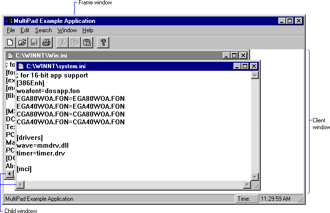

# About the Multiple Document Interface

Each document in an multiple-document interface (MDI) application is displayed in a separate child window within the client area of the application's main window. Typical MDI applications include word-processing applications that allow the user to work with multiple text documents, and spreadsheet applications that allow the user to work with multiple charts and spreadsheets. For more information, see the following topics.

-   [Frame, Client, and Child Windows](#frame-client-and-child-windows)
-   [Child Window Creation](#child-window-creation)
-   [Child Window Activation](#child-window-activation)
-   [Multiple Document Menus](#multiple-document-menus)
-   [Multiple Document Accelerators](#multiple-document-accelerators)
-   [Child Window Size and Arrangement](#child-window-size-and-arrangement)
-   [Icon Title Windows](#icon-title-windows)
-   [Child Window Data](#child-window-data)
    -   [Window Structure](#window-structure)
    -   [Window Properties](#window-properties)

## Frame, Client, and Child Windows

An MDI application has three kinds of windows: a frame window, an MDI client window, as well as a number of child windows. The *frame window* is like the main window of the application: it has a sizing border, a title bar, a window menu, a minimize button, and a maximize button. The application must register a window class for the frame window and provide a window procedure to support it.

An MDI application does not display output in the client area of the frame window. Instead, it displays the MDI client window. An *MDI client window* is a special type of child window belonging to the preregistered window class **MDICLIENT**. The client window is a child of the frame window; it serves as the background for child windows. It also provides support for creating and manipulating child windows. For example, an MDI application can create, activate, or maximize child windows by sending messages to the MDI client window.

When the user opens or creates a document, the client window creates a child window for the document. The client window is the parent window of all MDI child windows in the application. Each child window has a sizing border, a title bar, a window menu, a minimize button, and a maximize button. Because a child window is clipped, it is confined to the client window and cannot appear outside it.

An MDI application can support more than one kind of document. For example, a typical spreadsheet application enables the user to work with both charts and spreadsheets. For each type of document that it supports, an MDI application must register a child window class and provide a window procedure to support the windows belonging to that class. For more information about window classes, see [Window Classes](window-classes.md). For more information about window procedures, see [Window Procedures](window-procedures.md).

Following is a typical MDI application. It is named Multipad.

## Child Window Creation

To create a child window, an MDI application either calls the [**CreateMDIWindow**](/windows/win32/api/winuser/nf-winuser-createmdiwindowa) function or sends the [**WM\_MDICREATE**](wm-mdicreate.md) message to the MDI client window. A more efficient way to create an MDI child window is to call the [**CreateWindowEx**](/windows/win32/api/winuser/nf-winuser-createwindowexa) function, specifying the **WS\_EX\_MDICHILD** extended style.

To destroy a child window, an MDI application sends a [**WM\_MDIDESTROY**](wm-mdidestroy.md) message to the MDI client window.

## Child Window Activation

Any number of child windows can appear in the client window at any one time, but only one can be active. The active child window is positioned in front of all other child windows, and its border is highlighted.

The user can activate an inactive child window by clicking it. An MDI application activates a child window by sending a [**WM\_MDIACTIVATE**](wm-mdiactivate.md) message to the MDI client window. As the client window processes this message, it sends a **WM\_MDIACTIVATE** message to the window procedure of the child window to be activated and to the window procedure of the child window being deactivated.

To prevent a child window from activating, handle the [**WM\_NCACTIVATE**](wm-ncactivate.md) message to the child window by returning **FALSE**.

The system keeps track of each child window's position in the stack of overlapping windows. This stacking is known as the [Z-Order](window-features.md). The user can activate the next child window in the Z order by clicking **Next** from the window menu in the active window. An application activates the next (or previous) child window in the Z order by sending a [**WM\_MDINEXT**](wm-mdinext.md) message to the client window.

To retrieve the handle to the active child window, the MDI application sends a [**WM\_MDIGETACTIVE**](wm-mdigetactive.md) message to the client window.

## Multiple Document Menus

The frame window of an MDI application should include a menu bar with a window menu. The window menu should include items that arrange the child windows within the client window or that close all child windows. The window menu of a typical MDI application might include the items in the following table.

| Menu item         | Purpose                                                                                                                  |
|-------------------|--------------------------------------------------------------------------------------------------------------------------|
| **Tile**          | Arranges child windows in a tile format so that each appears in its entirety in the client window.                       |
| **Cascade**       | Arranges child windows in a cascade format. The child windows overlap one another, but the title bar of each is visible. |
| **Arrange Icons** | Arranges the icons of minimized child windows along the bottom of the client window.                                     |
| **Close All**     | Closes all child windows.                                                                                                |

 

Whenever a child window is created, the system automatically appends a new menu item to the window menu. The text of the menu item is the same as the text on the menu bar of the new child window. By clicking the menu item, the user can activate the corresponding child window. When a child window is destroyed, the system automatically removes the corresponding menu item from the window menu.

The system can add up to ten menu items to the window menu. When the tenth child window is created, the system adds the **More Windows** item to the window menu. Clicking this item displays the **Select Window** dialog box. The dialog box contains a list box with the titles of all MDI child windows currently available. The user can activate a child window by clicking its title in the list box.

If your MDI application supports several types of child windows, tailor the menu bar to reflect the operations associated with the active window. To do this, provide separate menu resources for each type of child window the application supports. When a new type of child window is activated, the application should send a [**WM\_MDISETMENU**](wm-mdisetmenu.md) message to the client window, passing to it the handle to the corresponding menu.

When no child window exists, the menu bar should contain only items used to create or open a document.

When the user is navigating through an MDI application's menus by using cursor keys, the keys behave differently than when the user is navigating through a typical application's menus. In an MDI application, control passes from the application's window menu to the window menu of the active child window, and then to the first item on the menu bar.

## Multiple Document Accelerators

To receive and process accelerator keys for its child windows, an MDI application must include the [**TranslateMDISysAccel**](/windows/win32/api/winuser/nf-winuser-translatemdisysaccel) function in its message loop. The loop must call **TranslateMDISysAccel** before calling the [**TranslateAccelerator**](/windows/desktop/api/winuser/nf-winuser-translateacceleratora) or [**DispatchMessage**](/windows/win32/api/winuser/nf-winuser-dispatchmessage) function.

Accelerator keys on the window menu for an MDI child window are different from those for a non-MDI child window. In an MDI child window, the ALT+ – (minus) key combination opens the window menu, the CTRL+F4 key combination closes the active child window, and the CTRL+F6 key combination activates the next child window.

## Child Window Size and Arrangement

An MDI application controls the size and position of its child windows by sending messages to the MDI client window. To maximize the active child window, the application sends the [**WM\_MDIMAXIMIZE**](wm-mdimaximize.md) message to the client window. When a child window is maximized, its client area completely fills the MDI client window. In addition, the system automatically hides the child window's title bar, and adds the child window's window menu icon and Restore button to the MDI application's menu bar. The application can restore the client window to its original (premaximized) size and position by sending the client window a [**WM\_MDIRESTORE**](wm-mdirestore.md) message.

An MDI application can arrange its child windows in either a cascade or tile format. When the child windows are cascaded, the windows appear in a stack. The window on the bottom of the stack occupies the upper left corner of the screen, and the remaining windows are offset vertically and horizontally so that the left border and title bar of each child window is visible. To arrange child windows in the cascade format, an MDI application sends the [**WM\_MDICASCADE**](wm-mdicascade.md) message. Typically, the application sends this message when the user clicks **Cascade** on the window menu.

When the child windows are tiled, the system displays each child window in its entirety — overlapping none of the windows. All of the windows are sized, as necessary, to fit within the client window. To arrange child windows in the tile format, an MDI application sends a [**WM\_MDITILE**](wm-mditile.md) message to the client window. Typically, the application sends this message when the user clicks **Tile** on the window menu.

An MDI application should provide a different icon for each type of child window it supports. The application specifies an icon when registering the child window class. The system automatically displays a child window's icon in the lower portion of the client window when the child window is minimized. An MDI application directs the system to arrange child window icons by sending a [**WM\_MDIICONARRANGE**](wm-mdiiconarrange.md) message to the client window. Typically, the application sends this message when the user clicks **Arrange Icons** on the window menu.

## Icon Title Windows

Because MDI child windows may be minimized, an MDI application must avoid manipulating icon title windows as if they were normal MDI child windows. Icon title windows appear when the application enumerates child windows of the MDI client window. Icon title windows differ from other child windows, however, in that they are owned by an MDI child window.

To determine whether a child window is an icon title window, use the [**GetWindow**](/windows/win32/api/winuser/nf-winuser-getwindow) function with the GW\_OWNER index. Non-title windows return **NULL**. Note that this test is insufficient for top-level windows, because menus and dialog boxes are owned windows.

## Child Window Data

Because the number of child windows varies depending on how many documents the user opens, an MDI application must be able to associate data (for example, the name of the current file) with each child window. There are two ways to do this:

-   Store child window data in the window structure.
-   Use window properties.

### Window Structure

When an MDI application registers a window class, it may reserve extra space in the window structure for application data specific to this particular class of windows. To store and retrieve data in this extra space, the application uses the [**GetWindowLong**](/windows/win32/api/winuser/nf-winuser-getwindowlonga) and [**SetWindowLong**](/windows/win32/api/winuser/nf-winuser-setwindowlonga) functions.

To maintain a large amount of data for a child window, an application can allocate memory for a data structure and then store the handle to the memory containing the structure in the extra space associated with the child window.

### Window Properties

An MDI application can also store per-document data by using window properties. *Per-document data* is data specific to the type of document contained in a particular child window. Properties are different from extra space in the window structure in that you need not allocate extra space when registering the window class. A window can have any number of properties. Also, where offsets are used to access the extra space in window structures, properties are referred to by string names. For more information about window properties, see [Window Properties](window-properties.md).

 

 
