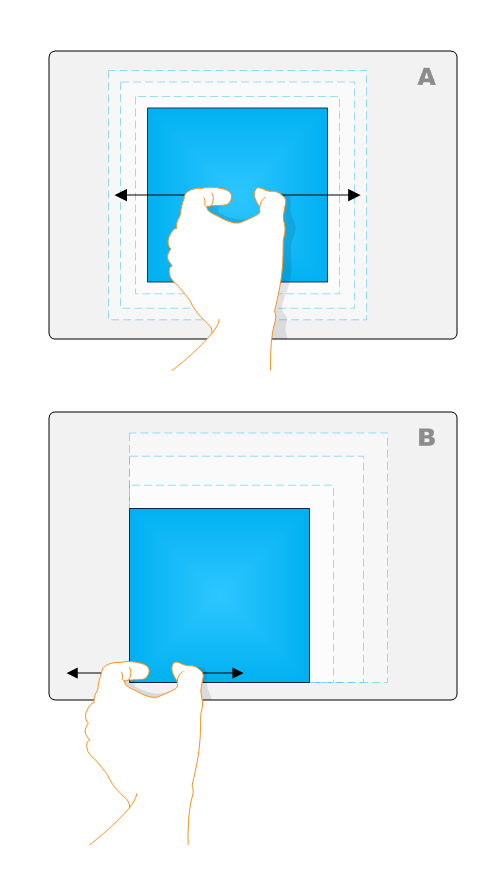
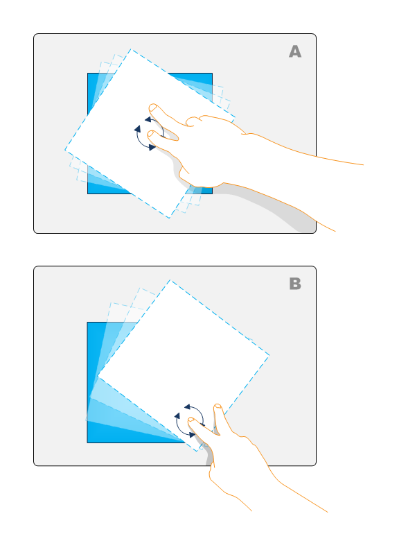
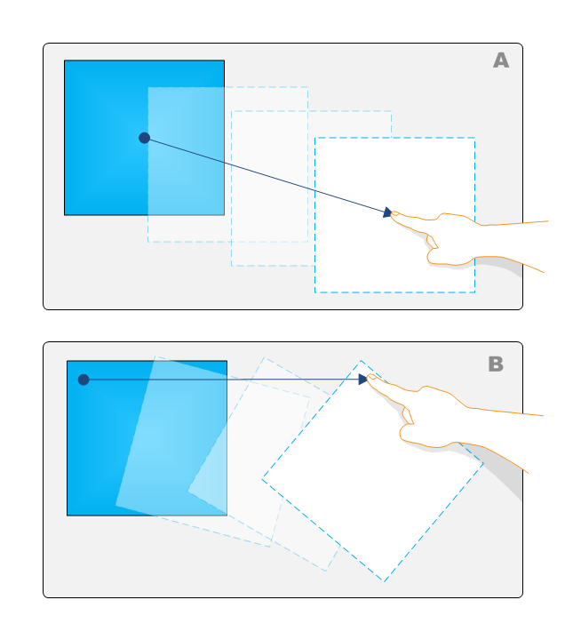

# Advanced Manipulations Overview

This section explains advanced manipulations for applications.

For usability purposes, you may want to add complex manipulations to your application so that objects can be manipulated with a fine degree of granularity. The following sections describe advanced manipulations.

### Advanced Expansion

The following illustration shows two interpretations of expansion.

In example A, the simple expansion example, the object is expanded around its center point. In example B, the object is expanded around the center point of the manipulation.

### Advanced Rotation

The following illustration shows two interpretations of rotation.

In example A, the simple rotation example, the object is rotated around its center point. In example B, the object is rotated around the center point of the manipulation. For more information on complex rotation, see the [Advanced Rotation](advanced-rotation.md) section.

## Advanced Translation

The following illustration shows two interpretations of translation.

In example A, the simple translation example, the object is moved without rotation. In example B, the object is rotated during the translation depending on where the object contact point is. If you enable single-finger rotation as described in [Single-Finger Rotation](single-finger-rotation.md), you can enable complex translation.

## Related topics

<dl> <dt>

[Manipulations](getting-started-with-manipulations.md)
</dt> </dl>

 

 

