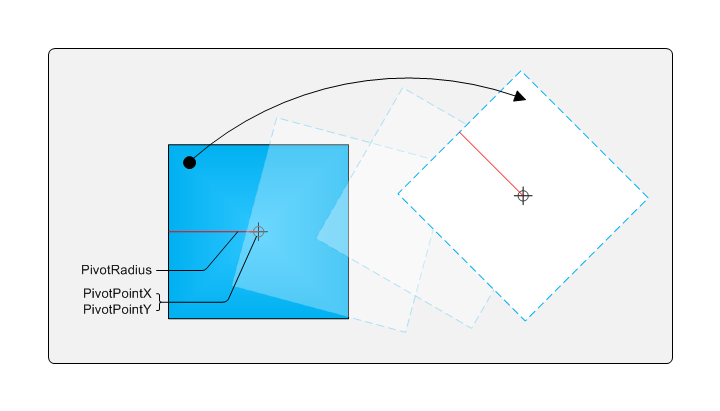

# Advanced Translation

The following illustration shows two interpretations of translation.


In example A, the simple translation example, the object is moved without rotation. In example B, the object is rotated during the translation, depending on where the object contact point is. If you enable single-finger rotation as described in [Single-Finger Rotation](single-finger-rotation.md), you can enable complex translation. The following diagram shows the various components of single-finger rotation when you are performing translation.



As the object is moved, the radius is recalculated and the pivot point is moved.

The following code shows one way that you can do this in an implementation of [**ManipulationDelta**](/windows/win32/api/manipulations/nf-manipulations-_imanipulationevents-manipulationdelta) that enables complex translation.


```C++
    //Apply transformation based on rotationDelta (in radians)
    FLOAT rads = 180.0f / 3.14159f;
    m_dObj->Rotate(rotationDelta*rads, x, y);

    // Apply translation based on scaleDelta
    m_dObj->Scale(scaleDelta);

    // Apply translation based on translationDelta
    m_dObj->Translate(translationDeltaX, translationDeltaY);

    // Set values for one finger rotations
    FLOAT fPivotRadius = (FLOAT)(m_dObj->get_Width() + m_dObj->get_Height())/8.0f;
    FLOAT fPivotPtX = m_dObj->get_CenterX();
    FLOAT fPivotPtY = m_dObj->get_CenterY();
        
    m_manip->put_PivotPointX(fPivotPtX);
    m_manip->put_PivotPointY(fPivotPtY);
    m_manip->put_PivotRadius(fPivotRadius);       
   
```


> [!Note]  
> Object transformations occur before the pivot points and radius are calculated. In this manner the object will move correctly if the user performs expansion on the object while it is moving.

 

## Related topics

<dl> <dt>

[Manipulations](getting-started-with-manipulations.md)
</dt> </dl>

 

 


