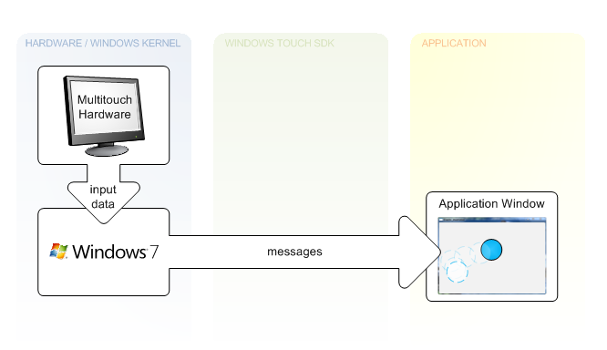
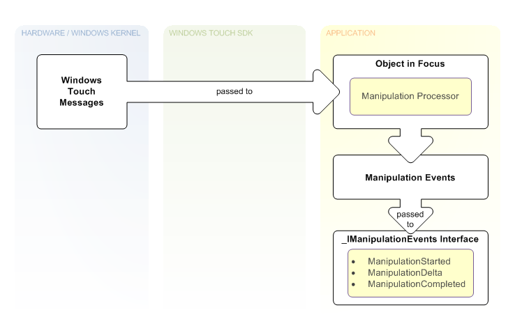
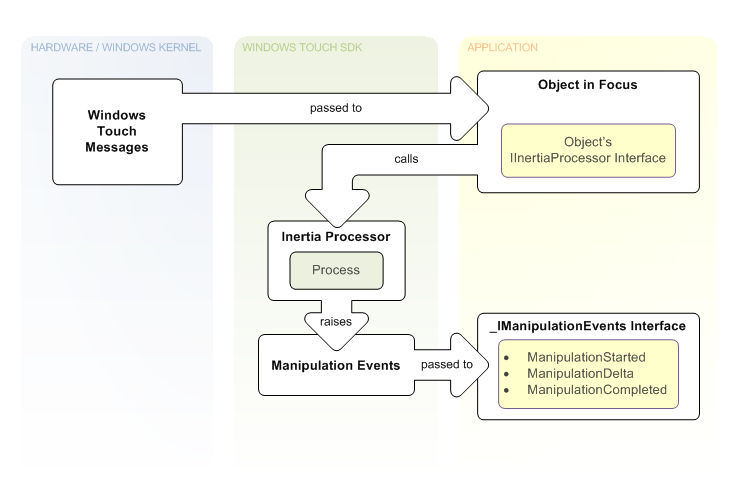

# Architectural Overview

This architectural overview provides context for the Windows Touch API for Tablet and Touch Technologies and explains how it fits into the larger Windows 7 architecture.

## Messages for Windows Touch Input and Gestures

Messaging features for Windows Touch are enabled by listening and interpreting messages during execution. The following illustration shows how messages are generated from hardware and sent to applications by Windows 7.

In the leftmost column of the illustration, touch-sensitive hardware receives input from a user. A driver then communicates between the hardware and the OS. Next, the OS generates a [**WM\_TOUCH**](wm-touchdown.md) or [**WM\_GESTURE**](wm-gesture.md) message that is then sent to an application's HWND. The application then updates the UI given the information encapsulated in the message.

Applications receive gestures by default. Unless an application registers for Windows Touch input messages with the [**RegisterTouchWindow**](/windows/desktop/api/winuser/nf-winuser-registertouchwindow) function, notifications for gestures ([**WM\_GESTURE**](wm-gesture.md) messages) are created by Windows and sent to that application window. If an application Window registers to receive touch messages, notifications for Windows Touch input ([**WM\_TOUCH**](wm-touchdown.md) messages) are sent to that application window. Windows Touch and gesture messages are greedy in the sense that after a touch is made or a gesture begins on an application Window, all messages are sent to that application until the gesture completes or the primary touch is completed.

For legacy support, Windows interprets [**WM\_GESTURE**](wm-gesture.md) messages if they are bubbled up and then will SEND or POST appropriate messages that map to the gesture. To avoid breaking legacy support, make sure that you forward WM\_GESTURE messages using [DefWindowProc](/windows/win32/api/winuser/nf-winuser-defwindowproca). More information on legacy support can be found in the section [Windows Touch Gestures Overview](windows-touch-gestures-overview.md).

## Manipulations and Inertia

Windows Touch programmers must be able to interpret gestures from multiple sources in a manner that is meaningful for the gesture taking place. Microsoft provides the manipulation API to perform these calculations. Manipulations are essentially gestures with values associated with them that describe the entire gesture. After you connect the input data to the manipulation processor, you can retrieve information pertinent to action that the user makes on the object. The following figure shows one way you can use manipulations.

In the top left of the illustration, the user has touched the screen, which creates touch messages. These messages contain an x-coordinate and a y-coordinate that are used to determine the object that is in focus. The object in focus contains a manipulation processor. Next, on the [**WM\_TOUCH**](wm-touchdown.md) message with the **TOUCHEVENTF\_UP** flag, the object in the user's focus is selected, the manipulation processor is referenced, and the message is sent to the manipulation processor. Subsequent **WM\_TOUCH** messages associated with this contact are sent to the manipulation processor until the **WM\_TOUCH** message with the **TOUCHEVENTF\_UP** flag is received and the selected object is dereferenced. In the bottom right section of the illustration, a manipulation event sink that implements the [**\_IManipulationEvents**](/windows/win32/api/manipulations/nn-manipulations-_imanipulationevents) interface is used to handle the manipulation events, which are raised while the touch messages are being created. The event sink can perform updates to the interface based on the manipulation events while they occur.

In Windows Touch applications, it's common to incorporate simple physics so that objects smoothly come to a stop, rather than abruptly stop when they are no longer being touched. Microsoft provides the Inertia API to perform the calculations for these simple physics so that your application can behave in a manner similar to other applications. This also saves you the effort required to create robust physics functionality. The following figure shows how you can use inertia.

Note the similarities between inertia and manipulation. The only difference between the two is that in the case of inertia, interpreted messages are handed to an inertia processor rather than a manipulation processor and the inertia processor raises the events. In the top left of the illustration, on the [**WM\_TOUCH**](wm-touchdown.md) message with the **TOUCHEVENTF\_UP** flag, touch messages are used to identify an object in focus that contains an inertia processor and a manipulation processor. Subsequent **WM\_TOUCH** messages are sent to the manipulation processor and the manipulation processor performs updates to the application UI. After the manipulation completes, velocity values from the manipulation are used to set up an inertia processor. As illustrated in the middle column, the [**Process**](/windows/desktop/api/manipulations/nf-manipulations-iinertiaprocessor-process) or [**ProcessTime**](/windows/desktop/api/manipulations/nf-manipulations-iinertiaprocessor-processtime) method is called on the [**IInertiaProcessor**](/windows/desktop/api/manipulations/nn-manipulations-iinertiaprocessor) interface using a timer or other loop in a separate thread until the calls indicate the processor is finished processing. While these calls are made, manipulation events are raised, which are handled by a manipulation event sink based on the [**\_IManipulationEvents**](/windows/win32/api/manipulations/nn-manipulations-_imanipulationevents) interface. At the bottom right section of the illustration, this event sink then performs updates to the application UI based on manipulation events when they occur through event handlers in the event sink.

## Related topics

<dl> <dt>

[Programming Guide](programming-guide.md)
</dt> </dl>

 

 