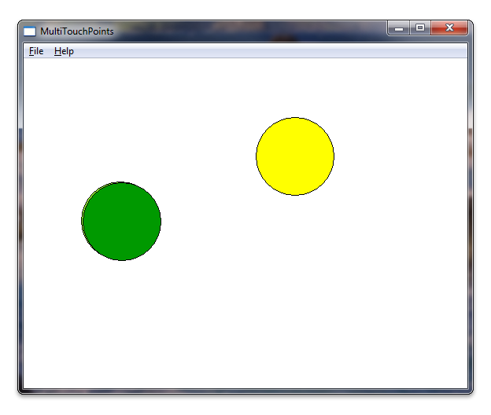
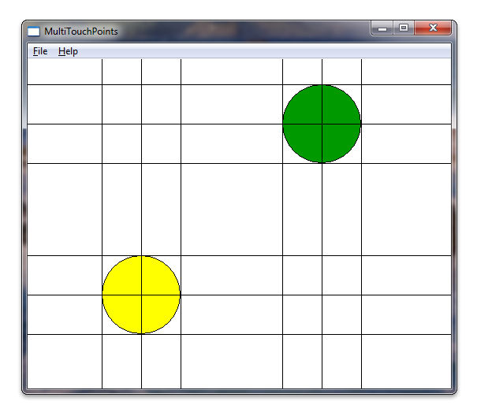

# Detecting and Tracking Multiple Touch Points

The following steps explain how to track multiple touch points using Windows Touch.

1. Create an application and enable Windows Touch.
2. Add a handler for [**WM\_TOUCH**](wm-touchdown.md) and track points.
3. Draw the points.

After you have your application running, it will render circles under each touch. The following screen shot shows how your application might look while running.



## Create an Application and Enable Windows Touch

Start with a Microsoft Win32 application using the Microsoft Visual Studio wizard. After you have completed the wizard, add support for Windows Touch messages by setting the Windows version in targetver.h and including windows.h and windowsx.h in your application. The following code shows how to set the Windows version in targetver.h.

```C++
#ifndef WINVER                  // Specifies that the minimum required platform is Windows 7.
#define WINVER 0x0601           // Change this to the appropriate value to target other versions of Windows.
#endif

#ifndef _WIN32_WINNT            // Specifies that the minimum required platform is Windows 7.
#define _WIN32_WINNT 0x0601     // Change this to the appropriate value to target other versions of Windows.
#endif     

#ifndef _WIN32_WINDOWS          // Specifies that the minimum required platform is Windows 98.
#define _WIN32_WINDOWS 0x0410 // Change this to the appropriate value to target Windows Me or later.
#endif

#ifndef _WIN32_IE                       // Specifies that the minimum required platform is Internet Explorer 7.0.
#define _WIN32_IE 0x0700        // Change this to the appropriate value to target other versions of IE.
#endif
```

The following code shows how your include directives should be added. Also, you can create some global variables that will be used later.

```C++
#include <windows.h>    // included for Windows Touch
#include <windowsx.h>   // included for point conversion

#define MAXPOINTS 10

// You will use this array to track touch points
int points[MAXPOINTS][2];

// You will use this array to switch the color / track ids
int idLookup[MAXPOINTS];


// You can make the touch points larger
// by changing this radius value
static int radius      = 50;

// There should be at least as many colors
// as there can be touch points so that you
// can have different colors for each point
COLORREF colors[] = { RGB(153,255,51), 
                      RGB(153,0,0), 
                      RGB(0,153,0), 
                      RGB(255,255,0), 
                      RGB(255,51,204), 
                      RGB(0,0,0),
                      RGB(0,153,0), 
                      RGB(153, 255, 255), 
                      RGB(153,153,255), 
                      RGB(0,51,153)
                    };

```

## Add Handler for WM\_TOUCH and Track Points

First, declare some variables that are used by the [**WM\_TOUCH**](wm-touchdown.md) handler in [**WndProc**](/windows/win32/api/winuser/nc-winuser-wndproc).

```C++
int wmId, wmEvent, i, x, y;

UINT cInputs;
PTOUCHINPUT pInputs;
POINT ptInput;   
```

Now, initialize the variables used for storing touch points and register the window for touch input from the **InitInstance** method.

```C++
BOOL InitInstance(HINSTANCE hInstance, int nCmdShow)
{
   HWND hWnd;

   hInst = hInstance; // Store instance handle in our global variable

   hWnd = CreateWindow(szWindowClass, szTitle, WS_OVERLAPPEDWINDOW,
      CW_USEDEFAULT, 0, CW_USEDEFAULT, 0, NULL, NULL, hInstance, NULL);

   if (!hWnd) {
      return FALSE;
   }

   // register the window for touch instead of gestures
   RegisterTouchWindow(hWnd, 0);  

   // the following code initializes the points
   for (int i=0; i< MAXPOINTS; i++){
     points[i][0] = -1;
     points[i][1] = -1;
     idLookup[i]  = -1;
   }  

   ShowWindow(hWnd, nCmdShow);
   UpdateWindow(hWnd);

   return TRUE;
}
```

Next, handle the [**WM\_TOUCH**](wm-touchdown.md) message from the [**WndProc**](/windows/win32/api/winuser/nc-winuser-wndproc) method. The following code shows an implementation of the handler for **WM\_TOUCH**.

```C++
case WM_TOUCH:        
  cInputs = LOWORD(wParam);
  pInputs = new TOUCHINPUT[cInputs];
  if (pInputs){
    if (GetTouchInputInfo((HTOUCHINPUT)lParam, cInputs, pInputs, sizeof(TOUCHINPUT))){
      for (int i=0; i < static_cast<INT>(cInputs); i++){
        TOUCHINPUT ti = pInputs[i];
        index = GetContactIndex(ti.dwID);
        if (ti.dwID != 0 && index < MAXPOINTS){                            
          // Do something with your touch input handle
          ptInput.x = TOUCH_COORD_TO_PIXEL(ti.x);
          ptInput.y = TOUCH_COORD_TO_PIXEL(ti.y);
          ScreenToClient(hWnd, &ptInput);
          
          if (ti.dwFlags & TOUCHEVENTF_UP){                      
            points[index][0] = -1;
            points[index][1] = -1;                
          }else{
            points[index][0] = ptInput.x;
            points[index][1] = ptInput.y;                
          }
        }
      }
    }
    // If you handled the message and don't want anything else done with it, you can close it
    CloseTouchInputHandle((HTOUCHINPUT)lParam);
    delete [] pInputs;
  }else{
    // Handle the error here 
  }  
```

> [!Note]  
> In order to use the [**ScreenToClient**](/windows/desktop/api/winuser/nf-winuser-screentoclient) function, you must have high DPI support in your application. For more information on supporting high DPI, see [High DPI]( ../hidpi/high-dpi-desktop-application-development-on-windows.md).

Now when a user touches the screen, the positions that he or she is touching will be stored in the points array. The **dwID** member of the [**TOUCHINPUT**](/windows/win32/api/winuser/ns-winuser-touchinput) structure stores an identifier that will be hardware dependent.

To address the issue of the dwID member being dependent on hardware, the [**WM\_TOUCH**](wm-touchdown.md) case handler uses a function, **GetContactIndex**, that maps the **dwID** member of the [**TOUCHINPUT**](/windows/win32/api/winuser/ns-winuser-touchinput) structure to a point that is drawn on the screen. The following code shows an implementation of this function.

```C++
// This function is used to return an index given an ID
int GetContactIndex(int dwID){
  for (int i=0; i < MAXPOINTS; i++){
    if (idLookup[i] == -1){
      idLookup[i] = dwID;
      return i;
    }else{
      if (idLookup[i] == dwID){
        return i;
      }
    }
  }
  // Out of contacts
  return -1;
}
```

> [!Important]
> **Windows 11 and newer**
>
> *Some three- and four-finger touch interactions will no longer work in Windows apps by default.*
>
> By default, three- and four-finger touch interactions are now consumed by the system for operations such as switching or minimizing windows and changing virtual desktops. As these interactions are now handled at the system level, your app's functionality could be affected by this change.
>
> To support three- or four-finger interactions within an application, a new user setting has been introduced that specifies whether or not the system handles these interactions:
>
> **Bluetooth & devices > Touch > "Three- and four-finger touch gestures"**
>
> When set to "On" (default), the system will handle all three- and four-finger interactions (apps will not be able to support them).
>
> When set to "Off", three- and four-finger interactions can be supported by apps (they will not be handled by the system).
>
> If your application must support these interactions, we recommend that you inform users of this setting and provide a link that launches the Settings app to the relevant page (ms-settings:devices-touch). For more details, see [Launcher.LaunchUriAsync Method](/uwp/api/windows.system.launcher.launchuriasync).

## Draw the Points

Declare the following variables for the drawing routine.

```C++
    // For double buffering
    static HDC memDC       = 0;
    static HBITMAP hMemBmp = 0;
    HBITMAP hOldBmp        = 0;
   
    // For drawing / fills
    PAINTSTRUCT ps;
    HDC hdc;
    
    // For tracking dwId to points
    int index;
```

The memory display context *memDC* is used for storing a temporary graphics context that is swapped with the rendered display context, *hdc*, to eliminate flickering. Implement the drawing routine, which takes the points you have stored and draws a circle at the points. The following code shows how you could implement the [**WM\_PAINT**](/windows/desktop/gdi/wm-paint) handler.

```C++
  case WM_PAINT:
    hdc = BeginPaint(hWnd, &ps);    
    RECT client;
    GetClientRect(hWnd, &client);        
  
    // start double buffering
    if (!memDC){
      memDC = CreateCompatibleDC(hdc);
    }
    hMemBmp = CreateCompatibleBitmap(hdc, client.right, client.bottom);
    hOldBmp = (HBITMAP)SelectObject(memDC, hMemBmp);          
  
    FillRect(memDC, &client, CreateSolidBrush(RGB(255,255,255)));
     
    //Draw Touched Points                
    for (i=0; i < MAXPOINTS; i++){        
      SelectObject( memDC, CreateSolidBrush(colors[i]));           
      x = points[i][0];
      y = points[i][1];
      if  (x >0 && y>0){              
        Ellipse(memDC, x - radius, y - radius, x+ radius, y + radius);
      }
    }
  
    BitBlt(hdc, 0,0, client.right, client.bottom, memDC, 0,0, SRCCOPY);      

    EndPaint(hWnd, &ps);
    break;
```

When you run your application, it now should look something like the illustration at the beginning of this section.

For fun, you can draw some extra lines around the touch points. The following screen shot shows how the application could look with a few extra lines drawn around the circles.



## Related topics

[Windows Touch Input](guide-multi-touch-input.md)
