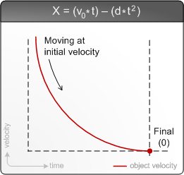
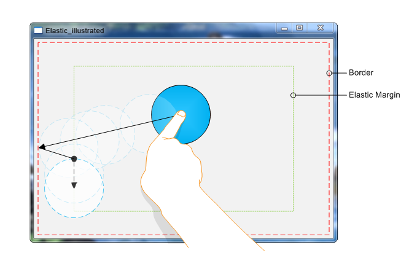

# Inertia Mechanics

Inertia is used to perform calculations for animating object movement and to enable support for generic usability in applications incorporating Windows Touch. This section illustrates the following features that are enabled by inertia.

-   A brief overview of inertia physics.
-   Smooth object animation using the velocity and deceleration properties.
-   Smooth object animation using a displacement property.
-   Bouncing from the screen edges using elastic bounds.

## Inertia Physics Overview

The inertia processor uses a simple physics model that incorporates a position, a deceleration value, and an initial velocity. Time is used as the dynamic input to the model to determine the current position of an object being displaced. The following graph and formula outline the physics model used for calculating object positions.

In the formula used for calculating the current position (x), the initial velocity (v) is multiplied by the time elapsed (t) and is reduced by the deceleration factor (d) times time squared. This results in smooth object deceleration. In the previous illustration at the initial (leftmost) part of the curve, the object is moving quickly because its current velocity is the initial velocity. At the final (rightmost) part of the curve, the object has completely stopped because its velocity is 0. Object velocity calculations for x-velocity, y-velocity, and rotational velocity all use this formula for calculations.

All distance used for the inertia processor is relative. If you want to use screen coordinates, you pass screen coordinates to the manipulation (or inertia) processor; if you want to use absolute coordinates, you pass those into the processor you are using. Regardless of the values that you are using, the manipulation processor will use millisecond clock ticks for processing the time. These values can either be passed directly to the inertia processor using the [**ProcessTime**](/windows/desktop/api/manipulations/nf-manipulations-iinertiaprocessor-processtime) method or by using the default timestamp through calls to [**Process**](/windows/desktop/api/manipulations/nf-manipulations-iinertiaprocessor-process).

## Smooth Object Animation using the Velocity and Deceleration Properties

You can enable smooth animation by directly interacting with the physics model by setting the velocity and deceleration values in the inertia processor interface and then calling [**Process**](/windows/desktop/api/manipulations/nf-manipulations-iinertiaprocessor-process). Calling **Process** will trigger object manipulations which in turn should cause UI updates. Object velocity values passed to the inertia processor are typically taken from the manipulation processor upon completion. Your deceleration value will be dependent on how long you want your object to be animated for and the units that you are using for your calculations. Because the values are dependent, sometimes you must scale the input velocity from the maniplation processor and use arbitrary values for deceleration. The following values are typical for various scenarios where you are passing centipixel values from the x and y properties of the [**TOUCHINPUT**](/windows/win32/api/winuser/ns-winuser-touchinput) structure to the manipulation processor.

| Scenario    | Property Set                                                                       | Deceleration Value | Typical Velocity Input Scaling                                  | Notes                                                                                 |
|-------------|------------------------------------------------------------------------------------|--------------------|-----------------------------------------------------------------|---------------------------------------------------------------------------------------|
| Translation | [**DesiredDeceleration**](/windows/desktop/api/manipulations/nf-manipulations-iinertiaprocessor-get_desireddeceleration)               | 0.003f             | None.                                                           | Using this value will result in longer distance animations when using touch input.    |
| Translation | [**DesiredDeceleration**](/windows/desktop/api/manipulations/nf-manipulations-iinertiaprocessor-get_desireddeceleration)               | 0.001f             | 1/20th initial velocity for touch inputs, none for mouse inputs | Using this value will animate for around a second given typical velocity inputs.      |
| Translation | [**DesiredDeceleration**](/windows/desktop/api/manipulations/nf-manipulations-iinertiaprocessor-get_desireddeceleration)               | 0.5f               | None                                                            | Using this value gives a natural feel to animation on large Windows Touch displays.   |
| Rotation    | [**DesiredAngularDeceleration**](/windows/desktop/api/manipulations/nf-manipulations-iinertiaprocessor-get_desiredangulardeceleration) | 0.000015f          | Radians converted to degrees.                                   | Using this value results in longer rotational animations when using touch input.      |
| Rotation    | [**DesiredAngularDeceleration**](/windows/desktop/api/manipulations/nf-manipulations-iinertiaprocessor-get_desiredangulardeceleration) | 0.00001f           | 1/40th rotation delta for touch inputs, none for mouse inputs   | This value is in radians so you must use very small deceleration and velocity values. |
| Rotation    | [**DesiredAngularDeceleration**](/windows/desktop/api/manipulations/nf-manipulations-iinertiaprocessor-get_desiredangulardeceleration) | 0.000005f          | None                                                            | This value has a natural feel on large Windows Touch displays.                        |

 

## Smooth Object Animation using the Desired Displacement Property

In some cases, you don't want to use the user's input for object displacement, but you still want an object to smoothly animate across the screen. In this case, you can use displacement properties in the inertia processor to have the processor calculate the initial velocity for moving an object across the screen.

## Controlling Object Position Using Elastic Bounds

After you have an object that is moving across the screen, you will typically want for it to stop before it goes outside of the user's viewpoint. The inertia processor enables this functionality through the boundary and elastic margin properties. The following image illustrates the various boundary and margin properties in a typical application.

You set the left, upper, right, and lower boundaries and elastic margins for your application, and the inertia processor will handle keeping UI elements within the bounds. When an object reaches an elastic margin, it will slow down until it reaches the boundary. It will never leave that margin again during inertia, but will still move until the object's perpendicular inertia component decelerates to 0. In the illustration, a circle is displaced toward the left elastic boundary. The solid arrow shows the direction of the manipulation; the solid circle is the initial position of the object; the solid arrow is the changes made before the circle hits the elastic margin; the dashed arrow shows where the inertia processor manipulates the circle after it hits the margin; and the dashed circles show where the object stops.

> [!Note]  
> Setting the margin properties will move the bounds outward. For example, if your top boundary is set to 50 and then you set the top elastic margin to 10, your top boundary will effectively become 40.

 

## Related topics

<dl> <dt>

[Handling Inertia in Unmanaged Code](handling-inertia-in-unmanaged-code.md)
</dt> <dt>

[Inertia](getting-started-with-inertia.md)
</dt> <dt>

[Manipulations](getting-started-with-manipulations.md)
</dt> </dl>

 

 

