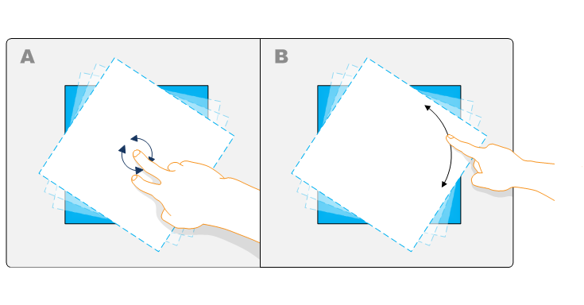
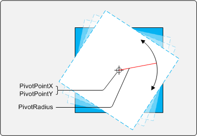

# Single-Finger Rotation

This section explains how to rotate an object using a pivot point.

The following image illustrates single-finger rotation.



In example A, the object is rotated around the center point of the object by using the rotation gesture. In example B, the object is rotated by moving a single finger around the edge of the object. The manipulation processor enables this rotation by using pivot point and pivot radius values. The following image illustrates the components of single-finger rotation.



After you set the [**PivotPointX**](/windows/desktop/api/manipulations/nf-manipulations-imanipulationprocessor-get_pivotpointx), [**PivotPointY**](/windows/desktop/api/manipulations/nf-manipulations-imanipulationprocessor-get_pivotpointy), and [**PivotRadius**](/windows/desktop/api/manipulations/nf-manipulations-imanipulationprocessor-get_pivotradius) values, subsequent translation messages will incorporate rotation. The larger the pivot radius, the greater the change in x and y must be to rotate the object. The following code shows how these values could be set in the manipulation processor.


```C++
HRESULT STDMETHODCALLTYPE CManipulationEventSink::ManipulationDelta( 
    /* [in] */ FLOAT x,
    /* [in] */ FLOAT y)
{
    m_cStartedEventCount ++;

    // Set the pivot point to the object's center and then set the radius 
    // to the distance from the center to the edge of the object.
    m_pManip->put_PivotPointX(m_objectRef->xPos);
    m_pManip->put_PivotPointY(m_objectRef->yPos);
    
    float fPivotRadius = (FLOAT)(sqrt(pow(m_dObj->get_Width()/2, 2) + pow(m_dObj->get_Height()/2, 2)))*0.4f;
    
    m_pManip->put_PivotRadius(fPivotRadius);
  

    return S_OK;
}    
     
```


In the previous example, the distance to the edge of the object (scaled to 40 percent) is used as the pivot radius. Because the object size is taken into consideration, this calculation is valid for every object delta. As the object scales, the pivot radius grows. This value and the object's center x and y values are passed to the manipulation processor to rotate the object around the pivot point.

> [!Note]  
> The [**PivotRadius**](/windows/desktop/api/manipulations/nf-manipulations-imanipulationprocessor-get_pivotradius) value should never be between 0.0 and 1.0.

 

## Related topics

<dl> <dt>

[Manipulations](getting-started-with-manipulations.md)
</dt> <dt>

[**PivotRadius**](/windows/desktop/api/manipulations/nf-manipulations-imanipulationprocessor-get_pivotradius)
</dt> <dt>

[**PivotPointX**](/windows/desktop/api/manipulations/nf-manipulations-imanipulationprocessor-get_pivotpointx)
</dt> <dt>

[**PivotPointY**](/windows/desktop/api/manipulations/nf-manipulations-imanipulationprocessor-get_pivotpointy)
</dt> </dl>

 

 


