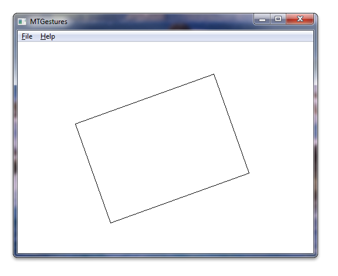

# Windows Touch Gesture Sample (MTGestures)

This section describes the Windows Touch Gesture sample.

The Windows Touch Gesture sample demonstrates how to use gesture messages to translate, rotate, and scale a box rendered by the Graphics Device Interface (GDI) by handling the [**WM_GESTURE**](wm-gesture.md) message. The following screen shot shows how the sample looks when it is running.



For this sample, gesture messages are passed to a gesture engine, which then calls methods on drawing objects to translate, rotate, and scale an object that has methods for handling these commands. To help show how the sample works, consider the steps for using the two-finger tap command to enable or disable diagonal lines in the rendered box. A user performs the two-finger tap gesture, which generates a message that is handled by the program. When the message is handled, it will toggle a Boolean for rendering diagonals on the drawing object, and the object will then render the diagonal lines.

The following code shows how gesture messages are passed to the gesture engine from the WndProc method.

```C++
    case WM_GESTURE:
        // The gesture-processing code is implemented in the CGestureEngine
        // class.
        return g_cGestureEngine.WndProc(hWnd,wParam,lParam);
        break;
```

The following code shows how the gesture engine handles the two-finger tap command.

```C++
// Two-finger tap command
void CMyGestureEngine::ProcessTwoFingerTap(void)
{
    if(_pcRect)
    {
        _pcRect->ToggleDrawDiagonals();
    }
}
```

The following code shows how the drawing object toggles its diagonals.

```C++
void ToggleDrawDiagonals(void){_bDrawDiagonals = !_bDrawDiagonals;}
```

The following code shows how the object renders diagonal lines in its draw method.

```C++
    if(_bDrawDiagonals)
    {
        // draw diagonals
        MoveToEx(hdc,ptRect[0].x,ptRect[0].y,NULL);
        LineTo(hdc,ptRect[2].x,ptRect[2].y);
        MoveToEx(hdc,ptRect[1].x,ptRect[1].y,NULL);
        LineTo(hdc,ptRect[3].x,ptRect[3].y);
    }
```

## Related topics

[Multi-touch Gestures Application (C#)](https://github.com/microsoft/Windows-classic-samples/tree/master/Samples/Win7Samples/Touch/MTGestures/CS), [Multi-touch Gestures Application (C++)](https://github.com/microsoft/Windows-classic-samples/tree/master/Samples/Win7Samples/Touch/MTGestures/cpp), [Windows Touch Samples](windows-touch-samples.md)
