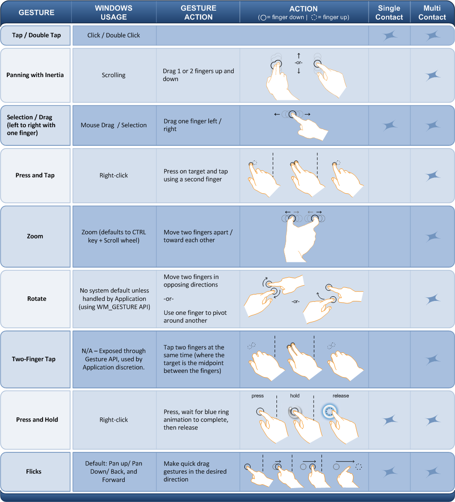

# Windows Touch Gestures Overview

This section describes the various gestures supported by Windows Touch.

## Gestures Overview

Windows Touch enables several gestures that support single and multiple contacts. The following image illustrates the various gestures that are supported in Windows 7.

> [!Note]  
> Some recognizers are more reliable at interpreting gestures with multiple contacts when the contacts are further apart from each other.

## Legacy Support

For legacy support, the default gesture handler maps some gestures to Windows messages that were used in previous versions of Windows. The following table outlines how gestures map to legacy messages.

| Gesture        | Description  | Message(s) Generated              |
|----------------|----------------------------------------------------------------------------------------------------------------------|-------------------------------------------------------------|
| Pan            | The pan gesture maps to using the scroll wheel.                  | **WM_VSCROLL**  **WM_HSCROLL**        |
| Press and Hold | The press and hold gesture maps to right clicking the mouse.     | **WM_RBUTTONDOWN**  **WM_RBUTTONUP**  |
| Zoom           | The zoom gesture triggers messages that are similar to holding the CTRL key, and spinning the mouse wheel to scroll. | **WM_MOUSEWHEEL** with **MK_CONTROL** set in the *wParam* |

## Interpreting Windows Touch Gestures

Windows Touch gestures can be interpreted by application developers by handling the [**WM_GESTURE**](wm-gesture.md) message from the WndProc function of an application. After handling this message, you can retrieve a [**GESTUREINFO**](/windows/win32/api/winuser/ns-winuser-gestureinfo) structure which describes the gesture. The **GESTUREINFO** structure will have assorted information that depends on the type of gesture.

The [**GESTUREINFO**](/windows/win32/api/winuser/ns-winuser-gestureinfo) structure is retrieved by passing the handle to the gesture information structure to the [**GetGestureInfo**](/windows/desktop/api/winuser/nf-winuser-getgestureinfo) function.

The following flags indicate the various states of the gestures and are stored in *dwFlags*. 

| Name        | Value      | Description                      |
|-------------|------------|----------------------------------|
| GF_BEGIN   | 0x00000001 | A gesture is starting.           |
| GF_INERTIA | 0x00000002 | A gesture has triggered inertia. |
| GF_END     | 0x00000004 | A gesture has finished.          |

> [!Note]  
> Most applications should ignore the **GID_BEGIN** and **GID_END** and pass them to [DefWindowProc](/windows/win32/api/winuser/nf-winuser-defwindowproca). These messages are used by the default gesture handler. Application behavior is undefined when the **GID_BEGIN** and **GID_END** messages are consumed by a third-party application.

The following table indicates the various identifiers for gestures. 

| Name              | Value | Description                 |
|-------------------|-------|-----------------------------|
| GID_BEGIN        | 1     | A gesture is starting.      |
| GID_END          | 2     | A gesture is ending.        |
| GID_ZOOM         | 3     | The zoom gesture.           |
| GID_PAN          | 4     | The pan gesture.            |
| GID_ROTATE       | 5     | The rotation gesture.       |
| GID_TWOFINGERTAP | 6     | The two-finger tap gesture. |
| GID_PRESSANDTAP  | 7     | The press and tap gesture.  |

> [!Note]  
> The **GID_PAN** gesture has built-in inertia. At the end of a pan gesture, additional pan gesture messages are created by the operating system.

The [**GESTUREINFO**](/windows/win32/api/winuser/ns-winuser-gestureinfo) structure members **ptsLocation** and **ullArguments** specify a point (using the **POINTS** structure) and additional information about gestures depending on the gesture. The following table lists the values associated with each type of gesture.

| Gesture ID            | *ullArguments*                  | *ptsLocation*                       |
|-----------------------|-------------------------------------------------------------------------------------------------------------------------------------------------------------------------------------------------------------------------------------------------------------------------------------------------------------------------------------------------------------------------------------------------------------|-------------------------------------------------------------------------------------------------------------------|
| **GID_ZOOM**         | Indicates the distance between the two points.            | Indicates the center of the zoom.   |
| **GID_PAN**          | Indicates the distance between the two points.            | Indicates the current position of the pan.                    |
| **GID_ROTATE**       | Indicates the angle of rotation if If the **GF_BEGIN** flag is set. Otherwise, this is the angle change since the rotation has started. This is signed to indicate the direction of the rotation. Use the [**GID_ROTATE_ANGLE_FROM_ARGUMENT**](/windows/desktop/api/winuser/nf-winuser-gid_rotate_angle_from_argument) and [**GID_ROTATE_ANGLE_TO_ARGUMENT**](/windows/desktop/api/winuser/nf-winuser-gid_rotate_angle_to_argument) macros to get and set the angle value. | This indicates the center of the rotation which is the stationary point that the target object is rotated around. |
| **GID_TWOFINGERTAP** | Indicates the distance between the two fingers.           | Indicates the center of the two fingers.                      |
| **GID_PRESSANDTAP**  | Indicates the delta between the first finger and the second finger. This value is stored in a **POINT** structure in the lower 32 bits of the *ullArguments* member.                        | Indicates the position that the first finger comes down on.   |

## Related topics

[Windows Touch Gestures](guide-multi-touch-gestures.md)
