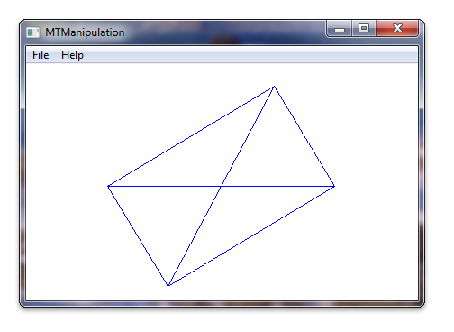

# Windows Touch Manipulation Sample (MTManipulation)

This section describes the Windows Touch Manipulation sample.

The Windows Touch Manipulation sample demonstrates how to translate, rotate, and scale an object using the [**IManipulationProcessor**](/windows/desktop/api/manipulations/nn-manipulations-imanipulationprocessor) interface and implementing an [**_IManipulationEvents**](/windows/win32/api/manipulations/nn-manipulations-_imanipulationevents) event sink. The following screen shot shows how the sample looks when it is running.



For this sample, a **CDrawingObject** class is created that can be programmatically translated, rotated, or scaled. An [**IManipulationProcessor**](/windows/desktop/api/manipulations/nn-manipulations-imanipulationprocessor) interface is instantiated. A manipulation event sink is created that accepts a pointer to the **CDrawingObject** class and the **IManipulationProcessor** interface on its constructor. A connection point to the IManipulationProcessor is created in the manipulation event sink implementation so that events raised by the **IManipulationProcessor** are received by the event sink. Touch data is fed to the **IManipulationProcessor** interface and the interface will then raise [**_IManipulationEvent**](/windows/win32/api/manipulations/nn-manipulations-_imanipulationevents) events. The event handlers in the **CManipulationEventSink** class will update the orientation of the **CDrawingObject** by calling accessors on the pointer to the **CDrawingObject**.

The following code shows how the window is set up for touch and how the **CDrawingObject** and [**IManipulationProcessor**](/windows/desktop/api/manipulations/nn-manipulations-imanipulationprocessor) are instantiated and passed to the **CManipulationEventSink** constructor.

```C++
CDrawingObject g_cRect; // CDrawingObject class holds information about the rectangle
                        // and it is responsible for painting the rectangle.

(...)

BOOL InitInstance(HINSTANCE hInstance, int nCmdShow)
{
(...)
    // Register application window for receiving multi-touch input. Use default settings.
    if (!RegisterTouchWindow(hWnd, 0))
    {
        MessageBox(hWnd, L"Cannot register application window for multi-touch input", L"Error", MB_OK);
        return FALSE;
    }
    ASSERT(IsTouchWindow(hWnd, NULL));

    // Instantiate the ManipulationProcessor object
    HRESULT hr = CoCreateInstance(__uuidof(ManipulationProcessor), NULL, CLSCTX_ALL, IID_PPV_ARGS(&g_pIManipProc));
    if (FAILED(hr))
    {
        ASSERT(SUCCEEDED(hr) && L"InitInstance: failed to instantiate the ManipulationProcessor object");
        return FALSE;
    }

    // Instantiate the event sink with the manipulation processor and pointer to the rectangle object
    g_pManipulationEventSink = new CManipulationEventSink(&g_cRect);
    if (g_pManipulationEventSink == NULL)
    {
        ASSERT(g_pManipulationEventSink && L"InitInstance: failed to instantiate the CManipulationEventSink class");
        g_pIManipProc->Release();
        g_pIManipProc = NULL;
        return FALSE;
    }

    // Establish the link between ManipulationEventSink and ManipulationProcessor
    if (!g_pManipulationEventSink->Connect(g_pIManipProc))
    {
        ASSERT(FALSE && L"InitInstance: failed to connect ManipulationEventSink and ManipulationProcessor");
        g_pIManipProc->Release();
        g_pIManipProc = NULL;
        g_pManipulationEventSink->Release();
        g_pManipulationEventSink = NULL;
        return FALSE;
    }
```

The following code shows the constructor for the manipulation event sink, **CManipulationEventSink**.

```C++
CManipulationEventSink::CManipulationEventSink(CDrawingObject* pcDrawingObject)
:   m_cRefCount(1),
    m_pConnection(NULL),
    m_dwCookie(0),
    m_pcDrawingObject(pcDrawingObject)
{
    ASSERT((pcDrawingObject != NULL) && L"CManipulationEventSink constructor: incorrect argument");
}
```

The following code shows how the event sink is connected to the manipulation processor.

```C++
bool CManipulationEventSink::Connect(IManipulationProcessor* pManipulationProcessor)
{
    // Check input arguments
    if (pManipulationProcessor == NULL)
    {
        ASSERT((pManipulationProcessor != NULL) && L"CManipulationEventSink::Create : incorrect arguments");
        return false;
    }

    // Check object state
    if ((m_dwCookie != 0) || (m_pConnection != NULL))
    {
        ASSERT((m_dwCookie == 0) && (m_pConnection == NULL) && L"CManipulationEventSink::Connect : connection already established");
        return false;
    }

    // Get the container with the connection points.
    IConnectionPointContainer* pConnectionContainer = NULL;
    HRESULT hr = pManipulationProcessor->QueryInterface(&pConnectionContainer);
    if (FAILED(hr))
    {
        ASSERT(SUCCEEDED(hr) && L"CManipulationEventSink::Connect : failed to get the container with the connection points");
        return false;
    }

    // Get a connection point.
    hr = pConnectionContainer->FindConnectionPoint(__uuidof(_IManipulationEvents), &m_pConnection);
    if (FAILED(hr))
    {
        ASSERT(SUCCEEDED(hr) && L"CManipulationEventSink::Connect : failed to get a connection point");
        pConnectionContainer->Release();
        return false;
    }

    // Release the connection container.
    pConnectionContainer->Release();

    // Advise. Establishes an advisory connection between the connection point and the
    // caller's sink object.
    hr = m_pConnection->Advise(this, &m_dwCookie);
    if (FAILED(hr))
    {
        ASSERT(SUCCEEDED(hr) && L"CManipulationEventSink::Connect : failed to Advise");
        m_pConnection->Release();
        m_pConnection = NULL;
        return false;
    }

    return true;
}
```

The following code shows how touch data is passed to the manipulation event sink.

```C++
LRESULT CALLBACK WndProc(HWND hWnd, UINT message, WPARAM wParam, LPARAM lParam)
{
(...)

    switch (message)
    {
 (...)
    // WM_TOUCH message handlers
    case WM_TOUCH:
        {
            // WM_TOUCH message can contain several messages from different contacts
            // packed together.
            // Message parameters need to be decoded:
            UINT  cInputs  = (int) wParam;      // Number of actual per-contact messages
            TOUCHINPUT* pInputs = new TOUCHINPUT[cInputs]; // Allocate the storage for the parameters of the per-contact messages
            if (pInputs == NULL)
            {
                break;
            }
            // Unpack message parameters into the array of TOUCHINPUT structures, each
            // representing a message for one single contact.
            if (GetTouchInputInfo((HTOUCHINPUT)lParam, cInputs, pInputs, sizeof(TOUCHINPUT)))
            {
                // For each contact, dispatch the message to the appropriate message
                // handler.
                for (unsigned int i = 0; i < cInputs; i++)
                {
                    if (pInputs[i].dwFlags & TOUCHEVENTF_DOWN)
                    {
                        g_pIManipProc->ProcessDown(pInputs[i].dwID, (FLOAT)pInputs[i].x, (FLOAT)pInputs[i].y);
                    }
                    else if (pInputs[i].dwFlags & TOUCHEVENTF_MOVE)
                    {
                        g_pIManipProc->ProcessMove(pInputs[i].dwID, (FLOAT)pInputs[i].x, (FLOAT)pInputs[i].y);
                    }
                    else if (pInputs[i].dwFlags & TOUCHEVENTF_UP)
                    {
                        g_pIManipProc->ProcessUp(pInputs[i].dwID, (FLOAT)pInputs[i].x, (FLOAT)pInputs[i].y);
                    }
                }
            }
            else
            {
                // error handling, presumably out of memory
                ASSERT(FALSE && L"Error: failed to execute GetTouchInputInfo");
                delete [] pInputs;
                break;
            }
            if (!CloseTouchInputHandle((HTOUCHINPUT)lParam))
            {
                // error handling, presumably out of memory
                ASSERT(FALSE && L"Error: failed to execute CloseTouchInputHandle");
                delete [] pInputs;
                break;
            }
            delete [] pInputs;

            // Force redraw of the rectangle
            InvalidateRect(hWnd, NULL, TRUE);
        }
        break;
```

The following code shows how the event handlers update the object orientation and size on manipulation delta events.

```C++
HRESULT STDMETHODCALLTYPE CManipulationEventSink::ManipulationDelta(
    /* [in] */ FLOAT /* x */,
    /* [in] */ FLOAT /* y */,
    /* [in] */ FLOAT translationDeltaX,
    /* [in] */ FLOAT translationDeltaY,
    /* [in] */ FLOAT scaleDelta,
    /* [in] */ FLOAT /* expansionDelta */,
    /* [in] */ FLOAT rotationDelta,
    /* [in] */ FLOAT /* cumulativeTranslationX */,
    /* [in] */ FLOAT /* cumulativeTranslationY */,
    /* [in] */ FLOAT /* cumulativeScale */,
    /* [in] */ FLOAT /* cumulativeExpansion */,
    /* [in] */ FLOAT /* cumulativeRotation */)
{
    m_pcDrawingObject->ApplyManipulationDelta(translationDeltaX,translationDeltaY,scaleDelta,rotationDelta);

    return S_OK;
}
```

The following code is the implementation of **ApplyManipulationDelta** in the **CDrawingObject** class.

```C++
// This function is responsible for manipulation of the rectangle.
// It is called from CManipulationEventSink class.
// in:
//      translationDeltaX - shift of the x-coordinate (1/100 of pixel units)
//      translationDeltaY - shift of the y-coordinate (1/100 of pixel units)
//             scaleDelta - scale factor (zoom in/out)
//          rotationDelta - rotation angle in radians
void CDrawingObject::ApplyManipulationDelta(
    const FLOAT translationDeltaX,
    const FLOAT translationDeltaY,
    const FLOAT scaleDelta,
    const FLOAT rotationDelta
)
{
    _ptCenter.x += (LONG) (translationDeltaX / 100.0);
    _ptCenter.y += (LONG) (translationDeltaY / 100.0);

    _dScalingFactor *= scaleDelta;

    _dRotationAngle -= rotationDelta; // we are substracting because Y-axis is down
}
```

After the **CDrawingObject**'s center points, scale factor, and rotation angle are updated, the object will draw itself transformed.

## Related topics

[Multi-touch Manipulation Application](https://github.com/microsoft/Windows-classic-samples/tree/master/Samples/Win7Samples/Touch/MTManipulation/cpp), [Manipulation and Inertia Sample](https://github.com/microsoft/Windows-classic-samples/tree/master/Samples/Win7Samples/Touch/MTManipulationInertia/cpp), [Windows Touch Samples](windows-touch-samples.md)
