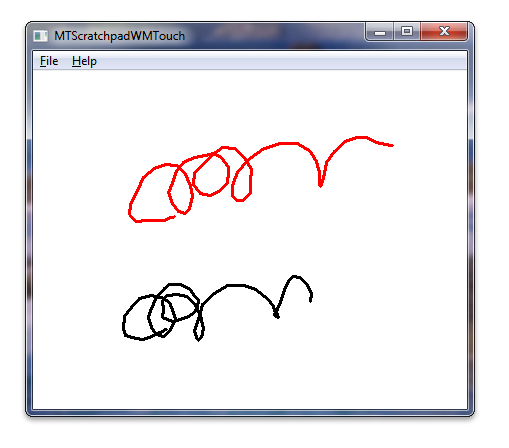

# Windows Touch Scratchpad Sample (C++)

The [Windows Touch Scratchpad sample](https://github.com/microsoft/Windows-classic-samples/tree/main/Samples/Win7Samples/Touch/MTScratchpadWMTouch) shows how to use Windows Touch messages to draw traces of the touch points to a window. The trace of the primary finger, the one that was put on the digitizer first, is drawn in black. Secondary fingers are drawn in six other colors: red, green, blue, cyan, magenta, and yellow. The following image shows how the application could look while running.



For this application, the window is registered as a touch window, touch messages are interpreted to add touch points to stroke objects, and ink strokes are rendered to the screen in the **WM_PAINT** message handler.

The following code shows how the window is registered as a touch window.

```C++
    // Register application window for receiving multitouch input. Use default settings.
    if(!RegisterTouchWindow(hWnd, 0))
    {
        MessageBox(hWnd, L"Cannot register application window for multitouch input", L"Error", MB_OK);
        return FALSE;
    }
```

The following code shows how touch messages are used to add touch points to ink strokes.

```C++
        // WM_TOUCH message handlers
        case WM_TOUCH:
            {
                // WM_TOUCH message can contain several messages from different contacts
                // packed together.
                // Message parameters need to be decoded:
                unsigned int numInputs = (unsigned int) wParam; // Number of actual per-contact messages
                TOUCHINPUT* ti = new TOUCHINPUT[numInputs]; // Allocate the storage for the parameters of the per-contact messages
                if(ti == NULL)
                {
                    break;
                }
                // Unpack message parameters into the array of TOUCHINPUT structures, each
                // representing a message for one single contact.
                if(GetTouchInputInfo((HTOUCHINPUT)lParam, numInputs, ti, sizeof(TOUCHINPUT)))
                {
                    // For each contact, dispatch the message to the appropriate message
                    // handler.
                    for(unsigned int i=0; i<numInputs; ++i)
                    {
                        if(ti[i].dwFlags & TOUCHEVENTF_DOWN)
                        {
                            OnTouchDownHandler(hWnd, ti[i]);
                        }
                        else if(ti[i].dwFlags & TOUCHEVENTF_MOVE)
                        {
                            OnTouchMoveHandler(hWnd, ti[i]);
                        }
                        else if(ti[i].dwFlags & TOUCHEVENTF_UP)
                        {
                            OnTouchUpHandler(hWnd, ti[i]);
                        }
                    }
                }
                CloseTouchInputHandle((HTOUCHINPUT)lParam);
                delete [] ti;
            }
            break;
```

The following code shows how the ink strokes are drawn to the screen in the **WM_PAINT** message handler.

```C++
        case WM_PAINT:
            hdc = BeginPaint(hWnd, &ps);
            // Full redraw: draw complete collection of finished strokes and
            // also all the strokes that are currently in drawing.
            g_StrkColFinished.Draw(hdc);
            g_StrkColDrawing.Draw(hdc);
            EndPaint(hWnd, &ps);
            break;
```

The following code shows how the stroke object renders strokes to the screen.

```C++
void CStroke::Draw(HDC hDC) const
{
    if(m_nCount < 2)
    {
        return;
    }

    HPEN hPen = CreatePen(PS_SOLID, 3, m_clr);
    HGDIOBJ hOldPen = SelectObject(hDC, hPen);
    Polyline(hDC, m_arrData, m_nCount);
    SelectObject(hDC, hOldPen);
    DeleteObject(hPen);
}
```

## Related topics

[Windows Touch Scratchpad Sample (C#)](windows-touch-scratchpad-sample-in-c---mtscratchpadwmtouchcs-.md), [Multi-touch Scratchpad Application (WM_TOUCH/C#)](https://github.com/microsoft/Windows-classic-samples/tree/master/Samples/Win7Samples/Touch/MTScratchpadWMTouch/CS), [Multi-touch Scratchpad Application (WM_TOUCH/C++)](https://github.com/microsoft/Windows-classic-samples/tree/master/Samples/Win7Samples/Touch/MTScratchpadWMTouch/cpp), [Windows Touch Samples](windows-touch-samples.md)
