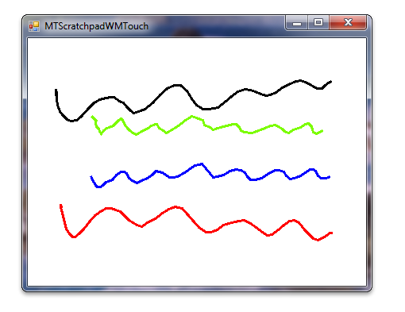

# Windows Touch Scratchpad Sample (C#)

The [Windows Touch Scratchpad sample in C#](https://github.com/microsoft/Windows-classic-samples/tree/master/Samples/Win7Samples/Touch/MTScratchpadWMTouch/CS) shows how to use Windows Touch messages to draw traces of the touch points to a window. The trace of the primary finger, the one that was put on the digitizer first, is drawn in black. Secondary fingers are drawn in six other colors: red, green, blue, cyan, magenta, and yellow. The following image shows how the application could look when it runs.



For this sample, a touchable form is created to handle [**WM_TOUCH**](wm-touchdown.md) messages. This form is inherited to enable Windows Touch on the scratchpad application. When the **WM_TOUCH** messages come to the form, they are interpreted into points and are added to the collection of strokes. The strokes collection is rendered to the Graphics object. The following code shows how the touchable form registers itself for handling **WM_TOUCH** messages, and how it handles **WM_TOUCH** messages.

```CSharp
        private void OnLoadHandler(Object sender, EventArgs e)
        {
            try
            {
                // Registering the window for multi-touch, using the default settings.
                // p/invoking into user32.dll
                if (!RegisterTouchWindow(this.Handle, 0))
                {
                    Debug.Print("ERROR: Could not register window for multi-touch");
                }
            }
            catch (Exception exception)
            {
                Debug.Print("ERROR: RegisterTouchWindow API not available");
                Debug.Print(exception.ToString());
                MessageBox.Show("RegisterTouchWindow API not available", "MTScratchpadWMTouch ERROR",
                    MessageBoxButtons.OK, MessageBoxIcon.Error, MessageBoxDefaultButton.Button1, 0);
            }
        }
(...)
        [PermissionSet(SecurityAction.Demand, Name = "FullTrust")]
        protected override void WndProc(ref Message m)
        {
            // Decode and handle WM_TOUCH message.
            bool handled;
            switch (m.Msg)
            {
                case WM_TOUCH:
                    handled = DecodeTouch(ref m);
                    break;
                default:
                    handled = false;
                    break;
            }

            // Call parent WndProc for default message processing.
            base.WndProc(ref m);

            if (handled)
            {
                // Acknowledge event if handled.
                m.Result = new System.IntPtr(1);
            }
        }
```

The following code shows how the Windows Touch message is interpreted and the data is added to stroke collections.

```CSharp
        private bool DecodeTouch(ref Message m)
        {
            // More than one touchinput may be associated with a touch message,
            // so an array is needed to get all event information.
            int inputCount = LoWord(m.WParam.ToInt32()); // Number of touch inputs, actual per-contact messages

            TOUCHINPUT[] inputs; // Array of TOUCHINPUT structures
            inputs = new TOUCHINPUT[inputCount]; // Allocate the storage for the parameters of the per-contact messages

            // Unpack message parameters into the array of TOUCHINPUT structures, each
            // representing a message for one single contact.
            if (!GetTouchInputInfo(m.LParam, inputCount, inputs, touchInputSize))
            {
                // Get touch info failed.
                return false;
            }

            // For each contact, dispatch the message to the appropriate message
            // handler.
            bool handled = false; // Boolean, is message handled
            for (int i = 0; i < inputCount; i++)
            {
                TOUCHINPUT ti = inputs[i];

                // Assign a handler to this message.
                EventHandler<WMTouchEventArgs> handler = null;     // Touch event handler
                if ((ti.dwFlags & TOUCHEVENTF_DOWN) != 0)
                {
                    handler = Touchdown;
                }
                else if ((ti.dwFlags & TOUCHEVENTF_UP) != 0)
                {
                    handler = Touchup;
                }
                else if ((ti.dwFlags & TOUCHEVENTF_MOVE) != 0)
                {
                    handler = TouchMove;
                }

                // Convert message parameters into touch event arguments and handle the event.
                if (handler != null)
                {
                    // Convert the raw touchinput message into a touchevent.
                    WMTouchEventArgs te = new WMTouchEventArgs(); // Touch event arguments

                    // TOUCHINFO point coordinates and contact size is in 1/100 of a pixel; convert it to pixels.
                    // Also convert screen to client coordinates.
                    te.ContactY = ti.cyContact/100;
                    te.ContactX = ti.cxContact/100;
                    te.Id = ti.dwID;
                    {
                        Point pt = PointToClient(new Point(ti.x/100, ti.y/100));
                        te.LocationX = pt.X;
                        te.LocationY = pt.Y;
                    }
                    te.Time = ti.dwTime;
                    te.Mask = ti.dwMask;
                    te.Flags = ti.dwFlags;

                    // Invoke the event handler.
                    handler(this, te);

                    // Mark this event as handled.
                    handled = true;
                }
            }

            CloseTouchInputHandle(m.LParam);

            return handled;
        }
    }
```

The following code shows how a stroke collection is displayed.

```CSharp
        public void Draw(Graphics graphics)
        {
            if ((points.Count < 2) || (graphics == null))
            {
                return;
            }

            Pen pen = new Pen(color, penWidth);
            graphics.DrawLines(pen, (Point[]) points.ToArray(typeof(Point)));
        }
```

The following code shows how the individual stroke objects display themselves with a Graphics object.

```CSharp
        public void Draw(Graphics graphics)
        {
            if(points.Count < 2 || graphics == null)
            {
                return;
            }

            Pen pen = new Pen(color, penWidth);
            graphics.DrawLines(pen, (Point[]) points.ToArray(typeof(Point)));
        }
```

## Related topics

[Windows Touch Scratchpad Sample (C++)](windows-touch-scratchpad-sample--mtscratchpadwmtouch-.md), [Multi-touch Scratchpad Application (WM_TOUCH/C#)](https://github.com/microsoft/Windows-classic-samples/tree/master/Samples/Win7Samples/Touch/MTScratchpadWMTouch/CS), [Multi-touch Scratchpad Application (WM_TOUCH/C++)](https://github.com/microsoft/Windows-classic-samples/tree/master/Samples/Win7Samples/Touch/MTScratchpadWMTouch/cpp), [Windows Touch Samples](windows-touch-samples.md)

