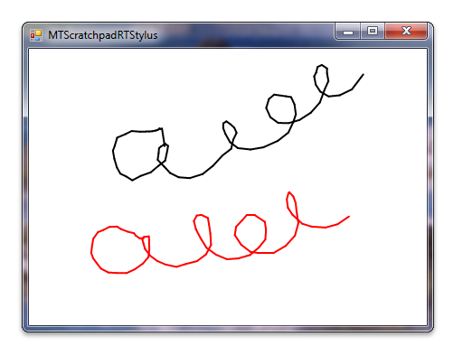

# Windows Touch Scratchpad using the Real-Time Stylus in C# Sample (MTScratchpadRTStylusCS)

This section describes the Windows Touch Scratchpad sample when using the real-time stylus in C#.

The Windows Touch Scratchpad sample shows how to use Windows Touch messages to draw traces of the touch points to a window. The trace of the primary finger, the one that was put on the digitizer first, is drawn in black. Secondary fingers are drawn in six other colors: red, green, blue, cyan, magenta and yellow. The following screen shot shows how the application could look while running.



For this sample, the Real-Time Stylus (RTS) object is created and support for multiple contact points is enabled. A DynamicRenderer plug-in is added to the RTS to render content. A plug-in, EventHandlerPlugIn, is implemented to track down the number of fingers and to change the color that the dynamic renderer is drawing. With both plug-ins in the RTS plug-in stack, the Windows Touch Scratchpad application will render the primary contact in black and the rest of the contacts in the various colors.

The following code shows how the EventHandlerPlugIn increments and decrements a count of the number of contacts and sets the color of the dynamic renderer.


```CSharp
        public void StylusDown(RealTimeStylus sender, StylusDownData data)
        {
            // Set new stroke color to the DrawingAttributes of the DynamicRenderer
            // If there are no fingers down, this is a primary contact
            dynamicRenderer.DrawingAttributes.Color = touchColor.GetColor(cntContacts == 0);

            ++cntContacts;  // Increment finger-down counter
        }

        public void StylusUp(RealTimeStylus sender, StylusUpData data)
        {
            --cntContacts;  // Decrement finger-down counter
        }
    
```


The following code shows how the RTS is created with multiple contact point support.


```CSharp
        private void OnLoadHandler(Object sender, EventArgs e)
        {
            // Create RealTimeStylus object and enable it for multi-touch
            realTimeStylus = new RealTimeStylus(this);
            realTimeStylus.MultiTouchEnabled = true;

            // Create DynamicRenderer and event handler, and add them to the RTS object as synchronous plugins
            dynamicRenderer = new DynamicRenderer(this);
            eventHandler = new EventHandlerPlugIn(this.CreateGraphics(), dynamicRenderer);
            realTimeStylus.SyncPluginCollection.Add(eventHandler);
            realTimeStylus.SyncPluginCollection.Add(dynamicRenderer);

            // Enable RTS and DynamicRenderer object, and enable auto-redraw of the DynamicRenderer
            realTimeStylus.Enabled = true;
            dynamicRenderer.Enabled = true;
            dynamicRenderer.EnableDataCache = true;
        }
```


After the DynamicRenderer object's color has changed and strokes have been drawn, a call to DynamicRenderer::Refresh will cause the new strokes to appear. The following code shows how this is performed in the OnPaintHandler method.


```CSharp
        private void OnPaintHandler(object sender, PaintEventArgs e)
        {
            // Erase the background
            Brush brush = new SolidBrush(SystemColors.Window);
            e.Graphics.FillRectangle(brush, ClientRectangle);

            // Ask DynamicRenderer to redraw itself
            dynamicRenderer.Refresh();
        }
    
```


## Related topics

<dl> <dt>

[Windows Touch Samples](windows-touch-samples.md)
</dt> </dl>

 

 


