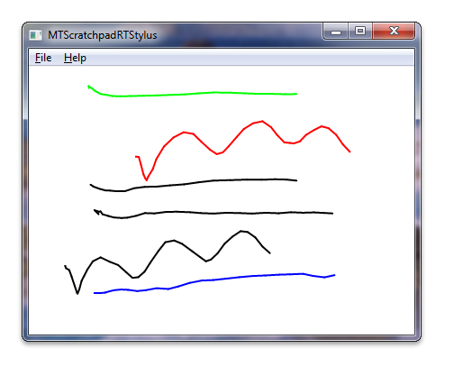

# Windows Touch Scratchpad using the Real-time Stylus Sample (C++)

The Windows Touch Scratchpad sample ([MTScratchpadRTStylus](https://github.com/microsoft/Windows-classic-samples/tree/master/Samples/Win7Samples/Touch/MTScratchpadRTStylus/cpp)) shows how to use Windows Touch messages to draw traces of the touch points to a window. The trace of the primary finger, the one that was put on the digitizer first, is drawn in black. Secondary fingers are drawn in six other colors: red, green, blue, cyan, magenta, and yellow. The following screen shot shows how the application could look while running.



For this sample, the Real-time Stylus (RTS) object is created and support for multiple contact points is enabled. A DynamicRenderer plug-in is added to the RTS to render content. A plug-in, **CSyncEventHandlerRTS**, is implemented to track down the number of fingers and to change the color that the dynamic renderer is drawing. With both plug-ins in the RTS plug-in stack, the Windows Touch Scratchpad application will render the primary contact in black and the rest of the contacts in the various colors.

The following code shows how the RTS object is created with support for multiple contact points.

```C++
IRealTimeStylus* CreateRealTimeStylus(HWND hWnd)
{
    // Check input argument
    if (hWnd == NULL)
    {
        ASSERT(hWnd && L"CreateRealTimeStylus: invalid argument hWnd");
        return NULL;
    }

    // Create RTS object
    IRealTimeStylus* pRealTimeStylus = NULL;
    HRESULT hr = CoCreateInstance(CLSID_RealTimeStylus, NULL, CLSCTX_ALL, IID_PPV_ARGS(&pRealTimeStylus));
    if (FAILED(hr))
    {
        ASSERT(SUCCEEDED(hr) && L"CreateRealTimeStylus: failed to CoCreateInstance of RealTimeStylus");
        return NULL;
    }

    // Attach RTS object to a window
    hr = pRealTimeStylus->put_HWND((HANDLE_PTR)hWnd);
    if (FAILED(hr))
    {
        ASSERT(SUCCEEDED(hr) && L"CreateRealTimeStylus: failed to set window handle");
        pRealTimeStylus->Release();
        return NULL;
    }

    // Register RTS object for receiving multi-touch input.
    IRealTimeStylus3* pRealTimeStylus3 = NULL;
    hr = pRealTimeStylus->QueryInterface(&pRealTimeStylus3);
    if (FAILED(hr))
    {
        ASSERT(SUCCEEDED(hr) && L"CreateRealTimeStylus: cannot access IRealTimeStylus3");
        pRealTimeStylus->Release();
        return NULL;
    }
    hr = pRealTimeStylus3->put_MultiTouchEnabled(TRUE);
    if (FAILED(hr))
    {
        ASSERT(SUCCEEDED(hr) && L"CreateRealTimeStylus: failed to enable multi-touch");
        pRealTimeStylus->Release();
        pRealTimeStylus3->Release();
        return NULL;
    }
    pRealTimeStylus3->Release();

    return pRealTimeStylus;
}
```

The following code shows how the dynamic renderer plug-in is created and added to the RTS.

```C++
IDynamicRenderer* CreateDynamicRenderer(IRealTimeStylus* pRealTimeStylus)
{
    // Check input argument
    if (pRealTimeStylus == NULL)
    {
        ASSERT(pRealTimeStylus && L"CreateDynamicRenderer: invalid argument RealTimeStylus");
        return NULL;
    }

    // Get window handle from RTS object
    HWND hWnd = NULL;
    HRESULT hr = pRealTimeStylus->get_HWND((HANDLE_PTR*)&hWnd);
    if (FAILED(hr))
    {
        ASSERT(SUCCEEDED(hr) && L"CreateDynamicRenderer: failed to get window handle");
        return NULL;
    }

    // Create DynamicRenderer object
    IDynamicRenderer* pDynamicRenderer = NULL;
    hr = CoCreateInstance(CLSID_DynamicRenderer, NULL, CLSCTX_ALL, IID_PPV_ARGS(&pDynamicRenderer));
    if (FAILED(hr))
    {
        ASSERT(SUCCEEDED(hr) && L"CreateDynamicRenderer: failed to CoCreateInstance of DynamicRenderer");
        return NULL;
    }

    // Add DynamicRenderer to the RTS object as a synchronous plugin
    IStylusSyncPlugin* pSyncDynamicRenderer = NULL;
    hr = pDynamicRenderer->QueryInterface(&pSyncDynamicRenderer);
    if (FAILED(hr))
    {
        ASSERT(SUCCEEDED(hr) && L"CreateDynamicRenderer: failed to access IStylusSyncPlugin of DynamicRenderer");
        pDynamicRenderer->Release();
        return NULL;
    }

    hr = pRealTimeStylus->AddStylusSyncPlugin(
        0,                      // insert plugin at position 0 in the sync plugin list
        pSyncDynamicRenderer);  // plugin to be inserted - DynamicRenderer
    if (FAILED(hr))
    {
        ASSERT(SUCCEEDED(hr) && L"CreateDynamicRenderer: failed to add DynamicRenderer to the RealTimeStylus plugins");
        pDynamicRenderer->Release();
        pSyncDynamicRenderer->Release();
        return NULL;
    }

    // Attach DynamicRenderer to the same window RTS object is attached to
    hr = pDynamicRenderer->put_HWND((HANDLE_PTR)hWnd);
    if (FAILED(hr))
    {
        ASSERT(SUCCEEDED(hr) && L"CreateDynamicRenderer: failed to set window handle");
        pDynamicRenderer->Release();
        pSyncDynamicRenderer->Release();
        return NULL;
    }

    pSyncDynamicRenderer->Release();

    return pDynamicRenderer;
}
```

The following code changes the stylus stroke color for the **StylusDown** event handler in the **CSyncEventHandlerRTS**, a custom RTS plug-in.

```C++
HRESULT CSyncEventHandlerRTS::StylusDown(
    IRealTimeStylus* /* piRtsSrc */,
    const StylusInfo* /* pStylusInfo */,
    ULONG /* cPropCountPerPkt */,
    LONG* /* pPacket */,
    LONG** /* ppInOutPkt */)
{
    // Get DrawingAttributes of DynamicRenderer
    IInkDrawingAttributes* pDrawingAttributesDynamicRenderer;
    HRESULT hr = g_pDynamicRenderer->get_DrawingAttributes(&pDrawingAttributesDynamicRenderer);
    if (FAILED(hr))
    {
        ASSERT(SUCCEEDED(hr) && L"CSyncEventHandlerRTS::StylusDown: failed to get RTS's drawing attributes");
        return hr;
    }

    // Set new stroke color to the DrawingAttributes of the DynamicRenderer
    // If there are no fingers down, this is a primary contact
    hr = pDrawingAttributesDynamicRenderer->put_Color(GetTouchColor(m_nContacts == 0));
    if (FAILED(hr))
    {
        ASSERT(SUCCEEDED(hr) && L"CSyncEventHandlerRTS::StylusDown: failed to set color");
        pDrawingAttributesDynamicRenderer->Release();
        return hr;
    }

    pDrawingAttributesDynamicRenderer->Release();

    ++m_nContacts;  // Increment finger-down counter

    return S_OK;
}
```

When the *m_nContacts* value is incremented, it will change the color set in the dynamic renderer. Strokes that are not the primary contact will be drawn with different colors.

## Related topics

[Multi-touch Scratchpad Application (RTS/C#)](https://github.com/microsoft/Windows-classic-samples/tree/master/Samples/Win7Samples/Touch/MTScratchpadRTStylus/CS), [Multi-touch Scratchpad Application (RTS/C++)](https://github.com/microsoft/Windows-classic-samples/tree/master/Samples/Win7Samples/Touch/MTScratchpadRTStylus/cpp), [Windows Touch Samples](windows-touch-samples.md)
