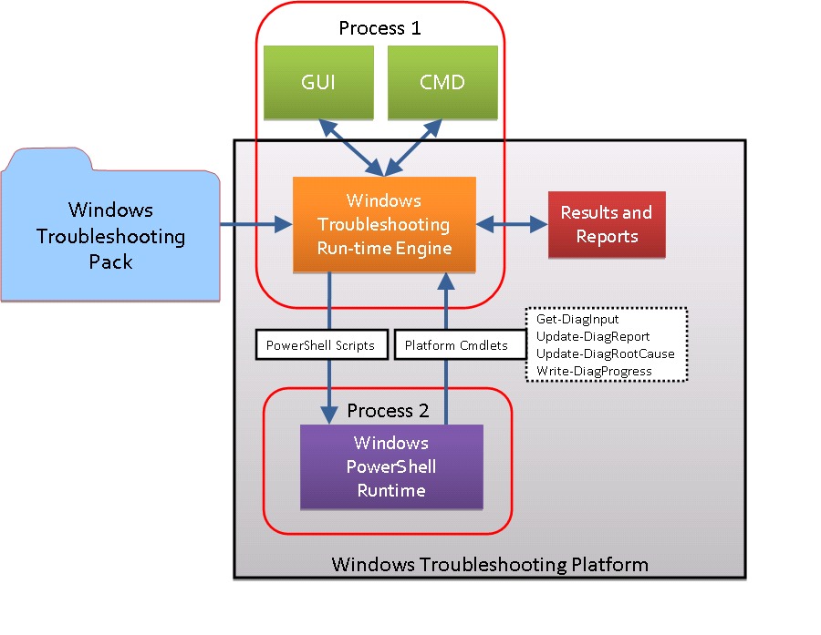
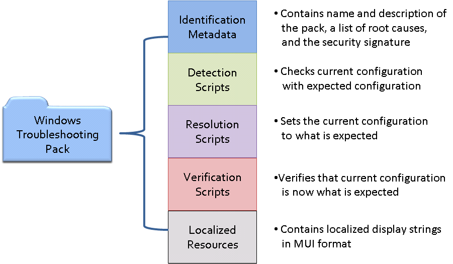

# About WTP

Windows Troubleshooting Platform (WTP) provides ISVs, OEMs, and administrators the ability to write troubleshooting packs that let home users and information workers troubleshoot and resolve their PC problems. A troubleshooting pack guides the user through the steps needed to troubleshoot and fix a problem. A user or an application can initiate a troubleshooting pack.

An application can initiate troubleshooting when it cannot accomplish a task. For example, if an application fails to access a remote share or Web site, the application could then initiate troubleshooting to determine whether the network is running instead of displaying an error message and leaving it up to the user to manually troubleshoot the issue.

In addition to following the traditional model of problem detection and resolution, a troubleshooting pack can also compare a well-known configuration that is known to work with the current conditions on the computer. Based on the results of this comparison, a set of actions can be taken if conflicts are found. For example, a troubleshooting pack that detects and fixes audio sound problems should check for all conditions that could cause sound problems such as if the volume is set to zero, the sound has been muted, a audio driver is present, and if the right hardware is present. If the sound is muted, the troubleshooting pack could restore the sound.

## WTP architecture

The following diagram shows the WTP architecture. WTP consists of a Windows Troubleshooting run-time engine, results and reports, four troubleshooting cmdlets, and a hosted Windows PowerShell runtime.

When a user or an application invokes a troubleshooting pack to run, the troubleshooting run-time engine reads the metadata from the manifest, verifies that the troubleshooting pack is allowed to run on the computer and if so, displays some of the metadata to the user such as the name of the troubleshooting pack and the publisher. If the security check fails, the engine stops running the troubleshooting pack immediately.

The run-time engine then gets the detection script from the troubleshooting pack and runs it in the hosted Windows PowerShell runtime. If the script needs to get information from the user, it uses the [Get-DiagInput](get-diaginput-cmdlet.md) cmdlet to display the interaction and get the user's input. The diagram also shows the process boundaries, where Windows PowerShell is run in a separate process from WTP. This is done for reliability to ensure that WTP does not experience any side effects caused by poorly written scripts.

When WTP runs a troubleshooting pack, it creates a results report and debug report. The results report contains a list of the root causes being detected, the root causes that were detected, and the status of any resolutions that were applied. The debug report contains the same information as the results report but it also contains details that are useful to a developer, such as any exceptions that were logged during execution.

## Components of a troubleshooting pack

The following diagram shows the components that you include in your troubleshooting pack.

The design of a troubleshooting pack is based on three steps or phases: detect the problem (troubleshooting), resolve the problem (resolution), and verify the resolution (verification). You use a manifest to describe each phase. Each phase is represented as a set of Windows PowerShell scripts. When a user invokes a troubleshooting pack, WTP instantiates a Windows PowerShell runspace to run the scripts. The troubleshooter scripts determine whether any of the root causes that can be detected by the troubleshooting pack exist. For each root cause that is found to exist, WTP runs the resolver scripts used to fix the root cause. The resolver scripts will try to fix the root causes that were found or provide instructions to the user on how to fix the root cause. After running the resolvers, WTP runs the verifier scripts in the troubleshooting pack. The verifier scripts will determine whether the resolution phase successfully fixed the root causes.

WTP helps ensure a secure troubleshooting experience because it will not run any troubleshooting pack unless it is signed by a certificate that matches a certificate in the trusted store. It will also show the user the publisher of the troubleshooting pack. The publisher is derived from the certificate. WTP security is Group Policy–enabled so enterprises have increased control and flexibility for the IT administrator.

Localization of troubleshooting packs is fully supported using standard resource files. WTP supports adding languages as they become available and does not require all languages to be shipped at the same time.

## Running a troubleshooting pack

You can run the troubleshooting pack through the WTP wizard (MSDT.exe) or from the Windows PowerShell command line. The wizard provides a standard user experience by providing wizard pages with standard interactions that your troubleshooting pack can use. The wizard checks for all root causes but the user can decide which root causes to resolve. Running a troubleshooting pack from the command line is primarily for the IT administrator who needs more control of what is run and how it is run.

An administrator can use the [Get-TroubleshootingPack](get-troubleshootingpack-cmdlet.md) cmdlet to discover the purpose of a troubleshooting pack before running it. For example, it can discover the root causes that it can detect and resolve, any user input that is required from the user, the platform on which it can run, and if it needs to run in an elevated security mode.

Windows PowerShell supports running troubleshooting packs remotely. To run a troubleshooting pack that contains user interactions remotely, you will need to provide an answer file that contains the answers to the questions that the troubleshooting pack asks. To create the answer file, use the [Get-TroubleshootingPack](get-troubleshootingpack-cmdlet.md) cmdlet. You can then pass the answer file to the troubleshooting pack when you run it.

## Related topics

<dl> <dt>

[Using WTP](using-wtp.md)
</dt> <dt>

[WTP Reference](windows-troubleshooting-reference.md)
</dt> </dl>

 

 

