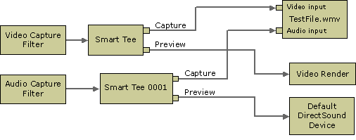

# Capturing Directly from a Device to an ASF File (QASF)

\[The feature associated with this page, [Windows Media Format 11 SDK](/windows/win32/wmformat/windows-media-format-11-sdk), is a legacy feature. It has been superseded by [Source Reader](/windows/win32/medfound/source-reader) and [Sink Writer](/windows/win32/medfound/sink-writer). **Source Reader** and **Sink Writer** have been optimized for Windows 10 and Windows 11. Microsoft strongly recommends that new code use **Source Reader** and **Sink Writer** instead of **Windows Media Format 11 SDK**, when possible. Microsoft suggests that existing code that uses the legacy APIs be rewritten to use the new APIs if possible.\]

When capturing audio or video directly to an ASF file, the filter graph looks something like the following diagram, depending on the type of capture device being used.

The DirectShow SDK documentation describes in detail how to create capture graphs, but there is one important point to remember when creating capture graphs using the WM ASF Writer: the WM ASF Writer will not run unless all of its pins are connected. If you configure the WM ASF Writer with the default system profile (not recommended), or any profile with audio and video streams, then it will create an input pin for each stream and each of those pins must be connected. If you do not intend to capture audio, for example, then be sure to configure the filter with a video-only profile so that no audio pin is created.

 

 

