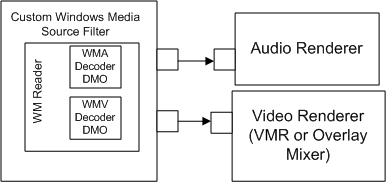
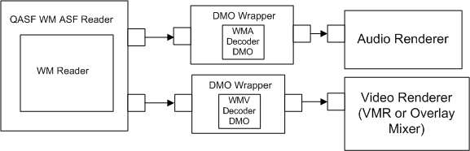

# Enabling DirectX Video Acceleration

This section describes how to enable Microsoft® DirectX® Video Acceleration when playing streamed content in a custom player.

## Background

DirectX Video Acceleration (DirectX VA) is an API specification for hardware acceleration of 2-D decoding operations. It enables software decoders to offload certain CPU-intensive operations to the graphics card for processing. For end users, this makes possible high-bit-rate video such as full-screen DVD playback on older computers equipped with DirectX VA-compatible graphics cards.

Beginning with the Windows Media Format 9 Series SDK, the DMO Wrapper filter supports DirectX VA. This means that, for local playback, applications can use the WM ASF Reader filter to play Windows Media-based content and DirectX VA hardware acceleration will be invoked automatically if the graphics card supports it. However, the WM ASF Reader filter does not support playback of streamed content. Therefore, if you want to support DirectX VA when playing streamed content in a custom player, you must use an alternate mechanism, which is the one used by Windows Media Player beginning with the Windows Media 9 Series.

Because Windows Media Player was designed before the QASF filters had been developed, Windows Media Player has its own source filter, based on the Windows Media Format SDK, for playing Windows Media-based content. The WMP Windows Media Source Filter delivers decompressed data downstream directly to the audio and video renderers. By contrast, the WM ASF Reader delivers compressed content downstream to the Windows Media Decoder DirectX Media Objects (DMOs), which are hosted inside the DMO Wrapper. The following diagrams illustrate the differences between the WM ASF Reader and the WMP Windows Media Source Filter.





To enable DirectX VA for streamed content, you must create a custom source filter like the one in the top diagram. Basically, this filter will use the Windows Media Format SDK to instantiate a WM Reader object, decompress the samples, and send them downstream on its output pins. This discussion assumes that you have created the source filter already and are now ready to implement the DirectX VA support.

To enable DirectX VA, the basic task of the source filter is to provide the Video Renderer and the WMV Decoder DMO with the interfaces they will need to negotiate the DirectX VA connection. The source filter does not participate in those negotiations. After streaming starts, the only DirectX VA-related task that the source filter can perform is to modify the time stamps on the video samples before the WMV decoder delivers them to the Video Renderer. The primary reason for doing this is to provide custom timeline control beyond what the standard DirectShow® interfaces enable.

Three interfaces are defined to enable the necessary communications between the Windows Media Format SDK, the player's source filter, the Windows Media Video decoder DMO, and the Overlay Mixer or Video Mixing Renderer. These interfaces are described in the following table.


| Interface                                                        | Description                                                                                                                                                                                        |
|------------------------------------------------------------------|----------------------------------------------------------------------------------------------------------------------------------------------------------------------------------------------------|
| [**IWMCodecAMVideoAccelerator**](/previous-versions/windows/desktop/api/wmdxva/nn-wmdxva-iwmcodecamvideoaccelerator) | Exposed by the Windows Media Decoder DMO and called by a media player's source filter to set up the various connections required to enable DirectX VA for decoding of Windows Media Video content. |
| [**IWMPlayerTimestampHook**](/previous-versions/windows/desktop/api/wmdxva/nn-wmdxva-iwmplayertimestamphook)         | Implemented on the player's source filter. It enables the filter to modify the time stamps on the video samples before delivering them downstream.                                                 |
| [**IWMReaderAccelerator**](/previous-versions/windows/desktop/api/wmsdkidl/nn-wmsdkidl-iwmreaderaccelerator)             | Implemented on the WM Reader object. It is called by a player source filter to obtain interfaces from the decoder DMO.                                                                             |


 

## Order of Operations in DirectX VA–enabled Playback

This section describes the general order of operations at run time for a DirectX VA-enabled player and its source filter. The components referred to in this section are:

-   A third-party media player, referred to as the player.
-   A custom source filter, instantiated by the player, that uses the Windows Media Format SDK to decompress Windows Media-based content.
-   The video output pin of the player's source filter, referred to as the output pin.
-   The DirectShow video playback filter graph, referred to as the graph.
-   The Video Mixing Renderer, referred to as the VMR.
-   The Windows Media Format SDK Asynchronous Reader object, referred to as the reader.
-   The Windows Media Video Decoder DirectX Media Object, referred to as the decoder DMO.

The order of operations is as follows:

1.  The player instantiates its source filter and a reader object. The reader creates a video decoder DMO and sets the (compressed) input type on it. This must happen before the player attempts to configure its video playback graph because the SDK and the decoder DMO must be involved in the negotiation process with the graph, and the DMO must know the input format during step 9.
2.  The player calls **IGraphBuilder::Render**, providing it the video source filter's output pin. At this point, the DirectShow filter graph manager tries to connect the VMR to the player's video source filter.
3.  The filter graph manager calls **IPin::Connect** on the output pin of the player's video source filter.

Steps 4 through 10 occur inside of **IPin::Connect**.

1.  The source filter obtains the **IWMCodecAMVideoAccelerator** interface from the reader's **IWMReaderAccelerator::GetCodecInterface** method. If the codec does not support DirectX VA, the call to **GetCodecInterface** may fail. In this case, negotiation proceeds as usual, without DirectX VA support.
2.  The source filter passes the **IAMVideoAccelerator** pointer from the pin passed into **Connect** to the decoder DMO through **IWMCodecAMVideoAccelerator::SetAcceleratorInterface**.
3.  The source filter then delegates the remainder of the **IPin::Connect** operation to the **CBaseOutputPin::Connect** method. The format enumeration with the SDK proceeds as it does today. If the codec supports DirectX VA for the content being connected, the codec DMO presents those DirectX VA subtypes first, prior to the YUV and RGB types supported. If DirectX VA support is available, steps 7 through 11 are attempted in the context of a DirectX VA subtype. The following code snippet shows how to identify a DirectX VA media subtype.
    ```C++
    bool IsDXVASubtype( AM_MEDIA_TYPE * pmt )
    {
        // All DXVA types have the same last 3 DWORDs.
        // guidDXVA is the base GUID for all DXVA subtypes.

        GUID guidDXVA = { 0x00000000, 0xa0c7, 0x11d3, { 0xb9,0x84,0x00,0xc0,0x4f,0x2e,0x73,0xc5 } };

        unsigned long const * plguid;
        unsigned long const * plguidDXVA;
        plguid = (unsigned long const *)&pmt->subtype;
        plguidDXVA = (unsigned long *)&guidDXVA;

        if( ( plguid[1] == plguidDXVA[1] ) &&
            ( plguid[2] == plguidDXVA[2] ) &&
            ( plguid[3] == plguidDXVA[3] ) )
        {
            return true;
        }

        return false;
    }
    
    ```

    

4.  The **CBaseOutputPin::Connect** implementation calls **IPin::CompleteConnect** during step 3. If a DirectX VA subtype is being considered, the DirectX VA negotiation is attempted. The output pin calls **IWMCodecAMVideoAccelerator::NegotiateConnection**, passing it the current output media type.
5.  The decoder DMO performs the required negotiation with the VMR through the **IAMVideoAccelerator** interface, and returns the video subtype GUID that the two have agreed on. The output pin delegates all **IAMVideoAcceleratorNotify** calls received during this process to the decoder DMO's **IAMVideoAcceleratorNotify** interface, which can also be obtained through the **IWMReaderAccelerator::GetCodecInterface** method.
6.  If **NegotiateConnection** succeeds, the output pin calls **IWMCodecAMVideoAccelerator::SetPlayerNotify** with an **IWMPlayerTimestampHook** interface. This hook allows the source filter to update the time stamps on the samples before they are handed to the renderer.
7.  The source filter calls **IWMReaderAccelerator::Notify** with the negotiated media type. This allows the reader to update its internal variables and commit to DirectX VA. This is the last place the codec or reader can fail. If any of the above steps fail, the source filter should return to step 3 and try the next type enumerated by the reader.
8.  Playback starts. The reader ignores output buffers from the decoder DMO if the connection output type is DirectX VA.
9.  When **IPin::Disconnect** occurs, the source filter calls **IWMCodecAMVideoAccelerator::SetAcceleratorInterface** with a **NULL**. This breaks the DirectX VA connection between the codec and the renderer.

## Related topics

<dl> <dt>

[**Reading ASF Files**](reading-asf-files.md)
</dt> </dl>

 

 


