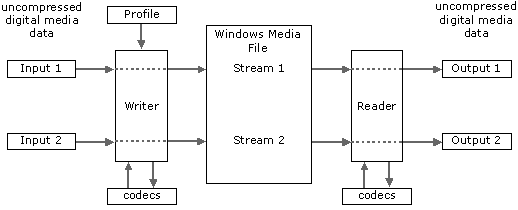
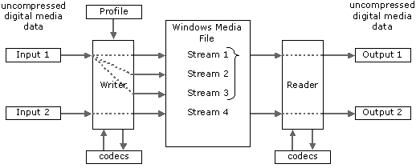
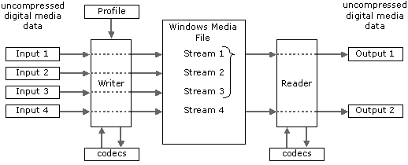

# Inputs, Streams, and Outputs

An "input" in this documentation is any digital media data stream (such as audio or video) that your application delivers to the writer object from a source by using appropriate APIs. Inputs must be delivered in a supported format. Several standard RGB and YUV formats are supported as input, and the audio codecs support PCM. If a specified input format is not supported natively by the codec, the writer object will instantiate either an audio or video helper object that is capable of converting a wide variety of formats into formats the codec can accept. For audio inputs, the helper object will adjust the bit depth, sample rate, and number of channels as necessary. For video inputs, the video helper object will perform color-space conversions and rectangle-size adjustments. In some cases, compressed audio and video data can be passed in an input stream. An input may be of some other media type besides audio and video, such as text, script commands, still images, or arbitrary file data.

An "output" in this documentation refers to data that the reader object passes to an application for rendering. An output equates to a single stream at the time of playback. If you are using mutual exclusion, all of the mutually exclusive streams share a single output. Typically, output data is in the form of uncompressed audio or video data, although it can contain any type of data. Supported video output formats are listed elsewhere in this documentation.

The term "stream" in this documentation refers to data in an ASF file, as opposed to (1) the input source data before it is processed by the writer object, and (2) the output data after it is decompressed by the reader object. An ASF stream contains data that comes from a single input on the writer object, although more than one stream can be created from the same input. A stream has the same format and compression settings from beginning to end. A simple ASF file has two streams, one for audio and one for video. A more complex file might have two audio streams and several video streams. The audio streams might have the same compression settings but contain different content, such as a narration in different languages. The video streams might contain the same content, but have different compression settings. The media format and compression settings that the writer object will apply to each stream are specified in the profile.

The relationship between inputs, streams, and outputs can be of three basic types. The following three diagrams illustrate the relationships.

In the most basic relationship, which is a profile without any mutual exclusion, each input is processed by the writer and inserted in the ASF file as a single stream. On playback, the reader reads the stream and delivers uncompressed samples as a single output, as shown in the following diagram.

A more complex relationship occurs when multiple bit rate mutual exclusion is used. In this case, a single input is processed by the writer and encoded at several bit rates. Each encoding of the data is inserted in the ASF file as a separate stream. On playback, the reader determines which stream to decompress based upon the available bandwidth. The reader then reads the selected stream and delivers uncompressed samples as a single output, as shown in the following diagram.

The third type of relationship can occur when a language-based or custom mutual exclusion is used. In this relationship, multiple inputs are processed by the reader and each is inserted into the ASF file as an individual stream. On playback, your application manually selects which stream to decompress based upon logic you provide. The reader then reads the selected stream and delivers uncompressed samples as a single output. This process can be used for including soundtracks in multiple languages. The following diagram illustrates this process.

There is some variation in the relationships described previously. For example, a file can contain all three relationships, or one or two of them. It is also possible for some inputs to be compressed, in which case the writer performs no additional compression. The reader, also, can deliver compressed samples. But when it does, you must access them by stream number, not by output number.

> [!Note]  
> Inputs, steams, and outputs are all assigned numbers by the objects of the Windows Media Format SDK. Streams have a stream number, which is 1-based, that you define in the profile. Each stream is also assigned a stream index for use in enumerating streams in a profile. None of these numbers are guaranteed to be consistent with each other. That is, input number 1 may not correspond with stream number 1, stream number 1 may not correspond with stream index 1, and so on.

 

## Related topics

<dl> <dt>

[**Concepts**](concepts.md)
</dt> <dt>

[**Mutual Exclusion**](mutual-exclusion.md)
</dt> </dl>

 

 

