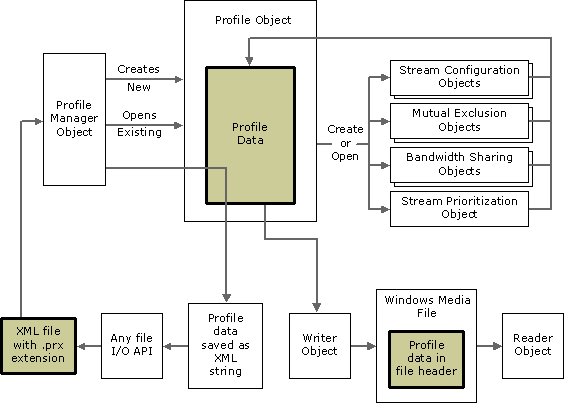

# Profiles

\[The feature associated with this page, [Windows Media Format 11 SDK](/windows/win32/wmformat/windows-media-format-11-sdk), is a legacy feature. It has been superseded by [Source Reader](/windows/win32/medfound/source-reader) and [Sink Writer](/windows/win32/medfound/sink-writer). **Source Reader** and **Sink Writer** have been optimized for Windows 10 and Windows 11. Microsoft strongly recommends that new code use **Source Reader** and **Sink Writer** instead of **Windows Media Format 11 SDK**, when possible. Microsoft suggests that existing code that uses the legacy APIs be rewritten to use the new APIs if possible.\]

A profile is a collection of data that describes the configuration of an ASF file. At a minimum, a profile must contain configuration settings for a single stream.

The stream information in a profile contains the bit rate, buffer window, and media properties for the stream. The stream information for audio and video describes exactly how the media is configured in the file, including which codec (if any) will be used to compress the data.

A profile also contains information about the various ASF file features that will be used in files created with it. These include [Mutual Exclusion](mutual-exclusion.md), [Stream Prioritization](stream-prioritization.md), [Bandwidth Sharing](bandwidth-sharing.md), and [Data Unit Extensions](data-unit-extensions.md).

Previous versions of the Windows Media Format SDK provided preconfigured system profiles, which could be used to create common types of files, or altered slightly to suit the needs of your application. System profiles are not supported for the Windows Media 9 Series codecs. This is because the number of "common" types of files has grown exponentially with the addition of new features. It is expected that virtually every content creator has needs that go beyond the simple solutions provided by system profiles. You can still use the old system profiles as a starting place. For more information, see [Using System Profiles](using-system-profiles.md).

You must supply the writer with a profile for every file you write. You can specify a profile to use with the writer by calling [**IWMWriter::SetProfile**](/previous-versions/windows/desktop/api/Wmsdkidl/nf-wmsdkidl-iwmwriter-setprofile).

Profile data exists in several different forms that can be used by the Windows Media Format SDK. Profile information can also be accessed in several ways. This can lead to confusion about what a profile is and how it is used.

The following diagram shows how profile data is used in the SDK.

Profile data takes three different forms: data contained within a profile object in an application, an XML file on disk, and data in the header of an ASF file. Each of these forms of data is shown as a shaded rectangle in the diagram.

## Data in a Profile Object

When you are editing a profile, you use a profile object, which encapsulates all of the profile data. You can create an empty profile object by using the profile manager object. You can also use the profile manager object to load existing profile data into a profile object.

Most profile data must be added and manipulated through the use of objects representing individual parts of the profile. These include stream configuration objects, mutual exclusion objects, bandwidth sharing objects, and a stream prioritization object. Each of these object types can be created using methods in the profile object. Making changes to these objects does not affect the profile object until you use a method in the profile object to include the updated data from the other object.

## Data in an XML File

Profile data is stored on disk in the form of an XML file with the .prx file name extension. Included with the Windows Media Format SDK is a collection of profiles called system profiles that cover the most common types of ASF files. System profiles are stored in a file named WMSysPr9.prx. (Note that this file actually contains no system profiles for Windows Media 9 Series because the concept of system profiles is no longer used.) When you save your own custom profiles, you must save them to your own files.

You can use the profile manager object to save the data from a profile object to a string of XML text. You can then use whatever file I/O functions you like to save the string to a file on disk.

## Data in the Header of an ASF File

The writer takes the information from the profile and uses it to create the streams that go into the data section of the ASF file. The bulk of the profile data is stored in the header section of the file when a file is written. At playback, the reader object (or the synchronous reader object) can access the information in the header of the file. In this case, the reading object creates a profile object and populates it with the data from the header.

When you access the profile data by using the reader (or synchronous reader), you can make changes to the profile information, but there is no way to apply those changes to the file in the reader. You can apply the profile information from a file in a reader to a profile in a writer to create a new file with the same settings as the file in the reader. In this case, any changes you make to the profile information prior to setting the profile in the writer will be reflected in the profile information registered by the writer.

## Using Profile Editor

Rather than creating profiles by using the Windows Media Format SDK, you can use Profile Editor, a utility that is included with Windows Media Encoder. In your encoding application, use the **IWMProfileManager::LoadProfileByData** method to load the saved profile. In some scenarios, for example if you use a limited number of profiles that are never modified dynamically, it might be more convenient to use the Profile Editor to create your profiles.

However, if you do use Profile Editor, it is recommended that you do not use the "Video Size: Same As Video Input" setting. When this check box is checked, Profile Editor will create a profile with the video output height and width set to zero. When Windows Media Encoder encounters these profiles, it sets the correct values to match its video input. However, the Writer in the Windows Media Format SDK does not do so automatically, so you must ensure that your application sets the video frame size in cases where the profile has none.

**Note** Some stream configuration items are not stored in the profile. The data in the profile describes the format of the finished ASF file. Input media properties and other configuration data used by the writer object to configure the codecs are not saved in the profile. This includes all properties set by using the [**IWMPropertyVault::SetProperty**](/previous-versions/windows/desktop/api/Wmsdkidl/nf-wmsdkidl-iwmpropertyvault-setproperty) method.

## Related topics

<dl> <dt>

[**Bandwidth Sharing Object**](bandwidth-sharing-object.md)
</dt> <dt>

[**Concepts**](concepts.md)
</dt> <dt>

[**IWMProfile Interface**](iwmprofile.md)
</dt> <dt>

[**IWMProfileManager Interface**](/previous-versions/windows/desktop/api/wmsdkidl/nn-wmsdkidl-iwmprofilemanager)
</dt> <dt>

[**Mutual Exclusion Object**](mutual-exclusion-object.md)
</dt> <dt>

[**Profile Manager Object**](profile-manager-object.md)
</dt> <dt>

[**Stream Configuration Object**](stream-configuration-object.md)
</dt> <dt>

[**Stream Prioritization Object**](stream-prioritization-object.md)
</dt> <dt>

[**Working with Profiles**](working-with-profiles.md)
</dt> </dl>

 

 

