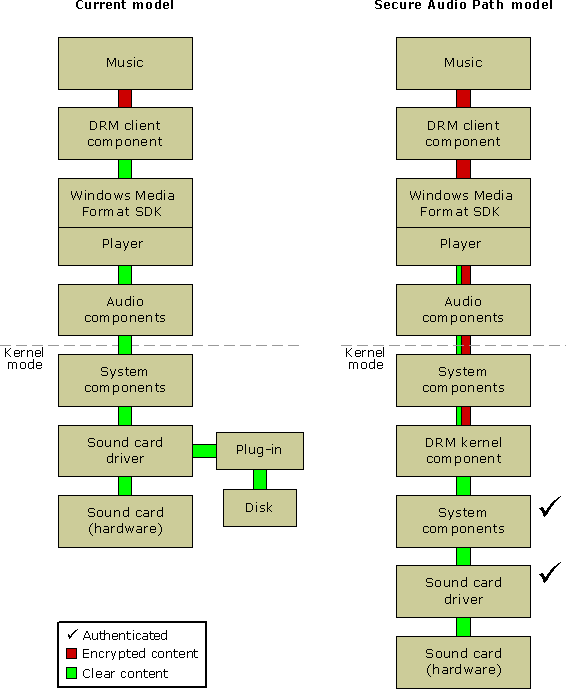

# The Secure Audio Path Model (deprecated)

This page documents a feature that will be supported with a different technical solution in future versions of Windows.

Microsoft Secure Audio Path (SAP) is a feature of Microsoft Windows® Me and Microsoft Windows XP. The requirement that an audio file be played only through a secure audio path is specified in the DRM license and enforced by the DRM client components. There is no extra encryption added for SAP-only files when they are initially protected. The SAP encryption is added automatically by the DRM components at playback time, as is the authentication process for all software components involved in playback. The workings of SAP are therefore completely transparent to applications, and that is why there is no method or property in the Windows Media Format SDK for enabling or disabling SAP. If desired, when creating a protected file a content owner can add a custom header attribute called something like "DRMHeader.SAPRequired" in order to instruct a license server to add the SAP requirement to the license. The implementation of such a scheme is up to the content owner and the license service.

In the current DRM model, if SAP is not applied, when protected digital music is played, the encrypted content passes to the DRM client component. The DRM client verifies that the application and the DRM component incorporating the Windows Media Format SDK are valid. If they are valid, the DRM client decrypts the content and sends it to the application, which then sends it to the lower-level audio components. At this point, the decrypted music is available to user mode applications and plug-ins and kernel mode drivers that can intercept the decrypted audio bits.

When the Secure Audio Path requirement is applied, the content is not decrypted by the application, but rather is passed in an encrypted state to lower level components, all of which have been authenticated by Microsoft as trustworthy. A trusted audio component is one that does not make the audio content available to any system component except other specific trusted components. In this way, the digital content remains protected all the way down to the driver level.

The following diagram displays the current model in comparison to the Secure Audio Path model.

 

 

