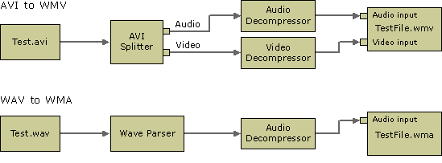

# Transcoding Files (QASF)

You can build a file-transcoding filter graph using the [WM ASF Writer](wm-asf-writer-filter.md) in various ways. The easiest way is to co-create, configure, and add the WM ASF Writer to the filter graph, and then use the **IGraphBuilder::RenderFile** method to build the graph automatically.

An alternative way is to add each filter manually to the graph and connect the pins. After adding the WM ASF Writer, configure it by using the **IConfigAsfWriter** methods if the default profile is not suitable, and connect the WM ASF Writer input pins to the corresponding output pins on the upstream filters.

The following illustration shows typical WM ASF Writer transcoding filter graph configurations.

 

 

