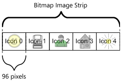

# Adding Custom Icons to Windows Movie Maker

**Note** To learn how to create custom icons for Windows DVD Maker, see [Windows DVD Maker XML Extensibility](windows-dvd-maker-xml-extensibility.md).

You can attach custom icons to your custom effects and transitions for Windows Movie Maker. These icons are created as a resource file in a C++ project and compiled into a DLL. If you are not providing any custom transition or effect code, the project will contain only the icon resource file.

Windows Movie Maker can use a single bitmap image consisting of one or more icons joined at the sides. Windows Movie Maker automatically cuts the image into 96-pixel-wide segments, each segment being one icon. Windows Movie Maker assigns an identification number to each segment, starting at 0 and incrementing by 1, which describes how many "jumps" into the strip an icon is. In your XML file you specify which icon to use for each effect. You can use all custom icons, or all Windows Movie Maker standard icons, but you cannot mix the two types. The following diagram shows the layout of a bitmap image strip for icons.



In the preceding diagram, an effect or transition would set **iconid** = 0 for the smiley-face icon, and 4 for the sun icon.

**Note** The recommended height for custom icons is 72 pixels.

To add your own icons, you must add two additional attributes to the **TransitionsAndEffects** tag:

**specialiconfileid**

An attribute that is used in an XML file only when including your own custom icons. It should be a unique number from 1 to 8192. This number must be unique for all **specialiconfileid** attributes in all other custom Windows Movie Maker XML files that you create, but otherwise has no meaning.

**specialiconresourceid**

An attribute that is used in an XML file only when including your own custom icons. This is the number assigned to the icon bitmap resource in your custom DLL. You can find this number in your Visual Studio project, in the resource file.

Here is XML code that specifies custom icons:


```C++
<TransitionsAndEffects Version="2.8" specialiconfileid="22" specialiconresourceid="101">
```


**To create custom icons for your effects and transitions**

1.  Open Visual Studio and create a new C++ project. If you are only creating a DLL to hold icons, create a new Win32 project, and when asked for settings, choose an empty project that compiles to a DLL.
2.  Add a new resource to the project. When asked what kind of resource, choose "bitmap."
3.  Draw or import a bitmap in the resource editor. The largest icon size is 96 pixels wide and 72 pixels high. Windows Movie Maker measures an image from the bottom left corner: if the image is too high, the extra material will be cropped; if the image is too wide, the extra material will be assigned to the next higher icon. If your image is less than 96 pixels wide, Windows Movie Maker will include part of the next icon. Insert as many icon images as you need in these 96-pixel-wide windows.
4.  Note the ID assigned to the bitmap in the resource.h file. This will be assigned to the **specialiconresourceid** attribute. For example, the following line shows a bitmap that has been assigned 101 as its identifier:
    ```C++
    #define IDB_BITMAP1                     101
    ```

    

5.  Compile the DLL, and place it in the \\AddOnTFX folder with your XML file. The image DLL must have the same name as the XML file that uses the icons. So, for example, if your DLL is called MyIcons.dll, your XML file must be MyIcons.xml.
6.  In your XML file, add a **specialiconfileid** attribute to the **TransitionsAndEffects** XML tag and assign it a unique integer from 1 to 8192. The value of this number is not important as long as no other XML effect file that you create uses this number to identify itself.
7.  Add a **specialiconresourceid** attribute to the **TransitionsAndEffects** tag, and assign it the number that Visual Studio assigned to the bitmap (in this example, the 101 shown in step 4).
8.  In each transition or effect XML block, add an **iconid** attribute to the **Transition** tag, and choose the offset into your bitmap, starting at zero, where your icon is located. These numbers do not have to be sequential, and regions can be skipped.

The following XML snippet shows two custom transitions using the first and third icons in a bitmap image with the ID 101 from the DLL, and a unique ID of 22 assigned to the files:


```C++
<TransitionsAndEffects Version="2.8" specialiconfileid="22" specialiconresourceid="101">
   <Transitions>
      <TransitionDLL guid="TFX">
         <Transition name="Grow, custom icon 1" iconid="0">
            <Param name="InternalName" value="Simple3D" />
            <Param name="ScaleA" value="bigger" />
            <Param name="ExponentialProgressDuration" value="3.0" />
            <Param name="ExponentialProgressScale" value="1.0" />
         </Transition>
      </TransitionDLL>
      <TransitionDLL guid="TFX">
         <Transition name="Grow, custom icon 3" iconid="2">
            <Param name="InternalName" value="Simple3D" />
            <Param name="ScaleA" value="bigger" />
            <Param name="ExponentialProgressDuration" value="3.0" />
            <Param name="ExponentialProgressScale" value="2.0" />
         </Transition>
      </TransitionDLL>
   </Transitions>
</TransitionsAndEffects>
```


**Note** The XML file name and the DLL file name must match only when the DLL is used for holding an image. If the DLL is not holding an image (as when it holds custom effects and transition objects) the names do not need to match.

## Related topics

<dl> <dt>

[**Programming Guide**](programming-guide.md)
</dt> </dl>

 

 


