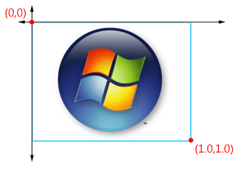
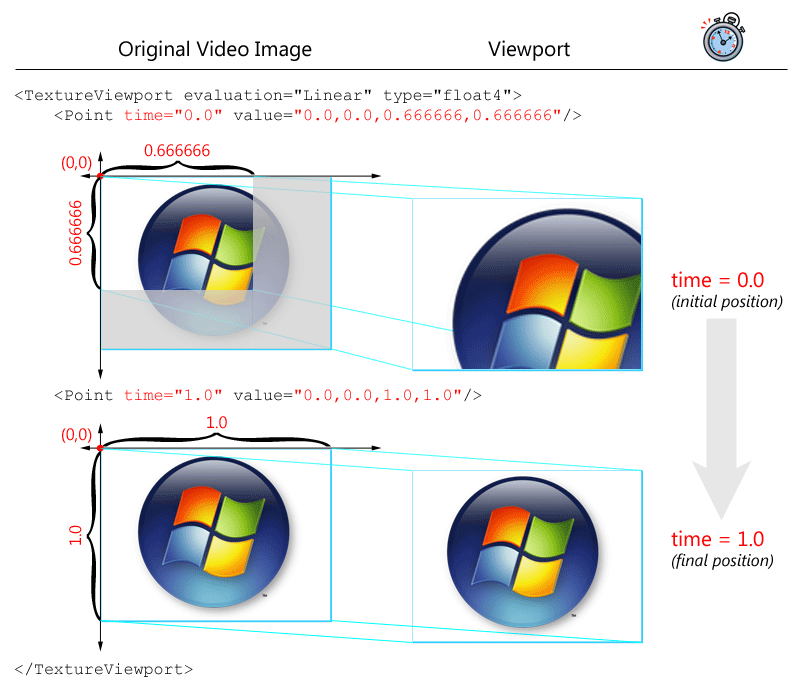
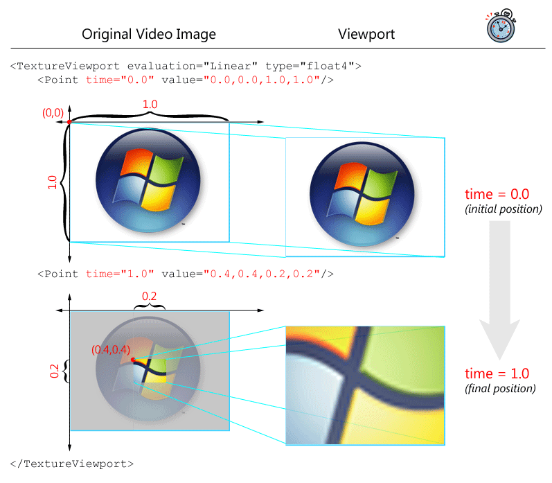

# Making Your Own XML File

This topic is a brief tutorial that demonstrates how to create a custom effect in XML for use with Windows Movie Maker.

**Important** Although this tutorial deals only with Windows Movie Maker, the guidelines for where to place your custom XML file apply to both Windows Movie Maker and Windows DVD Maker. For more information on the contents of the custom XML file that applies to Windows DVD Maker, see [Windows DVD Maker XML Extensibility](windows-dvd-maker-xml-extensibility.md).

**Step 1: Create a new XML file**

To make your own XML file for Windows Movie Maker and/or Windows DVD Maker, you must create a folder called AddOnTFX (or use an existing one) at one of the paths that follow. On your computer, this folder's path name will be one of the following, where "%AppData%" indicates the path to the user's "AppData" folder, "%ProgramFiles%" indicates the path to the computer's "Program Files" folder, and "0409" is the user's hexadecimal locale ID (in this case, US English).

-   %AppData%\\Microsoft\\Movie Maker\\AddOnTFX
-   %ProgramFiles%\\MovieMaker\\Shared\\AddOnTFX
-   %ProgramFiles%\\MovieMaker\\MUI\\0409\\AddOnTFX

Both Windows Movie Maker and Windows DVD Maker check these paths and load all the transitions and effects they find in these locations.

Inside the AddOnTFX folder you've created, create a new file with an .xml extension in Notepad or any other XML authoring software. There are no naming restrictions on the file, other than normal Windows naming conventions and that it must have an .xml extension.

**Note** Both Windows Movie Maker and Windows DVD Maker will load XML files only on startup. Any changes you make to the XML file when either Windows Movie Maker or Windows DVD Maker is running will not take effect until you close and restart Windows Movie Maker or Windows DVD Maker.

**Step 2: Start with the first-level tags**

In the blank XML file you've created, paste the following lines of code:


```C++
<TransitionsAndEffects Version="2.8">
    <Effects>
        <EffectDLL guid="TFX">

        </EffectDLL>
    </Effects>
</TransitionsAndEffects>
```


The preceding lines of XML represent the opening and closing tags for the XML file itself, the effects portion of the XML file, and a single Windows Movie Maker effect object.

**Step 3: Paste an existing effect**

With the cursor on the blank line between the tags you just pasted into the file (the line after `<EffectDLL guid="TFX">`), paste the code for the "Zoom Out, from Upper Left" effect (from [Pan/Zoom Effects](pan-zoom-effects.md)), so the contents of the file appear as follows:


```C++
<TransitionsAndEffects Version="2.8">
    <Effects>
        <EffectDLL guid="TFX">
            <Effect nameID="62784" iconid="36" guid="Zoom Out, from Upper Left" comment="Zoom Out, from Upper Left" shadermodel="2">          
                <Param name="Animation" value="FXPanZoom" />
                <Param name="FXFile" value="Parity.fx" />
                <Param name="Technique" value="PanZoom" />
                <Semantics>
                    <TextureViewport evaluation="Linear" type="float4">
                        <Point time="0.0" value="0.0,0.0,0.666666,0.666666"/>
                        <Point time="1.0" value="0.0,0.0,1.0,1.0"/>
                    </TextureViewport>
                </Semantics>
            </Effect>
        </EffectDLL>
    </Effects>
</TransitionsAndEffects>
```


For more information about the elements and attributes you just pasted in, see [Reading the XML File](reading-the-xml-file.md). To view the contents of the Windows Movie Maker private XML file, including the parameters for every built-in transition and effect, see [Transition and Effect Objects Provided by Windows Movie Maker](transition-and-effect-objects-provided-by-windows-movie-maker.md).

**Step 4: Change the Effect tag's attributes**

Before you change the effect's parameters, you must change the names and values of a few attributes within the **Effect** tag:

-   Replace the **nameID** attribute with a **name** attribute. (The **nameID** attribute is reserved for built-in transforms.)
-   Set the **name** attribute equal to "Super Zoom", which will be the name of the custom effect that is displayed in the Windows Movie Maker interface.
-   Change the value of the **guid** attribute to "Super Zoom" as well. The only requirement for the **guid** attribute within a custom effect's **Effect** tag is that it be a unique **guid** value. For that reason, we recommend setting it equal to the name of your custom effect.
-   Change the value of the **iconid** attribute to "0". This sets the icon that is used to represent the custom effect in the Windows Movie Maker interface. In this case, the icon is one of the built-in Windows Movie Maker effect icons, but you can create your own custom icon. For more information on creating custom icons, see [Adding Custom Icons to Windows Movie Maker](adding-custom-icons-to-windows-movie-maker.md).
-   Remove the **comment** attribute. This attribute is ignored by Windows Movie Maker.

After you have finished making the preceding changes, the XML will appear as follows:


```C++
<TransitionsAndEffects Version="2.8">
    <Effects>
        <EffectDLL guid="TFX">
             <Effect name="Super Zoom" iconid="0" guid="Super Zoom" shadermodel="2">          
                <Param name="Animation" value="FXPanZoom" />
                <Param name="FXFile" value="Parity.fx" />
                <Param name="Technique" value="PanZoom" />
                <Semantics>
                    <TextureViewport evaluation="Linear" type="float4">
                        <Point time="0.0" value="0.0,0.0,0.666666,0.666666"/>
                        <Point time="1.0" value="0.0,0.0,1.0,1.0"/>
                    </TextureViewport>
                </Semantics>
            </Effect>
        </EffectDLL>
    </Effects>
</TransitionsAndEffects>
```


**Step 5: Modify the effect's parameters**

Every transform has a unique combination of parameters. In this case, the effect is partly defined by the **TextureViewport** element, which specifies the part of the image that will be visible at a particular time.

For many Windows Movie Maker effects, the video image is mapped out using sets of coordinates, each of which ranges from 0.0 to 1.0. Therefore, the image's upper-left corner represents the coordinates (0.0,0.0), and its lower-right corner represents the coordinates (1.0,1.0).

The **TextureViewport** element is defined by one or more **Point** elements, which describe the *viewport* (the viewable portion of the original video image) at a particular point in time. The **Point** element is modified by the **time** attribute (a value from 0.0 to 1.0, where 0.0 indicates the start point of the effect and 1.0 indicates the end point of the effect) and the **value** attribute, which defines the position of the viewport as a list of four floating-point values.

The first two values in the **value** list are the coordinates on the original video image where the upper-left corner of the viewport sits. The third and fourth values define the width and height of the viewport, expressed as a fraction of the entire width and height of the original video image area. The following diagram illustrates this.



For example, a value of "0.0,0.0,0.666666,0.666666" indicates a viewport whose upper-left corner is at the upper-left corner of the original video image, but whose image contains only two-thirds of the width and height of the original video image. This has the effect of magnifying the upper-left region of the original video image by about 50%.

In the built-in "Zoom Out, from Upper Left" effect, the viewport starts out showing two-thirds of the original video image, and ends showing the full video image. This progression is illustrated in the following diagram.



The "Super Zoom" modified effect will start with the viewport displaying the entire image, and will zoom in to a small area in the center of the original video image. The changes to the XML are shown in bold within the following code, and are illustrated after the code.


```C++
<TransitionsAndEffects Version="2.8">
    <Effects>
        <EffectDLL guid="TFX">
            <Effect name="Super Zoom" iconid="0" guid="Super Zoom" shadermodel="2">          
                <Param name="Animation" value="FXPanZoom" />
                <Param name="FXFile" value="Parity.fx" />
                <Param name="Technique" value="PanZoom" />
                <Semantics>
                    <TextureViewport evaluation="Linear" type="float4">
                        <Point time="0.0" value="

    0.0,0.0,1.0,1.0
"/>
                        <Point time="1.0" value="

    0.4,0.4,0.2,0.2
"/>
                    </TextureViewport>
                </Semantics>
            </Effect>
        </EffectDLL>
    </Effects>
</TransitionsAndEffects>
```


The following diagram illustrates the "Super Zoom" effect shown in the preceding code.



**Step 6: Test the custom effect**

Save the file. If Windows Movie Maker is running, close it. Now start Windows Movie Maker and apply the new "Super Zoom" effect to a video clip to test it.

## Related topics

<dl> <dt>

[**Creating Custom Transforms Using XML**](creating-custom-transforms-using-xml.md)
</dt> <dt>

[**Pan/Zoom Effects**](pan-zoom-effects.md)
</dt> </dl>

 

 


