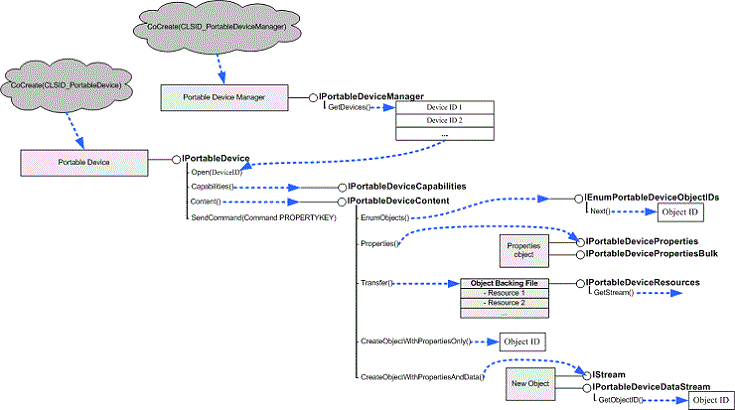

# Client Interfaces

Applications use the methods supported by the following interfaces to perform operations on portable devices. These operations include opening a connection to a device, retrieving data from a device, writing data to a device, and so on.

| Interface                                                                              | Description                                                                                                                                                                                                                         |
|----------------------------------------------------------------------------------------|-------------------------------------------------------------------------------------------------------------------------------------------------------------------------------------------------------------------------------------|
| [**IEnumPortableDeviceObjectIDs**](/windows/desktop/api/PortableDeviceApi/nn-portabledeviceapi-ienumportabledeviceobjectids)                   | Enumerates the objects on a portable device.                                                                                                                                                                                        |
| [**IPortableDevice**](/windows/desktop/api/PortableDeviceApi/nn-portabledeviceapi-iportabledevice)                                             | Provides low-level access to a portable device.                                                                                                                                                                                     |
| [**IPortableDeviceCapabilities**](/windows/desktop/api/portabledeviceapi/nn-portabledeviceapi-iportabledevicecapabilities)                     | Retrieves a variety of device capabilities, including supported formats, commands, and functional objects.                                                                                                                          |
| [**IPortableDeviceContent**](/windows/desktop/api/portabledeviceapi/nn-portabledeviceapi-iportabledevicecontent)                               | Provides methods to create, enumerate, and delete content on a device.                                                                                                                                                              |
| [**IPortableDeviceDataStream**](/windows/desktop/api/PortableDeviceApi/nn-portabledeviceapi-iportabledevicedatastream)                         | Exposes additional methods on an **IStream** used for data transfers.                                                                                                                                                               |
| [**IPortableDeviceEventCallback**](/windows/desktop/api/PortableDeviceApi/nn-portabledeviceapi-iportabledeviceeventcallback)                   | Implemented by the application to receive asynchronous callbacks.                                                                                                                                                                   |
| [**IPortableDeviceManager**](/windows/desktop/api/PortableDeviceApi/nn-portabledeviceapi-iportabledevicemanager)                               | Enumerates devices that are connected to the computer, and provides a simple way to request installation information for the device (including manufacturer, friendly name, and description).                                       |
| [**IPortableDeviceProperties**](/windows/desktop/api/portabledeviceapi/nn-portabledeviceapi-iportabledeviceproperties)                         | Read and write properties for an object on the device.                                                                                                                                                                              |
| [**IPortableDevicePropertiesBulk**](/windows/desktop/api/PortableDeviceApi/nn-portabledeviceapi-iportabledevicepropertiesbulk)                 | Reads and writes multiple properties on multiple objects on a device, asynchronously.                                                                                                                                               |
| [**IPortableDevicePropertiesBulkCallback**](/windows/desktop/api/PortableDeviceApi/nn-portabledeviceapi-iportabledevicepropertiesbulkcallback) | Implemented by the application to track the progress of an asynchronous operation that was begun by using the **IPortableDevicePropertiesBulk** interface.                                                                          |
| [**IPortableDeviceResources**](/windows/desktop/api/PortableDeviceApi/nn-portabledeviceapi-iportabledeviceresources)                           | Provides access to an object's data.                                                                                                                                                                                                |
| [**IPortableDeviceService**](/windows/desktop/api/PortableDeviceAPI/nn-portabledeviceapi-iportabledeviceservice)                               | Windows 7 only. Provides low-level access to a portable device service.                                                                                                                                                             |
| [**IPortableDeviceServiceCapabilities**](/windows/desktop/api/portabledeviceapi/nn-portabledeviceapi-iportabledevicecapabilities)              | Windows 7 only. Retrieves a variety of service capabilities, including supported formats, commands, methods, and rendering profiles.                                                                                                |
| [**IPortableDeviceServiceMethods**](/windows/desktop/api/PortableDeviceAPI/nn-portabledeviceapi-iportabledeviceservicemethods)                 | Windows 7 only. Invokes methods synchronously and asynchronously on a service.                                                                                                                                                      |
| [**IPortableDeviceServiceMethodCallback**](/windows/desktop/api/PortableDeviceAPI/nn-portabledeviceapi-iportabledeviceservicemethodcallback)   | Windows 7 only. Implemented by the application to track the completion of an asynchronous service method operation begun by calling [**IPortableDeviceServiceMethods::InvokeAsync**](/windows/desktop/api/PortableDeviceAPI/nf-portabledeviceapi-iportabledeviceservicemethods-invokeasync) |
| [**IPortableDeviceServiceManager**](/windows/desktop/api/PortableDeviceAPI/nn-portabledeviceapi-iportabledeviceservicemanager)                 | Windows 7 only. Enumerates services that are supported by a device, and retrieves the device associated with a service.                                                                                                             |

 

The following diagram shows how an application gets most of the interfaces it needs. Not all methods of all the interfaces or the interfaces that are implemented by the application are shown.

## Related topics

<dl> <dt>

[**Programming Reference**](programming-reference.md)
</dt> </dl>

 

 

