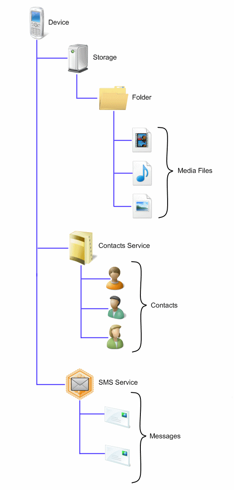

# Device Representation

Devices have two main behaviors that are addressed by the Windows Portable Devices (WPD) architecture:

-   Accessing and storing content. For example, applications must be able to add music files to a portable music player.
-   Programming the device. This includes simple operations such as changing settings and preparing the device for data capture, or more complex operations such as uploading firmware. Examples include issuing a "Take Picture" command to a digital still camera.

In WPD, these behaviors are described by representing the device as a hierarchy of objects. The following illustration shows a WPD object representation for a multi-function device, which in this case is a mobile phone.

This hierarchy illustrates the following functionality and contents.

Functionality:

-   Storage object. This device has data storage.
-   Contacts Service. This service is a functional object that can be used to synchronize and store contacts on the phone.
-   SMS Service. This service is a functional object that can be used to send, receive, and store SMS messages.

Contents:

-   Media objects. This device stores images, music, and video files in folders on the Storage object. While the files shown in the illustration are stored under one folder, a device can subdivide content into folders organized by the type of media stored; for example, image folders, music folders, and video folders.
-   Contact objects. This device stores contact information (such as name, phone number, and address) as children of the Contacts Service
-   Message objects. This device stores SMS messages as children of the SMS Service.

## Related topics

<dl> <dt>

[**Application Overview**](application-overview.md)
</dt> </dl>

 

 

